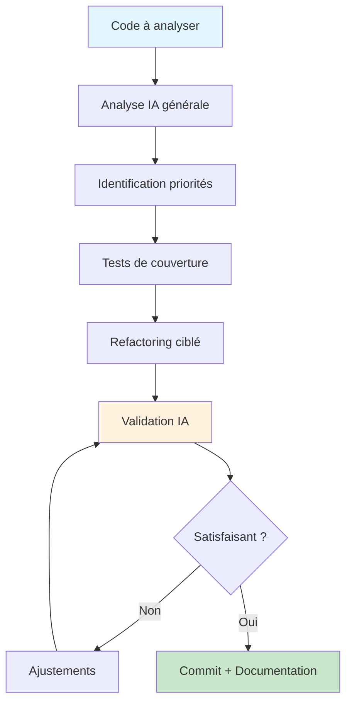

# Utiliser une IA pour challenger son propre code et suggérer des refactorings

<Badge type="tip" text="AI-Powered Development 2025" />

L'intelligence artificielle révolutionne notre approche du développement logiciel. Au-delà de la simple génération de code, les IA modernes excellent dans l'analyse critique et l'amélioration du code existant. Ce guide explore comment transformer une IA en partenaire de code review et mentor en refactoring, pour élever constamment la qualité de votre code.

## L'IA comme pair reviewer virtuel

### Dépasser la génération de code traditionnelle

L'utilisation d'une IA pour générer du code from scratch représente seulement une fraction de son potentiel. Son véritable atout réside dans sa capacité à analyser du code existant avec un œil neuf, libre des biais et habitudes que nous développons en tant qu'auteurs.

::: info Avantages de la code review par IA
- **Objectivité totale** : Pas d'ego ni de préjugés personnels
- **Disponibilité constante** : Review 24h/24, sans contraintes d'agenda
- **Consistance** : Applique les mêmes standards à chaque analyse
- **Perspective multiple** : Peut adopter différents points de vue (performance, lisibilité, sécurité)
- **Connaissances vastes** : Accès à des patterns et bonnes pratiques transversaux
:::

### Types d'analyses que l'IA maîtrise

**Analyse de la complexité** : L'IA identifie rapidement les fonctions trop complexes, les imbrications excessives ou les responsabilités multiples. Elle propose des découpages logiques basés sur les principes SOLID.

**Détection de code smells** : Variables mal nommées, duplication de code, classes trop volumineuses - l'IA détecte ces anti-patterns et suggère des améliorations spécifiques.

**Optimisation des performances** : Boucles inefficaces, requêtes N+1, allocations mémoire inutiles - l'IA propose des alternatives plus performantes avec justification.

**Amélioration de la lisibilité** : Restructuration de la logique, meilleur nommage, ajout de commentaires explicatifs aux endroits critiques.

## Techniques de prompt engineering pour la code review

### Formuler des demandes d'analyse efficaces

La qualité de l'analyse dépend largement de la précision de votre demande. Une approche structurée maximise la pertinence des suggestions.

**Contexte métier** : Commencez toujours par expliquer le rôle de votre code dans l'application. "Cette fonction gère l'authentification des utilisateurs dans une API REST" donne à l'IA un cadre d'analyse approprié.

**Objectifs spécifiques** : Précisez si vous cherchez une optimisation des performances, une amélioration de la lisibilité, ou une réduction de la complexité. Chaque objectif oriente l'analyse différemment.

**Contraintes techniques** : Mentionnez les limitations (version du langage, compatibilité, contraintes mémoire) pour que les suggestions restent applicables dans votre contexte.

### Templates de prompts pour différents besoins

::: details Exemples de prompts structurés

**Pour l'analyse générale de qualité :**
```
Analyse ce code en te concentrant sur :
1. La lisibilité et la maintenabilité
2. Le respect des bonnes pratiques [langage]
3. Les opportunités de refactoring
4. Les risques potentiels ou edge cases manqués

Contexte : [description du rôle du code]
Contraintes : [version langage, frameworks utilisés]
```

**Pour l'optimisation des performances :**
```
Évalue les performances de ce code et identifie :
1. Les goulots d'étranglement potentiels
2. Les optimisations possibles (algorithme, structure de données)
3. L'impact sur la consommation mémoire
4. Les alternatives plus efficaces

Volume de données attendu : [estimation]
Criticité performance : [haute/moyenne/faible]
```

**Pour la sécurité :**
```
Audite ce code sous l'angle sécurité :
1. Vulnérabilités potentielles
2. Validation des entrées utilisateur
3. Gestion des erreurs et fuites d'information
4. Bonnes pratiques sécuritaires manquées

Type d'application : [web/API/desktop/mobile]
Niveau de sensibilité des données : [public/interne/confidentiel]
```
:::

### Itération et raffinement

**Première passe - Vue d'ensemble** : Demandez une analyse générale pour identifier les problèmes majeurs. L'IA dresse un panorama complet des améliorations possibles.

**Seconde passe - Approfondissement** : Focalisez sur les points critiques identifiés. Demandez des exemples concrets de refactoring pour chaque problème majeur.

**Troisième passe - Validation** : Présentez vos corrections à l'IA pour validation et suggestions d'améliorations supplémentaires.

## Stratégies de refactoring guidé par l'IA

### Priorisation des améliorations

L'IA excelle dans l'identification de multiples axes d'amélioration, mais la priorisation reste votre responsabilité. Établissez une hiérarchie basée sur l'impact business et la complexité d'implémentation.

**Impact critique** : Bugs potentiels, failles de sécurité, goulots de performance majeurs. Ces éléments nécessitent une attention immédiate.

**Impact élevé** : Amélioration significative de la lisibilité, réduction de la complexité cyclomatique, élimination de la duplication importante.

**Impact modéré** : Optimisations mineures, améliorations cosmétiques, restructurations qui facilitent les évolutions futures.

### Approche incrémentale

::: tip Méthodologie de refactoring par étapes
1. **Sécurisation** : Tests unitaires complets avant toute modification
2. **Validation IA** : Confirmation que les tests couvrent les cas critiques
3. **Refactoring ciblé** : Une amélioration à la fois, avec validation
4. **Review finale** : Analyse IA du code refactorisé pour validation
:::

**Red-Green-Refactor assisté par IA** : Intégrez l'IA dans le cycle TDD classique. Après la phase "Green", demandez à l'IA d'identifier les opportunités de refactoring du code qui fonctionne.

**Refactoring de legacy** : Pour du code ancien, l'IA aide à comprendre la logique complexe et propose des stratégies de modernisation progressive sans risquer de casser les fonctionnalités existantes.

## Outils et plateformes recommandés

### Solutions intégrées à l'IDE

**GitHub Copilot** : Excellente intégration native dans VS Code, suggestion contextuelle en temps réel. Particulièrement efficace pour les refactorings simples et l'optimisation de patterns récurrents.

**Tabnine** : IA spécialisée dans la complétion et l'analyse de code. Son mode "Code Review" propose des améliorations automatiques basées sur l'analyse statique.

**Amazon CodeWhisperer** : Fort sur l'analyse de sécurité et les bonnes pratiques AWS. Idéal pour les applications cloud-native nécessitant des optimisations spécifiques.

### Assistants conversationnels

**Claude** : Excellente capacité d'analyse contextuelle et de compréhension des enjeux métier. Particulièrement doué pour expliquer le "pourquoi" des recommandations.

**ChatGPT Code Interpreter** : Capacité à exécuter et tester du code, permettant une validation immédiate des suggestions de refactoring.

**Perplexity** : Intègre les recherches web pour proposer des solutions basées sur les dernières bonnes pratiques et tendances de l'industrie.

### Workflow optimal



## Cas d'usage pratiques par langage

### JavaScript/TypeScript

**Problématiques courantes identifiées par l'IA** : Gestion asynchrone inefficace, mutations d'état inappropriées, absence de typage strict, patterns non idiomatiques.

**Suggestions typiques** : Remplacement de callbacks par async/await, utilisation d'immutabilité, amélioration du typage TypeScript, optimisation des bundle sizes.

**Focus performance** : L'IA identifie les re-renders inutiles en React, les memory leaks potentiels, les algorithmes de tri inefficaces sur de grandes collections.

### Python

**Améliorations structurelles** : Utilisation de dataclasses, compréhensions de listes vs loops traditionnelles, gestion appropriée des exceptions, respect PEP8 avancé.

**Optimisations spécifiques** : Remplacement de loops par operations vectorisées, utilisation de générateurs pour économiser la mémoire, profiling-guided optimizations.

### Java

**Patterns modernes** : Migration vers les streams, utilisation des records, application des design patterns appropriés, gestion mémoire optimisée.

**Performance enterprise** : Optimisation des requêtes JPA, configuration des pools de connexions, utilisation appropriée des caches.

### Go

**Idiomes Go** : Gestion d'erreurs idiomatique, utilisation appropriée des goroutines, patterns de concurrence sécurisés.

**Performance système** : Optimisation de l'allocation mémoire, utilisation efficace des channels, profiling des performances.

## Limites et précautions

### Comprendre les biais de l'IA

::: warning Points de vigilance
- **Biais de popularité** : L'IA favorise parfois les solutions populaires au détriment de solutions plus adaptées au contexte
- **Connaissance figée** : Les modèles ont une date de coupure et peuvent manquer les dernières bonnes pratiques
- **Contexte limité** : L'IA ne voit que le code fourni, pas l'architecture globale ou les contraintes business
- **Suggestions génériques** : Peut proposer des optimisations non pertinentes pour votre cas d'usage spécifique
:::

### Validation et sens critique

**Test systématique** : Toute suggestion d'IA doit être testée rigoureusement. Une amélioration théorique peut introduire des régressions pratiques.

**Review humaine** : L'IA complète l'expertise humaine mais ne la remplace pas. La compréhension métier et l'expérience restent irremplaçables.

**Documentation des choix** : Documentez pourquoi vous avez suivi ou ignoré une suggestion d'IA. Cela aide l'équipe à comprendre les décisions techniques.

### Équilibre performance/lisibilité

L'IA tend parfois à sur-optimiser au détriment de la lisibilité. Gardez en tête que le code est lu bien plus souvent qu'il n'est écrit. Une optimisation marginale qui rend le code obscur n'est généralement pas justifiée.

## Bonnes pratiques pour maximiser l'efficacité

### Préparer le contexte

**Clean slate** : Analysez du code propre et fonctionnel. L'IA donne de meilleurs conseils sur du code qui fonctionne plutôt que sur du code cassé.

**Isolation** : Présentez des fonctions ou classes complètes avec leurs dépendances. Les fragments de code sortis de contexte génèrent des suggestions moins pertinentes.

**Documentation des intentions** : Expliquez l'objectif métier de votre code. L'IA peut alors proposer des refactorings qui préservent ou améliorent cette intention.

### Construire un dialogue

**Questions spécifiques** : "Comment améliorer les performances de cette fonction ?" est plus efficace que "Que penses-tu de ce code ?".

**Alternatives multiples** : Demandez plusieurs approches pour le même problème. L'IA peut proposer des solutions créatives auxquelles vous n'auriez pas pensé.

**Justifications** : Exigez que l'IA explique ses recommandations. Cela vous aide à apprendre et à valider la pertinence des suggestions.

### Intégration dans le workflow

::: details Routine de code review assistée par IA

**Daily basis (15 minutes)** :
- Review IA du code écrit la veille
- Identification rapide des code smells
- Corrections mineures immédiates

**Weekly basis (1 heure)** :
- Analyse approfondie des modules récemment modifiés
- Planification des refactorings identifiés
- Review des patterns émergents dans l'équipe

**Monthly basis (demi-journée)** :
- Audit IA de l'architecture globale
- Identification des dettes techniques majeures
- Planification des sprints d'amélioration
:::

## Mesurer l'impact des améliorations

### Métriques techniques

**Complexité cyclomatique** : Mesurez la réduction de complexité après les refactorings suggérés par l'IA. Une baisse significative indique une amélioration de la maintenabilité.

**Couverture de tests** : Les refactorings IA-guidés améliorent souvent la testabilité. Mesurez l'augmentation de la couverture possible après refactoring.

**Performance benchmarks** : Pour les optimisations de performance, mesurez l'impact réel avec des benchmarks avant/après sur des données représentatives.

### Métriques d'équipe

**Vitesse de développement** : Le code mieux structuré grâce aux suggestions IA accélère le développement de nouvelles fonctionnalités.

**Réduction des bugs** : Un code plus lisible et mieux organisé génère généralement moins de bugs en production.

**Satisfaction développeur** : Code plus agréable à maintenir = développeurs plus productifs et satisfaits.

## L'avenir de la collaboration humain-IA

### Tendances émergentes

**IA spécialisée** : Des modèles entraînés spécifiquement sur certains frameworks ou domaines (finance, santé, etc.) offrent des suggestions plus pertinentes.

**Intégration CI/CD** : Les pipelines intègrent progressivement des étapes d'analyse IA automatique avec suggestions de merge request.

**Apprentissage contextuel** : Les IA futures apprendront des préférences et contraintes spécifiques de votre équipe pour des suggestions personnalisées.

### Développer sa collaboration avec l'IA

**Patience et itération** : Comme avec un nouveau collègue, la collaboration avec l'IA s'améliore avec le temps et la pratique.

**Feedback bidirectionnel** : Indiquez à l'IA quand ses suggestions sont pertinentes ou non. Certains outils apprennent de ces retours.

**Veille technologique** : Les capacités d'IA évoluent rapidement. Restez informé des nouvelles fonctionnalités et techniques de prompt.

## Conclusion

L'IA transforme la code review d'une tâche ponctuelle en un processus continu d'amélioration. Elle démocratise l'accès à une expertise de haut niveau et permet à chaque développeur de bénéficier d'un mentor virtuel disponible 24h/24.

::: tip Points clés à retenir
- **Complémentarité** : L'IA augmente vos capacités, elle ne les remplace pas
- **Apprentissage mutuel** : Vous apprenez de l'IA, et elle s'adapte à vos besoins
- **Qualité progressive** : Petites améliorations constantes plutôt que refactorings massifs
- **Validation critique** : Gardez votre esprit critique et testez systématiquement
:::

L'objectif n'est pas de produire du code parfait, mais d'élever constamment le niveau de qualité tout en apprenant de nouvelles approches et techniques. L'IA devient ainsi un catalyseur de croissance professionnelle autant qu'un outil d'amélioration du code.

Dans cette nouvelle ère du développement assisté par IA, les développeurs qui maîtrisent cette collaboration ont un avantage concurrentiel significatif. Ils produisent du code de meilleure qualité, apprennent plus rapidement, et peuvent se concentrer sur les aspects créatifs et stratégiques du développement logiciel.

## Ressources et documentation

### Outils et plateformes IA

- [GitHub Copilot](https://github.com/features/copilot) - Assistant IA intégré pour VS Code et IDEs
- [Claude](https://claude.ai) - Assistant conversationnel d'Anthropic pour analyse de code
- [ChatGPT](https://chat.openai.com) - Plateforme OpenAI avec mode code interpreter
- [Tabnine](https://www.tabnine.com) - IA spécialisée en complétion et analyse de code
- [Amazon CodeWhisperer](https://aws.amazon.com/codewhisperer/) - Assistant IA d'AWS
- [Perplexity](https://perplexity.ai) - Recherche augmentée par IA pour développeurs

### Documentation officielle

- [Anthropic Claude Documentation](https://docs.anthropic.com/claude/docs) - Guide complet d'utilisation de Claude
- [GitHub Copilot Best Practices](https://docs.github.com/en/copilot) - Bonnes pratiques officielles
- [OpenAI API Documentation](https://platform.openai.com/docs) - Intégration ChatGPT dans vos workflows

### Guides et méthodologies

- [The Pragmatic Programmer](https://pragprog.com/titles/tpp20/the-pragmatic-programmer-20th-anniversary-edition/) - Livre fondamental sur l'amélioration continue du code
- [Clean Code](https://www.oreilly.com/library/view/clean-code-a/9780136083238/) - Principles de code maintenable
- [Refactoring: Improving the Design of Existing Code](https://martinfowler.com/books/refactoring.html) - Guide de référence sur le refactoring

### Articles et ressources

- [AI-Assisted Programming Best Practices](https://github.blog/2023-06-20-how-to-write-better-prompts-for-github-copilot/) - GitHub Blog
- [The Future of Programming with AI](https://stackoverflow.blog/2023/05/10/the-future-of-programming-with-ai/) - Stack Overflow Blog
- [Prompt Engineering Guide](https://www.promptingguide.ai) - Techniques avancées de prompt engineering

### Communautés et forums

- [r/MachineLearning](https://reddit.com/r/MachineLearning) - Discussions sur l'IA en développement
- [AI for Developers Discord](https://discord.gg/ai-developers) - Communauté de développeurs utilisant l'IA
- [Stack Overflow AI Tag](https://stackoverflow.com/questions/tagged/artificial-intelligence) - Questions techniques sur l'IA

### Études et recherches

- [GitHub Copilot Research](https://github.blog/2022-09-07-research-quantifying-github-copilots-impact-on-developer-productivity-and-happiness/) - Impact sur la productivité
- [Anthropic Constitutional AI](https://www.anthropic.com/research/constitutional-ai-harmlessness-from-ai-feedback) - Recherche sur l'IA sûre
- [Microsoft AI Pair Programming](https://www.microsoft.com/en-us/research/publication/the-programmer-assistant-using-large-language-models-for-code-completion/) - Études académiques