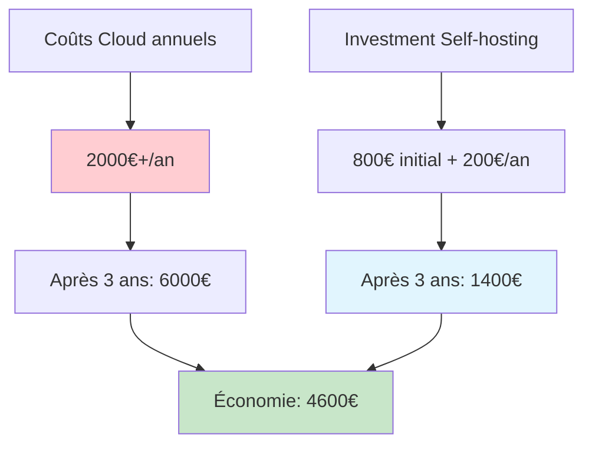

# Auto-hébergement : reprendre le contrôle de ses données

<Badge type="tip" text="Self-hosting & Data Privacy 2025" />

L'auto-hébergement représente bien plus qu'une simple alternative technique aux services cloud : c'est une démarche de souveraineté numérique qui permet de reprendre le contrôle de ses données personnelles et professionnelles. Ce guide présente les approches modernes pour créer votre propre infrastructure tout en maintenant sécurité et praticité.

## Pourquoi l'auto-hébergement en 2025

### Enjeux de souveraineté des données

::: info Contexte législatif et technique
- **RGPD** - Contrôle accru sur le traitement des données personnelles
- **Cloud Act** - Risques d'accès par autorités étrangères
- **Dépendance aux GAFAM** - Centralisation excessive des services
- **Coûts croissants** - Abonnements multiples et inflation du cloud
- **Performances** - Latence réduite avec infrastructure locale
:::

### Avantages et défis de l'auto-hébergement

| Avantages | Défis |
|-----------|--------|
| Contrôle total des données | Complexité technique initiale |
| Confidentialité garantie | Responsabilité de la maintenance |
| Coûts prévisibles | Disponibilité à assurer |
| Personnalisation complète | Sauvegarde et récupération |
| Indépendance technologique | Montée en compétences nécessaire |

### ROI de l'auto-hébergement



## Architecture moderne d'auto-hébergement

### Stack technologique recommandé 2025

::: tip Stack de base moderne
**Virtualisation** - Proxmox VE ou VMware ESXi
**Conteneurisation** - Docker + Docker Compose
**Orchestration** - Kubernetes (k3s) pour infrastructures avancées
**Reverse Proxy** - Traefik v3 ou Nginx Proxy Manager
**Monitoring** - Prometheus + Grafana + Loki
**Sauvegarde** - Restic + repositories distribués
:::

### Infrastructure en couches

```yaml
# Architecture self-hosting moderne
infrastructure:
  hardware:
    tier1: # Serveur principal
      cpu: "AMD Ryzen 5 7600 (6 cores)"
      ram: "32GB DDR5"
      storage: "1TB NVMe + 4TB HDD"
      network: "Gigabit Ethernet"
      power: "UPS 1500VA"
    
    tier2: # Serveur backup/NAS
      cpu: "Intel N100 (4 cores)"
      ram: "16GB DDR4"
      storage: "2x 8TB HDD RAID 1"
      network: "Gigabit Ethernet"
      
  hypervisor:
    solution: "Proxmox VE 8.x"
    features:
      - "High Availability Cluster"
      - "Live Migration"
      - "Backup scheduling"
      - "VLAN management"
      
  networking:
    firewall: "pfSense/OPNsense"
    vpn: "WireGuard"
    dns: "Pi-hole + Unbound"
    certificates: "Let's Encrypt + ACME"
    
  applications:
    core_services:
      - "Traefik (reverse proxy)"
      - "Authentik (SSO/LDAP)"
      - "Vaultwarden (passwords)"
      - "Nextcloud (files/collaboration)"
      
    development:
      - "GitLab CE (git + CI/CD)"
      - "SonarQube (code quality)"
      - "Nexus (artifacts)"
      - "Jenkins/Drone (CI/CD)"
      
    monitoring:
      - "Prometheus (metrics)"
      - "Grafana (dashboards)"
      - "Loki (logs)"
      - "Alertmanager (notifications)"
```

## Choix matériel et configuration

### Serveur principal optimisé

::: details Configuration recommandée 2025

**Option Budget (500-800€)**
- **CPU** : AMD Ryzen 5 5600G (6C/12T, GPU intégré)
- **RAM** : 16GB DDR4-3200 (extensible à 64GB)
- **Storage** : 500GB NVMe + 2TB HDD
- **Carte mère** : B550 avec IPMI si possible
- **Alimentation** : 500W 80+ Gold modulaire
- **Boîtier** : Fractal Define 7 (silencieux)

**Option Performance (1200-1800€)**
- **CPU** : AMD Ryzen 7 7700 (8C/16T)
- **RAM** : 32GB DDR5-5600 (extensible à 128GB)
- **Storage** : 1TB NVMe Gen4 + 4TB HDD
- **Carte mère** : B650 avec IPMI
- **GPU** : RTX 4060 (pour IA/transcoding)
- **Alimentation** : 650W 80+ Platinum

**Option Professionnelle (2500-4000€)**
- **CPU** : AMD EPYC 7313P (16C/32T)
- **RAM** : 64GB DDR4 ECC
- **Storage** : 2TB NVMe + 8TB HDD RAID
- **Carte mère** : Server board avec IPMI
- **Redondance** : Alimentation double
- **Réseau** : Carte 10Gb optionnelle
:::

### Optimisations énergétiques

```bash
# Configuration power management Linux
# /etc/systemd/system/powertune.service

[Unit]
Description=Power management tuning
After=multi-user.target

[Service]
Type=oneshot
ExecStart=/bin/bash -c '\
  # CPU governor pour efficacité énergétique
  echo "powersave" > /sys/devices/system/cpu/cpu*/cpufreq/scaling_governor; \
  
  # Optimisations réseau
  ethtool -s eth0 wol g; \
  ethtool -K eth0 gro on lro on tso on; \
  
  # Gestion disques
  hdparm -B 254 /dev/sd*; \
  hdparm -S 240 /dev/sd*; \
  
  # Optimisations système
  echo 1500 > /proc/sys/vm/dirty_writeback_centisecs; \
  echo 15 > /proc/sys/vm/dirty_expire_centisecs'

[Install]
WantedBy=multi-user.target
```

## Services essentiels auto-hébergés

### Authentification centralisée avec Authentik

```yaml
# docker-compose.yml - Authentik SSO
version: '3.8'

services:
  authentik-db:
    image: postgres:15-alpine
    restart: unless-stopped
    healthcheck:
      test: ["CMD-SHELL", "pg_isready -d $${POSTGRES_DB} -U $${POSTGRES_USER}"]
      start_period: 20s
      interval: 30s
      retries: 5
      timeout: 5s
    volumes:
      - authentik_db:/var/lib/postgresql/data
    environment:
      POSTGRES_PASSWORD: ${AUTHENTIK_PG_PASS}
      POSTGRES_USER: authentik
      POSTGRES_DB: authentik
    env_file:
      - .env

  authentik-redis:
    image: redis:7-alpine
    command: --save 60 1 --loglevel warning
    restart: unless-stopped
    healthcheck:
      test: ["CMD-SHELL", "redis-cli ping | grep PONG"]
      start_period: 20s
      interval: 30s
      retries: 5
      timeout: 3s
    volumes:
      - authentik_redis:/data

  authentik-server:
    image: ghcr.io/goauthentik/server:2024.2.2
    restart: unless-stopped
    command: server
    depends_on:
      - authentik-db
      - authentik-redis
    environment:
      AUTHENTIK_REDIS__HOST: authentik-redis
      AUTHENTIK_POSTGRESQL__HOST: authentik-db
      AUTHENTIK_POSTGRESQL__USER: authentik
      AUTHENTIK_POSTGRESQL__NAME: authentik
      AUTHENTIK_POSTGRESQL__PASSWORD: ${AUTHENTIK_PG_PASS}
      AUTHENTIK_SECRET_KEY: ${AUTHENTIK_SECRET_KEY}
      AUTHENTIK_ERROR_REPORTING__ENABLED: "false"
      AUTHENTIK_DISABLE_UPDATE_CHECK: "true"
      AUTHENTIK_AVATARS: "gravatar,initials"
    volumes:
      - authentik_media:/media
      - authentik_custom_templates:/templates
    ports:
      - "9000:9000"
      - "9443:9443"
    labels:
      - "traefik.enable=true"
      - "traefik.http.routers.authentik.rule=Host(`auth.yourdomain.com`)"
      - "traefik.http.routers.authentik.tls=true"
      - "traefik.http.routers.authentik.tls.certresolver=letsencrypt"

volumes:
  authentik_db:
  authentik_redis:
  authentik_media:
  authentik_custom_templates:
```

### Nextcloud optimisé pour performance

```yaml
# docker-compose.yml - Nextcloud stack
version: '3.8'

services:
  nextcloud-db:
    image: mariadb:10.11
    restart: unless-stopped
    command: --transaction-isolation=READ-COMMITTED --binlog-format=ROW --innodb-file-per-table=1 --skip-innodb-read-only-compressed
    volumes:
      - nextcloud_db:/var/lib/mysql
    environment:
      MYSQL_ROOT_PASSWORD: ${MYSQL_ROOT_PASSWORD}
      MYSQL_PASSWORD: ${MYSQL_PASSWORD}
      MYSQL_DATABASE: nextcloud
      MYSQL_USER: nextcloud
    env_file:
      - .env

  nextcloud-redis:
    image: redis:7-alpine
    restart: unless-stopped
    command: redis-server --requirepass ${REDIS_PASSWORD}
    volumes:
      - nextcloud_redis:/data

  nextcloud-app:
    image: nextcloud:28-apache
    restart: unless-stopped
    depends_on:
      - nextcloud-db
      - nextcloud-redis
    volumes:
      - nextcloud_data:/var/www/html
      - nextcloud_config:/var/www/html/config
      - nextcloud_custom_apps:/var/www/html/custom_apps
      - nextcloud_themes:/var/www/html/themes
      - /mnt/storage:/external_storage
    environment:
      MYSQL_PASSWORD: ${MYSQL_PASSWORD}
      MYSQL_DATABASE: nextcloud
      MYSQL_USER: nextcloud
      MYSQL_HOST: nextcloud-db
      REDIS_HOST: nextcloud-redis
      REDIS_HOST_PASSWORD: ${REDIS_PASSWORD}
      NEXTCLOUD_ADMIN_PASSWORD: ${NEXTCLOUD_ADMIN_PASSWORD}
      NEXTCLOUD_ADMIN_USER: admin
      NEXTCLOUD_TRUSTED_DOMAINS: cloud.yourdomain.com
      OVERWRITEPROTOCOL: https
      OVERWRITECLIURL: https://cloud.yourdomain.com
      APACHE_DISABLE_REWRITE_IP: 1
      TRUSTED_PROXIES: 172.18.0.0/16
    labels:
      - "traefik.enable=true"
      - "traefik.http.routers.nextcloud.rule=Host(`cloud.yourdomain.com`)"
      - "traefik.http.routers.nextcloud.tls=true"
      - "traefik.http.routers.nextcloud.tls.certresolver=letsencrypt"
      - "traefik.http.routers.nextcloud.middlewares=nextcloud-dav,nextcloud-secure-headers"
      
      # Middleware pour .well-known redirects
      - "traefik.http.middlewares.nextcloud-dav.replacepathregex.regex=^/.well-known/ca(l|rd)dav"
      - "traefik.http.middlewares.nextcloud-dav.replacepathregex.replacement=/remote.php/dav/"
      
      # Headers de sécurité
      - "traefik.http.middlewares.nextcloud-secure-headers.headers.customFrameOptionsValue=SAMEORIGIN"
      - "traefik.http.middlewares.nextcloud-secure-headers.headers.customResponseHeaders.Strict-Transport-Security=max-age=31536000; includeSubDomains"

  # Worker pour tâches en arrière-plan
  nextcloud-cron:
    image: nextcloud:28-apache
    restart: unless-stopped
    depends_on:
      - nextcloud-db
      - nextcloud-redis
    volumes_from:
      - nextcloud-app
    entrypoint: /cron.sh
    environment:
      MYSQL_PASSWORD: ${MYSQL_PASSWORD}
      MYSQL_DATABASE: nextcloud
      MYSQL_USER: nextcloud
      MYSQL_HOST: nextcloud-db

volumes:
  nextcloud_db:
  nextcloud_redis:
  nextcloud_data:
  nextcloud_config:
  nextcloud_custom_apps:
  nextcloud_themes:
```

### GitLab CE pour développement

```yaml
# docker-compose.yml - GitLab Community Edition
version: '3.8'

services:
  gitlab:
    image: gitlab/gitlab-ce:16.8.1-ce.0
    restart: unless-stopped
    hostname: git.yourdomain.com
    environment:
      GITLAB_OMNIBUS_CONFIG: |
        external_url 'https://git.yourdomain.com'
        
        # PostgreSQL configuration
        postgresql['enable'] = true
        postgresql['shared_preload_libraries'] = 'pg_stat_statements'
        postgresql['track_activity_query_size'] = 2048
        
        # Redis configuration  
        redis['enable'] = true
        redis['maxmemory'] = '1gb'
        redis['maxmemory_policy'] = 'allkeys-lru'
        
        # GitLab configuration
        gitlab_rails['time_zone'] = 'Europe/Paris'
        gitlab_rails['gitlab_email_enabled'] = true
        gitlab_rails['gitlab_email_from'] = 'gitlab@yourdomain.com'
        gitlab_rails['gitlab_email_display_name'] = 'GitLab'
        
        # SMTP configuration
        gitlab_rails['smtp_enable'] = true
        gitlab_rails['smtp_address'] = "smtp.gmail.com"
        gitlab_rails['smtp_port'] = 587
        gitlab_rails['smtp_user_name'] = "your-email@gmail.com"
        gitlab_rails['smtp_password'] = "your-app-password"
        gitlab_rails['smtp_domain'] = "gmail.com"
        gitlab_rails['smtp_authentication'] = "login"
        gitlab_rails['smtp_enable_starttls_auto'] = true
        
        # Performance optimizations
        unicorn['worker_processes'] = 2
        sidekiq['max_concurrency'] = 10
        postgresql['max_connections'] = 200
        postgresql['shared_buffers'] = '256MB'
        
        # Container Registry
        registry_external_url 'https://registry.yourdomain.com'
        gitlab_rails['registry_enabled'] = true
        
        # Backup configuration
        gitlab_rails['backup_keep_time'] = 604800 # 7 days
        gitlab_rails['backup_path'] = "/var/opt/gitlab/backups"
        
        # SSL via reverse proxy
        nginx['listen_port'] = 80
        nginx['listen_https'] = false
        nginx['proxy_set_headers'] = {
          "Host" => "$http_host_with_default",
          "X-Real-IP" => "$remote_addr",
          "X-Forwarded-For" => "$proxy_add_x_forwarded_for",
          "X-Forwarded-Proto" => "https",
          "X-Forwarded-Ssl" => "on",
          "Upgrade" => "$http_upgrade",
          "Connection" => "$connection_upgrade"
        }
        
    ports:
      - "2222:22"  # SSH Git access
    volumes:
      - gitlab_config:/etc/gitlab
      - gitlab_logs:/var/log/gitlab
      - gitlab_data:/var/opt/gitlab
      - gitlab_backups:/var/opt/gitlab/backups
    shm_size: '256m'
    labels:
      - "traefik.enable=true"
      - "traefik.http.services.gitlab.loadbalancer.server.port=80"
      - "traefik.http.routers.gitlab.rule=Host(`git.yourdomain.com`)"
      - "traefik.http.routers.gitlab.tls=true"
      - "traefik.http.routers.gitlab.tls.certresolver=letsencrypt"

volumes:
  gitlab_config:
  gitlab_logs:
  gitlab_data:
  gitlab_backups:
```

## Réseau et sécurité

### Configuration Traefik v3 moderne

```yaml
# docker-compose.yml - Traefik reverse proxy
version: '3.8'

services:
  traefik:
    image: traefik:v3.0
    restart: unless-stopped
    command:
      # Global configuration
      - --global.checkNewVersion=false
      - --global.sendAnonymousUsage=false
      
      # API and dashboard
      - --api.dashboard=true
      - --api.debug=false
      
      # Entrypoints
      - --entrypoints.web.address=:80
      - --entrypoints.websecure.address=:443
      - --entrypoints.websecure.http.tls=true
      
      # HTTP to HTTPS redirect
      - --entrypoints.web.http.redirections.entryPoint.to=websecure
      - --entrypoints.web.http.redirections.entryPoint.scheme=https
      - --entrypoints.web.http.redirections.entrypoint.permanent=true
      
      # Docker provider
      - --providers.docker=true
      - --providers.docker.exposedByDefault=false
      - --providers.docker.network=traefik
      
      # Let's Encrypt
      - --certificatesresolvers.letsencrypt.acme.tlschallenge=true
      - --certificatesresolvers.letsencrypt.acme.email=admin@yourdomain.com
      - --certificatesresolvers.letsencrypt.acme.storage=/acme.json
      - --certificatesresolvers.letsencrypt.acme.caserver=https://acme-v02.api.letsencrypt.org/directory
      
      # Logging
      - --log.level=INFO
      - --log.format=json
      - --accesslog=true
      - --accesslog.format=json
      
      # Metrics
      - --metrics.prometheus=true
      - --metrics.prometheus.addEntryPointsLabels=true
      - --metrics.prometheus.addServicesLabels=true
      
    ports:
      - "80:80"
      - "443:443"
    volumes:
      - /var/run/docker.sock:/var/run/docker.sock:ro
      - traefik_acme:/acme.json
      - traefik_logs:/var/log/traefik
    networks:
      - traefik
    labels:
      - "traefik.enable=true"
      - "traefik.http.routers.dashboard.rule=Host(`traefik.yourdomain.com`)"
      - "traefik.http.routers.dashboard.service=api@internal"
      - "traefik.http.routers.dashboard.tls=true"
      - "traefik.http.routers.dashboard.tls.certresolver=letsencrypt"
      - "traefik.http.routers.dashboard.middlewares=dashboard-auth"
      - "traefik.http.middlewares.dashboard-auth.basicauth.users=admin:$$2y$$10$$..."
      
      # Security headers middleware
      - "traefik.http.middlewares.secure-headers.headers.accesscontrolallowmethods=GET,OPTIONS,PUT"
      - "traefik.http.middlewares.secure-headers.headers.accesscontrolmaxage=100"
      - "traefik.http.middlewares.secure-headers.headers.hostsproxyheaders=X-Forwarded-Host"
      - "traefik.http.middlewares.secure-headers.headers.referrerpolicy=same-origin"
      - "traefik.http.middlewares.secure-headers.headers.framedeny=true"
      - "traefik.http.middlewares.secure-headers.headers.contentTypeNosniff=true"
      - "traefik.http.middlewares.secure-headers.headers.browserXssFilter=true"
      - "traefik.http.middlewares.secure-headers.headers.forceSTSHeader=true"
      - "traefik.http.middlewares.secure-headers.headers.stsIncludeSubdomains=true"
      - "traefik.http.middlewares.secure-headers.headers.stsSeconds=31536000"

networks:
  traefik:
    external: true

volumes:
  traefik_acme:
  traefik_logs:
```

### Sécurisation réseau avec fail2ban

```ini
# /etc/fail2ban/jail.local
[DEFAULT]
# Paramètres globaux
bantime = 3600        # 1 heure de ban
findtime = 600        # Fenêtre de 10 minutes
maxretry = 3          # 3 tentatives max
backend = systemd     # Utilise journald

# Actions par défaut
banaction = iptables-multiport
protocol = tcp
chain = INPUT

# Notification par email
destemail = admin@yourdomain.com
sender = fail2ban@yourdomain.com
mta = sendmail
action = %(action_mwl)s

[sshd]
enabled = true
port = ssh
filter = sshd
logpath = /var/log/auth.log
maxretry = 3
bantime = 7200

[traefik-auth]
enabled = true
port = http,https
filter = traefik-auth
logpath = /var/log/traefik/access.log
maxretry = 5
findtime = 300
bantime = 1800

[docker-auth]
enabled = true
port = http,https
filter = docker-auth
logpath = /var/log/auth.log
maxretry = 3
bantime = 3600

# Filtre personnalisé pour Traefik
# /etc/fail2ban/filter.d/traefik-auth.conf
[Definition]
failregex = ^.*"ClientIP":"<HOST>".*"RequestMethod":".*".*"RouterName":".*auth.*".*"DownstreamStatus":401.*$
ignoreregex =
```

## Monitoring et observabilité

### Stack Prometheus + Grafana

```yaml
# docker-compose.yml - Monitoring stack
version: '3.8'

services:
  prometheus:
    image: prom/prometheus:v2.48.1
    restart: unless-stopped
    command:
      - '--config.file=/etc/prometheus/prometheus.yml'
      - '--storage.tsdb.path=/prometheus'
      - '--storage.tsdb.retention.time=90d'
      - '--storage.tsdb.retention.size=10GB'
      - '--web.console.libraries=/etc/prometheus/console_libraries'
      - '--web.console.templates=/etc/prometheus/consoles'
      - '--web.enable-lifecycle'
      - '--web.enable-admin-api'
    volumes:
      - ./prometheus/prometheus.yml:/etc/prometheus/prometheus.yml
      - ./prometheus/rules:/etc/prometheus/rules
      - prometheus_data:/prometheus
    depends_on:
      - node-exporter
      - cadvisor
    labels:
      - "traefik.enable=true"
      - "traefik.http.routers.prometheus.rule=Host(`prometheus.yourdomain.com`)"
      - "traefik.http.routers.prometheus.tls=true"
      - "traefik.http.routers.prometheus.tls.certresolver=letsencrypt"

  grafana:
    image: grafana/grafana:10.2.3
    restart: unless-stopped
    environment:
      GF_SECURITY_ADMIN_USER: admin
      GF_SECURITY_ADMIN_PASSWORD: ${GRAFANA_PASSWORD}
      GF_SECURITY_SECRET_KEY: ${GRAFANA_SECRET_KEY}
      GF_USERS_ALLOW_SIGN_UP: false
      GF_USERS_ALLOW_ORG_CREATE: false
      GF_AUTH_ANONYMOUS_ENABLED: false
      GF_INSTALL_PLUGINS: grafana-piechart-panel,grafana-worldmap-panel
      GF_SERVER_ROOT_URL: https://monitoring.yourdomain.com
    volumes:
      - grafana_data:/var/lib/grafana
      - ./grafana/provisioning:/etc/grafana/provisioning
      - ./grafana/dashboards:/var/lib/grafana/dashboards
    depends_on:
      - prometheus
    labels:
      - "traefik.enable=true"
      - "traefik.http.routers.grafana.rule=Host(`monitoring.yourdomain.com`)"
      - "traefik.http.routers.grafana.tls=true"
      - "traefik.http.routers.grafana.tls.certresolver=letsencrypt"

  node-exporter:
    image: prom/node-exporter:v1.7.0
    restart: unless-stopped
    command:
      - '--path.procfs=/host/proc'
      - '--path.sysfs=/host/sys'
      - '--path.rootfs=/rootfs'
      - '--collector.filesystem.mount-points-exclude=^/(sys|proc|dev|host|etc)($$|/)'
      - '--collector.systemd'
      - '--collector.processes'
    volumes:
      - /proc:/host/proc:ro
      - /sys:/host/sys:ro
      - /:/rootfs:ro
      - /run/systemd/private:/run/systemd/private:ro
      - /var/lib/dbus/machine-id:/var/lib/dbus/machine-id:ro
    pid: host
    network_mode: host

  cadvisor:
    image: gcr.io/cadvisor/cadvisor:v0.48.1
    restart: unless-stopped
    privileged: true
    devices:
      - /dev/kmsg:/dev/kmsg
    volumes:
      - /:/rootfs:ro
      - /var/run:/var/run:ro
      - /sys:/sys:ro
      - /var/lib/docker:/var/lib/docker:ro
      - /cgroup:/cgroup:ro
    command:
      - '--housekeeping_interval=10s'
      - '--docker_only=true'
      - '--storage_duration=1m0s'

  loki:
    image: grafana/loki:2.9.4
    restart: unless-stopped
    command: -config.file=/etc/loki/local-config.yaml
    volumes:
      - ./loki/loki-config.yml:/etc/loki/local-config.yaml
      - loki_data:/loki
    labels:
      - "traefik.enable=true"
      - "traefik.http.routers.loki.rule=Host(`loki.yourdomain.com`)"
      - "traefik.http.routers.loki.tls=true"

  promtail:
    image: grafana/promtail:2.9.4
    restart: unless-stopped
    volumes:
      - ./promtail/promtail-config.yml:/etc/promtail/config.yml
      - /var/log:/var/log:ro
      - /var/lib/docker/containers:/var/lib/docker/containers:ro
    command: -config.file=/etc/promtail/config.yml

volumes:
  prometheus_data:
  grafana_data:
  loki_data:

networks:
  default:
    external:
      name: traefik
```

### Alertes automatisées

```yaml
# prometheus/rules/host-alerts.yml
groups:
  - name: host.rules
    rules:
      - alert: HostOutOfMemory
        expr: node_memory_MemAvailable_bytes / node_memory_MemTotal_bytes * 100 < 10
        for: 2m
        labels:
          severity: warning
        annotations:
          summary: "Host out of memory (instance {{ $labels.instance }})"
          description: "Node memory is filling up (< 10% left)\n  VALUE = {{ $value }}\n  LABELS = {{ $labels }}"

      - alert: HostOutOfDiskSpace
        expr: (node_filesystem_avail_bytes * 100) / node_filesystem_size_bytes < 10 and ON (instance, device, mountpoint) node_filesystem_readonly == 0
        for: 2m
        labels:
          severity: warning
        annotations:
          summary: "Host out of disk space (instance {{ $labels.instance }})"
          description: "Disk is almost full (< 10% left)\n  VALUE = {{ $value }}\n  LABELS = {{ $labels }}"

      - alert: HostHighCpuLoad
        expr: 100 - (avg by(instance) (rate(node_cpu_seconds_total{mode="idle"}[2m])) * 100) > 80
        for: 5m
        labels:
          severity: warning
        annotations:
          summary: "Host high CPU load (instance {{ $labels.instance }})"
          description: "CPU load is > 80%\n  VALUE = {{ $value }}\n  LABELS = {{ $labels }}"

      - alert: ServiceDown
        expr: up == 0
        for: 1m
        labels:
          severity: critical
        annotations:
          summary: "Service {{ $labels.job }} down"
          description: "{{ $labels.job }} on {{ $labels.instance }} has been down for more than 1 minute."

# alertmanager/alertmanager.yml
global:
  smtp_smarthost: 'localhost:587'
  smtp_from: 'alerts@yourdomain.com'

route:
  group_by: ['alertname']
  group_wait: 10s
  group_interval: 10s
  repeat_interval: 1h
  receiver: 'web.hook'

receivers:
  - name: 'web.hook'
    email_configs:
      - to: 'admin@yourdomain.com'
        subject: '[ALERT] {{ .GroupLabels.alertname }}'
        body: |
          {{ range .Alerts }}
          Alert: {{ .Annotations.summary }}
          Description: {{ .Annotations.description }}
          Instance: {{ .Labels.instance }}
          {{ end }}
    
    webhook_configs:
      - url: 'https://hooks.slack.com/services/YOUR/SLACK/WEBHOOK'
        send_resolved: true
        title: 'Alert: {{ .GroupLabels.alertname }}'
        text: |
          {{ range .Alerts }}
          {{ .Annotations.summary }}
          {{ .Annotations.description }}
          {{ end }}
```

## Sauvegarde et récupération

### Stratégie 3-2-1 moderne

::: tip Règle 3-2-1 appliquée
- **3 copies** des données importantes
- **2 supports** différents (local + distant)
- **1 copie** hors site (cloud chiffré ou distant)
:::

```bash
#!/bin/bash
# backup-script.sh - Sauvegarde automatisée avec Restic

set -euo pipefail

# Configuration
BACKUP_SOURCE="/srv"
BACKUP_EXCLUDE_FILE="/etc/restic/exclude.txt"
RESTIC_REPOSITORY_LOCAL="/mnt/backup/restic"
RESTIC_REPOSITORY_CLOUD="s3:backup.s3.amazonaws.com/homelab-backup"
RESTIC_PASSWORD_FILE="/etc/restic/password"
LOG_FILE="/var/log/backup.log"
RETENTION_DAILY=7
RETENTION_WEEKLY=4
RETENTION_MONTHLY=12
RETENTION_YEARLY=3

# Variables d'environnement pour cloud
export AWS_ACCESS_KEY_ID="your-access-key"
export AWS_SECRET_ACCESS_KEY="your-secret-key"
export RESTIC_PASSWORD_FILE="$RESTIC_PASSWORD_FILE"

# Fonction de logging
log() {
    echo "[$(date '+%Y-%m-%d %H:%M:%S')] $1" | tee -a "$LOG_FILE"
}

# Fonction de notification
notify() {
    local status=$1
    local message=$2
    
    # Notification email
    echo "$message" | mail -s "Backup $status - $(hostname)" admin@yourdomain.com
    
    # Notification Slack (optionnel)
    if [[ -n "${SLACK_WEBHOOK:-}" ]]; then
        curl -X POST -H 'Content-type: application/json' \
            --data "{\"text\":\"Backup $status on $(hostname): $message\"}" \
            "$SLACK_WEBHOOK"
    fi
}

# Sauvegarde locale
backup_local() {
    log "Starting local backup..."
    
    restic -r "$RESTIC_REPOSITORY_LOCAL" backup \
        --exclude-file="$BACKUP_EXCLUDE_FILE" \
        --tag "$(date +%Y-%m-%d)" \
        --hostname "$(hostname)" \
        "$BACKUP_SOURCE"
    
    log "Local backup completed"
}

# Sauvegarde cloud
backup_cloud() {
    log "Starting cloud backup..."
    
    restic -r "$RESTIC_REPOSITORY_CLOUD" backup \
        --exclude-file="$BACKUP_EXCLUDE_FILE" \
        --tag "$(date +%Y-%m-%d)" \
        --hostname "$(hostname)" \
        "$BACKUP_SOURCE"
    
    log "Cloud backup completed"
}

# Nettoyage des anciennes sauvegardes
cleanup_snapshots() {
    local repository=$1
    
    log "Cleaning up old snapshots in $repository..."
    
    restic -r "$repository" forget \
        --keep-daily "$RETENTION_DAILY" \
        --keep-weekly "$RETENTION_WEEKLY" \
        --keep-monthly "$RETENTION_MONTHLY" \
        --keep-yearly "$RETENTION_YEARLY" \
        --prune
    
    log "Cleanup completed for $repository"
}

# Vérification de l'intégrité
check_integrity() {
    local repository=$1
    
    log "Checking integrity of $repository..."
    
    restic -r "$repository" check \
        --read-data-subset=5%
    
    log "Integrity check completed for $repository"
}

# Script principal
main() {
    log "=== Backup process started ==="
    
    # Arrêter les services critiques temporairement
    systemctl stop docker
    sleep 5
    
    # Effectuer les sauvegardes
    if backup_local; then
        if backup_cloud; then
            # Nettoyage des anciennes sauvegardes
            cleanup_snapshots "$RESTIC_REPOSITORY_LOCAL"
            cleanup_snapshots "$RESTIC_REPOSITORY_CLOUD"
            
            # Vérification d'intégrité (une fois par semaine)
            if [[ $(date +%w) -eq 0 ]]; then
                check_integrity "$RESTIC_REPOSITORY_LOCAL"
            fi
            
            log "=== Backup process completed successfully ==="
            notify "SUCCESS" "All backups completed successfully"
        else
            log "Cloud backup failed"
            notify "PARTIAL" "Local backup successful, cloud backup failed"
        fi
    else
        log "Local backup failed"
        notify "FAILED" "Local backup failed"
    fi
    
    # Redémarrer les services
    systemctl start docker
    
    log "=== Backup process ended ==="
}

# Gestion des erreurs
trap 'log "Backup script failed with error"; systemctl start docker; notify "ERROR" "Backup script encountered an error"' ERR

# Exécution
main "$@"
```

## Tests et validation

### Validation de la récupération

```bash
#!/bin/bash
# disaster-recovery-test.sh - Test de récupération

# Configuration
TEST_RESTORE_PATH="/tmp/restore-test"
CRITICAL_SERVICES=("traefik" "authentik" "nextcloud" "gitlab")

# Test de restauration
test_restore() {
    local snapshot_id=$1
    
    echo "Testing restore of snapshot $snapshot_id..."
    
    # Créer un environnement de test
    mkdir -p "$TEST_RESTORE_PATH"
    
    # Restaurer dans l'environnement de test
    restic -r "$RESTIC_REPOSITORY_LOCAL" restore "$snapshot_id" \
        --target "$TEST_RESTORE_PATH"
    
    # Vérifier l'intégrité des données critiques
    verify_critical_data "$TEST_RESTORE_PATH"
    
    # Nettoyer
    rm -rf "$TEST_RESTORE_PATH"
}

# Vérification des données critiques
verify_critical_data() {
    local restore_path=$1
    local errors=0
    
    # Vérifier les bases de données
    for service in "${CRITICAL_SERVICES[@]}"; do
        if [[ -d "$restore_path/srv/$service" ]]; then
            echo "✓ $service data found"
        else
            echo "✗ $service data missing"
            ((errors++))
        fi
    done
    
    # Vérifier les configurations
    if [[ -d "$restore_path/etc" ]]; then
        echo "✓ Configuration files found"
    else
        echo "✗ Configuration files missing"
        ((errors++))
    fi
    
    return $errors
}

# Test RTO (Recovery Time Objective)
measure_rto() {
    local start_time=$(date +%s)
    
    # Simuler un arrêt complet
    docker-compose down
    
    # Simuler une restauration
    echo "Simulating full restore..."
    sleep 30  # Simulation
    
    # Redémarrer les services
    docker-compose up -d
    
    # Attendre que tous les services soient disponibles
    wait_for_services
    
    local end_time=$(date +%s)
    local rto=$((end_time - start_time))
    
    echo "RTO measured: ${rto} seconds"
    
    # Vérifier que RTO < 15 minutes
    if [[ $rto -lt 900 ]]; then
        echo "✓ RTO objective met"
    else
        echo "✗ RTO objective exceeded"
    fi
}

# Attendre la disponibilité des services
wait_for_services() {
    local services=("https://cloud.yourdomain.com" "https://git.yourdomain.com")
    
    for service in "${services[@]}"; do
        while ! curl -f "$service" &>/dev/null; do
            echo "Waiting for $service..."
            sleep 10
        done
        echo "✓ $service is available"
    done
}

# Exécution des tests
echo "Starting disaster recovery tests..."
test_restore latest
measure_rto
echo "Disaster recovery tests completed"
```

## Coûts et ROI

### Analyse financière détaillée

::: details Comparaison coûts 3 ans

**Coûts Cloud (Google Workspace + AWS)**
```
Année 1: 2400€ (Google Workspace 600€ + AWS 1800€)
Année 2: 2640€ (inflation +10%)
Année 3: 2904€ (inflation +10%)
Total 3 ans: 7944€
```

**Coûts Auto-hébergement**
```
Initial:
- Serveur principal: 1200€
- Serveur backup: 400€
- Réseau (UPS, switch): 300€
- Domaine et certificats: 50€
Total initial: 1950€

Annuel:
- Électricité (150W*24h*365j*0.20€): 262€
- Maintenance et renouvellement: 200€
- Domaine: 15€
Total annuel: 477€

Total 3 ans: 1950€ + (477€ * 3) = 3381€
Économie: 7944€ - 3381€ = 4563€
```
:::

### Métriques de performance

```bash
# Performance monitoring script
#!/bin/bash

# Collecte de métriques de performance
collect_metrics() {
    local timestamp=$(date '+%Y-%m-%d %H:%M:%S')
    
    # Latence réseau
    local latency=$(ping -c 5 cloud.yourdomain.com | tail -1 | awk '{print $4}' | cut -d'/' -f2)
    
    # Uptime services
    local uptime=$(uptime | awk '{print $3}' | sed 's/,//')
    
    # Utilisation disque
    local disk_usage=$(df -h /srv | tail -1 | awk '{print $5}' | sed 's/%//')
    
    # Charge CPU
    local cpu_load=$(top -bn1 | grep "Cpu(s)" | awk '{print $2}' | sed 's/%us,//')
    
    # Mémoire disponible
    local mem_available=$(free -m | awk 'NR==2{printf "%.1f", $7*100/$2}')
    
    # Enregistrer les métriques
    echo "$timestamp,$latency,$uptime,$disk_usage,$cpu_load,$mem_available" >> /var/log/performance.csv
}

# Génération de rapport mensuel
generate_monthly_report() {
    local month=$(date '+%Y-%m')
    local report_file="/var/log/report-$month.txt"
    
    cat > "$report_file" << EOF
Rapport de performance - $month
================================

Disponibilité moyenne: $(calculate_uptime)%
Latence moyenne: $(calculate_avg_latency)ms
Utilisation CPU moyenne: $(calculate_avg_cpu)%
Utilisation mémoire moyenne: $(calculate_avg_memory)%
Utilisation disque: $(calculate_disk_growth)%

Incidents: $(count_incidents)
Temps de résolution moyen: $(calculate_mttr)min

Économies réalisées: $(calculate_savings)€
EOF

    # Envoyer le rapport par email
    mail -s "Rapport mensuel auto-hébergement" admin@yourdomain.com < "$report_file"
}
```

## Conclusion

### Checklist de mise en œuvre

::: info Roadmap d'implémentation
**Phase 1 - Fondations (Semaine 1-2)**
- [ ] Acquisition et configuration matériel
- [ ] Installation Proxmox VE
- [ ] Configuration réseau de base
- [ ] Mise en place Traefik + Let's Encrypt

**Phase 2 - Services Core (Semaine 3-4)**
- [ ] Déploiement Authentik (SSO)
- [ ] Installation Nextcloud
- [ ] Configuration monitoring de base
- [ ] Tests de sauvegarde/restauration

**Phase 3 - Services Développement (Semaine 5-6)**
- [ ] Installation GitLab CE
- [ ] Configuration CI/CD basique
- [ ] Intégration avec authentification
- [ ] Documentation et formation équipe

**Phase 4 - Optimisation (Semaine 7-8)**
- [ ] Fine-tuning performances
- [ ] Automatisation complète sauvegardes
- [ ] Monitoring avancé et alertes
- [ ] Tests de récupération disaster

**Phase 5 - Production (Semaine 9+)**
- [ ] Migration données depuis cloud
- [ ] Formation utilisateurs finaux
- [ ] Monitoring et maintenance continus
- [ ] Planification évolutions futures
:::

### Recommandations finales

L'auto-hébergement représente un investissement initial en temps et argent qui se révèle rapidement rentable. Les points clés pour réussir :

1. **Commencer progressivement** - Migrer service par service
2. **Prioriser la sécurité** - Ne jamais compromettre sur la sécurité
3. **Documenter extensivement** - Pour faciliter maintenance et formation
4. **Automatiser au maximum** - Réduire les interventions manuelles
5. **Maintenir à jour** - Suivre les mises à jour de sécurité

L'auto-hébergement moderne en 2025 offre une alternative viable et économique aux services cloud, tout en garantissant une souveraineté complète sur vos données. Avec les bonnes pratiques et outils, cette approche devient accessible même aux équipes de taille modeste.

La technologie a considérablement évolué pour simplifier l'auto-hébergement. Les conteneurs, l'automatisation et les outils de monitoring modernes permettent aujourd'hui d'obtenir une fiabilité comparable aux services cloud professionnels, tout en conservant le contrôle total de son infrastructure.