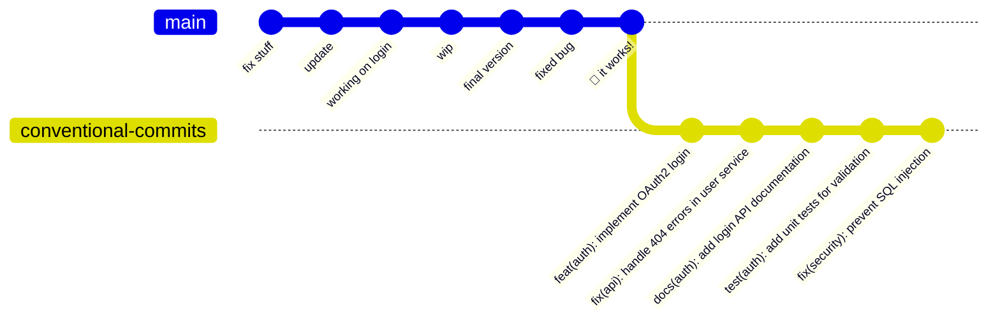

# Conventional Commits : des messages qui ont du sens

"Encore un commit avec le message 'fix stuff' ou 'wip'..." Qui n'a jamais pesté en parcourant l'historique Git d'un projet ? Après trois ans d'alternance en tant que développeur fullstack, j'ai vu défiler des historiques de commits... disons, créatifs. Entre les "oops", "ça marche" et les mystérieux "update", retrouver l'origine d'un bug ou comprendre l'évolution d'une fonctionnalité relevait parfois de l'archéologie numérique.

C'est là que les Conventional Commits entrent en scène. Cette spécification, adoptée par des projets majeurs comme Angular, transforme vos messages de commit en véritable documentation structurée. Plus qu'une simple convention, c'est un outil puissant qui automatise la génération de changelogs, facilite le versioning sémantique et améliore la collaboration en équipe.

## Le problème des messages de commit désorganisés

Imaginez que vous rejoignez une équipe sur un projet React en production. Le dernier déploiement a introduit un bug critique et vous devez rapidement identifier les changements responsables. Vous ouvrez l'historique Git et découvrez ceci :

```bash
* feat: add user
* fix stuff  
* update  
* working on login  
* wip  
* final version  
* fix: resolve API timeout issue  
* fixed bug  
* 🎉 it works!
```

Lequel de ces commits a introduit le bug ? Lesquels concernent l'authentification ? Impossible à dire sans examiner chaque diff en détail. C'est exactement le genre de situation où une convention claire aurait évité des heures de débogage.



## Qu'est-ce que les Conventional Commits ?

Les Conventional Commits définissent une convention simple mais puissante pour structurer vos messages de commit. Basée sur la spécification v1.0.0 (stable depuis plusieurs années et toujours d'actualité en 2025), elle impose un format précis :

```
<type>[scope optionnel]: <description>

[corps optionnel]

[pied de page optionnel]
```

### Les types essentiels

Voici les 11 types que j'utilise quotidiennement dans mes projets :

**Types principaux :**
- `feat:` - Nouvelle fonctionnalité (MINOR en semver)
- `fix:` - Correction de bug (PATCH en semver)

**Types complémentaires :**
- `docs:` - Documentation uniquement
- `style:` - Formatage, point-virgules manquants (aucun changement de code)
- `refactor:` - Refactoring sans ajout de fonctionnalité ni correction
- `perf:` - Amélioration des performances
- `test:` - Ajout ou modification de tests
- `build:` - Changements du système de build ou dépendances externes
- `ci:` - Modifications des scripts d'intégration continue
- `chore:` - Tâches de maintenance (mise à jour dépendances, etc.)
- `revert:` - Annulation d'un commit précédent

### Exemples concrets de mon quotidien

Voici des messages que j'écris régulièrement :

::: code-group

```bash [Frontend React/TypeScript]
feat(auth): implement OAuth2 login with Google
fix(api): handle 404 errors in user service
perf(components): lazy load ProfileCard component
docs(readme): add installation instructions for Windows
style(eslint): fix semicolon and spacing issues
test(auth): add unit tests for login validation
```

```bash [Backend Spring Boot]
feat(user): add password reset functionality
fix(security): prevent SQL injection in search endpoint
perf(database): optimize user query with indexing
build(maven): upgrade to Spring Boot 3.2.1
ci(github): add automated security scanning
chore(deps): bump jackson-core from 2.15.2 to 2.16.0
```

```bash [DevOps/Infrastructure]
feat(docker): add multi-stage build for production
fix(nginx): resolve SSL certificate renewal
ci(k8s): implement rolling deployment strategy
docs(deployment): document backup procedure
chore(monitoring): update Grafana dashboard config
```

:::

## Indiquer les breaking changes

Un aspect crucial souvent négligé : comment signaler les changements cassants ? Les Conventional Commits offrent deux méthodes :

### Méthode 1 : Le point d'exclamation

```bash
feat!: switch from REST to GraphQL API
chore!: drop support for Node.js 16
refactor!: rename getUserData to fetchUserProfile
```

### Méthode 2 : Le footer BREAKING CHANGE

```bash
feat(api): add pagination to user endpoints

BREAKING CHANGE: The /api/users endpoint now returns 
paginated results. Update client code to handle the 
new response format with 'data', 'totalCount', and 
'hasMore' properties.
```

Cette information est cruciale car elle génère automatiquement une version MAJOR en suivant le versioning sémantique.

## Les scopes : ajouter du contexte

Le scope, placé entre parenthèses après le type, précise la partie du projet concernée. Dans un projet Angular, on pourrait avoir :

```bash
feat(auth): add two-factor authentication
fix(router): prevent infinite redirects on protected routes
docs(components): update ButtonGroup usage examples
test(services): increase UserService test coverage
```

Pour un projet fullstack, j'organise souvent mes scopes ainsi :

```bash
# Frontend
feat(components): create reusable DataTable
fix(store): resolve state mutation in cart reducer

# Backend  
feat(api): implement user preferences endpoint
fix(database): handle connection timeout gracefully

# Infrastructure
feat(docker): add development environment
ci(actions): cache npm dependencies
```

## Automatisation avec les outils modernes

La vraie puissance des Conventional Commits réside dans l'écosystème d'outils qui s'appuient sur cette convention.

### Configuration type avec Commitizen et Commitlint

Voici la configuration que j'utilise sur mes projets en 2025 :

::: code-group

```json [package.json]
{
  "scripts": {
    "commit": "cz",
    "prepare": "husky install"
  },
  "devDependencies": {
    "@commitlint/cli": "^18.4.3",
    "@commitlint/config-conventional": "^18.4.3",
    "commitizen": "^4.3.0",
    "cz-conventional-changelog": "^3.3.0",
    "husky": "^8.0.3"
  },
  "config": {
    "commitizen": {
      "path": "./node_modules/cz-conventional-changelog"
    }
  }
}
```

```js [commitlint.config.js]
module.exports = {
  extends: ['@commitlint/config-conventional'],
  rules: {
    'type-enum': [
      2, 
      'always',
      [
        'feat', 'fix', 'docs', 'style', 'refactor',
        'perf', 'test', 'build', 'ci', 'chore', 'revert'
      ]
    ],
    'scope-case': [2, 'always', 'lower-case'],
    'subject-case': [2, 'never', ['upper-case']],
    'subject-empty': [2, 'never'],
    'subject-full-stop': [2, 'never', '.'],
    'header-max-length': [2, 'always', 72]
  }
}
```

:::

### Installation des hooks Git

```bash
# Installation et configuration
npm install
npx husky add .husky/commit-msg 'npx --no -- commitlint --edit "$1"'

# Utilisation
npm run commit  # Lance Commitizen pour un commit guidé
git commit -m "feat: add user profile page"  # Commit direct validé
```

Cette configuration empêche les commits non-conformes et guide l'équipe vers de bonnes pratiques.

## Génération automatique de versions et changelogs

L'un des avantages les plus concrets : l'automatisation complète du versioning. Avec des outils comme `release-please` (recommandé en 2025, `standard-version` étant déprécié), vos commits génèrent automatiquement :

### Exemple de CHANGELOG.md généré

```markdown
# Changelog

## [2.1.0](https://github.com/user/project/compare/v2.0.0...v2.1.0) (2025-01-03)

### Features

* **auth**: implement OAuth2 login with Google ([a1b2c3d](https://github.com/user/project/commit/a1b2c3d))
* **api**: add pagination to user endpoints ([e4f5g6h](https://github.com/user/project/commit/e4f5g6h))

### Bug Fixes

* **security**: prevent SQL injection in search endpoint ([i7j8k9l](https://github.com/user/project/commit/i7j8k9l))
* **api**: handle 404 errors in user service ([m1n2o3p](https://github.com/user/project/commit/m1n2o3p))

### Performance Improvements

* **database**: optimize user query with indexing ([q4r5s6t](https://github.com/user/project/commit/q4r5s6t))
```

### Configuration GitHub Actions pour release-please

```yaml
# .github/workflows/release-please.yml
name: Release Please

on:
  push:
    branches:
      - main

jobs:
  release-please:
    runs-on: ubuntu-latest
    steps:
      - uses: google-github-actions/release-please-action@v4
        with:
          release-type: node
          package-name: my-app
```

## Bénéfices observés en équipe

Après avoir implémenté les Conventional Commits sur plusieurs projets en alternance, voici les améliorations concrètes que j'ai observées :

### Amélioration de la communication

Avant, lors des code reviews, on perdait du temps à déchiffrer les changements. Maintenant, un simple coup d'œil à l'historique nous renseigne immédiatement :

```bash
feat(payment): integrate Stripe payment gateway
fix(email): resolve template rendering for user notifications  
perf(api): cache user preferences for 5 minutes
docs(api): document payment webhook endpoints
```

Chaque développeur comprend instantanément la nature et l'impact des modifications.

### Facilitation du débogage

Quand un bug apparaît en production, identifier les commits suspects devient trivial. Un problème de performance ? On cherche les commits `perf:` et `feat:` récents. Un bug d'affichage ? Direction les commits `fix:` et `style:`.

### Onboarding des nouveaux développeurs

Les nouveaux arrivants comprennent rapidement l'architecture du projet en parcourant l'historique structuré. Plus besoin d'expliquer longuement : l'historique devient auto-documenté.

## Quelques pièges à éviter

### Le scope trop générique

```bash
❌ feat(app): add new feature
✅ feat(auth): add two-factor authentication
```

### La description trop technique

```bash
❌ fix: change validateUser method to return boolean instead of string
✅ fix(auth): prevent login with invalid credentials
```

### Oublier les breaking changes

```bash
❌ refactor: update API response format
✅ refactor!: change API response from array to paginated object

BREAKING CHANGE: All API endpoints now return {data: [], total: number} 
instead of a direct array
```

## Intégration avec les outils de développement

### VSCode Extensions utiles

- **Conventional Commits** : Autocomplétion des types de commit
- **Git History** : Visualisation améliorée avec les conventions
- **GitLens** : Annotations enrichies grâce aux commits structurés

### Intégration Jira/Linear

Pour les équipes utilisant des outils de gestion de projet, on peut enrichir la convention :

```bash
feat(auth): implement SSO login

Implements user story AUTH-123
Closes #45
```

Certaines équipes ajoutent même une validation automatique des tickets :

```js
// commitlint.config.js
module.exports = {
  extends: ['@commitlint/config-conventional'],
  rules: {
    'footer-max-line-length': [2, 'always', 100],
    'references-empty': [2, 'never'] // Force une référence ticket/issue
  }
}
```

## Performance et impact sur le workflow

Une question légitime : est-ce que cette convention ralentit le développement ? Après plusieurs mois d'usage intensif, ma réponse est claire : l'investissement initial en vaut largement la peine.

Les premiers jours, rédiger un commit prend effectivement 30 secondes de plus. Mais cette micro-friction disparaît rapidement et les gains à long terme sont énormes :

- **Code reviews** 2x plus rapides
- **Débogage** facilité par l'historique structuré  
- **Releases** entièrement automatisées
- **Documentation** maintenue automatiquement

## Adoption progressive en équipe

Si vous souhaitez convaincre votre équipe, je recommande cette approche progressive :

### Semaine 1-2 : Sensibilisation
- Partage de cet article ou d'exemples concrets
- Démonstration des outils de génération automatique

### Semaine 3-4 : Test sur un projet pilote
- Configuration sur un projet non-critique
- Formation des développeurs volontaires

### Semaine 5-8 : Généralisation
- Déploiement des hooks Git sur tous les projets
- Formation de l'équipe complète
- Ajustement des règles selon le contexte projet

## Ressources pour aller plus loin

### Documentation officielle
- [Conventional Commits v1.0.0](https://www.conventionalcommits.org/en/v1.0.0/) - Spécification complète et exemples
- [Angular Commit Convention](https://github.com/conventional-changelog/conventional-changelog/tree/master/packages/conventional-changelog-angular) - Convention détaillée avec scopes

### Outils et intégrations
- [Commitizen](https://github.com/commitizen/cz-cli) - Interface interactive pour commits
- [Commitlint](https://github.com/conventional-changelog/commitlint) - Validation des messages de commit
- [Release Please](https://github.com/googleapis/release-please) - Automatisation des releases (remplace standard-version)
- [Husky](https://github.com/typicode/husky) - Git hooks simplifiés

### Articles et guides complémentaires
- [Why Use Conventional Commits](https://www.freecodecamp.org/news/how-to-write-better-git-commit-messages/) - Guide pratique avec exemples
- [Semantic Versioning](https://semver.org/) - Principe du versioning sémantique
- [Keep a Changelog](https://keepachangelog.com/) - Bonnes pratiques pour les changelogs

### Exemples de projets utilisant la convention
- [Angular](https://github.com/angular/angular) - Projet de référence avec scopes complexes
- [Vue.js](https://github.com/vuejs/core) - Adaptation pour un framework moderne
- [Electron](https://github.com/electron/electron) - Usage dans un projet desktop

Les Conventional Commits ne sont pas qu'une mode passagère : c'est une méthode éprouvée qui transforme votre rapport au versioning et à la documentation. En standardisant vos messages de commit, vous créez un historique lisible, recherchable et exploitable par les outils. Votre futur vous remerciera, et vos collègues aussi.