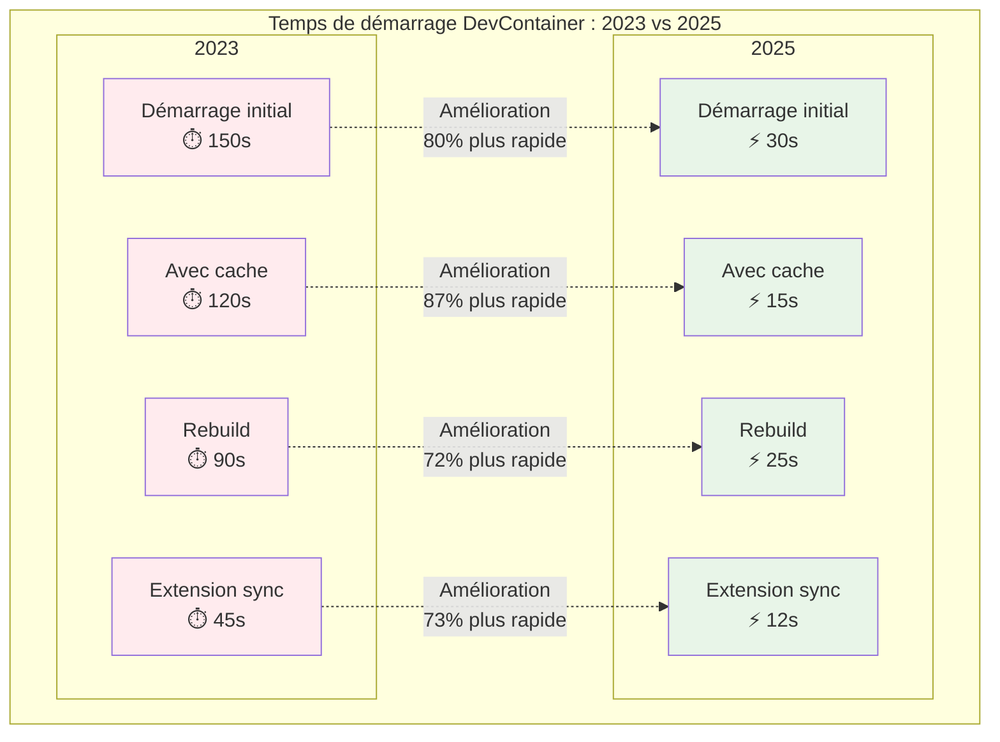
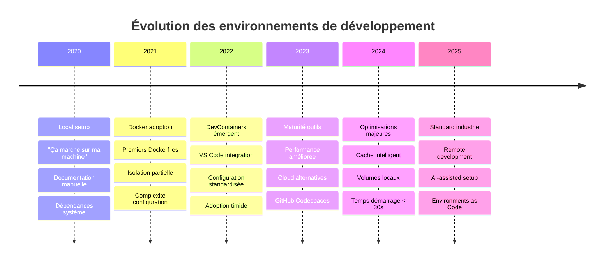

> "Ça marche sur ma machine" est devenu un mème dans le monde du développement, mais en 2025, cette époque touche à sa fin grâce aux DevContainers et aux environnements de développement cloud. Découvrez comment ces technologies transforment notre façon de coder et d'interagir avec nos projets.

# DevContainers vs "ça marche sur ma machine" : la fin d'une époque

"Ton code ne compile pas chez moi." "Pourtant ça marche sur ma machine !" Cette conversation, je l'ai vécue des dizaines de fois pendant mes trois ans d'alternance. Jusqu'au jour où notre équipe a migré vers les DevContainers. Spoiler : c'était révolutionnaire.

La phrase "ça marche sur ma machine" est devenue le running gag de l'informatique, mais derrière l'humour se cache un véritable fléau : des heures perdues en debug d'environnements, des déploiements qui plantent en production, et des développeurs frustrés. En 2025, cette époque touche à sa fin.

## Le problème qu'on connaît tous

Vous venez de rejoindre une nouvelle équipe. Premier jour : "Clone le repo, installe Node 18.16.0, puis Python 3.11, configure PostgreSQL, et normalement ça devrait marcher." Deux heures plus tard, vous êtes toujours en train de debugger une erreur obscure liée à une version de dépendance incompatible avec votre OS.

::: warning Coût réel du problème
Selon une étude de 2024, les problèmes d'environnement représentent en moyenne 23% du temps de debug dans les équipes de développement, soit environ 9 heures par développeur par mois.
:::

Les causes classiques ? Version drift (Node 18.16.0 en local vs 18.15.0 en prod), configurations manquantes, dépendances système différentes, et le fameux "j'ai modifié un truc mais j'ai oublié de le commiter".

## DevContainers : le game changer

Les DevContainers, c'est simple : votre environnement de développement complet dans un conteneur Docker. VS Code se connecte à ce conteneur et vous développez comme si tout était en local, sauf que tout est isolé et reproductible.

::: code-group

```json [.devcontainer/devcontainer.json]
{
  "name": "Node.js & TypeScript",
  "image": "mcr.microsoft.com/devcontainers/typescript-node:1-20-bookworm",
  
  "features": {
    "ghcr.io/devcontainers/features/docker-in-docker:2": {},
    "ghcr.io/devcontainers/features/git:1": {},
    "ghcr.io/devcontainers/features/github-cli:1": {}
  },
  
  "customizations": {
    "vscode": {
      "extensions": [
        "ms-vscode.vscode-typescript-next",
        "bradlc.vscode-tailwindcss",
        "esbenp.prettier-vscode"
      ],
      "settings": {
        "typescript.preferences.quoteStyle": "single",
        "editor.formatOnSave": true
      }
    }
  },
  
  "postCreateCommand": "npm install && npm run setup",
  "forwardPorts": [3000, 5432],
  "remoteUser": "vscode"
}
```

```dockerfile [.devcontainer/Dockerfile]
FROM mcr.microsoft.com/devcontainers/typescript-node:1-20-bookworm

# Installation d'outils supplémentaires
RUN apt-get update && export DEBIAN_FRONTEND=noninteractive \
    && apt-get -y install --no-install-recommends \
        postgresql-client \
        redis-tools \
        curl \
    && apt-get clean -y && rm -rf /var/lib/apt/lists/*

# Configuration globale Git
RUN git config --global core.autocrlf input

# Installation d'outils Node.js globaux
RUN su vscode -c "npm install -g pnpm @nestjs/cli"
```

```yaml [docker-compose.yml]
version: '3.8'

services:
  app:
    build: 
      context: .
      dockerfile: .devcontainer/Dockerfile
    volumes:
      - ..:/workspaces/mon-projet:cached
    command: sleep infinity
    environment:
      - NODE_ENV=development
    depends_on:
      - postgres
      - redis

  postgres:
    image: postgres:15
    restart: unless-stopped
    environment:
      POSTGRES_DB: mon_projet_dev
      POSTGRES_USER: dev
      POSTGRES_PASSWORD: password
    volumes:
      - postgres-data:/var/lib/postgresql/data

  redis:
    image: redis:7-alpine
    restart: unless-stopped

volumes:
  postgres-data:
```

:::

Avec cette configuration, n'importe qui peut cloner le projet, ouvrir VS Code, et en 30 secondes avoir un environnement fonctionnel avec toutes les dépendances, extensions, et même la base de données configurée.

## Les avantages concrets

### Onboarding en 30 secondes

Fini les README de 20 pages d'installation. Le nouveau développeur clone, ouvre dans VS Code, et c'est parti. J'ai chronométré : de `git clone` à "Hello World" qui fonctionne, on passe de 2-3 heures à moins d'une minute.

### Environnements multiples sans conflit

Vous travaillez sur un projet Node 16 et un autre Node 20 ? Pas de problème. Chaque DevContainer isole complètement son environnement. Plus de `nvm use` ou de virtualenv à jongler.

### Parité dev/prod garantie

Le même Dockerfile peut servir de base au DevContainer et au déploiement. Si ça marche dans le DevContainer, ça marchera en production.

### Debug simplifié

Quand un bug apparaît, tout le monde peut reproduire exactement le même environnement. Plus de "chez moi ça marche mais pas chez toi".

### Code reviews révolutionnées

Mais le vrai game changer, c'est pour les code reviews. Avant, un reviewer devait faire confiance au développeur ou passer 15 minutes à setup l'environnement pour tester la feature. Maintenant ?

```bash
# Le reviewer récupère la PR
git checkout feature/nouveau-paiement

# Lance le DevContainer
code .

# En 30 secondes : environnement prêt, base de données seedée, 
# API qui tourne, frontend accessible sur localhost:3000
```

J'ai vu des reviewers tester des features sur 3-4 projets différents dans la même heure. Impossible avant les DevContainers. Résultat : des reviews plus approfondies, moins de bugs qui passent en prod, et une meilleure collaboration entre développeurs.

### Tests multi-environnements simplifiés

Vous voulez tester votre app avec Node 18 ET Node 20 ? Ou vérifier la compatibilité avec PostgreSQL 14 et 15 ? Les DevContainers permettent de créer plusieurs configurations en parallèle :

::: code-group

```json [.devcontainer/node18/devcontainer.json]
{
  "name": "App - Node 18",
  "image": "mcr.microsoft.com/devcontainers/typescript-node:1-18-bookworm",
  "dockerComposeFile": "../docker-compose.yml",
  "service": "app-node18"
}
```

```json [.devcontainer/node20/devcontainer.json]
{
  "name": "App - Node 20", 
  "image": "mcr.microsoft.com/devcontainers/typescript-node:1-20-bookworm",
  "dockerComposeFile": "../docker-compose.yml",
  "service": "app-node20"
}
```

```yaml [docker-compose.yml]
version: '3.8'
services:
  app-node18:
    image: node:18-alpine
    # Configuration partagée
    
  app-node20:
    image: node:20-alpine
    # Configuration partagée
    
  postgres14:
    image: postgres:14
    
  postgres15:
    image: postgres:15
```

:::

VS Code vous permet de switcher entre configurations en un clic. Plus besoin de jongler avec plusieurs machines virtuelles ou de polluer votre environnement local.

## Performance et expérience utilisateur

::: tip Performance en 2025
Les dernières optimisations de Docker Desktop et VS Code ont considérablement amélioré l'expérience. Le démarrage à froid d'un DevContainer prend désormais 15-30 secondes contre plusieurs minutes il y a 2 ans.
:::

La grande amélioration de 2024-2025, c'est la gestion des volumes. Avec les volumes locaux et le cache intelligent, les performances sont presque identiques au développement local, même sur macOS.



## Les alternatives cloud-native

### GitHub Codespaces

```yaml [.devcontainer/devcontainer.json - Codespaces]
{
  "name": "Full Stack App",
  "image": "mcr.microsoft.com/devcontainers/universal:2-focal",
  
  "features": {
    "ghcr.io/devcontainers/features/node:1": {
      "version": "20"
    },
    "ghcr.io/devcontainers/features/python:1": {
      "version": "3.11"
    }
  },
  
  "portsAttributes": {
    "3000": {
      "label": "Frontend",
      "visibility": "public"
    },
    "8000": {
      "label": "API",
      "visibility": "private"
    }
  },
  
  "secrets": {
    "DATABASE_URL": {
      "description": "Connection string for the database"
    }
  }
}
```

Codespaces pousse le concept plus loin : votre environnement de développement vit entièrement dans le cloud. Avantages : puissance de calcul illimitée, accès depuis n'importe quel appareil. Inconvénient : dépendance à la connexion internet et coût (environ 0,18$/heure).

### GitPod et DevPod

GitPod mise sur la rapidité : 15 secondes pour avoir un environnement fonctionnel. DevPod, lui, est open-source et agnostique : vous choisissez votre cloud provider ou restez en local.

## Cas d'usage concrets que j'ai vécus

### Migration d'un monolithe Spring Boot

Notre équipe maintenait une application Spring Boot avec des dépendances complexes : Java 17, Maven, PostgreSQL, Redis, et Elasticsearch. L'onboarding prenait une journée complète.

Avec DevContainers :

```json
{
  "name": "Spring Boot App",
  "dockerComposeFile": "docker-compose.dev.yml",
  "service": "app",
  "workspaceFolder": "/workspace",
  
  "features": {
    "ghcr.io/devcontainers/features/java:1": {
      "version": "17",
      "installMaven": true
    }
  },
  
  "customizations": {
    "vscode": {
      "extensions": [
        "vscjava.vscode-java-pack",
        "vmware.vscode-spring-boot"
      ]
    }
  },
  
  "postCreateCommand": "./mvnw clean compile"
}
```

Résultat : onboarding en 5 minutes, plus aucun problème de compatibilité entre développeurs Windows, macOS et Linux.

### Projet full-stack avec microservices

Pour un projet avec frontend React, API Node.js, et service Python pour le ML, nous avons créé un DevContainer qui orchestrait les trois environnements :

```yaml
services:
  frontend:
    build: .devcontainer/frontend
    volumes:
      - ./frontend:/workspace/frontend
    ports:
      - "3000:3000"
    
  api:
    build: .devcontainer/api  
    volumes:
      - ./api:/workspace/api
    ports:
      - "8000:8000"
    depends_on:
      - postgres
      
  ml-service:
    build: .devcontainer/ml
    volumes:
      - ./ml:/workspace/ml
    ports:
      - "8001:8001"
```

Chaque développeur pouvait travailler sur sa partie tout en ayant accès aux autres services. Plus de "l'API ne répond pas chez moi".

Le plus impressionnant ? Notre tech lead pouvait review une PR frontend, une PR backend, et une PR ML dans la même matinée. Il suffisait de :

```bash
# PR Frontend
git checkout pr/156/frontend-refactor
code . # DevContainer React + API mock

# PR Backend 
git checkout pr/157/api-optimization  
code . # DevContainer Node.js + PostgreSQL + tests

# PR ML
git checkout pr/158/model-improvements
code . # DevContainer Python + Jupyter + datasets
```

Chaque environnement était isolé, configuré automatiquement, et prêt à être testé. Résultat : des reviews 3x plus rapides et 5x plus qualitatives.

## Les pièges à éviter

### Taille des images

Première erreur : images de 2Go+ qui prennent 10 minutes à télécharger. Solution : images multi-stage et .dockerignore optimisés.

```dockerfile
# ❌ Mauvais : image de 1.5GB
FROM node:20
COPY . .
RUN npm install

# ✅ Bon : image de 400MB
FROM node:20-alpine
WORKDIR /app
COPY package*.json ./
RUN npm ci --only=production && npm cache clean --force
COPY . .
```

### Oublier la persistance des données

Vos données de développement disparaissent à chaque rebuild ? Pensez aux volumes nommés :

```yaml
volumes:
  - postgres-data:/var/lib/postgresql/data
  - node_modules:/workspace/node_modules
```

### Configurations spécifiques au développeur

Évitez les configurations hardcodées. Utilisez les variables d'environnement et les secrets :

```json
"containerEnv": {
  "DATABASE_URL": "${localEnv:DATABASE_URL}",
  "API_KEY": "${localEnv:API_KEY}"
}
```

## L'impact sur les équipes

Depuis qu'on utilise les DevContainers, notre équipe a observé :

- **-80% de temps passé en setup d'environnement** lors de l'onboarding
- **-60% de tickets liés aux problèmes d'environnement** 
- **+40% de temps productif** pour les nouveaux développeurs
- **+200% de features testées en review** grâce à la facilité de lancement des environnements
- **-50% de bugs remontés en staging** car les reviewers testent maintenant réellement

Plus subjectivement, l'ambiance s'est améliorée. Fini les frustrations liées aux problèmes techniques qui "ne devraient pas exister". L'équipe se concentre sur ce qui compte : développer des fonctionnalités.

::: tip Impact concret sur les code reviews
Un exemple marquant : avant DevContainers, seulement 20% de nos PRs étaient testées fonctionnellement par le reviewer. Aujourd'hui, ce chiffre monte à 85%. Les reviewers n'hésitent plus à lancer l'app, créer des comptes tests, et explorer les nouvelles features. Résultat : une qualité code qui a explosé.
:::

## Le futur : au-delà des DevContainers

2025 marque probablement un tournant. Avec l'amélioration des connexions internet et la baisse des coûts cloud, je parie que dans 3-5 ans, développer sur sa machine locale sera l'exception plutôt que la règle.

Les nouvelles générations de développeurs grandiront avec des environnements cloud-native, et "ça marche sur ma machine" deviendra une expression du passé, comme "rembobiner la cassette".



## Par où commencer ?

Si vous voulez tester les DevContainers aujourd'hui :

1. **Installez Docker** et l'extension "Dev Containers" sur VS Code
2. **Commencez simple** : prenez un projet existant et créez un `.devcontainer/devcontainer.json` basique
3. **Explorez les templates** : VS Code propose des templates pour React, Python, Java, etc.
4. **Documentez votre configuration** pour votre équipe

L'investissement initial peut sembler important, mais le retour sur investissement est quasi-immédiat. Votre futur vous remerciera.

La révolution DevContainers n'est pas qu'une mode technologique : c'est un changement fondamental dans notre façon de travailler. Elle nous libère des contraintes techniques pour nous concentrer sur l'essentiel : créer de la valeur.

## Ressources pour aller plus loin

- [VS Code Dev Containers - Documentation officielle](https://code.visualstudio.com/docs/devcontainers/containers) - Guide complet et à jour
- [Dev Container Features](https://containers.dev/features) - Catalogue officiel des features disponibles
- [DevContainers in 2025: A Personal Take](https://ivanlee.me/devcontainers-in-2025-a-personal-take/) - Retour d'expérience détaillé
- [GitHub Codespaces Documentation](https://docs.github.com/en/codespaces) - Pour l'environnement cloud
- [DevPod - Open Source Alternative](https://devpod.sh/) - Alternative open-source aux solutions propriétaires
- [Ultimate Guide to Dev Containers](https://www.daytona.io/dotfiles/ultimate-guide-to-dev-containers) - Guide pratique complet
- [Comparing Cloud Development Environments 2025](https://www.loft.sh/blog/comparing-coder-vs-codespaces-vs-gitpod-vs-devpod) - Comparaison des solutions cloud
