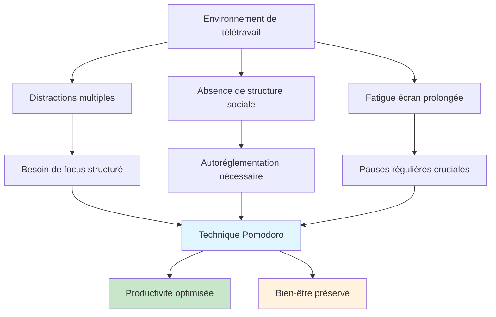
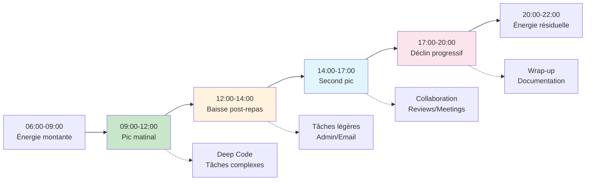

# La technique Pomodoro adaptée pour les sessions de code en télétravail

<Badge type="tip" text="Productivité & Remote Work 2025" />

Le télétravail transforme radicalement notre approche du développement logiciel. La technique Pomodoro, créée dans les années 1980, trouve une nouvelle pertinence dans ce contexte moderne. Ce guide présente une adaptation spécialement conçue pour les développeurs en remote, intégrant les spécificités du code et les défis du travail à distance.

## Comprendre la technique Pomodoro moderne

### Principe fondamental adapté au développement

::: info Pomodoro pour développeurs
La technique Pomodoro divise le travail en **intervals de focus intense** (traditionnellement 25 minutes) suivis de **pauses courtes** (5 minutes). Pour le développement, ces durées sont adaptables selon la complexité des tâches et le contexte de télétravail.
:::

### Pourquoi Pomodoro fonctionne particulièrement bien en remote



### Défis spécifiques du télétravail

| Défi | Impact sur le code | Solution Pomodoro |
|------|-------------------|-------------------|
| Distractions domestiques | Interruptions fréquentes | Cycles de focus protégés |
| Isolement social | Manque de feedback | Pauses de communication |
| Fatigue écran | Baisse de qualité code | Pauses visuelles régulières |
| Procrastination | Reports de tâches complexes | Décomposition en pomodoros |
| Surmenage | Burnout technique | Limites de temps strictes |

## Adaptation spécifique au développement

### Durées optimisées selon le type de tâche

Le développement logiciel nécessite différents niveaux de concentration selon la complexité des tâches. Contrairement au Pomodoro classique de 25 minutes, certaines activités bénéficient d'intervalles adaptés :

::: tip Durées recommandées par activité
**Debugging complexe** → 45-60 minutes + pause 10 minutes
**Développement de features** → 25-30 minutes + pause 5 minutes  
**Code review** → 20 minutes + pause 5 minutes
**Tests unitaires** → 25 minutes + pause 5 minutes
**Documentation** → 30 minutes + pause 5 minutes
**Refactoring** → 45 minutes + pause 10 minutes
:::

### Le concept de "Deep Code Pomodoro"

Pour les tâches de développement complexes comme l'architecture logicielle ou le debugging d'un problème difficile, la méthode traditionnelle de 25 minutes peut s'avérer frustrante. Le "Deep Code Pomodoro" propose des sessions de 45 à 90 minutes pour ces situations.

L'idée clé est d'adapter la durée selon trois facteurs : la complexité de la tâche, votre niveau d'énergie actuel, et l'environnement de travail disponible. Une session d'architecture système nécessite plus de temps pour entrer dans le flow qu'une simple correction de bug.

**Critères pour une session longue :**
- Problème nécessitant une vision d'ensemble
- Tâche requérant de charger beaucoup de contexte mental
- Pas d'interruption attendue dans les 90 prochaines minutes
- Niveau d'énergie élevé (généralement le matin)

### Micro-pauses spécialisées pour développeurs

Le travail sur écran sollicite intensément notre système visuel et notre posture. En télétravail, cette sollicitation est encore plus importante car nous manquons des micro-déplacements naturels du bureau (aller chercher un café, discuter avec un collègue, se rendre en salle de réunion).

**Types de pauses selon la durée :**

**Pause Oculaire (2-3 minutes)** : Essentielle après chaque pomodoro de 25 minutes. La règle des "20-20-20" recommande toutes les 20 minutes de regarder quelque chose à 20 pieds (6 mètres) pendant 20 secondes. Fermez les yeux quelques instants et pratiquez des mouvements oculaires circulaires.

**Pause Physique (5 minutes)** : Combattez la position assise prolongée par des étirements ciblés. Concentrez-vous sur le cou, les épaules et les poignets qui sont les plus sollicités. Une marche rapide, même dans l'appartement, relance la circulation.

**Pause Mentale (5-10 minutes)** : Permettez à votre cerveau de se réinitialiser. La méditation ou la respiration profonde sont particulièrement efficaces. Évitez les écrans pendant cette pause - regardez par la fenêtre ou écoutez de la musique sans paroles.

**Pause Sociale (10-15 minutes)** : Compensez l'isolement du télétravail par un contact humain bref. Un message sur le canal équipe ou un appel vidéo rapide avec un collègue peut suffire à rompre l'isolement.

**Pause Créative (15 minutes)** : Nourrissez votre curiosité technique avec la lecture d'un article court ou l'exploration d'un nouvel outil. Cette pause stimule votre créativité sans vous épuiser mentalement.

## Mise en place pratique

### Setup de l'environnement de travail

Un environnement optimisé est crucial pour le succès de la technique Pomodoro en télétravail. Contrairement au bureau, vous avez un contrôle total sur votre espace, ce qui est un avantage considérable.

**L'éclairage fait la différence** : Privilégiez la lumière naturelle en positionnant votre écran perpendiculairement à la fenêtre pour éviter les reflets. Une lampe de bureau réglable (température de couleur 6500K) complète efficacement la lumière naturelle. Activez un filtre de lumière bleue après 18h pour préserver votre sommeil.

**Ergonomie : investissement rentable** : Un bureau ajustable en hauteur permet d'alterner position assise et debout. Votre écran doit être à hauteur des yeux pour éviter les tensions cervicales. Un clavier et une souris séparés améliorent considérablement le confort sur de longues sessions.

**Ambiance productive** : Maintenez une température entre 20-22°C pour une concentration optimale. Quelques plantes améliorent la qualité de l'air et apportent une touche de nature. Minimisez les distractions visuelles et utilisez un bruit blanc si nécessaire.

**Préparation numérique** : Avant chaque session, désactivez toutes les notifications non essentielles. Mettez votre téléphone en mode avion ou dans une autre pièce. Fermez tous les onglets de navigateur non liés à votre tâche actuelle. Configurez votre IDE en plein écran pour maximiser l'immersion.

### Outils recommandés pour développeurs

::: details Sélection d'outils 2025
**Timers spécialisés :**
- **Forest** - Gamification avec plantation virtuelle
- **Toggl Track** - Suivi temps avec intégrations dev
- **Be Focused** - Simple et efficace sur macOS
- **Pomofocus** - Web app minimaliste et gratuite

**Extensions IDE :**
- **Pomodoro Timer (VS Code)** - Intégré à l'éditeur
- **Time Master (JetBrains)** - Statistiques détaillées
- **WakaTime** - Analytics temps de code automatique

**Applications de pause :**
- **Stretchly** - Rappels d'étirements automatiques
- **EyeCare** - Exercices oculaires guidés
- **Headspace for Developers** - Méditations courtes

**Outils de communication équipe :**
- **Slack Status** - Indiquer session Pomodoro
- **Discord Activity** - Partage focus time
- **Notion Dashboard** - Suivi collectif équipe
:::

### Planification de la journée type

```mermaid
gantt
    title Journée type développeur remote avec Pomodoro
    dateFormat HH:mm
    axisFormat %H:%M
    
    section Matin
    Setup & planning    :09:00, 30m
    Deep Code 1         :09:30, 60m
    Pause longue        :10:30, 15m
    Code session 2      :10:45, 45m
    Pause courte        :11:30, 10m
    Code review         :11:40, 30m
    
    section Midi
    Pause déjeuner      :12:10, 60m
    
    section Après-midi
    Réunion équipe      :13:10, 30m
    Debug session       :13:40, 45m
    Pause courte        :14:25, 10m
    Feature dev         :14:35, 60m
    Pause longue        :15:35, 20m
    Tests & doc         :15:55, 45m
    Wrap-up journée     :16:40, 20m
```



## Stratégies avancées

### Pomodoro en pair programming remote

Le pair programming à distance bénéficie énormément de la structure Pomodoro. La technique permet de maintenir l'engagement des deux développeurs et d'éviter la fatigue cognitive inhérente aux sessions de partage d'écran prolongées.

**Synchronisation des pauses** : La question clé est de décider si les pauses sont synchronisées ou individuelles. Les pauses synchronisées favorisent la cohésion et permettent des discussions informelles, mais peuvent ne pas convenir aux rythmes biologiques de chacun. Les pauses individuelles offrent plus de flexibilité mais risquent de fragmenter la session.

**Rotation des rôles** : Profitez des transitions entre pomodoros pour échanger les rôles driver/navigator. Cette rotation régulière maintient l'engagement et évite qu'une personne reste passive trop longtemps. Un cycle de 25 minutes est idéal pour cette rotation.

**Gestion des fuseaux horaires** : Pour les équipes distribuées, planifiez des sessions de pair programming pendant les heures de chevauchement. Une session de 2 heures (4 pomodoros) est généralement optimale pour le pair programming remote.

**Communication efficace** : Maintenez la vidéo activée pour préserver les signaux non-verbaux. Utilisez un chat en parallèle pour partager des liens ou noter des idées sans interrompre le flow de code. Préparez un environnement de développement partagé (Live Share, CodeTogether) avant la session.

### Gestion des interruptions en remote

::: warning Interruptions typiques en télétravail
- **Notifications non professionnelles** (réseaux sociaux, news)
- **Sollicitations familiales** (enfants, conjoint, livraisons)
- **Urgences techniques** (pannes, incidents production)
- **Réunions non planifiées** (calls spontanés)
- **Tâches domestiques** (ménage, cuisine, administratif)
:::

```markdown
## Protocole de gestion des interruptions

### Classification des interruptions

**🔴 Critique (interruption immédiate)**
- Incident de production
- Urgence familiale
- Panne système critique

**🟡 Important (noter et traiter après le pomodoro)**
- Message Slack non urgent
- Email important mais non critique
- Idée de feature/amélioration

**🟢 Non urgent (reporter à plus tard)**
- Réseaux sociaux
- News/articles
- Tâches ménagères

### Actions selon le type

1. **Interruption critique**
   - Arrêter le pomodoro
   - Noter le temps restant
   - Traiter l'urgence
   - Reprendre avec un nouveau pomodoro

2. **Interruption importante**
   - Noter rapidement (< 30 secondes)
   - Continuer le pomodoro
   - Traiter pendant la pause

3. **Interruption non urgente**
   - Ignorer complètement
   - Ajouter à une liste "plus tard"
   - Traiter en fin de journée
```

### Pomodoro distribué en équipe

L'implémentation du Pomodoro à l'échelle d'une équipe remote nécessite un équilibre délicat entre structure collective et flexibilité individuelle. L'objectif est de maximiser les périodes de focus tout en préservant la collaboration naturelle.

**Créneaux de focus collectif** : Définissez des plages horaires où toute l'équipe se concentre simultanément. Par exemple, 9h-10h30 pour le "deep work" et 14h-15h30 pour les tâches collaboratives. Cette synchronisation crée une émulation positive et réduit les interruptions.

**Indicateurs de statut** : Utilisez des statuts Slack/Teams clairs : "🍅 Deep coding - Ne pas déranger", "☕ En pause - Messages courts OK", "💬 Disponible pour collaboration". Cette communication passive évite les malentendus et respecte le rythme de chacun.

**Protocoles de communication** : Établissez des règles claires pour les différents niveaux d'urgence. Les vrais urgences justifient un appel téléphonique, les sujets importants un message Slack avec mention, le reste peut attendre la fin du pomodoro en cours.

## Mesurer et optimiser

### Métriques de productivité personnelles

Le suivi de vos sessions Pomodoro révèle des patterns précieux pour optimiser votre productivité. Contrairement aux métriques techniques traditionnelles (lignes de code, commits), les métriques Pomodoro se concentrent sur la qualité de votre attention et l'efficacité de votre gestion du temps.

**Métriques fondamentales à tracker** : Comptez vos pomodoros complétés versus interrompus chaque jour. Un ratio supérieur à 80% indique une bonne maîtrise de votre environnement. Notez votre niveau d'énergie (sur 10) en début de session - cela révèle vos créneaux de productivité optimale.

**Analyse des patterns temporels** : Après 2-3 semaines de données, des tendances émergent. Vous découvrirez peut-être que votre concentration est maximale entre 9h-11h, ou que les après-midis sont plus propices aux tâches collaboratives. Ces insights permettent d'adapter votre planning aux réalités de votre rythme biologique.

**Types de distractions** : Catégorisez vos interruptions en trois types : internes (pensées qui divaguent), externes (sollicitations familiales, livraisons) et numériques (notifications, emails). Identifier le type dominant oriente vos efforts d'amélioration.

**Calcul de la qualité du focus** : Divisez vos pomodoros complétés par le total des pomodoros tentés. Un score inférieur à 70% suggère des améliorations d'environnement ou de discipline personnelle.

### Dashboard de suivi visuel

Un tableau de bord visuel transforme vos données Pomodoro en insights actionables. L'objectif n'est pas de créer un système complexe, mais d'avoir une vue d'ensemble rapide de vos patterns de productivité.

**Éléments essentiels du dashboard** : Un compteur journalier simple (🍅×8/10) vous motive à atteindre votre objectif quotidien. Un indicateur de "streak" (série de jours consécutifs) gamifie l'habitude et maintient la motivation sur le long terme.

**Métriques de qualité** : Affichez votre pourcentage de focus (pomodoros complétés/tentés) avec une tendance (↗️ +5% cette semaine). Identifiez et mettez en évidence votre meilleur créneau horaire - c'est là que vous devriez programmer vos tâches les plus importantes.

**Insights automatisés** : Après quelques semaines de données, des patterns émergent naturellement. Votre système peut suggérer des optimisations : "Vos sessions de 45 minutes sont 30% plus efficaces pour le debugging" ou "Désactiver les notifications entre 14h-16h améliorerait votre focus de 15%".

**Simplicité avant tout** : Résistez à la tentation de créer un dashboard trop complexe. Quelques métriques clés bien choisies sont plus utiles qu'un tableau de bord surchargé que vous finirez par ignorer.

## Adaptation aux différents types de projets

### Projets de maintenance vs nouveaux développements

::: details Stratégies par type de projet

**🔧 Maintenance/Debug**
- Pomodoros plus courts (20-25 min)
- Pauses fréquentes pour éviter la frustration
- Documentation des solutions trouvées
- Rotation entre différents bugs

**🆕 Nouveau développement**
- Pomodoros standards (25-30 min)
- Planning préalable des features
- Prototypage rapide en première session
- Tests écrits en fin de pomodoro

**🏗️ Architecture/Refactoring**
- Deep work sessions (45-90 min)
- Pauses plus longues (15-20 min)
- Schémas et diagrammes pendant pauses
- Validation avec équipe en fin de session

**📚 Learning/R&D**
- Sessions flexibles (30-60 min)
- Pauses pour synthèse des apprentissages
- Notes structurées obligatoires
- Partage avec équipe encouragé
:::

### Gestion des projets urgents

```markdown
## Mode "Crisis Pomodoro" pour urgences

### Adaptations spéciales
- **Durée** : 15-20 minutes (plus courts)
- **Pauses** : 2-3 minutes (micro-récupération)
- **Focus** : Une seule tâche par pomodoro
- **Communication** : Updates toutes les 2 sessions

### Protocole d'urgence
1. **Assessment rapide** (5 min)
   - Identifier la cause racine
   - Évaluer l'impact
   - Définir les actions prioritaires

2. **Sprint de résolution** (4x 15min)
   - Session 1 : Diagnostic approfondi
   - Session 2 : Solution temporaire
   - Session 3 : Fix définitif
   - Session 4 : Tests et validation

3. **Communication continue**
   - Update stakeholders toutes les 30min
   - Documentation des actions
   - Post-mortem planifié

### Éviter le burnout en mode urgence
- Limiter à 6h maximum par jour
- Pauses obligatoires toutes les 2h
- Décompression en fin de journée
- Review du processus en équipe
```

## Santé et bien-être

### Prévention de la fatigue numérique

::: warning Signaux d'alerte à surveiller
- **Yeux** : Picotements, sécheresse, vision floue
- **Posture** : Tensions cou/épaules, mal de dos
- **Mental** : Difficulté de concentration, irritabilité
- **Physique** : Maux de tête, fatigue générale
:::

**Protocole bien-être intégré** : Le Pomodoro ne se contente pas d'optimiser la productivité, il doit aussi préserver votre santé sur le long terme. 

**Santé visuelle** : Appliquez religieusement la règle 20-20-20 : toutes les 20 minutes, regardez quelque chose à 20 pieds (6 mètres) pendant 20 secondes. Pendant les pauses plus longues, pratiquez des exercices oculaires dirigés ou observez la nature à l'extérieur.

**Santé physique** : Intégrez 30 secondes d'étirements ciblés (cou, épaules, poignets) à chaque transition de pomodoro. Toutes les 2 heures, levez-vous pour une marche rapide de 10 minutes, même si c'est dans votre appartement. N'oubliez pas l'hydratation - un verre d'eau à chaque pause longue.

**Santé mentale** : Cultivez une routine de méditation matinale de 10 minutes pour préparer votre cerveau aux sessions de focus. En fin de journée, pratiquez la gratitude pour ancrer les aspects positifs. Instaurez une déconnexion numérique le soir pour préserver la qualité de votre sommeil.

### Gestion de l'énergie circadienne



## Outils et intégrations

### Intégration avec les outils de développement

::: details Extensions et plugins recommandés

**VS Code Extensions**
```json
{
  "recommendations": [
    "atlassian.atlascode", // Intégration Jira
    "ms-vscode.vscode-json", // JSON avec timestamps
    "streetsidesoftware.code-spell-checker", // Orthographe
    "yzhang.markdown-all-in-one", // Documentation
    "pomodoro-timer.pomodoro-timer" // Timer intégré
  ]
}
```

**Configuration VS Code pour Pomodoro**
```json
{
  "pomodoro.workTime": 25,
  "pomodoro.shortBreak": 5,
  "pomodoro.longBreak": 15,
  "pomodoro.sessions": 4,
  "pomodoro.playSound": true,
  "pomodoro.autoStartBreaks": false,
  "pomodoro.showNotifications": true,
  "pomodoro.statusBarText": "🍅 ${minutes}:${seconds}"
}
```

**Intégration avec Slack/Teams**
```javascript
// Auto-update Slack status
const updateSlackStatus = (isPomodoro) => {
  const status = isPomodoro 
    ? { 
        status_text: "🍅 Deep coding session", 
        status_emoji: ":tomato:",
        status_expiration: Date.now() + (25 * 60 * 1000) 
      }
    : { 
        status_text: "", 
        status_emoji: "",
        status_expiration: 0 
      };
  
  slack.users.profile.set(status);
};
```
:::

### Scripts d'automatisation

```bash
#!/bin/bash
# pomodoro-dev.sh - Script complet de session de développement

# Configuration
WORK_TIME=25
SHORT_BREAK=5
LONG_BREAK=15
SESSIONS_BEFORE_LONG=4

# Fonctions utilitaires
start_focus_mode() {
    echo "🍅 Démarrage session Pomodoro..."
    
    # Désactiver notifications
    osascript -e 'display notification "Mode focus activé" with title "Pomodoro"'
    
    # Ouvrir les applications nécessaires
    open -a "Visual Studio Code"
    open -a "Terminal"
    
    # Fermer les distractions
    osascript -e 'quit app "Safari"' 2>/dev/null || true
    osascript -e 'quit app "Slack"' 2>/dev/null || true
    
    # Démarrer le timer
    timer $((WORK_TIME * 60)) "Fin de session de travail"
}

start_break() {
    local break_type=$1
    local duration=$2
    
    echo "⏸️ Pause ${break_type} (${duration} min)"
    
    # Suggestions d'activités
    case $break_type in
        "courte")
            echo "💡 Suggestions : étirements, hydratation, respiration"
            ;;
        "longue") 
            echo "💡 Suggestions : marche, exercices, méditation"
            ;;
    esac
    
    # Timer de pause
    timer $((duration * 60)) "Fin de pause"
}

# Fonction principal
run_pomodoro_session() {
    local session_count=1
    
    while true; do
        echo "📋 Session $session_count"
        start_focus_mode
        
        read -p "Session terminée. Prendre une pause ? (y/n) " -n 1 -r
        echo
        
        if [[ $REPLY =~ ^[Yy]$ ]]; then
            if (( session_count % SESSIONS_BEFORE_LONG == 0 )); then
                start_break "longue" $LONG_BREAK
            else
                start_break "courte" $SHORT_BREAK
            fi
        fi
        
        read -p "Continuer avec une nouvelle session ? (y/n) " -n 1 -r
        echo
        
        if [[ ! $REPLY =~ ^[Yy]$ ]]; then
            break
        fi
        
        ((session_count++))
    done
    
    echo "✅ Session Pomodoro terminée. Bonnes tâches accomplies !"
}

# Timer simple
timer() {
    local seconds=$1
    local message=$2
    
    while [ $seconds -gt 0 ]; do
        echo -ne "\r⏰ Temps restant: $(date -u -d @$seconds +%M:%S)"
        sleep 1
        ((seconds--))
    done
    
    echo -e "\n🔔 $message"
    osascript -e "display notification \"$message\" with title \"Pomodoro Timer\""
}

# Exécution du script
run_pomodoro_session
```

## Ressources et communauté

### Applications recommandées 2025

| Application | Plateforme | Prix | Points forts |
|-------------|------------|------|--------------|
| **Focus** | macOS/iOS | Gratuit | Simple, élégant |
| **Forest** | Multi | €3.99 | Gamification |
| **Toggl Track** | Multi | Freemium | Analytics avancées |
| **Be Focused** | macOS/iOS | €2.99 | Intégration système |
| **PomoDone** | Multi | Freemium | Intégration outils |

### Communautés et ressources

::: info Ressources pour approfondir
**Livres spécialisés :**
- "The Pomodoro Technique" - Francesco Cirillo
- "Deep Work" - Cal Newport  
- "Atomic Habits" - James Clear

**Communautés en ligne :**
- [r/pomodoro](https://reddit.com/r/pomodoro) - Reddit community
- [Pomodoro Focus](https://discord.gg/pomodoro) - Discord server
- [Indie Hackers](https://indiehackers.com) - Productivity discussions

**Études scientifiques :**
- Research on attention spans and productivity
- Remote work effectiveness studies
- Cognitive load theory applications
:::

## Conclusion

### Récapitulatif des bonnes pratiques

::: tip Checklist Pomodoro pour développeurs remote
**Préparation**
- [ ] Environnement optimisé (éclairage, ergonomie)
- [ ] Tâches découpées et priorisées
- [ ] Outils de timer configurés
- [ ] Notifications désactivées

**Exécution**
- [ ] Durées adaptées au type de tâche
- [ ] Pauses respectées et variées
- [ ] Interruptions gérées selon protocole
- [ ] Métriques trackées quotidiennement

**Optimisation**
- [ ] Analyse hebdomadaire des patterns
- [ ] Ajustements selon l'énergie circadienne
- [ ] Intégration team et communication
- [ ] Bien-être physique et mental prioritaire

**Évolution**
- [ ] Expérimentation de nouvelles stratégies
- [ ] Adaptation selon les projets
- [ ] Partage d'expérience avec l'équipe
- [ ] Formation continue sur la productivité
:::

### L'essentiel à retenir

La technique Pomodoro adaptée au télétravail transforme votre journée de développement en une succession de sprints productifs entrecoupés de pauses régénératrices. L'objectif n'est pas la perfection, mais la progression constante vers de meilleures habitudes de travail.

**Commencez petit** : Implémentez d'abord les bases (25 minutes de focus + 5 minutes de pause) avant d'explorer les variantes avancées. L'habitude doit d'abord s'ancrer solidement.

**Adaptez à votre réalité** : Votre environnement de télétravail est unique. Ajustez les durées selon vos tâches, votre énergie, et les contraintes de votre contexte familial et professionnel.

**Persévérez avec bienveillance** : Les premiers jours peuvent sembler artificiels. Donnez-vous au moins deux semaines pour que la méthode devienne naturelle. Votre cerveau s'adaptera progressivement à cette nouvelle structure.
