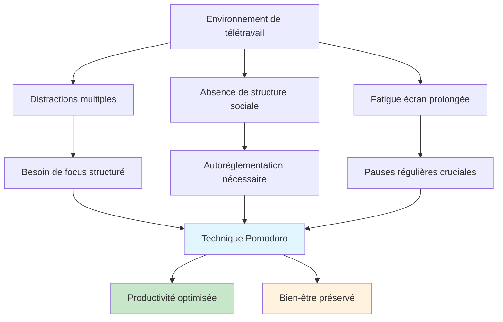
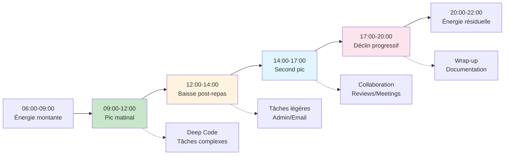

# La technique Pomodoro adaptée pour les sessions de code en télétravail

<Badge type="tip" text="Productivité & Remote Work 2025" />

Le télétravail transforme radicalement notre approche du développement logiciel. La technique Pomodoro, créée dans les années 1980, trouve une nouvelle pertinence dans ce contexte moderne. Ce guide présente une adaptation spécialement conçue pour les développeurs en remote, intégrant les spécificités du code et les défis du travail à distance.

## Comprendre la technique Pomodoro moderne

### Principe fondamental adapté au développement

::: info Pomodoro pour développeurs
La technique Pomodoro divise le travail en **intervals de focus intense** (traditionnellement 25 minutes) suivis de **pauses courtes** (5 minutes). Pour le développement, ces durées sont adaptables selon la complexité des tâches et le contexte de télétravail.
:::

### Pourquoi Pomodoro fonctionne particulièrement bien en remote



### Défis spécifiques du télétravail

| Défi | Impact sur le code | Solution Pomodoro |
|------|-------------------|-------------------|
| Distractions domestiques | Interruptions fréquentes | Cycles de focus protégés |
| Isolement social | Manque de feedback | Pauses de communication |
| Fatigue écran | Baisse de qualité code | Pauses visuelles régulières |
| Procrastination | Reports de tâches complexes | Décomposition en pomodoros |
| Surmenage | Burnout technique | Limites de temps strictes |

## Adaptation spécifique au développement

### Durées optimisées selon le type de tâche

::: tip Durées recommandées par activité
**Debugging complexe** → 45-60 minutes + pause 10 minutes
**Développement de features** → 25-30 minutes + pause 5 minutes  
**Code review** → 20 minutes + pause 5 minutes
**Tests unitaires** → 25 minutes + pause 5 minutes
**Documentation** → 30 minutes + pause 5 minutes
**Refactoring** → 45 minutes + pause 10 minutes
:::

### Le concept de "Deep Code Pomodoro"

```typescript
interface DeepCodePomodoro {
  duration: number; // 45-90 minutes pour tâches complexes
  focusLevel: 'deep' | 'standard' | 'light';
  taskType: 'architecture' | 'implementation' | 'debugging' | 'review';
  complexity: 'high' | 'medium' | 'low';
  prerequisites: {
    environment: boolean; // Setup optimal
    documentation: boolean; // Ressources préparées  
    interruptions: boolean; // Notifications désactivées
  };
}

const createDeepCodeSession = (task: CodingTask): DeepCodePomodoro => {
  const complexity = evaluateComplexity(task);
  
  return {
    duration: complexity === 'high' ? 60 : 
              complexity === 'medium' ? 45 : 30,
    focusLevel: complexity === 'high' ? 'deep' : 'standard',
    taskType: task.type,
    complexity,
    prerequisites: {
      environment: true,
      documentation: true,
      interruptions: false
    }
  };
};
```

### Micro-pauses spécialisées pour développeurs

```markdown
## Types de pauses selon la session

### Pause Oculaire (2-3 minutes)
- Regarder au loin (6+ mètres)
- Exercices oculaires (cercles, focus/défocus)
- Fermer les yeux et détendre

### Pause Physique (5 minutes)
- Étirements cou/épaules/poignets
- Micro-exercices posturaux
- Marche rapide ou montée d'escaliers

### Pause Mentale (5-10 minutes)
- Méditation ou respiration profonde
- Écoute musicale sans paroles
- Observation nature (fenêtre/balcon)

### Pause Sociale (10-15 minutes)
- Call rapide avec collègue
- Message équipe sur canal dédié
- Café virtuel informel

### Pause Créative (15 minutes)
- Lecture article technique court
- Sketch d'architecture sur papier
- Exploration outil/librairie
```

## Mise en place pratique

### Setup de l'environnement de travail

```yaml
# Configuration workspace Pomodoro-ready
workspace_setup:
  physical:
    lighting:
      - Natural light preferred
      - Adjustable desk lamp (6500K)
      - Blue light filter after 18h
    ergonomics:
      - Standing desk option
      - Ergonomic chair
      - Monitor at eye level
      - Separate keyboard/mouse
    ambiance:
      - Plants for air quality
      - Minimal visual distractions
      - Temperature 20-22°C
      - White noise if needed
  
  digital:
    focus_mode:
      - Notifications disabled
      - Phone in flight mode
      - Browser tabs minimal
      - IDE full screen
    tools:
      - Pomodoro timer app
      - Time tracking software
      - Ambient sound app
      - Break reminder system
  
  preparation:
    before_session:
      - Clear desk surface
      - Prepare water/tea
      - Review task breakdown
      - Set specific objectives
    task_ready:
      - Code editor configured
      - Documentation bookmarked
      - Test environment running
      - Backup plan defined
```

### Outils recommandés pour développeurs

::: details Sélection d'outils 2025
**Timers spécialisés :**
- **Forest** - Gamification avec plantation virtuelle
- **Toggl Track** - Suivi temps avec intégrations dev
- **Be Focused** - Simple et efficace sur macOS
- **Pomofocus** - Web app minimaliste et gratuite

**Extensions IDE :**
- **Pomodoro Timer (VS Code)** - Intégré à l'éditeur
- **Time Master (JetBrains)** - Statistiques détaillées
- **WakaTime** - Analytics temps de code automatique

**Applications de pause :**
- **Stretchly** - Rappels d'étirements automatiques
- **EyeCare** - Exercices oculaires guidés
- **Headspace for Developers** - Méditations courtes

**Outils de communication équipe :**
- **Slack Status** - Indiquer session Pomodoro
- **Discord Activity** - Partage focus time
- **Notion Dashboard** - Suivi collectif équipe
:::

### Planification de la journée type

```mermaid
gantt
    title Journée type développeur remote avec Pomodoro
    dateFormat HH:mm
    axisFormat %H:%M
    
    section Matin
    Setup & planning    :09:00, 30m
    Deep Code 1         :09:30, 60m
    Pause longue        :10:30, 15m
    Code session 2      :10:45, 45m
    Pause courte        :11:30, 10m
    Code review         :11:40, 30m
    
    section Midi
    Pause déjeuner      :12:10, 60m
    
    section Après-midi
    Réunion équipe      :13:10, 30m
    Debug session       :13:40, 45m
    Pause courte        :14:25, 10m
    Feature dev         :14:35, 60m
    Pause longue        :15:35, 20m
    Tests & doc         :15:55, 45m
    Wrap-up journée     :16:40, 20m
```



## Stratégies avancées

### Pomodoro en pair programming remote

```typescript
interface RemotePairSession {
  participants: Developer[];
  sessionType: 'navigator-driver' | 'ping-pong' | 'mob';
  duration: number;
  breakStrategy: 'synchronized' | 'alternated' | 'individual';
  communication: {
    video: boolean;
    audio: boolean;
    screen: 'shared' | 'individual';
    chat: boolean;
  };
}

class RemotePairPomodoro {
  private session: RemotePairSession;
  private currentRole: 'driver' | 'navigator';
  
  constructor(session: RemotePairSession) {
    this.session = session;
    this.currentRole = 'driver';
  }
  
  async startSession(): Promise<void> {
    const cycles = Math.floor(this.session.duration / 25);
    
    for (let i = 0; i < cycles; i++) {
      await this.runCycle(i + 1);
      
      if (i < cycles - 1) {
        await this.handleBreak(i + 1);
      }
    }
  }
  
  private async runCycle(cycleNumber: number): Promise<void> {
    console.log(`🍅 Cycle ${cycleNumber} - Role: ${this.currentRole}`);
    
    // 25 minutes de travail
    await this.timer(25 * 60 * 1000);
    
    // Rotation des rôles
    this.switchRoles();
  }
  
  private async handleBreak(cycleNumber: number): Promise<void> {
    const isLongBreak = cycleNumber % 4 === 0;
    const breakDuration = isLongBreak ? 15 : 5;
    
    if (this.session.breakStrategy === 'synchronized') {
      console.log(`⏸️ Pause synchronisée: ${breakDuration} minutes`);
      await this.timer(breakDuration * 60 * 1000);
    } else {
      console.log(`⏸️ Pause individuelle: ${breakDuration} minutes`);
      // Chacun gère sa pause
    }
  }
  
  private switchRoles(): void {
    this.currentRole = this.currentRole === 'driver' ? 'navigator' : 'driver';
  }
  
  private timer(ms: number): Promise<void> {
    return new Promise(resolve => setTimeout(resolve, ms));
  }
}

// Utilisation
const pairSession: RemotePairSession = {
  participants: [
    { name: 'Alice', timezone: 'Europe/Paris' },
    { name: 'Bob', timezone: 'America/New_York' }
  ],
  sessionType: 'navigator-driver',
  duration: 120, // 2 heures
  breakStrategy: 'synchronized',
  communication: {
    video: true,
    audio: true,
    screen: 'shared',
    chat: true
  }
};

const pairPomodoro = new RemotePairPomodoro(pairSession);
await pairPomodoro.startSession();
```

### Gestion des interruptions en remote

::: warning Interruptions typiques en télétravail
- **Notifications non professionnelles** (réseaux sociaux, news)
- **Sollicitations familiales** (enfants, conjoint, livraisons)
- **Urgences techniques** (pannes, incidents production)
- **Réunions non planifiées** (calls spontanés)
- **Tâches domestiques** (ménage, cuisine, administratif)
:::

```markdown
## Protocole de gestion des interruptions

### Classification des interruptions

**🔴 Critique (interruption immédiate)**
- Incident de production
- Urgence familiale
- Panne système critique

**🟡 Important (noter et traiter après le pomodoro)**
- Message Slack non urgent
- Email important mais non critique
- Idée de feature/amélioration

**🟢 Non urgent (reporter à plus tard)**
- Réseaux sociaux
- News/articles
- Tâches ménagères

### Actions selon le type

1. **Interruption critique**
   - Arrêter le pomodoro
   - Noter le temps restant
   - Traiter l'urgence
   - Reprendre avec un nouveau pomodoro

2. **Interruption importante**
   - Noter rapidement (< 30 secondes)
   - Continuer le pomodoro
   - Traiter pendant la pause

3. **Interruption non urgente**
   - Ignorer complètement
   - Ajouter à une liste "plus tard"
   - Traiter en fin de journée
```

### Pomodoro distribué en équipe

```yaml
# Configuration équipe Pomodoro
team_pomodoro_config:
  sync_strategy: "flexible" # strict, flexible, async
  
  time_slots:
    focus_blocks:
      - start: "09:00"
        end: "10:30"
        type: "deep_work"
      - start: "14:00" 
        end: "15:30"
        type: "collaborative"
    
    communication_windows:
      - start: "10:30"
        end: "11:00"
        type: "team_sync"
      - start: "15:30"
        end: "16:00"
        type: "cross_team"
  
  status_indicators:
    focus_mode: "🍅 Deep coding - Please don't disturb"
    break_mode: "☕ On break - Quick messages OK"
    available: "💬 Available for collaboration"
    
  collaboration_rules:
    urgent_contact: "Phone call only"
    important_contact: "Slack with @here"
    normal_contact: "Regular message"
    
  metrics_tracking:
    individual:
      - pomodoros_completed
      - interruption_count
      - focus_quality_score
    team:
      - collective_focus_time
      - collaboration_efficiency
      - delivery_velocity
```

## Mesurer et optimiser

### Métriques de productivité personnelles

```typescript
interface PomodoroMetrics {
  date: Date;
  totalPomodoros: number;
  completedPomodoros: number;
  interruptedPomodoros: number;
  taskTypes: {
    [key: string]: {
      count: number;
      averageFocus: number; // 1-10
      linesOfCode?: number;
      bugsFixed?: number;
      testsWritten?: number;
    };
  };
  energyLevels: {
    morning: number; // 1-10
    afternoon: number;
    evening: number;
  };
  distractions: {
    internal: number; // pensées wandering
    external: number; // interruptions
    digital: number; // notifications
  };
}

class PomodoroAnalytics {
  private metrics: PomodoroMetrics[] = [];
  
  addDailyMetrics(metrics: PomodoroMetrics): void {
    this.metrics.push(metrics);
  }
  
  getProductivityTrends(days: number = 30): ProductivityTrend {
    const recentMetrics = this.metrics.slice(-days);
    
    return {
      averagePomodoros: this.calculateAverage(recentMetrics, 'completedPomodoros'),
      focusQuality: this.calculateFocusQuality(recentMetrics),
      bestTimeSlots: this.identifyBestTimeSlots(recentMetrics),
      taskEfficiency: this.calculateTaskEfficiency(recentMetrics),
      recommendations: this.generateRecommendations(recentMetrics)
    };
  }
  
  private calculateFocusQuality(metrics: PomodoroMetrics[]): number {
    const totalCompleted = metrics.reduce((sum, m) => sum + m.completedPomodoros, 0);
    const totalInterrupted = metrics.reduce((sum, m) => sum + m.interruptedPomodoros, 0);
    
    return totalCompleted / (totalCompleted + totalInterrupted) * 100;
  }
  
  private identifyBestTimeSlots(metrics: PomodoroMetrics[]): TimeSlot[] {
    // Analyse des créneaux de meilleure productivité
    const timeSlots = ['09:00-10:30', '10:30-12:00', '14:00-15:30', '15:30-17:00'];
    
    return timeSlots.map(slot => ({
      time: slot,
      productivity: this.calculateSlotProductivity(metrics, slot),
      recommendation: this.getSlotRecommendation(slot)
    })).sort((a, b) => b.productivity - a.productivity);
  }
  
  private generateRecommendations(metrics: PomodoroMetrics[]): string[] {
    const recommendations = [];
    
    const avgInterruptions = this.calculateAverage(metrics, 'distractions');
    if (avgInterruptions.external > 3) {
      recommendations.push("Réduire les interruptions externes (notifications, environnement)");
    }
    
    const focusQuality = this.calculateFocusQuality(metrics);
    if (focusQuality < 70) {
      recommendations.push("Améliorer la qualité du focus (méditation, setup environnement)");
    }
    
    return recommendations;
  }
}
```

### Dashboard de suivi visuel

```html
<!-- Dashboard Pomodoro personnel -->
<div class="pomodoro-dashboard">
  <div class="metrics-grid">
    <!-- Compteur journalier -->
    <div class="metric-card">
      <h3>Aujourd'hui</h3>
      <div class="pomodoro-count">
        <span class="completed">🍅×8</span>
        <span class="target">/10</span>
      </div>
      <div class="progress-bar">
        <div class="progress" style="width: 80%"></div>
      </div>
    </div>
    
    <!-- Streak actuel -->
    <div class="metric-card">
      <h3>Streak</h3>
      <div class="streak-counter">
        <span class="number">12</span>
        <span class="unit">jours</span>
      </div>
      <div class="streak-visual">🔥🔥🔥</div>
    </div>
    
    <!-- Focus quality -->
    <div class="metric-card">
      <h3>Qualité Focus</h3>
      <div class="quality-score">
        <span class="score">85%</span>
        <span class="trend">↗️ +5%</span>
      </div>
    </div>
    
    <!-- Horaires optimaux -->
    <div class="metric-card">
      <h3>Meilleur créneau</h3>
      <div class="best-time">
        <span class="time">09:00-10:30</span>
        <span class="quality">92% focus</span>
      </div>
    </div>
  </div>
  
  <!-- Graphique hebdomadaire -->
  <div class="weekly-chart">
    <h3>Semaine en cours</h3>
    <div class="chart-container">
      <!-- Chart.js ou D3.js -->
      <canvas id="weeklyChart"></canvas>
    </div>
  </div>
  
  <!-- Insights et recommandations -->
  <div class="insights-panel">
    <h3>💡 Insights</h3>
    <ul class="insights-list">
      <li>Votre pic de productivité : 09h-11h</li>
      <li>Réduire les notifications entre 14h-16h améliorerait le focus de 15%</li>
      <li>Les sessions de 45min sont plus efficaces pour le debugging</li>
    </ul>
  </div>
</div>
```

## Adaptation aux différents types de projets

### Projets de maintenance vs nouveaux développements

::: details Stratégies par type de projet

**🔧 Maintenance/Debug**
- Pomodoros plus courts (20-25 min)
- Pauses fréquentes pour éviter la frustration
- Documentation des solutions trouvées
- Rotation entre différents bugs

**🆕 Nouveau développement**
- Pomodoros standards (25-30 min)
- Planning préalable des features
- Prototypage rapide en première session
- Tests écrits en fin de pomodoro

**🏗️ Architecture/Refactoring**
- Deep work sessions (45-90 min)
- Pauses plus longues (15-20 min)
- Schémas et diagrammes pendant pauses
- Validation avec équipe en fin de session

**📚 Learning/R&D**
- Sessions flexibles (30-60 min)
- Pauses pour synthèse des apprentissages
- Notes structurées obligatoires
- Partage avec équipe encouragé
:::

### Gestion des projets urgents

```markdown
## Mode "Crisis Pomodoro" pour urgences

### Adaptations spéciales
- **Durée** : 15-20 minutes (plus courts)
- **Pauses** : 2-3 minutes (micro-récupération)
- **Focus** : Une seule tâche par pomodoro
- **Communication** : Updates toutes les 2 sessions

### Protocole d'urgence
1. **Assessment rapide** (5 min)
   - Identifier la cause racine
   - Évaluer l'impact
   - Définir les actions prioritaires

2. **Sprint de résolution** (4x 15min)
   - Session 1 : Diagnostic approfondi
   - Session 2 : Solution temporaire
   - Session 3 : Fix définitif
   - Session 4 : Tests et validation

3. **Communication continue**
   - Update stakeholders toutes les 30min
   - Documentation des actions
   - Post-mortem planifié

### Éviter le burnout en mode urgence
- Limiter à 6h maximum par jour
- Pauses obligatoires toutes les 2h
- Décompression en fin de journée
- Review du processus en équipe
```

## Santé et bien-être

### Prévention de la fatigue numérique

::: warning Signaux d'alerte à surveiller
- **Yeux** : Picotements, sécheresse, vision floue
- **Posture** : Tensions cou/épaules, mal de dos
- **Mental** : Difficulté de concentration, irritabilité
- **Physique** : Maux de tête, fatigue générale
:::

```yaml
# Protocole bien-être intégré
wellness_protocol:
  visual_health:
    every_20_minutes:
      - "Règle 20-20-20 : 20 sec à 20 pieds"
      - "Clignements volontaires"
      - "Massage léger des tempes"
    
    during_breaks:
      - "Exercices oculaires dirigés"
      - "Compresses chaudes/froides"
      - "Observation nature extérieure"
  
  physical_health:
    micro_breaks: # Toutes les 25 minutes
      - "Étirements cou (30 sec)"
      - "Rotations épaules (30 sec)"
      - "Flexions poignets (30 sec)"
    
    active_breaks: # Toutes les 2h
      - "Marche rapide (10 min)"
      - "Exercices posturaux (5 min)"
      - "Hydratation (verre d'eau)"
  
  mental_health:
    daily_practices:
      - "Méditation matinale (10 min)"
      - "Gratitude en fin de journée"
      - "Déconnexion numérique soirée"
    
    weekly_practices:
      - "Review rétrospective"
      - "Planification ajustée"
      - "Activité physique extérieure"
```

### Gestion de l'énergie circadienne



## Outils et intégrations

### Intégration avec les outils de développement

::: details Extensions et plugins recommandés

**VS Code Extensions**
```json
{
  "recommendations": [
    "atlassian.atlascode", // Intégration Jira
    "ms-vscode.vscode-json", // JSON avec timestamps
    "streetsidesoftware.code-spell-checker", // Orthographe
    "yzhang.markdown-all-in-one", // Documentation
    "pomodoro-timer.pomodoro-timer" // Timer intégré
  ]
}
```

**Configuration VS Code pour Pomodoro**
```json
{
  "pomodoro.workTime": 25,
  "pomodoro.shortBreak": 5,
  "pomodoro.longBreak": 15,
  "pomodoro.sessions": 4,
  "pomodoro.playSound": true,
  "pomodoro.autoStartBreaks": false,
  "pomodoro.showNotifications": true,
  "pomodoro.statusBarText": "🍅 ${minutes}:${seconds}"
}
```

**Intégration avec Slack/Teams**
```javascript
// Auto-update Slack status
const updateSlackStatus = (isPomodoro) => {
  const status = isPomodoro 
    ? { 
        status_text: "🍅 Deep coding session", 
        status_emoji: ":tomato:",
        status_expiration: Date.now() + (25 * 60 * 1000) 
      }
    : { 
        status_text: "", 
        status_emoji: "",
        status_expiration: 0 
      };
  
  slack.users.profile.set(status);
};
```
:::

### Scripts d'automatisation

```bash
#!/bin/bash
# pomodoro-dev.sh - Script complet de session de développement

# Configuration
WORK_TIME=25
SHORT_BREAK=5
LONG_BREAK=15
SESSIONS_BEFORE_LONG=4

# Fonctions utilitaires
start_focus_mode() {
    echo "🍅 Démarrage session Pomodoro..."
    
    # Désactiver notifications
    osascript -e 'display notification "Mode focus activé" with title "Pomodoro"'
    
    # Ouvrir les applications nécessaires
    open -a "Visual Studio Code"
    open -a "Terminal"
    
    # Fermer les distractions
    osascript -e 'quit app "Safari"' 2>/dev/null || true
    osascript -e 'quit app "Slack"' 2>/dev/null || true
    
    # Démarrer le timer
    timer $((WORK_TIME * 60)) "Fin de session de travail"
}

start_break() {
    local break_type=$1
    local duration=$2
    
    echo "⏸️ Pause ${break_type} (${duration} min)"
    
    # Suggestions d'activités
    case $break_type in
        "courte")
            echo "💡 Suggestions : étirements, hydratation, respiration"
            ;;
        "longue") 
            echo "💡 Suggestions : marche, exercices, méditation"
            ;;
    esac
    
    # Timer de pause
    timer $((duration * 60)) "Fin de pause"
}

# Fonction principal
run_pomodoro_session() {
    local session_count=1
    
    while true; do
        echo "📋 Session $session_count"
        start_focus_mode
        
        read -p "Session terminée. Prendre une pause ? (y/n) " -n 1 -r
        echo
        
        if [[ $REPLY =~ ^[Yy]$ ]]; then
            if (( session_count % SESSIONS_BEFORE_LONG == 0 )); then
                start_break "longue" $LONG_BREAK
            else
                start_break "courte" $SHORT_BREAK
            fi
        fi
        
        read -p "Continuer avec une nouvelle session ? (y/n) " -n 1 -r
        echo
        
        if [[ ! $REPLY =~ ^[Yy]$ ]]; then
            break
        fi
        
        ((session_count++))
    done
    
    echo "✅ Session Pomodoro terminée. Bonnes tâches accomplies !"
}

# Timer simple
timer() {
    local seconds=$1
    local message=$2
    
    while [ $seconds -gt 0 ]; do
        echo -ne "\r⏰ Temps restant: $(date -u -d @$seconds +%M:%S)"
        sleep 1
        ((seconds--))
    done
    
    echo -e "\n🔔 $message"
    osascript -e "display notification \"$message\" with title \"Pomodoro Timer\""
}

# Exécution du script
run_pomodoro_session
```

## Ressources et communauté

### Applications recommandées 2025

| Application | Plateforme | Prix | Points forts |
|-------------|------------|------|--------------|
| **Focus** | macOS/iOS | Gratuit | Simple, élégant |
| **Forest** | Multi | €3.99 | Gamification |
| **Toggl Track** | Multi | Freemium | Analytics avancées |
| **Be Focused** | macOS/iOS | €2.99 | Intégration système |
| **PomoDone** | Multi | Freemium | Intégration outils |

### Communautés et ressources

::: info Ressources pour approfondir
**Livres spécialisés :**
- "The Pomodoro Technique" - Francesco Cirillo
- "Deep Work" - Cal Newport  
- "Atomic Habits" - James Clear

**Communautés en ligne :**
- [r/pomodoro](https://reddit.com/r/pomodoro) - Reddit community
- [Pomodoro Focus](https://discord.gg/pomodoro) - Discord server
- [Indie Hackers](https://indiehackers.com) - Productivity discussions

**Études scientifiques :**
- Research on attention spans and productivity
- Remote work effectiveness studies
- Cognitive load theory applications
:::

## Conclusion

### Récapitulatif des bonnes pratiques

::: tip Checklist Pomodoro pour développeurs remote
**Préparation**
- [ ] Environnement optimisé (éclairage, ergonomie)
- [ ] Tâches découpées et priorisées
- [ ] Outils de timer configurés
- [ ] Notifications désactivées

**Exécution**
- [ ] Durées adaptées au type de tâche
- [ ] Pauses respectées et variées
- [ ] Interruptions gérées selon protocole
- [ ] Métriques trackées quotidiennement

**Optimisation**
- [ ] Analyse hebdomadaire des patterns
- [ ] Ajustements selon l'énergie circadienne
- [ ] Intégration team et communication
- [ ] Bien-être physique et mental prioritaire

**Évolution**
- [ ] Expérimentation de nouvelles stratégies
- [ ] Adaptation selon les projets
- [ ] Partage d'expérience avec l'équipe
- [ ] Formation continue sur la productivité
:::

### L'avenir du Pomodoro en remote

La technique Pomodoro évolue avec les nouvelles réalités du travail :
- **IA intégrée** pour optimisation automatique des sessions
- **Biometric feedback** via wearables pour adaptation temps réel
- **VR/AR** pour environnements de focus immersifs
- **Team synchronization** pour collaboration distribuée optimale

La clé du succès reste l'adaptation personnelle et l'expérimentation continue. Chaque développeur doit trouver son rythme optimal en fonction de son contexte, ses projets et son équipe.

Le Pomodoro moderne pour développeurs remote n'est pas une contrainte rigide, mais un framework flexible pour structurer son travail et préserver son bien-être dans un environnement de plus en plus connecté et distrayant.