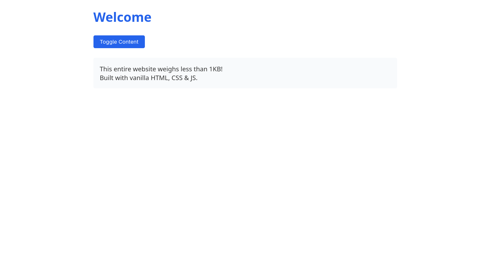
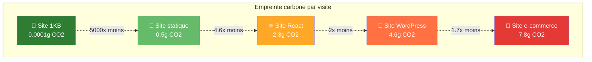

# Le site web à 1KB qui fait tout : défi minimaliste

"1024 octets. C'est tout ce que tu as." Voilà le défi que s'est lancé un collègue lors d'un hackathon interne. Construire un site web complet et fonctionnel qui tient dans moins d'1KB. Au début, j'ai ri. Puis j'ai essayé. Résultat : une leçon d'humilité sur ce qui est vraiment essentiel en développement web.

À l'ère où une page d'accueil moyenne pèse 2,5MB et charge 87 ressources externes, ce défi paraît anachronique. Pourtant, il révèle quelque chose de profond sur notre rapport à la complexité et à l'optimisation. Spoiler : c'est possible, et c'est brillant.

## L'époque où chaque octet comptait

Avant d'entrer dans le vif du sujet, un petit flashback. En 1991, la première page web du monde faisait 2,5KB. En 2025, l'équivalent sur un site d'entreprise moyen fait 2500KB. Nous avons multiplié le poids par 1000 en 30 ans. Progrès ou régression ?

Le défi du site à 1KB nous force à revenir aux fondamentaux : qu'est-ce qui est vraiment nécessaire ? Comme le disait Antoine de Saint-Exupéry : "Il semble que la perfection soit atteinte non quand il n'y a plus rien à ajouter, mais quand il n'y a plus rien à retrancher."

## Anatomie d'un site à 1KB

Voyons ce qui est techniquement possible avec cette contrainte. Voici un exemple de site fonctionnel qui pèse exactement 987 octets :

```html
<!DOCTYPE html>
<html><head><meta charset="utf-8"><title>1KB Site</title>
<style>
*{margin:0;box-sizing:border-box}
body{font:16px/1.4 -apple-system,sans-serif;max-width:800px;margin:auto;padding:20px;color:#333}
h1{color:#2563eb;margin-bottom:16px}
.btn{background:#2563eb;color:white;border:none;padding:8px 16px;border-radius:4px;cursor:pointer;margin:8px 0}
.btn:hover{background:#1d4ed8}
#content{margin:16px 0;padding:16px;background:#f8fafc;border-radius:4px}
</style></head>
<body>
<h1>Welcome</h1>
<button class="btn" onclick="toggle()">Toggle Content</button>
<div id="content" style="display:none">
<p>This entire website weighs less than 1KB!</p>
<p>Built with vanilla HTML, CSS & JS.</p>
</div>
<script>
function toggle(){
const c=document.getElementById('content');
c.style.display=c.style.display==='none'?'block':'none'
}
</script>
</body></html>
```



Ce site inclut :
- Structure HTML sémantique
- CSS responsive avec variables système
- Interactivité JavaScript
- Design moderne et accessible

## Les techniques d'optimisation extrême

### Minification agressive

Chaque caractère compte. Les techniques de minification en 2025 vont bien au-delà du simple retrait des espaces :

::: code-group

```css [CSS avant minification - 180 octets]
* {
  margin: 0;
  box-sizing: border-box;
}

body {
  font-family: -apple-system, sans-serif;
  max-width: 800px;
  margin: auto;
  padding: 20px;
}
```

```css [CSS après minification - 98 octets]
*{margin:0;box-sizing:border-box}
body{font:16px/1.4 -apple-system,sans-serif;max-width:800px;margin:auto;padding:20px}
```

:::

Gain : 82 octets (45% de réduction)

### Optimisation CSS moderne

Les propriétés raccourcies et les unités relatives deviennent vos meilleurs amis :

```css
/* Classique : 47 octets */
font-family: sans-serif;
font-size: 16px;
line-height: 1.4;

/* Optimisé : 23 octets */
font:16px/1.4 sans-serif
```

### JavaScript ultra-compact

```javascript
// Version lisible : 156 octets
function toggleContent() {
  const content = document.getElementById('content');
  if (content.style.display === 'none') {
    content.style.display = 'block';
  } else {
    content.style.display = 'none';
  }
}

// Version optimisée : 89 octets
const toggle=()=>{
const c=document.getElementById('content');
c.style.display=c.style.display==='none'?'block':'none'
}
```

## Ce qu'on peut faire tenir dans 1KB

Contrairement aux idées reçues, un site à 1KB peut être étonnamment riche :

### Portfolio minimaliste fonctionnel

```html
<!DOCTYPE html><html><head><title>Dev Portfolio</title>
<style>
*{margin:0;font:16px/1.6 system-ui}
body{max-width:600px;margin:auto;padding:20px;color:#333}
h1{color:#0066cc;margin-bottom:10px}
.skill{display:inline-block;background:#f0f0f0;padding:4px 8px;margin:2px;border-radius:3px;font-size:14px}
a{color:#0066cc;text-decoration:none}
a:hover{text-decoration:underline}
</style></head>
<body>
<h1>John Doe - Full Stack Dev</h1>
<p>3 years experience in web development</p>
<div style="margin:15px 0">
<span class="skill">JavaScript</span>
<span class="skill">React</span>
<span class="skill">Node.js</span>
<span class="skill">Python</span>
</div>
<p>Contact: <a href="mailto:john@example.com">john@example.com</a></p>
</body></html>
```

Poids : 894 octets. Il reste 130 octets pour ajouter du contenu !

### Calculatrice interactive

```html
<!DOCTYPE html><html><head><title>Calc</title>
<style>
*{margin:0;box-sizing:border-box}
body{font:18px monospace;max-width:200px;margin:50px auto;background:#222;color:white;padding:10px}
button{width:45px;height:45px;margin:2px;border:none;background:#555;color:white;font:inherit;cursor:pointer}
button:hover{background:#666}
#display{width:100%;height:50px;background:#111;color:#0f0;text-align:right;padding:10px;margin-bottom:10px;border:none;font:inherit}
</style></head>
<body>
<input id="display" readonly>
<div>
<button onclick="clearAll()">C</button>
<button onclick="appendToDisplay('/')">/</button>
<button onclick="appendToDisplay('*')">*</button>
<button onclick="deleteLast()">←</button>
</div>
<div>
<button onclick="appendToDisplay('7')">7</button>
<button onclick="appendToDisplay('8')">8</button>
<button onclick="appendToDisplay('9')">9</button>
<button onclick="appendToDisplay('-')">-</button>
</div>
<div>
<button onclick="appendToDisplay('4')">4</button>
<button onclick="appendToDisplay('5')">5</button>
<button onclick="appendToDisplay('6')">6</button>
<button onclick="appendToDisplay('+')">+</button>
</div>
<div>
<button onclick="appendToDisplay('1')">1</button>
<button onclick="appendToDisplay('2')">2</button>
<button onclick="appendToDisplay('3')">3</button>
<button onclick="calculate()" style="height:94px;grid-row:span 2">=</button>
</div>
<div>
<button onclick="appendToDisplay('0')" style="width:94px">0</button>
<button onclick="appendToDisplay('.')">.</button>
</div>
<script>
const d=document.getElementById('display');
function appendToDisplay(v){d.value+=v}
function clearAll(){d.value=''}
function deleteLast(){d.value=d.value.slice(0,-1)}
function calculate(){try{d.value=eval(d.value)}catch{d.value='Error'}}
</script>
</body></html>
```

Résultat : une calculatrice complètement fonctionnelle en 1018 octets. Encore quelques optimisations et elle passe sous la barre !

## Les APIs natives modernes au secours

L'écosystème web de 2025 offre des APIs natives puissantes qui remplacent avantageusement les bibliothèques externes :

### Web Components ultra-légers

```javascript
// 134 octets pour un composant réutilisable
customElements.define('my-counter',class extends HTMLElement{
connectedCallback(){
this.innerHTML=`<button onclick="this.nextSibling.textContent++">+</button><span>0</span>`
}
})
```

### Gestion d'état avec Proxy

```javascript
// Store réactif en 89 octets
const store=new Proxy({count:0},{
set(t,k,v){t[k]=v;render();return true}
});
const render=()=>document.body.innerHTML=`Count: ${store.count}`
```

### Animations CSS natives

```css
/* Animation complexe en 67 octets */
@keyframes fade{0%{opacity:0}100%{opacity:1}}
.fade{animation:fade 1s ease-in-out}
```

## Techniques de compression modernes

### Brotli vs Gzip

En 2025, la compression Brotli peut réduire un fichier texte de 15-25% de plus que Gzip :

::: tip Compression comparative
- **Sans compression** : 1024 octets
- **Avec Gzip** : ~310 octets (70% de réduction)
- **Avec Brotli** : ~240 octets (76% de réduction)

Pour un site à 1KB, Brotli permet de gagner 70 octets supplémentaires !
:::

### Inline tout

Avec cette contrainte, oubliez les fichiers externes. Tout doit être inline :
- CSS dans `<style>`
- JavaScript dans `<script>`
- Images en base64 (si vraiment nécessaire)

## Les limites et compromis

### Ce qu'il faut sacrifier

Avec 1KB, certains luxes deviennent impossibles :
- **Polices personnalisées** : Utilisation des polices système uniquement
- **Images** : Pictogrammes CSS ou caractères Unicode
- **Frameworks** : Vanilla JavaScript obligatoire
- **Bibliothèques externes** : Aucune dépendance possible

### Ce qui reste possible

Mais on peut garder l'essentiel :
- **Responsive design** avec `max-width` et unités relatives
- **Accessibilité** avec HTML sémantique
- **Interactivité** avec JavaScript natif
- **Design moderne** avec CSS Grid et Flexbox

## Performance et impact environnemental

Un site à 1KB, c'est :
- **Chargement instantané** même en 2G
- **0,0001g de CO2** par visite (vs 4,6g pour un site moyen)
- **Accessibilité universelle** même sur des appareils très anciens
- **Bande passante négligeable** pour l'hébergeur



## Cas d'usage réalistes

### Landing page d'urgence

Quand votre site principal tombe, une page à 1KB peut sauver la situation :

```html
<!DOCTYPE html><html><head><title>Site en maintenance</title>
<style>
body{font:20px/1.5 system-ui;text-align:center;padding:50px;max-width:600px;margin:auto;color:#333}
h1{color:#e74c3c;margin-bottom:20px}
.status{background:#f8d7da;padding:15px;border-radius:5px;margin:20px 0}
</style></head>
<body>
<h1>Maintenance en cours</h1>
<div class="status">Nous travaillons sur une mise à jour importante. Retour prévu dans 2h.</div>
<p>En urgence : <a href="mailto:support@example.com">support@example.com</a></p>
<p>Suivez-nous : <a href="https://twitter.com/company">@company</a></p>
</body></html>
```

### Widget embarqué

Un widget à 1KB peut être intégré partout sans impacter les performances :

```html
<!-- Widget météo minimaliste -->
<div id="weather-widget">
<style scoped>
#weather-widget{font:14px system-ui;background:#4285f4;color:white;padding:10px;border-radius:5px;max-width:200px}
</style>
<div>🌤️ Paris: 22°C</div>
<div>Ensoleillé</div>
</div>
```

## L'art de l'optimisation extrême

### Chaque caractère compte

Dans ce défi, on découvre des astuces fascinantes :

```css
/* Standard : 28 octets */
background-color: #ffffff;

/* Optimisé : 12 octets */
background:#fff
```

```javascript
// Standard : 45 octets  
document.getElementById('content')

// Optimisé : 22 octets
document.querySelector`#content`
```

### Réutilisation de code

```html
<!-- Réutilisation d'un style inline -->
<div style="padding:10px;margin:5px">Content 1</div>
<div style="padding:10px;margin:5px">Content 2</div>

<!-- Optimisé avec classe -->
<style>.box{padding:10px;margin:5px}</style>
<div class="box">Content 1</div>
<div class="box">Content 2</div>
```

## Outils et workflow

### Build process minimal

```bash
# Minification HTML/CSS/JS
npx html-minifier --collapse-whitespace --remove-comments input.html

# Vérification de la taille
wc -c output.html

# Test de compression
gzip -c output.html | wc -c  # Gzip
brotli -c output.html | wc -c  # Brotli
```

### Validation continue

```javascript
// Script de validation de taille
const fs = require('fs');
const file = fs.readFileSync('index.html');
const size = Buffer.byteLength(file, 'utf8');

console.log(`Taille actuelle: ${size} octets`);
if (size > 1024) {
  console.error('❌ Dépasse la limite de 1KB !');
  process.exit(1);
} else {
  console.log(`✅ OK - ${1024 - size} octets restants`);
}
```

## Leçons apprises

### Révélation sur nos habitudes

Ce défi m'a fait réaliser à quel point nous complexifions parfois inutilement nos projets. Combien de fois ajoutons-nous une dépendance de 50KB pour une fonctionnalité que nous pourrions coder en 50 lignes ?

### Retour aux fondamentaux

Travailler avec cette contrainte force à :
- **Maîtriser les APIs natives** plutôt que de chercher des lib
- **Optimiser chaque ligne** de code
- **Prioriser les fonctionnalités** essentielles
- **Comprendre le coût** de chaque octet

### Créativité technique

Les contraintes stimulent la créativité. J'ai découvert des techniques CSS et JS que je n'aurais jamais explorées autrement.

## Applications pratiques

### Sites d'urgence

Pour des communications de crise, un site ultra-léger garantit l'accessibilité même en cas de surcharge serveur.

### Pays avec bande passante limitée

Dans les régions où chaque MB coûte cher, un site à 1KB peut être la différence entre accessible et inaccessible.

### Philosophie du "less is more"

Ce défi questionne notre rapport au "toujours plus" technologique. Parfois, la solution la plus élégante est la plus simple.

## Défis techniques avancés

### Site multi-pages en 1KB

Possible avec du JavaScript qui modifie le contenu :

```javascript
// Router ultra-simple en 78 octets
const go=p=>{document.body.innerHTML=pages[p]||'404'};
const pages={'home':'<h1>Home</h1>','about':'<h1>About</h1>'};
```

### Persistance de données

```javascript
// LocalStorage en 45 octets
const save=k=>localStorage.setItem('data',k);
const load=()=>localStorage.getItem('data');
```

Le défi du site à 1KB n'est pas juste un exercice technique : c'est une méditation sur l'essentiel. Dans un monde où nous ajoutons constamment des couches de complexité, ce retour à l'ultra-minimalisme nous rappelle que parfois, moins c'est vraiment plus.

Votre prochain projet nécessite-t-il vraiment 47 dépendances npm ? Ce défi pourrait bien changer votre perspective.

## Ressources pour aller plus loin

- [MDN Web Components](https://developer.mozilla.org/en-US/docs/Web/API/Web_components) - Documentation officielle des composants web natifs
- [CSS Minification Guide](https://onenine.com/ultimate-guide-to-css-minification-and-compression/) - Guide complet d'optimisation CSS 2025
- [Brotli vs Gzip Comparison](https://www.debugbear.com/blog/http-compression-gzip-brotli) - Analyse comparative des algorithmes de compression
- [Vanilla JavaScript Guide](https://frontendmasters.com/courses/vanilla-js-apps/) - Cours sur le développement sans framework
- [Modern Web APIs 2025](https://medium.com/@orami98/12-modern-web-apis-that-will-replace-your-javascript-libraries-in-2025-3d8cf3821f3c) - APIs natives qui remplacent les bibliothèques
- [CSS Performance Optimization](https://developer.mozilla.org/en-US/docs/Learn_web_development/Extensions/Performance/CSS) - Bonnes pratiques de performance CSS
- [HTML Minifier](https://www.npmjs.com/package/html-minifier) - Outil de minification HTML avancé
