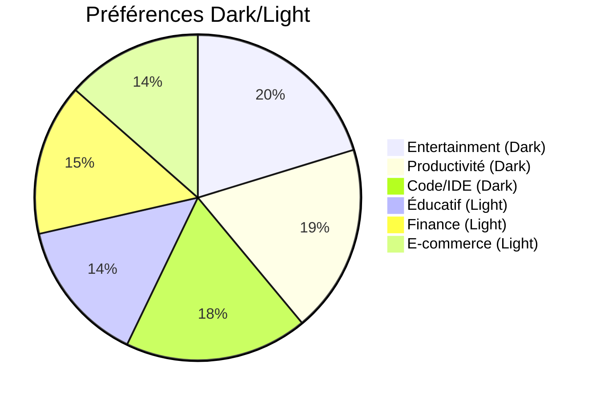
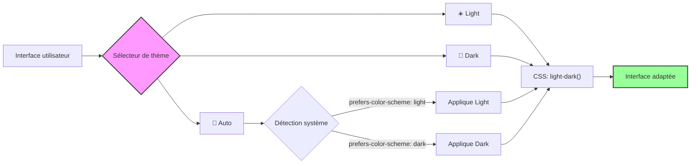

# Dark theme vs Light theme : la guerre des deux mondes

"Tu codes en dark mode ou en light mode ?" Cette question divise les développeurs depuis des années, créant des débats aussi passionnés que ceux sur les espaces vs les tabulations. Pendant mes trois années d'alternance, j'ai observé des équipes entières changer leurs IDE en catastrophe quand quelqu'un projetait son écran en light mode lors d'une présentation. Les réactions oscillaient entre grimaces douloureuses et commentaires sarcastiques sur "l'aveuglement volontaire".

Mais au-delà des préférences personnelles et des mèmes sur les "vampires du code", que disent vraiment les études récentes ? En 2025, avec des données solides sur la productivité, la santé visuelle et les nouvelles possibilités techniques comme la fonction CSS `light-dark()`, il est temps de faire le point sur cette guerre des thèmes.

## Les chiffres parlent d'eux-mêmes

Les statistiques 2024-2025 révèlent des tendances marquées. Selon une étude sur les préférences utilisateurs de 2025, **78% des utilisateurs choisissent le dark mode** pour leurs applications, particulièrement dans l'entertainment (Netflix) et la productivité (Slack). Cette préférence monte à **82% chez les utilisateurs de smartphones**.

Du côté des développeurs, **70% des professionnels du software estiment que le dark mode facilite les sessions de code prolongées**. Mais attention aux généralités : **55% des utilisateurs préfèrent encore le light mode** pour les applications éducatives et financières (Duolingo, PayPal), où la clarté et le professionnalisme priment.



Ces chiffres cachent une réalité plus nuancée que le simple "dark mode gagne". Le contexte d'usage reste déterminant.

## La science derrière la fatigue oculaire

### Dark mode : ami ou ennemi de vos yeux ?

Contrairement aux idées reçues, **le dark mode n'est pas universellement meilleur pour la santé visuelle**. Une étude publiée dans la National Library of Medicine montre que le dark mode réduit effectivement la fatigue oculaire... **mais uniquement en conditions de faible luminosité**.

Le piège ? **En environnement lumineux (comme la plupart des bureaux), le dark mode peut paradoxalement augmenter la fatigue oculaire**. Votre écran sombre contrastant avec l'éclairage ambiant force vos pupilles à des ajustements constants, créant une tension supplémentaire.

### L'astigmatisme : un facteur souvent oublié

Les personnes avec astigmatisme rencontrent des difficultés spécifiques avec le dark mode. Le contraste entre texte clair et fond sombre peut créer des effets de halo et de flou, rendant la lecture plus laborieuse. C'est un point important souvent négligé dans les débats sur l'accessibilité.

### La lumière bleue : mythe ou réalité ?

Le dark mode réduit effectivement l'exposition à la lumière bleue, liée aux perturbations du rythme circadien. Mais l'impact sur les performances cognitives et la vigilance reste débattu. Certaines études suggèrent que l'effet de la lumière bleue est moins important que d'autres facteurs comme la luminosité globale et les pauses régulières.

## Performance et économie d'énergie

Un avantage concret du dark mode : **l'efficacité énergétique**. Sur les écrans OLED et AMOLED, le dark mode peut **réduire la consommation de batterie de 30 à 67%** selon la luminosité. Sur un iPhone 14 à 100% de luminosité, le dark mode économise en moyenne 67% d'énergie.

::: tip Astuce pour les développeurs mobiles
Utilisez des noirs vrais (`#000000`) plutôt que des gris sombres pour maximiser les économies d'énergie sur OLED. Chaque pixel noir est littéralement éteint.
:::

Cette économie d'énergie n'est pas négligeable quand on passe 8+ heures par jour devant un écran, surtout en déplacement.

## Implémentation technique : l'évolution en 2025

### La révolution `light-dark()`

2025 marque un tournant avec la fonction CSS `light-dark()`, disponible depuis mai 2024 dans tous les navigateurs modernes. Elle simplifie drastiquement l'implémentation des thèmes adaptatifs :

```css
:root {
  color-scheme: light dark;
}

body {
  color: light-dark(#333b3c, #efefec);
  background-color: light-dark(#efedea, #223a2c);
  border-color: light-dark(#d1d5db, #374151);
}

.code-block {
  background: light-dark(#f8fafc, #1e293b);
  color: light-dark(#1e293b, #e2e8f0);
}
```

Cette approche élimine le besoin de media queries complexes et centralise la logique de thème.

### Approche traditionnelle avec `prefers-color-scheme`

Pour les projets nécessitant un support plus large ou un contrôle granulaire :

::: code-group

```css [CSS Vanilla]
:root {
  --bg-primary: #ffffff;
  --text-primary: #1a202c;
  --bg-code: #f7fafc;
}

@media (prefers-color-scheme: dark) {
  :root {
    --bg-primary: #1a202c;
    --text-primary: #f7fafc;
    --bg-code: #2d3748;
  }
}

body {
  background-color: var(--bg-primary);
  color: var(--text-primary);
}
```

```javascript [React + Hooks]
import { useState, useEffect } from 'react'

function useTheme() {
  const [theme, setTheme] = useState('system')
  
  useEffect(() => {
    const stored = localStorage.getItem('theme')
    if (stored) {
      setTheme(stored)
      document.documentElement.classList.toggle('dark', 
        stored === 'dark' || 
        (stored === 'system' && window.matchMedia('(prefers-color-scheme: dark)').matches)
      )
    }
  }, [])

  const toggleTheme = (newTheme) => {
    setTheme(newTheme)
    localStorage.setItem('theme', newTheme)
    document.documentElement.classList.toggle('dark', 
      newTheme === 'dark' || 
      (newTheme === 'system' && window.matchMedia('(prefers-color-scheme: dark)').matches)
    )
  }

  return { theme, toggleTheme }
}
```

```javascript [Vue 3 Composition API]
import { ref, watch, onMounted } from 'vue'

export function useTheme() {
  const theme = ref('system')
  
  const applyTheme = (value) => {
    const isDark = value === 'dark' || 
      (value === 'system' && window.matchMedia('(prefers-color-scheme: dark)').matches)
    document.documentElement.classList.toggle('dark', isDark)
  }
  
  watch(theme, (newTheme) => {
    localStorage.setItem('theme', newTheme)
    applyTheme(newTheme)
  })
  
  onMounted(() => {
    const stored = localStorage.getItem('theme') || 'system'
    theme.value = stored
    applyTheme(stored)
  })
  
  return { theme }
}
```

```typescript [Angular Service]
import { Injectable } from '@angular/core'
import { BehaviorSubject } from 'rxjs'

@Injectable({ providedIn: 'root' })
export class ThemeService {
  private themeSubject = new BehaviorSubject<string>('system')
  theme$ = this.themeSubject.asObservable()
  
  constructor() {
    this.initTheme()
  }
  
  private initTheme() {
    const stored = localStorage.getItem('theme') || 'system'
    this.setTheme(stored)
  }
  
  setTheme(theme: string) {
    this.themeSubject.next(theme)
    localStorage.setItem('theme', theme)
    
    const isDark = theme === 'dark' || 
      (theme === 'system' && window.matchMedia('(prefers-color-scheme: dark)').matches)
    
    document.documentElement.classList.toggle('dark', isDark)
  }
}
```

:::

### Configuration Tailwind CSS optimisée

Tailwind CSS reste l'outil de référence pour une implémentation scalable :

```javascript
// tailwind.config.js
module.exports = {
  darkMode: 'class', // Permet le contrôle manuel
  theme: {
    extend: {
      colors: {
        primary: {
          50: '#f0f9ff',
          900: '#0c4a6e',
        }
      }
    }
  }
}
```

```jsx
// Composant React avec Tailwind
function CodeEditor() {
  return (
    <div className="bg-white dark:bg-gray-900 text-gray-900 dark:text-gray-100">
      <pre className="bg-gray-50 dark:bg-gray-800 p-4 rounded-lg">
        <code className="text-sm">console.log('Hello, world!');</code>
      </pre>
    </div>
  )
}
```

## Prévenir le flash de contenu non stylé

Un problème récurrent : le FOUC (Flash of Unstyled Content) lors du chargement. La solution consiste à injecter un script dans le `<head>` :

```html
<script>
  (function() {
    const theme = localStorage.getItem('theme') || 'system'
    const isDark = theme === 'dark' || 
      (theme === 'system' && window.matchMedia('(prefers-color-scheme: dark)').matches)
    
    if (isDark) {
      document.documentElement.classList.add('dark')
    }
  })()
</script>
```

Cette approche évite le flash et garantit une expérience utilisateur fluide.

## Recommandations pratiques basées sur la science

### Pour l'usage quotidien

**Adaptez votre thème à votre environnement :**
- **Jour / Bureau lumineux** : Light mode pour réduire la fatigue oculaire
- **Soir / Environnement sombre** : Dark mode pour le confort visuel
- **Sessions nocturnes** : Dark mode + réduction de luminosité

### Pour les équipes de développement

**Offrez le choix sans imposer :**
- Implémentez un toggle à trois états : Light / Dark / System
- Respectez les préférences système par défaut
- Documentez vos choix de couleurs pour l'accessibilité

### Pour l'accessibilité

**Pensez au-delà du simple contraste :**
- Testez avec des utilisateurs ayant de l'astigmatisme
- Proposez des options de personnalisation (taille de police, espacement)
- Validez vos contrastes avec des outils comme WebAIM

## Cas d'usage spécifiques par contexte

### Applications de productivité

Les études montrent que **65% des utilisateurs préfèrent du texte noir sur fond blanc** pour la lecture prolongée et la concentration. Applications comme Notion ou Linear proposent intelligemment les deux modes avec une bascule rapide.

### Environnements de développement

**Les IDE modernes excellent dans l'adaptation contextuelle :**
- Visual Studio Code détecte automatiquement les préférences système
- JetBrains offre des thèmes optimisés pour différents langages
- Vim/Neovim permettent une personnalisation granulaire

### Applications mobiles

Sur mobile, **78% des utilisateurs préfèrent le dark mode**, particulièrement pour les apps utilisées le soir. Les plateformes comme Instagram ou Twitter ont vu leur engagement augmenter de 25% après l'introduction du dark mode.

## L'avenir des thèmes : au-delà du binaire

### Thèmes adaptatifs intelligents

2025 voit émerger des approches plus sophistiquées :
- **Thèmes temporels** : Ajustement automatique selon l'heure
- **Thèmes contextuels** : Adaptation selon l'activité (lecture, code, design)
- **Thèmes personnalisés** : Couleurs ajustées selon les préférences individuelles

### Nouvelles technologies

La fonction `light-dark()` n'est que le début. Les spécifications CSS futures incluront probablement :
- Support natif pour plus de deux thèmes
- Transitions automatiques plus fluides
- Intégration avec les capteurs de luminosité ambiante

## Le verdict : pragmatisme plutôt que dogmatisme

Après avoir analysé les données, testé les implémentations et observé les usages réels, ma conclusion est nuancée. **Il n'y a pas de "meilleur" thème universel**. La qualité d'un thème se mesure à sa capacité d'adaptation au contexte d'usage.

Les applications les plus réussies sont celles qui :
1. **Respectent les préférences système** par défaut
2. **Offrent un contrôle utilisateur** facile et persistant  
3. **S'adaptent au contexte** (heure, luminosité ambiante, type de contenu)
4. **Maintiennent la cohérence** à travers tous les composants

La vraie victoire n'est pas de convaincre tout le monde d'adopter votre thème préféré, mais de créer des interfaces assez flexibles pour satisfaire les deux camps. En 2025, avec les outils CSS modernes et une meilleure compréhension des enjeux d'accessibilité, c'est enfin possible.



La guerre des thèmes touche peut-être à sa fin. Place à la diplomatie et à l'adaptabilité.

## Ressources pour approfondir

### Documentation technique officielle
- [CSS light-dark() Function - MDN](https://developer.mozilla.org/en-US/docs/Web/CSS/color_value/light-dark) - Nouvelle fonction CSS pour thèmes adaptatifs
- [prefers-color-scheme - MDN](https://developer.mozilla.org/en-US/docs/Web/CSS/@media/prefers-color-scheme) - Media query pour détecter les préférences utilisateur
- [Tailwind CSS Dark Mode](https://tailwindcss.com/docs/dark-mode) - Implémentation avec Tailwind CSS

### Études et recherches récentes
- [Dark Mode Statistics 2025](https://forms.app/en/blog/dark-mode-statistics) - Statistiques complètes sur l'adoption du dark mode
- [Eye Strain and Dark Mode Studies](https://www.ncbi.nlm.nih.gov/) - Recherches médicales sur fatigue oculaire
- [Battery Optimization Studies](https://developer.android.com/guide/topics/ui/look-and-feel/darktheme) - Impact énergétique du dark mode

### Outils et ressources pratiques
- [WebAIM Contrast Checker](https://webaim.org/resources/contrastchecker/) - Validation des contrastes pour l'accessibilité
- [next-themes](https://github.com/pacocoursey/next-themes) - Gestion des thèmes pour Next.js
- [Inclusive Dark Mode Guide](https://www.smashingmagazine.com/2025/04/inclusive-dark-mode-designing-accessible-dark-themes/) - Guide d'accessibilité pour dark mode

### Articles techniques complémentaires
- [Dark Mode Implementation Best Practices 2025](https://medium.com/design-bootcamp/the-ultimate-guide-to-implementing-dark-mode-in-2025-bbf2938d2526) - Guide complet d'implémentation
- [CSS Custom Properties for Theming](https://css-tricks.com/a-complete-guide-to-custom-properties/) - Utilisation avancée des variables CSS
- [No-Flicker Dark Mode Implementation](https://cruip.com/implementing-tailwind-css-dark-mode-toggle-with-no-flicker/) - Éviter les flashs de contenu