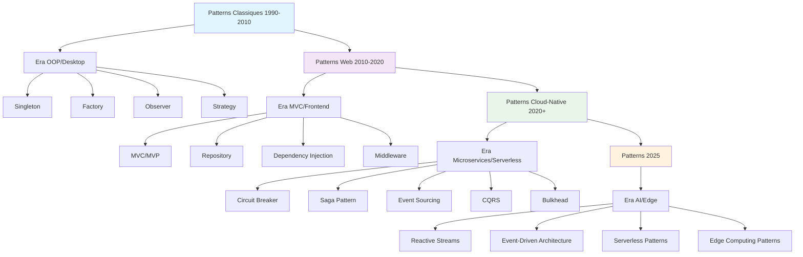

# Les design patterns sont-ils encore pertinents en 2025 ?

J'ai récemment participé à une code review où un collègue avait implémenté un pattern Observer "pur" dans une application React. L'ironie ? React utilise déjà ce pattern de façon native avec ses hooks et son système de re-rendu. Cette situation m'a fait réfléchir : à l'ère des frameworks modernes et de l'architecture cloud-native, les design patterns traditionnels gardent-ils vraiment leur pertinence ?

## Quand les frameworks font le travail pour nous

Prenons l'exemple de React 19, Angular 19 ou Vue 3 avec sa Composition API. Ces frameworks intègrent nativement des patterns qui nécessitaient auparavant une implémentation manuelle :

::: code-group

```typescript [React - Hook personnalisé]
// Pattern Observer moderne avec React
function useCounter() {
  const [count, setCount] = useState(0);
  
  const increment = useCallback(() => setCount(c => c + 1), []);
  const reset = useCallback(() => setCount(0), []);
  
  return { count, increment, reset };
}

// Usage
function Counter() {
  const { count, increment, reset } = useCounter();
  return (
    <div>
      <span>{count}</span>
      <button onClick={increment}>+</button>
      <button onClick={reset}>Reset</button>
    </div>
  );
}
```

```typescript [Vue 3 - Composition API]
// Pattern Observer avec Vue 3
import { ref, computed } from 'vue';

export function useCounter() {
  const count = ref(0);
  
  const increment = () => count.value++;
  const reset = () => count.value = 0;
  const isEven = computed(() => count.value % 2 === 0);
  
  return { count, increment, reset, isEven };
}
```

```java [Spring Boot - Dependency Injection moderne]
// Pattern Factory + Singleton intégrés
@Service
@Profile("production")
public class ProductionPaymentService implements PaymentService {
    
    @Autowired
    private PaymentGateway gateway;
    
    @Override
    public PaymentResult process(PaymentRequest request) {
        return gateway.processPayment(request);
    }
}

@Service
@Profile("test")
public class MockPaymentService implements PaymentService {
    // Implementation de test
}
```

:::

Le framework gère automatiquement l'instanciation, le cycle de vie et l'injection des dépendances. Fini le temps où nous devions coder manuellement ces patterns !

## L'émergence des patterns cloud-native

Mais si les patterns GoF classiques semblent moins nécessaires au niveau du code, de nouveaux patterns émergent au niveau architectural. En tant que développeur ayant migré plusieurs monolithes vers des microservices, j'ai découvert que l'architecture moderne créait ses propres patterns :

### Circuit Breaker Pattern

```java
@RestController
public class UserController {
    
    @Autowired
    private UserService userService;
    
    @CircuitBreaker(name = "user-service", fallbackMethod = "fallbackUser")
    @GetMapping("/users/{id}")
    public ResponseEntity<User> getUser(@PathVariable Long id) {
        return ResponseEntity.ok(userService.findById(id));
    }
    
    public ResponseEntity<User> fallbackUser(Long id, Exception ex) {
        return ResponseEntity.ok(User.builder()
            .id(id)
            .name("Utilisateur temporairement indisponible")
            .build());
    }
}
```

### Saga Pattern pour les transactions distribuées

```java
@SagaOrchestrationStart
public class OrderSaga {
    
    @SagaStep(compensationMethod = "cancelPayment")
    public void processPayment(OrderCreatedEvent event) {
        paymentService.processPayment(event.getPaymentDetails());
    }
    
    @SagaStep(compensationMethod = "releaseInventory") 
    public void reserveInventory(PaymentProcessedEvent event) {
        inventoryService.reserveItems(event.getOrderItems());
    }
    
    public void cancelPayment(OrderCreatedEvent event) {
        paymentService.refund(event.getPaymentDetails());
    }
}
```

Ces patterns sont spécifiquement conçus pour résoudre les défis de la distribution : latence réseau, pannes partielles, cohérence des données.

## La programmation fonctionnelle change la donne

::: tip Évolution des paradigmes
La montée de la programmation fonctionnelle remet en question plusieurs patterns orientés objet traditionnels.
:::

Dans des langages comme Scala, Clojure ou même TypeScript moderne, certains patterns deviennent des idiomes naturels :

```typescript
// Pattern Strategy avec les fonctions de première classe
type ValidationRule<T> = (value: T) => string | null;

const emailValidator: ValidationRule<string> = (email) => 
  /\S+@\S+\.\S+/.test(email) ? null : "Email invalide";

const lengthValidator = (min: number): ValidationRule<string> => 
  (value) => value.length >= min ? null : `Minimum ${min} caractères`;

// Composition naturelle
const validateUser = (user: User) => {
  const rules = [
    emailValidator,
    lengthValidator(3)
  ];
  
  return rules
    .map(rule => rule(user.email))
    .filter(error => error !== null);
};
```

Ici, le pattern Strategy n'a pas besoin d'interfaces ou de classes : les fonctions suffisent.

## Les design patterns évoluent, ils ne disparaissent pas

Après trois ans d'alternance entre développement frontend et backend, j'ai remarqué que les patterns ne disparaissent pas : ils évoluent et s'adaptent aux nouveaux contextes.

### En frontend moderne

- **Observer** → Hooks React, Composables Vue, Signals Angular
- **Command** → Redux actions, Vuex mutations  
- **Strategy** → Providers React, Composition API Vue
- **Factory** → Component factories, Dynamic imports

### En backend microservices

- **Singleton** → Service mesh, Container orchestration
- **Proxy** → API Gateway, Service mesh sidecar
- **Facade** → Backend For Frontend (BFF)
- **Chain of Responsibility** → Middleware pipelines

## Quand les utiliser en 2025 ?

Les design patterns ne sont pas obsolètes, mais leur utilisation doit être réfléchie. En 2025, ils restent un **vocabulaire commun** et un **modèle de pensée** pour structurer notre code. Cependant, leur implémentation doit être pragmatique et adaptée aux outils modernes.

**✅ Utilisez les patterns classiques quand :**
- Vous travaillez dans un domaine métier complexe nécessitant une modélisation fine
- Votre équipe développe une librairie ou un framework
- Vous avez besoin d'une flexibilité que le framework ne fournit pas nativement
- Vous maintenez du code legacy qui utilise déjà ces patterns

**❌ Évitez-les quand :**
- Le framework fournit déjà la fonctionnalité
- Vous sur-ingéniez une solution simple
- L'équipe n'est pas familière avec le pattern (préférez la simplicité)
- Vous développez un prototype ou un MVP

## L'avenir : patterns émergents et IA

En 2025, de nouveaux patterns émergent avec l'intégration de l'IA dans nos applications :

```python
# Pattern Observer pour les modèles ML
class ModelObserver:
    def __init__(self):
        self.callbacks = []
    
    def on_prediction(self, callback):
        self.callbacks.append(callback)
    
    def predict(self, data):
        result = self.model.predict(data)
        confidence = self.model.predict_proba(data).max()
        
        # Notification des observeurs avec contexte
        for callback in self.callbacks:
            callback(result, confidence, data)
        
        return result

# Usage avec monitoring automatique
model = ModelObserver()
model.on_prediction(lambda pred, conf, data: 
    log_prediction(pred, conf) if conf < 0.8 else None)
```

L'intelligence artificielle crée aussi ses propres patterns : RAG (Retrieval-Augmented Generation), Few-shot learning, ou Chain-of-Thought reasoning.

## Ma conclusion pragmatique

Les design patterns de 2025 ne sont plus ceux de 1994, et c'est tant mieux. Ils restent pertinents comme **vocabulaire commun** et **modèles de pensée**, mais leur implémentation a évolué.

Mon conseil ? Maîtrisez les concepts fondamentaux mais restez pragmatique. Un bon développeur en 2025 sait reconnaître quand un pattern apporte de la valeur et quand il complique inutilement le code.

La vraie question n'est pas "les patterns sont-ils morts ?" mais plutôt "comment évoluent-ils avec nos outils ?". Et la réponse, c'est qu'ils s'adaptent, se simplifient, et continuent de structurer notre façon de penser le code.



## Ressources pour aller plus loin

- [Design Patterns in the Spring Framework - Baeldung](https://www.baeldung.com/spring-framework-design-patterns) - Guide actualisé en 2025
- [Top 10 Microservices Design Patterns You Should Know in 2025](https://www.javaguides.net/2025/03/top-10-microservices-design-patterns.html) - Patterns pour l'architecture distribuée
- [Functional Programming Design Patterns - InfoQ](https://www.infoq.com/presentations/fp-design-patterns/) - Comment la programmation fonctionnelle repense les patterns
- [React Design Patterns - Documentation officielle](https://react.dev/learn/thinking-in-react) - Approche moderne des patterns en React
- [Advancements in JavaScript Frameworks 2025](https://www.nucamp.co/blog/coding-bootcamp-full-stack-web-and-mobile-development-2025-advancements-in-javascript-frameworks-whats-new-in-react-nextjs-angular-vuejs-and-svelte-in-2025) - Évolution des frameworks modernes
- [The Gang of Four Gave Us 23 Design Patterns… Are They Still Relevant in 2025?](https://medium.com/@freddy.dordoni/the-gang-of-four-gave-us-23-design-patterns-are-they-still-relevant-in-2025-f2e999c384c0) - Analyse moderne des patterns GoF