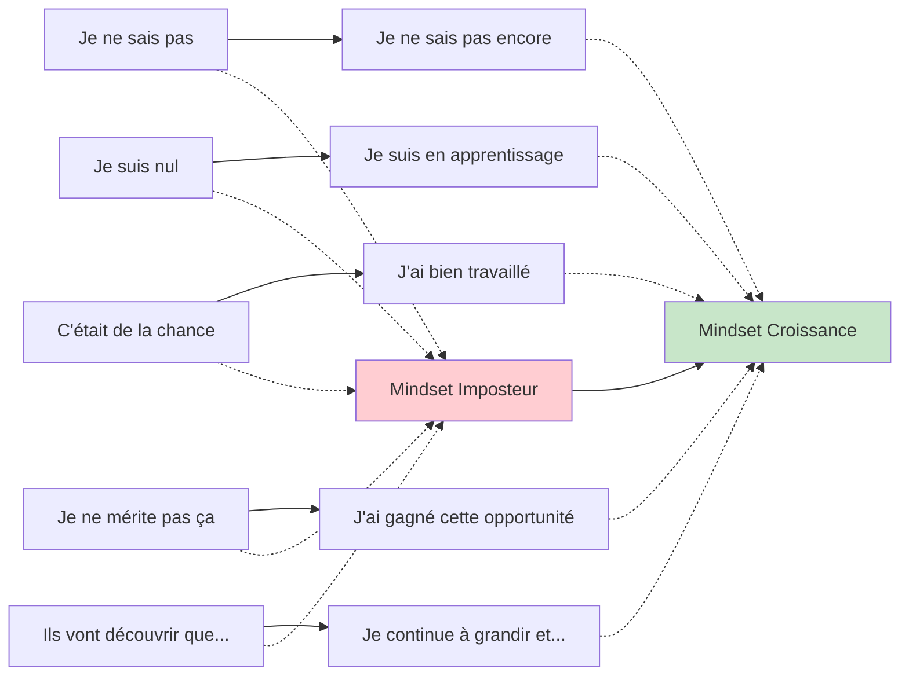

# Comprendre et surmonter le syndrome de l'imposteur

<Badge type="warning" text="Psychology & Self-Development" />

Dans l'univers technologique ultra-compétitif d'aujourd'hui, où les innovations se succèdent à un rythme effréné et où l'expertise semble parfois inaccessible, le syndrome de l'imposteur touche une majorité écrasante des professionnels de la tech. Cette sensation persistante d'être un "faux" expert, malgré des preuves objectives de compétence, peut paralyser les carrières les plus prometteuses. Explorons ensemble ce phénomène complexe et les voies concrètes pour le surmonter.

## Anatomie du syndrome de l'imposteur

### Définition et manifestations

::: info Qu'est-ce que le syndrome de l'imposteur ?
Le syndrome de l'imposteur est un **pattern psychologique** caractérisé par :
- La conviction persistante d'être un "faux" expert
- L'attribution de ses succès à la chance plutôt qu'aux compétences
- La peur constante d'être "découvert" comme incompétent
- La minimisation systématique de ses réalisations
- L'anxiété chronique malgré des preuves objectives de réussite
:::

### Les 5 profils types du syndrome de l'imposteur

```typescript
interface ImpostorProfiles {
  perfectionist: {
    description: "Ne tolère aucune erreur ou lacune de connaissance";
    trigger: "Toute imperfection devient une preuve d'incompétence";
    thoughts: ["Je dois tout maîtriser parfaitement", "Une erreur prouve que je ne mérite pas ma position"];
    behaviors: ["Procrastination par peur de l'imperfection", "Surcharge de travail pour compenser"];
  };
  
  expert: {
    description: "Craint d'être exposé comme ayant des lacunes de connaissance";
    trigger: "Questions auxquelles il ne peut répondre immédiatement";
    thoughts: ["Je devrais déjà savoir cela", "Si je pose des questions, ils vont découvrir que je ne sais rien"];
    behaviors: ["Évite de poser des questions", "Prétend connaître des sujets non maîtrisés"];
  };
  
  genius: {
    description: "Croit qu'il devrait tout réussir du premier coup et facilement";
    trigger: "Nécessité d'efforts soutenus ou d'apprentissage pour maîtriser";
    thoughts: ["Si j'étais vraiment compétent, ce serait facile", "Les vrais experts n'ont pas besoin de tant d'efforts"];
    behaviors: ["Évite les défis difficiles", "Abandonne rapidement si pas de résultats immédiats"];
  };
  
  soloist: {
    description: "Croit qu'il doit tout réussir seul, sans aide";
    trigger: "Besoin de collaborer ou demander de l'assistance";
    thoughts: ["Demander de l'aide prouve ma faiblesse", "Je dois me débrouiller seul"];
    behaviors: ["Isolement professionnel", "Refus d'aide même quand nécessaire"];
  };
  
  superwoman: {
    description: "Sent le besoin de réussir dans tous les domaines de la vie";
    trigger: "Équilibre vie professionnelle/personnelle difficile";
    thoughts: ["Je dois exceller partout", "Si je ne réussis pas tout, je suis un échec"];
    behaviors: ["Surmenage chronique", "Négligence de son bien-être personnel"];
  };
}
```

### Manifestations spécifiques dans la tech

::: warning Signaux d'alarme typiques en développement

**Technique**
- "Je ne suis qu'un développeur qui copie-colle du Stack Overflow"
- "Si ils savaient que j'utilise l'IA pour m'aider, ils me vireraient"
- "Mes collègues codent en 5 minutes ce qui me prend des heures"

**Social**
- Silence en réunion technique par peur de dire quelque chose de stupide
- Évitement des présentations ou talks techniques
- Attribution du succès d'équipe uniquement aux autres

**Carrière**
- Refus de postuler à des postes "trop avancés"
- Sous-négociation systématique du salaire
- Évitement des responsabilités de leadership
:::

## Racines psychologiques et sociétales

### Facteurs culturels et environnementaux

```mermaid
graph TD
    A[Culture Tech] --> B[Culte de la productivité]
    A --> C[Mythe du génie isolé]
    A --> D[Evolution technologique rapide]
    
    B --> E[Pression de performance constante]
    C --> F[Modèles irréalistes de "rock star developers"]
    D --> G[Sentiment d'obsolescence permanente]
    
    E --> H[Syndrome de l'imposteur]
    F --> H
    G --> H
    
    I[Éducation traditionnelle] --> J[Culture de la note parfaite]
    I --> K[Compétition plutôt que collaboration]
    
    J --> H
    K --> H
    
    L[Médias et réseaux sociaux] --> M[Comparaison constante]
    L --> N[Mise en avant des succès exceptionnels]
    
    M --> H
    N --> H
    
    style H fill:#ffcdd2
    style A fill:#e1f5fe
    style I fill:#e1f5fe
    style L fill:#e1f5fe
```

### Mécanismes neurologiques impliqués

::: details Comprendre la neurologie du syndrome de l'imposteur

**Biais cognitifs activés**
- **Effet Dunning-Kruger inversé** : Plus on devient compétent, plus on réalise l'étendue de ce qu'on ne sait pas
- **Biais d'attribution** : Succès attribués à des facteurs externes, échecs à des facteurs internes
- **Biais de confirmation** : Recherche sélective d'éléments confirmant son incompétence

**Réponses neurobiologiques**
- Activation chronique du système d'alarme (amygdale)
- Suppression de la réflexion analytique (cortex préfrontal)
- Production de cortisol et impact sur la mémoire de travail

**Cercle vicieux neurologique**
```
Stress → Diminution performance → Confirmation des craintes → Plus de stress
```
:::

### Impact sur le cerveau et les performances

```typescript
interface ImpostorNeuroBiology {
  acuteEffects: {
    cognitiveLoad: "Surcharge mentale par auto-surveillance constante";
    workingMemory: "Réduction de 30-40% de la mémoire de travail disponible";
    attentionBias: "Focus disproportionné sur les erreurs et faiblesses";
    decisionParalysis: "Difficulté à prendre des décisions par peur de l'erreur";
  };
  
  chronicEffects: {
    burnout: "Épuisement professionnel par surcompensation constante";
    anxietyDisorders: "Développement de troubles anxieux généralisés";
    depression: "Risque accru de dépression par dévalorisation chronique";
    sleepDisruption: "Troubles du sommeil par ruminations nocturnes";
  };
  
  performanceImpact: {
    productivity: "-25% productivité moyenne due à la procrastination";
    creativity: "-40% pensée créative par peur du risque";
    collaboration: "-50% participation active en équipe";
    careerGrowth: "Stagnation professionnelle par auto-sabotage";
  };
}
```

## Stratégies de dépassement : approche structurée

### Framework RECOGNIZE pour identifier ses patterns

```markdown
## Méthode RECOGNIZE d'auto-analyse

### R - Record (Enregistrer)
- Noter quotidiennement moments de doute sur ses compétences
- Tracker les pensées automatiques négatives
- Documenter les situations déclencheuses

### E - Explore (Explorer)
- Identifier son profil d'imposteur dominant
- Analyser les patterns familiaux/éducatifs
- Comprendre ses déclencheurs spécifiques

### C - Challenge (Challenger)
- Questionner la validité de ses pensées automatiques
- Rechercher des preuves objectives de compétence
- Examiner l'exactitude de ses auto-évaluations

### O - Objective Evidence (Preuves objectives)
- Compiler une liste de réalisations concrètes
- Collecter des feedback positifs reçus
- Documenter sa progression over time

### G - Growth Mindset (Mentalité de croissance)
- Redéfinir les erreurs comme opportunités d'apprentissage
- Adopter "je ne sais pas encore" au lieu de "je ne sais pas"
- Célébrer les progrès plutôt que chercher la perfection

### N - Network Support (Réseau de soutien)
- Identifier des mentors et alliés
- Rejoindre des communautés de développeurs
- Partager ses expériences avec des pairs

### I - Internalize Success (Intérioriser le succès)
- Pratiquer l'attribution correcte de ses réussites
- Accepter et intégrer les compliments reçus
- Développer un dialogue interne bienveillant

### Z - Zen Acceptance (Acceptation sereine)
- Accepter l'imperfection comme partie de l'humanité
- Cultiver la compassion envers soi-même
- Trouver la paix avec le fait de ne pas tout savoir

### E - Evolving Identity (Identité évolutive)
- Redéfinir son identité professionnelle positivement
- Intégrer ses compétences comme partie de soi
- Embrasser son statut de "développeur légitime"
```

### Techniques cognitives de recadrage

::: tip Exercices pratiques de recadrage mental

**La technique du "meilleur ami"**
- Quand une pensée d'imposteur arrive, se demander : "Que dirais-je à mon meilleur ami dans cette situation ?"
- Appliquer la même bienveillance à soi-même

**La méthode des preuves tangibles**
- Tenir un "journal de réussites" quotidien
- Noter 3 choses accomplies chaque jour, même petites
- Réviser régulièrement cette liste

**Le recadrage par questionnement socratique**
```typescript
interface SocraticQuestioning {
  evidenceQuestions: [
    "Quelles preuves objectives soutiennent cette pensée négative ?",
    "Quelles preuves la contredisent ?",
    "Qu'est-ce qu'un observateur neutre conclurait ?"
  ];
  
  perspectiveQuestions: [
    "Comment verrais-je cette situation dans 5 ans ?",
    "Quelle serait la vision d'un mentor que je respecte ?",
    "Cette pensée m'aide-t-elle ou me nuit-elle ?"
  ];
  
  alternativeQuestions: [
    "Quelle explication alternative pourrait expliquer cette situation ?",
    "Quelles sont mes forces qui pourraient s'appliquer ici ?",
    "Comment puis-je transformer cette crainte en opportunité d'apprentissage ?"
  ];
}
```
:::

### Protocole d'exposition progressive

```yaml
# Programme de désensibilisation graduelle sur 12 semaines

phase_1_familiarisation: # Semaines 1-2
  objectif: "Normaliser l'exposition contrôlée au jugement"
  activites:
    - Poser une question par jour en réunion d'équipe
    - Partager une ressource découverte sur Slack
    - Commenter positivement le code d'un collègue
  mesure_succes: "Réduction de 20% de l'anxiété anticipatoire"

phase_2_participation: # Semaines 3-5  
  objectif: "Augmenter la visibilité positive"
  activites:
    - Proposer une amélioration lors d'une code review
    - Animer un daily standup
    - Écrire un court article technique interne
  mesure_succes: "Feedback positif reçu de 2+ collègues"

phase_3_leadership: # Semaines 6-8
  objectif: "Prendre des responsabilités techniques"
  activites:
    - Présenter une solution technique en réunion
    - Mentorer un junior sur un aspect spécifique
    - Organiser une session de pair programming
  mesure_succes: "Reconnaissance de l'expertise par l'équipe"

phase_4_expertise: # Semaines 9-12
  objectif: "Assumer pleinement son statut d'expert"
  activites:
    - Donner un talk technique interne
    - Contribuer à un projet open source
    - Participer à un événement tech externe
  mesure_succes: "Acceptation interne de son niveau d'expertise"
```

## Stratégies pratiques au quotidien

### Gestion des situations déclencheuses

::: warning Situations communes et réponses adaptées

**Code review intimidante**
- **Pensée imposteur** : "Ils vont voir que mon code est mauvais"
- **Recadrage** : "C'est une opportunité d'apprentissage collectif"
- **Action** : Préparer 2-3 questions spécifiques pour améliorer le code

**Question technique inattendue**
- **Pensée imposteur** : "Je devrais déjà savoir ça"
- **Recadrage** : "C'est normal de ne pas tout connaître"
- **Action** : "Excellente question ! Je vais creuser ça et revenir vers vous"

**Nouveau projet complexe**
- **Pensée imposteur** : "Je ne suis pas assez qualifié pour ça"
- **Recadrage** : "C'est exactement le type de défi qui fait grandir"
- **Action** : Décomposer en tâches plus petites et identifier ce qu'il faut apprendre
:::

### Techniques de validation interne

```typescript
// Framework de auto-validation quotidienne

class SelfValidationFramework {
  private dailyWins: string[] = [];
  private skillsProgress: Map<string, number> = new Map();
  private feedbackReceived: string[] = [];
  
  recordDailyWin(win: string): void {
    this.dailyWins.push(`${new Date().toISOString()}: ${win}`);
    console.log("✅ Victoire enregistrée:", win);
  }
  
  trackSkillProgress(skill: string, currentLevel: number): void {
    const previousLevel = this.skillsProgress.get(skill) || 0;
    this.skillsProgress.set(skill, currentLevel);
    
    if (currentLevel > previousLevel) {
      console.log(`📈 Progression en ${skill}: ${previousLevel} → ${currentLevel}`);
    }
  }
  
  recordPositiveFeedback(feedback: string): void {
    this.feedbackReceived.push(feedback);
    console.log("🎯 Feedback positif reçu:", feedback);
  }
  
  generateWeeklyReport(): ValidationReport {
    return {
      totalWins: this.dailyWins.length,
      skillsImproved: Array.from(this.skillsProgress.keys()).length,
      positiveReinforcementCount: this.feedbackReceived.length,
      confidenceBooster: this.generateConfidenceMessage()
    };
  }
  
  private generateConfidenceMessage(): string {
    const messages = [
      "Cette semaine, vous avez prouvé votre valeur professionnelle",
      "Vos compétences continuent de progresser concrètement", 
      "Votre équipe bénéficie de votre expertise",
      "Vous méritez pleinement votre position actuelle"
    ];
    
    return messages[Math.floor(Math.random() * messages.length)];
  }
}

// Usage quotidien
const validator = new SelfValidationFramework();

// Matin : intention positive
validator.recordDailyWin("J'ai commencé la journée avec une attitude d'apprentissage");

// Journée : noter les réalisations
validator.recordDailyWin("J'ai résolu ce bug complexe en 2 heures");
validator.trackSkillProgress("React", 7.5);

// Soir : feedback reçu
validator.recordPositiveFeedback("Sarah a dit que mon explication était très claire");
```

### Construction d'un réseau de soutien

::: details Stratégies de networking pour combattre l'isolement

**Mentorship bidirectionnel**
- Trouver un mentor senior pour guidance
- Mentorer un junior pour réaliser sa propre valeur
- Rejoindre des programmes de mentorship tech

**Communautés professionnelles**
- Groupes Slack/Discord par technologie
- Meetups locaux de développeurs
- Conférences et workshops techniques

**Accountability partner**
- Trouver un "buddy" dans la même situation
- Check-ins hebdomadaires sur les progrès
- Partage des victoires et défis

**Documentation des interactions positives**
```markdown
# Mon réseau de soutien professionnel

## Mentors identifiés
- **Pierre** (Lead React) - Questions architecture front-end
- **Marie** (DevOps Senior) - Problématiques infrastructure
- **Jean** (CTO) - Vision carrière long terme

## Peers de confiance
- **Sarah** (Same level) - Accountability partner hebdomadaire
- **Tom** (Backend) - Échanges techniques cross-stack

## Juniors que je peux aider
- **Lisa** (Stagiaire) - Introduction aux bonnes pratiques
- **Alex** (Junior) - Accompagnement montée en compétence

## Communautés actives
- **React Paris Meetup** - Participation mensuelle
- **dev.to** - Lectures et interactions
- **Stack Overflow** - Contributions régulières
```
:::

## Transformation du mindset

### De "imposteur" à "apprenant permanent"



### Redéfinition de l'expertise et de la légitimité

::: tip Nouvelle définition de l'expert en tech

**L'expert moderne n'est PAS** :
- Quelqu'un qui sait tout
- Quelqu'un qui ne fait jamais d'erreurs
- Quelqu'un qui n'a jamais besoin d'aide
- Quelqu'un qui code tout parfaitement du premier coup

**L'expert moderne EST** :
- Quelqu'un qui sait comment apprendre efficacement
- Quelqu'un qui reconnaît ses limites et les dépasse
- Quelqu'un qui collabore et partage ses connaissances
- Quelqu'un qui itère et améliore continuellement

**Critères concrets de légitimité** :
- Vous résolvez des problèmes techniques régulièrement
- Vos collègues vous font confiance pour des tâches importantes
- Vous pouvez expliquer ce que vous faites et pourquoi
- Vous continuez d'apprendre et de vous adapter
- Vous contribuez positivement à votre équipe
:::

### Pratiques de self-compassion

```typescript
interface SelfCompassionPractices {
  dailyAffirmations: {
    technical: [
      "Je suis un développeur compétent qui continue d'apprendre",
      "Mes contributions ont de la valeur pour mon équipe",
      "Il est normal de ne pas tout savoir dans un domaine en évolution constante"
    ];
    
    personal: [
      "Je mérite ma place dans cette équipe",
      "Mes erreurs sont des opportunités de croissance",
      "Je traite mes collègues avec bienveillance, je mérite la même chose"
    ];
    
    growth: [
      "Chaque jour, je deviens un meilleur développeur",
      "Ma curiosité et ma persévérance sont mes forces",
      "Je contribue de manière unique à chaque projet"
    ];
  };
  
  selfCompassionBreak: {
    recognition: "C'est un moment difficile. C'est normal de se sentir ainsi.";
    universality: "Tous les développeurs passent par ces doutes. Je ne suis pas seul.";
    kindness: "Puis-je me traiter avec la même gentillesse qu'un bon ami ?";
  };
  
  reframingExercises: {
    errorReframe: {
      from: "J'ai fait une erreur, je suis nul";
      to: "J'ai fait une erreur, j'ai appris quelque chose d'important";
    };
    
    knowledgeReframe: {
      from: "Je ne connais pas cette technologie, je suis un imposteur";
      to: "Je ne connais pas encore cette technologie, c'est une opportunité d'apprentissage";
    };
    
    successReframe: {
      from: "J'ai réussi par chance";
      to: "J'ai réussi grâce à mon travail et mes compétences";
    };
  };
}
```

## Construire une carrière sereine

### Définir ses propres métriques de succès

::: details Framework personnel de définition du succès

**Métriques traditionnelles à questionner**
- Salaire comme unique mesure de valeur
- Vitesse de développement versus qualité
- Nombre de technologies maîtrisées versus profondeur
- Visibilité publique versus impact réel

**Métriques personnalisées authentiques**
```yaml
technical_growth:
  skill_deepening: "Approfondissement sur mes domaines de prédilection"
  problem_solving: "Capacité à résoudre des problèmes complexes"
  code_quality: "Amélioration continue de la qualité de mon code"
  learning_velocity: "Vitesse d'adaptation aux nouvelles technologies"

team_contribution:
  mentoring_impact: "Capacité à aider mes collègues à grandir"
  collaboration_quality: "Qualité de mes interactions d'équipe"
  knowledge_sharing: "Contribution à la base de connaissances collective"
  positive_culture: "Impact sur l'ambiance et la culture d'équipe"

personal_satisfaction:
  work_life_balance: "Équilibre personnel et bien-être"
  passion_projects: "Temps dédié aux projets qui me passionnent"
  continuous_learning: "Progression sur les sujets qui m'intéressent"
  career_autonomy: "Contrôle sur l'orientation de ma carrière"

impact_and_meaning:
  user_value: "Impact positif sur les utilisateurs finaux"
  product_contribution: "Amélioration concrète des produits"
  business_value: "Contribution aux objectifs business"
  industry_advancement: "Contribution à l'évolution de l'industrie"
```
:::

### Stratégies de carrière anti-imposteur

```typescript
class AntiImpostorCareerStrategy {
  private careerGoals: Map<string, CareerGoal> = new Map();
  private skillInventory: SkillAssessment[] = [];
  private networkContacts: NetworkContact[] = [];
  
  planCareerProgression(): CareerPlan {
    return {
      currentState: this.assessCurrentPosition(),
      desiredFuture: this.defineDesiredOutcomes(),
      gapAnalysis: this.identifySkillGaps(),
      actionPlan: this.createActionPlan(),
      milestones: this.defineMilestones()
    };
  }
  
  private assessCurrentPosition(): CurrentAssessment {
    return {
      technicalSkills: this.inventoryTechnicalSkills(),
      softSkills: this.inventorySoftSkills(),
      networkStrength: this.assessNetworkQuality(),
      careerCapital: this.calculateCareerCapital(),
      marketPosition: this.evaluateMarketPosition()
    };
  }
  
  buildConfidenceThrough Action(): ConfidenceBuilding {
    return {
      technicalContributions: [
        "Contribuer à un projet open source par mois",
        "Résoudre et documenter un problème complexe par trimestre",
        "Partager une solution technique avec la communauté"
      ],
      
      professionalVisibility: [
        "Présenter en interne sur un sujet maîtrisé",
        "Écrire un article technique tous les 2 mois",
        "Participer activement à une conférence par an"
      ],
      
      networkExpansion: [
        "Rencontrer un nouveau contact professionnel par mois",
        "Maintenir contact avec 5 personnes influentes du secteur",
        "Mentorer au moins une personne junior"
      ],
      
      skillDevelopment: [
        "Approfondir une compétence core par trimestre",
        "Explorer une nouvelle technologie par semestre",
        "Obtenir une certification reconnue par an"
      ]
    };
  }
}
```

### Mesurer et célébrer les progrès

::: tip Système de célébration des victoires

**Victoires quotidiennes** (5 minutes)
- Noter 1 chose bien faite dans un carnet
- Prendre une pause consciente après chaque réalisation
- Se remercier mentalement pour le travail accompli

**Victoires hebdomadaires** (15 minutes)
- Faire le bilan des apprentissages de la semaine
- Partager une réussite avec un proche ou collègue
- Se récompenser par une activité plaisante

**Victoires mensuelles** (30 minutes)
- Réviser et mettre à jour son portfolio de réalisations
- Analyser sa progression sur ses objectifs
- Planifier une célébration plus importante

**Victoires trimestrielles** (1 heure)
- Faire un bilan approfondi de sa croissance
- Ajuster ses objectifs si nécessaire
- Partager ses progrès avec son réseau professionnel
:::

## Cas d'étude et témoignages

### Transformation progressive : du doute à la confiance

::: details Cas d'étude : Sarah, développeuse full-stack

**Situation initiale** (Mois 0)
- 3 ans d'expérience, syndrome de l'imposteur sévère
- Évitait les réunions techniques, ne posait jamais de questions
- Sous-négociait son salaire, refusait les opportunités d'évolution

**Stratégies appliquées** (Mois 1-6)
1. **Auto-documentation** : Journal quotidien des réalisations
2. **Exposition progressive** : Une question par semaine en réunion
3. **Réseau de soutien** : Trouvé une mentor senior
4. **Recadrage cognitif** : Travail avec un psychologue spécialisé

**Résultats intermédiaires** (Mois 6)
- Participation active en réunion d'équipe
- Première contribution open source acceptée
- Feedback positif de sa mentor sur sa progression

**Transformation complète** (Mois 12)
- Promotion team lead obtenue
- Speaker à un meetup local React
- Mentore désormais deux développeurs juniors
- Négociation salariale réussie (+25%)

**Apprentissages clés**
- La progression n'est pas linéaire, avec des rechutes normales
- L'action précède souvent la confiance
- Le soutien externe est crucial dans les moments difficiles
- Les petites victoires quotidiennes s'accumulent
:::

### Anti-patterns communs à éviter

```typescript
interface CommonAntiPatterns {
  perfectionism: {
    behavior: "Attendre d'être 100% prêt avant d'agir";
    consequence: "Paralysie et stagnation professionnelle";
    healthyAlternative: "Agir avec 70% de préparation et apprendre en faisant";
  };
  
  comparaison_toxique: {
    behavior: "Se comparer constamment aux 'rock stars' de l'industrie";
    consequence: "Sentiment d'inadéquation permanent";
    healthyAlternative: "Se comparer à sa version d'hier, pas aux autres";
  };
  
  minimisation_systematique: {
    behavior: "Rejeter ou minimiser tous les compliments reçus";
    consequence: "Impossibilité d'intégrer les preuves de compétence";
    healthyAlternative: "Accepter gracieusement et documenter les feedbacks positifs";
  };
  
  isolation_professionelle: {
    behavior: "Éviter les interactions par peur du jugement";
    consequence: "Limitation des opportunités et renforcement des doutes";
    healthyAlternative: "Chercher activement des interactions professionnelles bienveillantes";
  };
  
  overcompensation: {
    behavior: "Travailler 60+ heures par semaine pour 'prouver sa valeur'";
    consequence: "Burnout et confirmation que 'on n'est pas assez bon'";
    healthyAlternative: "Travailler intelligemment avec des limites saines";
  };
}
```

## Ressources et outils pratiques

### Applications et outils numériques

::: info Outils recommandés pour le suivi et la progression

**Journaling et suivi**
- **Day One** - Journal personnel avec templates de réflexion
- **Notion** - Base de données personnelle de réalisations et apprentissages
- **Habitica** - Gamification des habitudes positives

**Apprentissage et développement**
- **Anki** - Répétition espacée pour consolider les connaissances
- **Obsidian** - Réseau de connaissances et réflexions
- **Forest** - Focus et productivité sans culpabilité

**Réseau et communauté**
- **LinkedIn Learning** - Développement professionnel structuré
- **Discord Tech Communities** - Interactions informelles avec des pairs
- **Meetup** - Événements locaux pour networking bienveillant
:::

### Livres et ressources approfondies

::: details Bibliographie recommandée

**Psychologie et développement personnel**
- "The Gifts of Imperfection" - Brené Brown (vulnérabilité et authenticité)
- "Mindset: The New Psychology of Success" - Carol Dweck (mentalité de croissance)
- "The Confidence Code" - Kay & Shipman (construction de la confiance)

**Carrière en technologie**
- "The Pragmatic Programmer" - Hunt & Thomas (philosophie professionnelle)
- "Soft Skills" - John Sonmez (développement de carrière holistique)
- "The Manager's Path" - Camille Fournier (évolution vers le leadership)

**Neurosciences et habitudes**
- "Atomic Habits" - James Clear (construction d'habitudes durables)
- "The Brain That Changes Itself" - Norman Doidge (neuroplasticité)
- "Thinking, Fast and Slow" - Daniel Kahneman (compréhension des biais cognitifs)

**Spécifique au syndrome de l'imposteur**
- "The Secret Thoughts of Successful Women" - Valerie Young
- "The Impostor Phenomenon" - Pauline Clance (article fondateur)
- Recherches académiques récentes sur ResearchGate
:::

### Exercices pratiques hebdomadaires

```yaml
# Programme d'exercices sur 8 semaines

semaine_1_awareness:
  objectif: "Développer la conscience de ses patterns d'imposteur"
  exercices:
    lundi: "Identifier son profil d'imposteur dominant (test en ligne)"
    mercredi: "Noter 3 situations déclencheuses de la semaine"
    vendredi: "Documenter ses pensées automatiques négatives"
  mesure: "Liste de 10 pensées d'imposteur identifiées"

semaine_2_evidence:
  objectif: "Compiler des preuves objectives de compétence"
  exercices:
    lundi: "Créer un dossier 'Mes réalisations' avec 10 exemples"
    mercredi: "Demander feedback à 2 collègues sur ses contributions"
    vendredi: "Lister 5 compétences techniques maîtrisées"
  mesure: "Portfolio de preuves constitué"

semaine_3_reframing:
  objectif: "Pratiquer le recadrage cognitif"
  exercices:
    lundi: "Transformer 3 pensées négatives en alternatives positives"
    mercredi: "Pratiquer la technique du 'meilleur ami'"
    vendredi: "Noter 3 apprentissages tirés d'erreurs récentes"
  mesure: "5 recadrages réussis documentés"

semaine_4_action:
  objectif: "Prendre des actions concrètes malgré les doutes"
  exercices:
    lundi: "Poser une question en réunion d'équipe"
    mercredi: "Proposer une amélioration technique"
    vendredi: "Partager une ressource utile avec l'équipe"
  mesure: "3 actions courageuses accomplies"

semaine_5_network:
  objectif: "Construire un réseau de soutien"
  exercices:
    lundi: "Identifier 2 mentors potentiels"
    mercredi: "Prendre contact avec un peer pour échanger"
    vendredi: "Rejoindre une communauté professionnelle en ligne"
  mesure: "3 nouvelles connexions professionnelles établies"

semaine_6_visibility:
  objectif: "Augmenter sa visibilité professionnelle positive"
  exercices:
    lundi: "Écrire un court article technique interne"
    mercredi: "Participer activement à une code review"
    vendredi: "Proposer d'animer une session de partage"
  mesure: "Feedback positif reçu de 2+ personnes"

semaine_7_leadership:
  objectif: "Assumer des responsabilités de leadership"
  exercices:
    lundi: "Mentorer un collègue junior sur un aspect spécifique"
    mercredi: "Prendre l'initiative sur un petit projet"
    vendredi: "Présenter une solution technique à l'équipe"
  mesure: "Leadership exercé avec succès"

semaine_8_integration:
  objectif: "Intégrer les nouvelles habitudes et mesurer les progrès"
  exercices:
    lundi: "Bilan des 7 semaines précédentes"
    mercredi: "Planifier la suite avec objectifs à 3 mois"
    vendredi: "Célébrer les progrès accomplis"
  mesure: "Plan de continuation établi et première célébration"
```

## Maintenir les progrès sur le long terme

### Prévention des rechutes

::: warning Signaux d'alerte de rechute à surveiller

**Indicateurs comportementaux**
- Retour de l'évitement des réunions techniques
- Diminution de la participation en équipe
- Procrastination sur les tâches importantes
- Isolement professionnel progressif

**Indicateurs cognitifs**
- Résurgence des pensées automatiques négatives
- Attribution des succès uniquement à la chance
- Focus disproportionné sur les erreurs
- Comparaisons toxiques avec les collègues

**Indicateurs émotionnels**
- Anxiété chronique avant les interactions professionnelles
- Sentiment de fatigue émotionnelle persistant
- Perte de plaisir dans le travail technique
- Doutes constants sur ses compétences

**Plan d'action en cas de rechute**
1. **Reconnaissance** : Identifier la rechute sans jugement
2. **Pause** : Prendre du recul et éviter les décisions impulsives
3. **Ressources** : Réactiver son réseau de soutien
4. **Retour aux bases** : Reprendre les exercices fondamentaux
5. **Patience** : Accepter que la progression ne soit pas linéaire
:::

### Rituels de maintenance de la confiance

```typescript
interface ConfidenceMaintenanceRituals {
  daily: {
    morning: {
      affirmation: "Réciter 1 affirmation personnalisée positive";
      intention: "Définir 1 intention d'apprentissage pour la journée";
      gratitude: "Noter 1 chose pour laquelle on est reconnaissant professionnellement";
    };
    
    evening: {
      victory: "Célébrer 1 victoire de la journée, même petite";
      learning: "Documenter 1 apprentissage réalisé";
      tomorrow: "Préparer mentalement le défi du lendemain";
    };
  };
  
  weekly: {
    review: "Bilan des progrès et des défis de la semaine";
    connection: "Interaction positive avec 1 personne de son réseau";
    challenge: "Accepter 1 petit défi pour sortir de sa zone de confort";
  };
  
  monthly: {
    assessment: "Évaluation objective de sa progression";
    goal_adjustment: "Ajustement des objectifs si nécessaire";
    celebration: "Célébration significative des progrès du mois";
  };
  
  quarterly: {
    deep_reflection: "Réflexion approfondie sur son évolution";
    strategy_update: "Mise à jour de sa stratégie de développement";
    network_expansion: "Expansion active de son réseau professionnel";
  };
}
```

### Devenir mentor : le cercle vertueux

::: tip Transformer son expérience en aide pour autrui

**Pourquoi devenir mentor anti-imposteur**
- Solidifie sa propre confiance en partageant son expérience
- Crée un impact positif tangible sur d'autres carrières
- Développe ses compétences de leadership et de communication
- Construit un legacy professionnel significatif

**Comment commencer**
1. **Identifier sa niche** : Domain technique + soft skills
2. **Trouver des mentees** : Juniors en entreprise, communautés, bootcamps
3. **Structurer l'accompagnement** : Sessions régulières, objectifs clairs
4. **Partager son histoire** : Vulnérabilité authentique sur son parcours

**Bénéfices pour le mentor**
- Renforcement de sa légitimité par la reconnaissance
- Développement d'une perspective plus large sur l'industrie
- Construction d'un réseau professionnel fort
- Satisfaction personnelle du contribution positive
:::

## Conclusion

### La transformation comme processus continu

Le syndrome de l'imposteur n'est pas une "maladie" à guérir définitivement, mais plutôt un compagnon de route avec lequel apprendre à danser. Dans un monde technologique en perpétuelle évolution, où l'expertise d'hier peut devenir obsolète demain, la capacité à naviguer l'incertitude avec grâce devient une compétence métacore.

### Les pilliers d'une confiance authentique

::: tip Les fondations d'une confiance durable

**Acceptation de l'imperfection**
- Reconnaître que l'expertise est un voyage, pas une destination
- Embrasser l'apprentissage continu comme norme professionnelle
- Voir les erreurs comme des données, pas des jugements de valeur

**Ancrage dans la réalité**
- Développer une évaluation objective de ses compétences
- Construire un portfolio tangible de réalisations
- Cultiver un réseau de feedback authentique et bienveillant

**Contribution positive**
- Focaliser sur l'impact créé plutôt que sur la perfection technique
- Partager généreusement ses connaissances et expériences
- Mentorer d'autres personnes dans leur parcours professionnel

**Équilibre et perspective**
- Maintenir une vision holistique de la réussite professionnelle
- Préserver son bien-être mental et physique
- Célébrer le chemin parcouru autant que les destinations atteintes
:::

### L'invitation à l'action

Le syndrome de l'imposteur prospère dans l'ombre du silence et de l'isolement. Votre première victoire contre lui pourrait être aussi simple que de partager cet article avec un collègue, de poser cette question que vous retenez depuis des semaines, ou de vous inscrire à ce meetup qui vous intimide.

**Votre légitimité en tant que développeur ne se mesure pas à l'absence de doutes, mais à votre courage de continuer à grandir malgré eux.**

Dans quelques années, quand vous regarderez en arrière, vous réaliserez que ces moments de doute qui vous paralysent aujourd'hui étaient en réalité les signaux d'une croissance imminente. La question n'est pas de savoir si vous méritez votre place dans l'industrie tech - vous l'avez déjà gagnée. La question est : qu'allez-vous construire maintenant que vous le savez ?