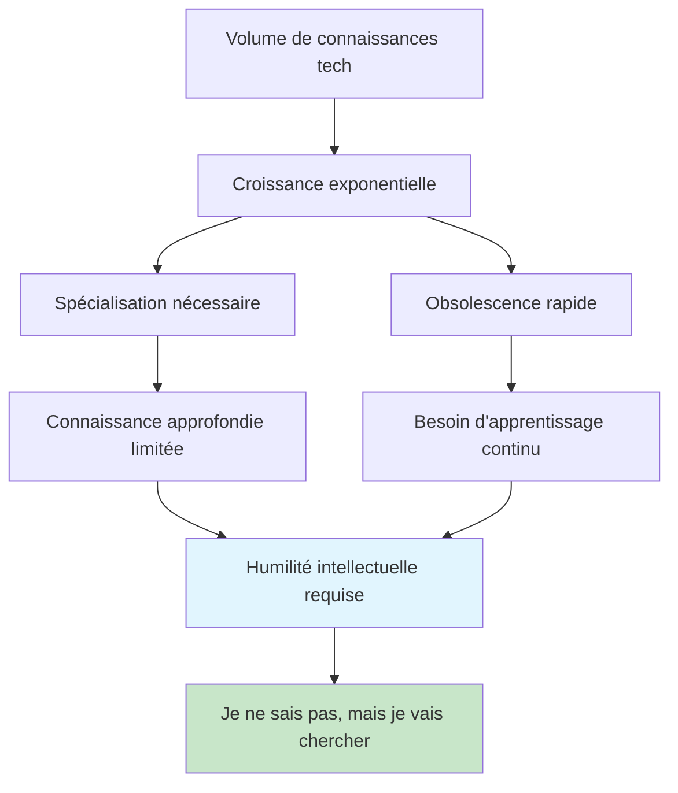
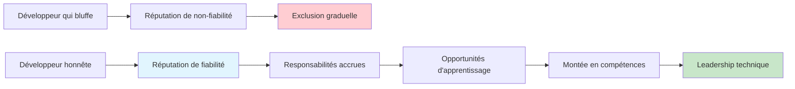
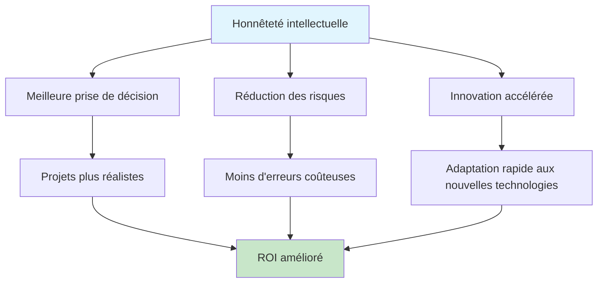

# Apprendre à dire "je ne sais pas, mais je vais chercher"

<Badge type="tip" text="Soft Skills & Professional Growth" />

Dans un monde technologique en constante évolution, la capacité à admettre ses limites et à transformer l'ignorance en opportunité d'apprentissage devient une compétence cruciale. Cette phrase apparemment simple "je ne sais pas, mais je vais chercher" représente bien plus qu'un aveu d'ignorance : c'est une démonstration de maturité professionnelle et d'intelligence émotionnelle.

## La psychologie de l'ignorance assumée

### Dépasser la peur du jugement

::: info Mécanismes psychologiques en jeu
- **Syndrome de l'imposteur** - Peur d'être "découvert" comme incompétent
- **Biais de surconfiance** - Tendance à surestimer ses connaissances
- **Pression sociale** - Attente perçue d'omniscience professionnelle
- **Ego défensif** - Protection de l'image de soi face aux pairs
:::

### Le paradoxe de l'expertise moderne



### Transformation cognitive nécessaire

::: tip Changement de paradigme
**De** : "Je dois tout savoir" 
**Vers** : "Je dois savoir comment apprendre"

**De** : "L'ignorance est une faiblesse"
**Vers** : "L'ignorance identifiée est une opportunité"

**De** : "Poser des questions révèle mon incompétence"
**Vers** : "Poser de bonnes questions démontre ma curiosité"
:::

## Situations pratiques en développement

### Scénarios courants et réponses appropriées

```typescript
// Exemples de situations réelles et réponses professionnelles

interface ProfessionalResponse {
  situation: string;
  badResponse: string;
  goodResponse: string;
  followUp: string[];
}

const commonScenarios: ProfessionalResponse[] = [
  {
    situation: "Question technique sur une technologie inconnue en réunion",
    badResponse: "Oui, je connais bien cette techno [bluff]",
    goodResponse: "Je ne suis pas familier avec cette technologie spécifique, mais je peux me renseigner et vous revenir avec une analyse détaillée d'ici demain.",
    followUp: [
      "Rechercher la documentation officielle",
      "Consulter des articles de référence",
      "Tester rapidement la technologie",
      "Préparer un résumé avec pros/cons",
      "Revenir avec une réponse structurée"
    ]
  },
  
  {
    situation: "Bug complexe dont la cause est inconnue",
    badResponse: "C'est probablement un problème de réseau [hypothèse non vérifiée]",
    goodResponse: "Je n'ai pas encore identifié la cause racine. Laissez-moi investiguer méthodiquement et je vous tiendrai informé de l'avancement toutes les heures.",
    followUp: [
      "Reproduire le bug de manière consistante",
      "Analyser les logs système",
      "Vérifier les changements récents",
      "Isoler les composants suspectés",
      "Documenter les découvertes"
    ]
  },
  
  {
    situation: "Estimation de durée pour une feature inconnue",
    badResponse: "Ça devrait prendre environ 2 jours [estimation au doigt mouillé]",
    goodResponse: "Cette feature implique des aspects que je ne maîtrise pas encore. J'ai besoin de 2-3 heures pour faire une analyse technique approfondie avant de donner une estimation fiable.",
    followUp: [
      "Décomposer la feature en tâches",
      "Identifier les incertitudes techniques",
      "Rechercher solutions existantes",
      "Prototyper les parties complexes",
      "Donner estimation avec intervalles de confiance"
    ]
  }
];
```

### Techniques de communication efficaces

::: details Formules de communication professionnelle

**Reconnaissance immédiate**
- "C'est une excellente question, je ne connais pas la réponse précise"
- "Je n'ai pas cette information sous la main"
- "Ce n'est pas mon domaine d'expertise"

**Engagement constructif**
- "Laissez-moi chercher et je vous reviens rapidement"
- "Je vais investiguer et vous proposer une solution"
- "Je connais quelqu'un qui pourrait nous éclairer sur ce point"

**Timeline claire**
- "Je peux vous donner une réponse détaillée d'ici [délai précis]"
- "Je fais mes recherches et je programme un point avec vous demain"
- "Je vous envoie un résumé par email dans les 2 heures"

**Valeur ajoutée**
- "En cherchant, je vais aussi documenter cela pour l'équipe"
- "Cela m'amènera à creuser un sujet intéressant pour nos projets futurs"
- "Je profiterai de cette recherche pour monter en compétence sur [technologie]"
:::

## Méthode de recherche structurée

### Framework de recherche efficace

```markdown
## Méthodologie "SEARCH" pour recherche technique

### S - Scope (Délimiter)
- Définir précisément ce que je cherche
- Identifier les mots-clés pertinents
- Établir le niveau de profondeur nécessaire
- Fixer une limite de temps de recherche

### E - Expert Sources (Sources expertes)
- Documentation officielle
- Articles de référence (blogs techniques reconnus)
- Papers académiques si pertinent
- Repositories GitHub populaires
- Stack Overflow (réponses validées)

### A - Assess (Évaluer)
- Vérifier la fraîcheur de l'information
- Croiser plusieurs sources
- Identifier les consensus et divergences
- Noter les limitations et contextes

### R - Record (Enregistrer)
- Prendre des notes structurées
- Sauvegarder les liens utiles
- Documenter les points clés
- Préparer un résumé

### C - Connect (Connecter)
- Relier aux connaissances existantes
- Identifier les implications pour le projet
- Formuler des recommandations pratiques
- Préparer les prochaines étapes

### H - Share (Partager)
- Présenter les découvertes clairement
- Partager la documentation avec l'équipe
- Contribuer à la base de connaissances
- Identifier les besoins d'approfondissement
```

### Outils de recherche moderne

::: tip Stack d'outils de recherche 2025

**Recherche générale**
- **Perplexity AI** - Recherche avec sources citées
- **Phind** - Moteur spécialisé développement
- **GitHub Search** - Code et documentation
- **Stack Overflow** - Q&A communautaire

**Documentation technique**
- **DevDocs** - Documentation unifiée
- **MDN Web Docs** - Référence web
- **Can I Use** - Compatibilité navigateurs
- **API Documentation** - Docs officielles

**Apprentissage approfondi**
- **Coursera/edX** - Cours structurés
- **YouTube** - Tutoriels visuels
- **Medium/Dev.to** - Articles techniques
- **Reddit** - Discussions communautaires

**Organisation des connaissances**
- **Obsidian** - Graphe de connaissances
- **Notion** - Base de données personnelle
- **Anki** - Répétition espacée
- **Pocket** - Sauvegarde articles
:::

### Template de recherche documentée

```markdown
# Recherche: [Sujet]

## Contexte
- **Demandeur**: [Nom/Équipe]
- **Date**: [Date]
- **Objectif**: [Pourquoi cette recherche]
- **Contraintes**: [Temps, budget, scope]

## Questions à résoudre
1. [Question principale]
2. [Questions secondaires]
3. [Implications pratiques]

## Sources consultées
### Documentation officielle
- [Source 1] - [Résumé des points clés]
- [Source 2] - [Résumé des points clés]

### Articles techniques
- [Article 1] - [Date] - [Auteur] - [Points clés]
- [Article 2] - [Date] - [Auteur] - [Points clés]

### Code/Exemples
- [Repository 1] - [Description]
- [Repository 2] - [Description]

## Synthèse
### Points clés découverts
1. [Point important 1]
2. [Point important 2]
3. [Point important 3]

### Limitations identifiées
- [Limitation 1]
- [Limitation 2]

### Recommandations
#### Immédiate
- [Action 1]
- [Action 2]

#### À moyen terme
- [Action 1]
- [Action 2]

## Prochaines étapes
- [ ] [Action concrète avec date]
- [ ] [Action concrète avec date]
- [ ] [Partage avec équipe]

## Ressources pour approfondir
- [Lien 1] - [Description]
- [Lien 2] - [Description]
```

## Construire sa crédibilité par l'honnêteté

### La crédibilité par la transparence

::: info Mécanismes de construction de confiance
**Court terme** : Admettre ses limites peut créer un malaise
**Moyen terme** : La cohérence et le follow-up construisent la confiance
**Long terme** : La réputation d'honnêteté devient un atout majeur
:::

### Différenciation par l'apprentissage



### Patterns de communication qui fonctionnent

```typescript
// Exemples de patterns de communication authentique

class AuthenticCommunication {
  // Pattern: Reconnaissance + Action + Timeline
  respondToTechnicalQuestion(question: string): string {
    return `Je ne maîtrise pas encore [sujet spécifique], 
            mais c'est exactement le type de défi que j'aime relever. 
            Laissez-moi creuser la documentation et quelques implémentations 
            de référence, et je vous propose une analyse détaillée demain matin.`;
  }
  
  // Pattern: Contexte + Limites + Valeur ajoutée
  estimateComplexTask(task: string): string {
    return `Cette tâche implique [technologies X, Y, Z] que je ne connais pas 
            en profondeur. Plutôt que de vous donner une estimation hasardeuse, 
            je préfère passer une demi-journée à faire un spike technique 
            pour vous donner des chiffres fiables avec les risques identifiés.`;
  }
  
  // Pattern: Honesty + Network + Collaboration
  escalateToExpert(domain: string): string {
    return `Ce domaine sort de mon expertise, mais je connais [Nom] 
            qui a travaillé sur des problématiques similaires. 
            Voulez-vous que je lui pose la question ou préférez-vous 
            que nous organisions un call à trois ?`;
  }
}
```

## Cultiver une culture d'apprentissage

### En équipe : créer un environnement psychologiquement sûr

::: tip Pratiques pour leaders techniques
**Modeling behavior**
- Commencer par donner l'exemple personnellement
- Partager ses propres moments d'apprentissage
- Célébrer les questions intelligentes

**Structural support**
- Temps dédié à la recherche (20% time)
- Budget formation et conférences
- Bibliothèque technique d'équipe

**Recognition systems**
- Valoriser les admissions d'ignorance constructives
- Récompenser le partage de connaissances
- Célébrer les échecs instructifs
:::

### Rituels d'équipe favorisant l'apprentissage

```yaml
# Pratiques d'équipe pour normaliser l'apprentissage
team_practices:
  daily_standups:
    added_question: "Qu'avez-vous appris hier ?"
    encouragement: "Quelles questions vous posez-vous aujourd'hui ?"
    
  weekly_rituals:
    learning_friday:
      duration: "2 heures"
      format: "Recherche libre ou apprentissage dirigé"
      sharing: "15 min présentation optionnelle"
    
    failure_stories:
      frequency: "Bi-mensuel"
      format: "Partage d'échecs instructifs"
      focus: "Apprentissages tirés, pas blame"
      
  monthly_practices:
    tech_talks_internal:
      presenter: "Chacun son tour"
      topics: "Nouvelles découvertes, recherches récentes"
      audience: "Équipe + autres équipes intéressées"
      
    learning_retrospective:
      questions:
        - "Quelles compétences nous ont manqué ce mois-ci ?"
        - "Quelles ressources d'apprentissage ont été les plus utiles ?"
        - "Quels sujets mériteraient une investigation collective ?"
        
  documentation:
    learning_log:
      format: "Wiki partagé"
      content: "Recherches, découvertes, ressources"
      maintenance: "Revue trimestrielle"
      
    expert_directory:
      internal: "Qui connaît quoi dans l'équipe"
      external: "Contacts experts par domaine"
      update: "Après chaque nouveau projet"
```

### Métriques de culture d'apprentissage

```typescript
interface LearningCultureMetrics {
  // Métriques quantitatives
  questionsAskedPerWeek: number;
  documentationContributions: number;
  learningSessionsAttended: number;
  knowledgeSharingPresentations: number;
  
  // Métriques qualitatives (sondages équipe)
  psychologicalSafety: number; // 1-10
  comfortWithAdmittingIgnorance: number; // 1-10
  learningOpportunityAccess: number; // 1-10
  
  // Métriques d'impact
  timeToResolution: number; // Diminue avec meilleure recherche
  codeQuality: number; // Améliore avec apprentissage
  teamVelocity: number; // Long terme positif
}

// Tableau de bord culture d'apprentissage
class LearningCultureDashboard {
  generateMonthlyReport(): LearningReport {
    return {
      highlights: [
        "15 nouvelles questions documentées cette semaine",
        "3 sessions de recherche collaborative organisées",
        "Temps moyen de résolution des blocages: -20%"
      ],
      areas_for_improvement: [
        "Encourager plus de questions en réunion",
        "Améliorer la documentation des recherches",
        "Créer plus d'opportunités de pair learning"
      ],
      learning_achievements: [
        "Équipe maintenant autonome sur Kubernetes",
        "Nouvelle expertise React Server Components",
        "Documentation GraphQL complètement mise à jour"
      ]
    };
  }
}
```

## Transformer l'ignorance en avantage compétitif

### L'ignorance comme signal de croissance

::: details Philosophie de l'ignorance productive

**Ignorance consciente > Ignorance inconsciente**
- Identifier ce qu'on ne sait pas
- Cartographier les zones d'ombre
- Prioriser les apprentissages

**Questions > Affirmations hasardeuses**
- "Comment fonctionne exactement [technologie] ?"
- "Quels sont les trade-offs de cette approche ?"
- "Avez-vous des ressources recommandées sur [sujet] ?"

**Curiosité > Arrogance**
- Approche d'apprentissage permanent
- Humilité intellectuelle
- Passion pour la découverte
:::

### Business case de l'honnêteté intellectuelle



### ROI de l'apprentissage transparent

::: info Impact mesurable sur l'organisation
**Court terme (1-3 mois)**
- Réduction des bugs dus aux approximations techniques
- Amélioration de la précision des estimations
- Diminution des tensions d'équipe

**Moyen terme (3-12 mois)**
- Montée en compétences plus rapide
- Meilleure documentation technique
- Culture de collaboration renforcée

**Long terme (1-3 ans)**
- Leadership technique reconnu
- Capacité d'adaptation technologique supérieure
- Attraction et rétention des talents
:::

## Cas d'étude concrets

### Success story : De junior effrayé à lead technique

::: details Parcours de transformation

**Situation initiale**
- Développeur junior, 6 mois d'expérience
- Peur constante d'être "découvert"
- Tendance à répondre "oui" à toutes les demandes

**Moment déclic**
- Bug critique en production causé par une "solution" bricolée
- Réalisation que l'honnêteté aurait évité le problème

**Transformation progressive**
1. **Mois 1-3** : Commencer à dire "je ne sais pas" en privé
2. **Mois 4-6** : Étendre aux réunions d'équipe
3. **Mois 7-12** : Devenir la référence pour les recherches techniques
4. **Année 2** : Promotion lead technique
5. **Année 3** : Mentor pour nouveaux développeurs

**Résultats concrets**
- 0 bugs critiques liés à des approximations techniques
- +150% amélioration temps de résolution des problèmes
- Score de confiance équipe : 9/10
- Promotion en avance de 18 mois
:::

### Anti-pattern : Le cost du bluff

```typescript
// Exemple réel anonymisé d'une situation problématique

interface ProjectDisaster {
  context: "Migration base de données critique";
  timeline: "6 mois de développement";
  team: "4 développeurs seniors";
  
  problem: {
    developer_claimed: "Je maîtrise parfaitement PostgreSQL";
    reality: "Première expérience avec PostgreSQL à cette échelle";
    consequence: "Architecture inadaptée découverte à 80% du projet";
  };
  
  impact: {
    timeline_delay: "4 mois supplémentaires";
    budget_overrun: "300% du budget initial";
    team_morale: "Très dégradé";
    client_relationship: "Sérieusement affectée";
    reputation: "Dommage long terme";
  };
  
  alternative_scenario: {
    honest_response: "Je n'ai pas d'expérience PostgreSQL à cette échelle, mais je peux monter en compétence ou nous pouvons faire appel à un expert";
    likely_outcome: {
      expert_consultation: "1 semaine";
      proper_architecture: "Design solide dès le début";
      timeline: "Respecté";
      budget: "Maîtrisé";
      learning: "Équipe monte en compétence progressivement";
    }
  };
}
```

## Guide pratique jour après jour

### Checklist quotidienne

::: tip Pratique quotidienne de l'honnêteté intellectuelle

**Matin - Préparation mentale**
- [ ] Identifier 1-2 sujets que je ne maîtrise pas complètement
- [ ] Prévoir du temps de recherche dans ma journée
- [ ] Accepter mentalement que je vais apprendre aujourd'hui

**Pendant les interactions**
- [ ] Écouter activement avant de répondre
- [ ] Prendre 3 secondes de réflexion avant de répondre
- [ ] Utiliser "Excellente question, laisse-moi vérifier" quand approprié
- [ ] Noter les sujets à approfondir

**Soir - Réflexion et apprentissage**
- [ ] Dédier 30 minutes à la recherche sur les questions du jour
- [ ] Documenter mes découvertes
- [ ] Planifier les follow-ups nécessaires
- [ ] Identifier mes progrès d'apprentissage
:::

### Scripts de communication prêts à l'emploi

```typescript
// Templates de réponses professionnelles

class HonestCommunicationTemplates {
  // En réunion avec client
  clientMeeting = {
    acknowledge: "C'est une question importante qui mérite une réponse précise",
    research: "Je préfère faire une recherche approfondie plutôt que de vous donner une information approximative",
    timeline: "Je peux vous revenir avec une analyse détaillée d'ici [délai]",
    value: "Cela m'amènera aussi à identifier les meilleures pratiques pour votre contexte"
  };
  
  // En équipe technique
  teamDiscussion = {
    acknowledge: "Je ne connais pas bien cette technologie",
    engagement: "mais c'est exactement le type de défi technique qui m'intéresse",
    action: "Je propose de faire un spike d'investigation et de partager mes découvertes",
    collaboration: "Si quelqu'un a de l'expérience dessus, je serais preneur de conseils"
  };
  
  // Avec le management
  managementReporting = {
    context: "Pour cette estimation, il y a des incertitudes techniques importantes",
    honesty: "Je préfère être transparent plutôt que donner un chiffre qui pourrait être trompeur",
    solution: "Je propose une approche en deux phases : investigation puis implémentation",
    confidence: "Cela nous donnera une estimation beaucoup plus fiable"
  };
}
```

### Métriques personnelles de progression

```yaml
# Tableau de bord personnel - auto-évaluation mensuelle
personal_growth_metrics:
  learning_indicators:
    questions_asked: 
      target: "Au moins 1 par jour"
      tracking: "Noter dans carnet"
    
    unknown_topics_identified:
      target: "3-5 nouveaux sujets par semaine"
      action: "Ajouter à liste apprentissage"
    
    follow_ups_completed:
      target: "100% des promesses de recherche"
      tracking: "Tableau kanban personnel"
      
  communication_quality:
    honesty_moments:
      frequency: "Noter chaque fois"
      reflection: "Analyser le résultat"
    
    reception_feedback:
      collection: "Demander feedback explicite"
      analysis: "Tendances positives/négatives"
      
  impact_measures:
    team_trust:
      indicator: "Sollicitation pour conseils techniques"
      frequency: "Augmentation over time"
    
    problem_resolution_time:
      measurement: "Temps moyen pour résoudre blocages"
      expectation: "Amélioration continue"
      
    learning_velocity:
      indicator: "Nouveaux concepts maîtrisés par mois"
      target: "Progression constante"
```

## Ressources pour approfondir

### Livres recommandés

::: info Lecture complémentaire
**Développement personnel**
- "The Lean Startup" - Eric Ries (fail fast, learn fast)
- "Mindset" - Carol Dweck (growth mindset)
- "The Art of Learning" - Josh Waitzkin (méta-apprentissage)

**Communication professionnelle**
- "Crucial Conversations" - Patterson, Grenny
- "Nonviolent Communication" - Marshall Rosenberg
- "The Culture Map" - Erin Meyer (communication interculturelle)

**Leadership technique**
- "The Manager's Path" - Camille Fournier
- "Accelerate" - Forsgren, Humble, Kim
- "Team Topologies" - Skelton, Pais
:::

### Communautés et ressources

::: details Espaces d'apprentissage et de discussion

**Communautés techniques**
- **Dev.to** - Partage d'expériences et apprentissages
- **Stack Overflow** - Questions/réponses techniques
- **Reddit** (r/programming, r/learningprogramming)
- **Discord/Slack** - Communautés par technologie

**Plateformes d'apprentissage**
- **Pluralsight** - Parcours techniques structurés
- **FreeCodeCamp** - Apprentissage open source
- **Udemy/Coursera** - Cours spécialisés
- **YouTube** - Tutoriels et conférences

**Réseaux professionnels**
- **LinkedIn Learning** - Soft skills et tech skills
- **Meetups locaux** - Networking et apprentissage
- **Conférences tech** - Immersion dans nouvelles tendances
- **Twitter tech** - Veille et discussions expertes
:::

## Conclusion

### L'art de la vulnérabilité professionnelle

Apprendre à dire "je ne sais pas, mais je vais chercher" représente un acte de courage professionnel qui transcende la simple honnêteté. C'est la reconnaissance que l'expertise moderne ne réside pas dans l'accumulation statique de connaissances, mais dans la capacité dynamique à identifier, rechercher et acquérir de nouvelles compétences.

### Transformation personnelle et professionnelle

::: tip Impact transformationnel
**Personnel**
- Réduction de l'anxiété liée à l'imposture
- Croissance accélérée des compétences
- Satisfaction professionnelle augmentée

**Relationnel**
- Confiance renforcée avec les collègues
- Leadership par l'exemple
- Mentoring naturel des juniors

**Organisationnel**
- Culture d'apprentissage stimulée
- Innovation collaborative favorisée
- Adaptation technologique facilitée
:::

### L'avenir appartient aux apprenants

Dans un monde où l'IA peut générer du code et où les technologies évoluent exponentiellement, la différenciation humaine se fait sur :
- La capacité à poser les bonnes questions
- L'art de naviguer l'incertitude avec sérénité
- La création de liens entre connaissances disparates
- La facilitation de l'apprentissage collectif

Dire "je ne sais pas, mais je vais chercher" n'est plus un aveu de faiblesse, c'est la démonstration d'une intelligence adaptative moderne. C'est reconnaître que dans un univers en expansion constante de connaissances, la curiosité intellectuelle et l'honnêteté personnelle deviennent nos boussoles les plus fiables.

**La prochaine fois qu'une question vous met en difficulté, respirez, souriez, et dites avec assurance : "Excellente question ! Je ne sais pas, mais je vais chercher et vous revenir avec une réponse détaillée."**

Votre futur vous remerciera pour cette honnêteté courageuse.
