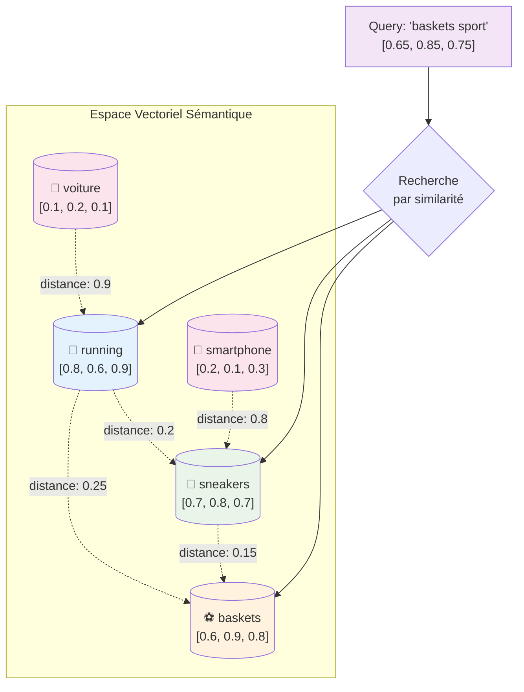

# Les bases de données vectorielles : pourquoi c'est le futur

Il y a deux ans, quand on me parlait de "bases de données vectorielles", j'avouais ne pas trop voir l'intérêt. Après tout, on avait déjà nos bonnes vieilles bases relationnelles, NoSQL, et même les moteurs de recherche comme Elasticsearch. Puis j'ai commencé à bosser sur des projets d'IA conversationnelle et j'ai vite compris : sans bases de données vectorielles, impossible de faire du Retrieval Augmented Generation (RAG) correctement.

Aujourd'hui, avec un marché estimé à 2,2 milliards de dollars en 2024 et une projection à 10,6 milliards en 2032, on peut dire que cette technologie n'est plus une curiosité - c'est devenu un pilier de l'infrastructure moderne.

## Quand la recherche traditionnelle montre ses limites

Imaginez que vous cherchiez "chaussures de sport" dans un e-commerce traditionnel. Le système ne comprend pas que vous pourriez aussi être intéressé par des "baskets", des "sneakers" ou des "running". Il se contente de matcher vos mots-clés exacts.

```python
# Recherche traditionnelle - approche naïve
def search_traditional(query, products):
    results = []
    query_words = query.lower().split()
    
    for product in products:
        score = 0
        for word in query_words:
            if word in product['name'].lower():
                score += 1
        if score > 0:
            results.append((product, score))
    
    return sorted(results, key=lambda x: x[1], reverse=True)

# Problème : "sneakers" ne matchera jamais "chaussures de sport"
```

Les bases de données vectorielles révolutionnent cette approche en comprenant le sens et les relations sémantiques entre les concepts.

## Comment ça marche concrètement ?

Le principe repose sur les **embeddings** - des représentations numériques qui capturent le sens des données dans un espace vectoriel multi-dimensionnel. Deux concepts similaires auront des vecteurs proches dans cet espace.

```python
# Exemple avec Qdrant (leader performance 2025)
from qdrant_client import QdrantClient
from qdrant_client.http import models
import numpy as np

# Configuration du client
client = QdrantClient("localhost", port=6333)

# Création d'une collection
client.create_collection(
    collection_name="products",
    vectors_config=models.VectorParams(
        size=384,  # Dimension du modèle d'embedding
        distance=models.Distance.COSINE
    )
)

# Insertion de produits avec leurs embeddings
products_data = [
    {
        "id": 1,
        "vector": generate_embedding("Nike Air Max chaussures running sport"),
        "payload": {
            "name": "Nike Air Max",
            "category": "running",
            "price": 129.99
        }
    },
    {
        "id": 2,
        "vector": generate_embedding("Adidas sneakers basket urbain"),
        "payload": {
            "name": "Adidas Stan Smith",
            "category": "lifestyle",
            "price": 89.99
        }
    }
]

client.upsert(
    collection_name="products",
    points=products_data
)

# Recherche sémantique
def semantic_search(query_text, limit=5):
    query_vector = generate_embedding(query_text)
    
    results = client.search(
        collection_name="products",
        query_vector=query_vector,
        limit=limit,
        with_payload=True
    )
    
    return results

# Maintenant "baskets sport" trouvera aussi les "sneakers" et "running"
results = semantic_search("baskets sport")
```



## Le paysage technologique en 2025

Après avoir testé plusieurs solutions en production, voici ce qui ressort :

### Qdrant : le roi de la performance
Écrit en Rust, Qdrant domine clairement les benchmarks avec des gains de **4x RPS** sur certains datasets. Ce qui m'a séduit :
- Latence ultra-faible même sous charge
- APIs disponibles en Python, TypeScript, Rust, Go
- Open source avec une communauté active

```python
# Installation simple
pip install qdrant-client

# API intuitive
from qdrant_client import QdrantClient

client = QdrantClient(":memory:")  # Pour les tests
# ou 
client = QdrantClient("https://xyz.us-east-1-0.aws.cloud.qdrant.io")  # Cloud
```

### Pinecone : la simplicité managée
Pour les équipes qui veulent juste que ça marche sans gérer l'infrastructure :

```python
import pinecone

pinecone.init(api_key="your-api-key", environment="us-west1-gcp")

index = pinecone.Index("example-index")

# Upsert simple
index.upsert([
    ("doc1", [0.1, 0.2, 0.3], {"text": "Premier document"}),
    ("doc2", [0.4, 0.5, 0.6], {"text": "Second document"})
])

# Query simple
results = index.query(
    vector=[0.1, 0.1, 0.1],
    top_k=3,
    include_metadata=True
)
```

### Weaviate : l'hybride intelligent
Plus d'un million de pulls Docker par mois, Weaviate combine recherche vectorielle et traditionnelle :

```python
import weaviate

client = weaviate.Client("http://localhost:8080")

# Schema avec vectorisation automatique
schema = {
    "classes": [
        {
            "class": "Article",
            "vectorizer": "text2vec-openai",
            "properties": [
                {"name": "title", "dataType": ["text"]},
                {"name": "content", "dataType": ["text"]}
            ]
        }
    ]
}

client.schema.create(schema)
```

## RAG : le cas d'usage qui change tout

Là où les bases de données vectorielles brillent vraiment, c'est dans les architectures RAG. J'ai implémenté plusieurs systèmes de Q&A d'entreprise et la différence est frappante.

```python
# Pipeline RAG complet avec LangChain
from langchain.embeddings import OpenAIEmbeddings
from langchain.vectorstores import Qdrant
from langchain.llms import OpenAI
from langchain.chains import RetrievalQA

# Setup des embeddings
embeddings = OpenAIEmbeddings(model="text-embedding-3-large")

# Vectorstore
vectorstore = Qdrant.from_documents(
    documents,
    embeddings,
    url="http://localhost:6333",
    collection_name="knowledge_base"
)

# Chaîne RAG
qa = RetrievalQA.from_chain_type(
    llm=OpenAI(temperature=0),
    chain_type="stuff",
    retriever=vectorstore.as_retriever(search_kwargs={"k": 3})
)

# Query avec contexte
response = qa.run("Comment optimiser les performances de notre API ?")
```

L'avantage ? Le LLM a maintenant accès à votre documentation interne, vos bonnes pratiques, vos solutions éprouvées. Fini les réponses génériques.

## Optimisations que j'ai apprises sur le terrain

### Taille des chunks : 512 tokens, le sweet spot
Après plusieurs tests, la taille de 512 tokens offre généralement les meilleures performances, même si ça varie selon le modèle d'embedding utilisé.

```python
from langchain.text_splitter import RecursiveCharacterTextSplitter

text_splitter = RecursiveCharacterTextSplitter(
    chunk_size=512,
    chunk_overlap=50,
    length_function=len,
    separators=["\n\n", "\n", " ", ""]
)

chunks = text_splitter.split_documents(documents)
```

### Recherche hybride : le meilleur des deux mondes
Combiner recherche sémantique et mots-clés améliore significativement la pertinence :

```python
# Avec Qdrant
from qdrant_client.http import models

# Index hybride avec sparse vectors
client.create_collection(
    collection_name="hybrid_search",
    vectors_config={
        "dense": models.VectorParams(
            size=384,
            distance=models.Distance.COSINE
        )
    },
    sparse_vectors_config={
        "sparse": models.SparseVectorParams()
    }
)

# Query hybride
results = client.search(
    collection_name="hybrid_search",
    query_vector=models.NamedVector(
        name="dense",
        vector=dense_vector
    ),
    sparse_vector=models.NamedSparseVector(
        name="sparse", 
        vector=sparse_vector
    )
)
```

## Au-delà de la recherche : les cas d'usage émergents

### Détection d'anomalies
Dans un projet récent, j'ai utilisé des embeddings pour détecter des logs d'erreur anormaux :

```python
# Clustering des logs normaux
normal_logs_embeddings = [get_embedding(log) for log in normal_logs]
normal_centroid = np.mean(normal_logs_embeddings, axis=0)

# Détection d'anomalie par distance
def is_anomaly(log_text, threshold=0.8):
    log_embedding = get_embedding(log_text)
    similarity = cosine_similarity([log_embedding], [normal_centroid])[0][0]
    return similarity < threshold
```

### Systèmes de recommandation
```python
# Recommandation basée sur le contenu
def recommend_articles(user_history, articles_db, top_k=5):
    # Profil utilisateur = moyenne des embeddings d'articles lus
    user_profile = np.mean([
        get_embedding(article['content']) 
        for article in user_history
    ], axis=0)
    
    # Recherche des articles similaires
    results = client.search(
        collection_name="articles",
        query_vector=user_profile,
        limit=top_k
    )
    
    return results
```

## Installation et setup rapide

### Option 1 : Qdrant avec Docker
```bash
# Ubuntu/Debian
sudo apt update && sudo apt install docker.io
docker run -p 6333:6333 qdrant/qdrant

# macOS avec Homebrew
brew install docker
docker run -p 6333:6333 qdrant/qdrant

# Arch Linux
sudo pacman -S docker
sudo systemctl start docker
docker run -p 6333:6333 qdrant/qdrant
```

### Option 2 : Chroma pour débuter
```python
# Plus simple pour prototyper
pip install chromadb

import chromadb
client = chromadb.Client()

collection = client.create_collection("test")
collection.add(
    documents=["Document 1", "Document 2"],
    ids=["1", "2"]
)

results = collection.query(
    query_texts=["Recherche similaire"],
    n_results=2
)
```

## Défis et limites à garder en tête

### Coût et dimensionalité
Plus de dimensions = meilleure précision mais plus de mémoire et latence. OpenAI's text-embedding-3-large permet de choisir entre 256, 1024 ou 3072 dimensions selon vos besoins.

### Sharding statique
Attention avec Qdrant et Pinecone : si vos données explosent, le re-sharding peut être complexe. Pensez scalabilité dès le départ.

### Consistance des embeddings
Un piège classique : mélanger des modèles d'embedding. Restez cohérent dans votre choix de modèle pour toute votre base.

## Vers l'IA agentique

Ce qui m'excite le plus, c'est l'évolution vers l'IA agentique. Les agents autonomes vont avoir besoin de bases de données vectorielles pour ancrer leur raisonnement dans des données privées et spécialisées. Ce n'est plus "si" mais "comment" architecturer efficacement ces systèmes.

Les bases de données vectorielles ne sont plus une technologie émergente - elles sont devenues un fondement de l'infrastructure IA moderne. Si vous travaillez avec des LLMs, des systèmes de recommandation, ou de la recherche sémantique, vous en aurez besoin. La question n'est plus "faut-il s'y mettre ?" mais "par laquelle commencer ?".

## Ressources

- [Documentation officielle Qdrant](https://qdrant.tech/documentation/) - Guide complet et examples
- [Pinecone Learning Center](https://www.pinecone.io/learn/) - Excellents tutoriels RAG
- [Weaviate Documentation](https://weaviate.io/developers/weaviate) - Architecture hybride
- [LangChain Vector Stores](https://python.langchain.com/docs/integrations/vectorstores/) - Intégrations prêtes à l'emploi
- [OpenAI Embeddings Guide](https://platform.openai.com/docs/guides/embeddings) - Modèles d'embedding 2025
- [Vector Database Comparison 2025](https://medium.com/tech-ai-made-easy/vector-database-comparison-pinecone-vs-weaviate-vs-qdrant-vs-faiss-vs-milvus-vs-chroma-2025-15bf152f891d) - Benchmarks détaillés
- [Retrieval Augmented Generation Paper](https://arxiv.org/abs/2005.11401) - Paper original de Facebook Research