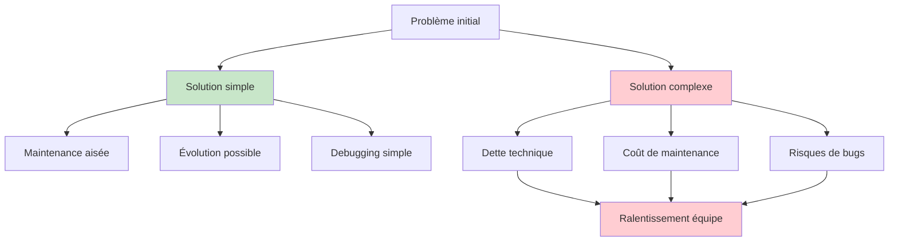
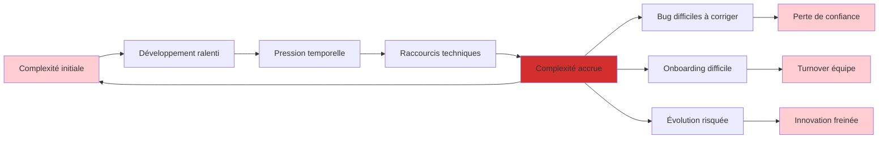

# La solution la plus simple est souvent la meilleure

<Badge type="tip" text="KISS Principle & Software Philosophy" />

Dans un monde technologique obsédé par l'innovation et la sophistication, le principe "Keep It Simple, Stupid" (KISS) semble presque contre-intuitif. Pourtant, cette philosophie, popularisée par l'ingénieur Kelly Johnson chez Lockheed, reste l'un des piliers les plus solides de l'ingénierie logicielle moderne. Explorons pourquoi la simplicité, loin d'être simpliste, représente souvent le summum de l'élégance technique.

## Comprendre la simplicité vs la facilité

### Distinction fondamentale

::: info Simple ≠ Facile
**Simple** : Peu de composants, peu d'interdépendances, facile à comprendre
**Facile** : Familier, proche de notre expérience, nécessite peu d'apprentissage

**Exemple concret :**
- **Simple mais difficile** : Apprendre les concepts de base de React (composants, props, state)
- **Complexe mais facile** : Utiliser une librairie UI avec 500 composants pré-faits
:::

### Anatomie de la complexité



### Types de complexité en développement

```typescript
// Types de complexité couramment rencontrés

interface ComplexityTypes {
  essential: {
    description: "Complexité inhérente au problème métier";
    example: "Calcul de taxes internationales";
    solution: "Accepter et bien structurer";
  };
  
  accidental: {
    description: "Complexité introduite par nos choix techniques";
    example: "Architecture microservices pour app simple";
    solution: "Éliminer ou simplifier";
  };
  
  cognitive: {
    description: "Charge mentale pour comprendre le code";
    example: "Fonctions de 200 lignes avec 10 paramètres";
    solution: "Décomposer et clarifier";
  };
  
  temporal: {
    description: "Complexité liée aux changements dans le temps";
    example: "État partagé mutable";
    solution: "Immutabilité et isolation";
  };
  
  behavioral: {
    description: "Interactions complexes entre composants";
    example: "Chaînes d'événements imbriquées";
    solution: "Découplage et communication explicite";
  };
}

// Anti-pattern : Over-engineering
class OverEngineeredUserService {
  private users: Map<string, User>;
  private cache: LRUCache<string, User>;
  private eventBus: EventEmitter;
  private metrics: MetricsCollector;
  private logger: StructuredLogger;
  private validator: SchemaValidator;
  private transformer: DataTransformer;
  
  async createUser(userData: CreateUserRequest): Promise<User> {
    // 50 lignes de validation, transformation, caching, events, logging...
    // Pour créer un simple utilisateur
  }
}

// Pattern : Simplicité élégante
class SimpleUserService {
  constructor(private userRepository: UserRepository) {}
  
  async createUser(userData: CreateUserRequest): Promise<User> {
    const user = new User(userData);
    return await this.userRepository.save(user);
  }
}
```

## Le coût caché de la complexité

### Impact sur l'équipe de développement

::: warning Coûts mesurables de la complexité
**Productivité** : -40% en moyenne sur code complexe vs simple
**Onboarding** : 3x plus long sur projets sur-architecturés  
**Debugging** : 5x plus de temps sur systèmes complexes
**Évolution** : Coût exponentiel avec la complexité accidentelle
:::

### Métriques de complexité technique

```typescript
interface CodeComplexityMetrics {
  // Métriques statiques
  cyclomaticComplexity: number; // < 10 recommandé
  cognitiveComplexity: number;  // < 15 recommandé
  nestingDepth: number;         // < 4 recommandé
  linesOfCode: number;          // < 50 par fonction
  
  // Métriques architecturales
  couplingBetweenObjects: number;
  dependencyCount: number;
  abstractionLevel: number;
  
  // Métriques d'équipe
  timeToUnderstand: number;     // minutes pour comprendre
  bugDensity: number;           // bugs per 1000 LOC
  changeFailureRate: number;    // % de déploiements qui échouent
  leadTime: number;             // temps feature → production
}

// Outil de mesure de complexité
class ComplexityAnalyzer {
  static analyzeFunction(func: Function): ComplexityScore {
    return {
      cognitive: this.calculateCognitiveLoad(func),
      cyclomatic: this.calculateCyclomaticComplexity(func),
      readability: this.assessReadability(func),
      recommendation: this.generateRecommendation(func)
    };
  }
  
  static assessCodebase(project: Project): ProjectComplexity {
    const files = project.getSourceFiles();
    const metrics = files.map(file => this.analyzeFile(file));
    
    return {
      averageComplexity: this.average(metrics),
      hotspots: this.identifyComplexityHotspots(metrics),
      trendOverTime: this.analyzeTrend(project.getHistory()),
      recommendedRefactoring: this.prioritizeRefactoring(metrics)
    };
  }
}
```

### Dette technique et cercle vicieux



## Principes de simplicité appliquée

### YAGNI : You Aren't Gonna Need It

::: tip Appliquer YAGNI efficacement
**Ne pas implémenter** ce qui n'est pas nécessaire **maintenant**
**Concevoir** pour rendre les futures extensions possibles
**Documenter** les décisions de ne pas implémenter
**Réviser** régulièrement les besoins futurs anticipés
:::

```typescript
// Anti-pattern : Over-anticipation
class BlogPost {
  private id: string;
  private title: string;
  private content: string;
  private author: User;
  private tags: Tag[];
  private categories: Category[];
  private seoMetadata: SEOMetadata;
  private socialMediaData: SocialMediaData;
  private analyticsTracking: AnalyticsConfig;
  private multilangVersions: Map<string, BlogPost>; // "On aura peut-être besoin de traduction"
  private scheduledPublications: ScheduleConfig[];   // "Et de publication programmée"
  private collaborativeEditing: CollabSession;       // "Et d'édition collaborative"
  private aiSuggestions: AISuggestionEngine;         // "L'IA sera utile un jour"
  
  // 200 lignes de code pour des features hypothétiques
}

// Pattern : YAGNI appliqué
class BlogPost {
  constructor(
    public readonly id: string,
    public readonly title: string,
    public readonly content: string,
    public readonly author: User,
    public readonly publishedAt: Date
  ) {}
  
  // Extensions futures possibles via composition :
  // - TaggedBlogPost extends BlogPost
  // - SEOOptimizedBlogPost extends BlogPost
  // - ScheduledBlogPost extends BlogPost
}
```

### Single Responsibility Principle avec simplicité

```typescript
// Complexe : Une classe fait tout
class UserManager {
  async createUser(data: any) { /* validation, création, email, logging, cache */ }
  async authenticateUser(credentials: any) { /* auth, session, tracking */ }
  async updateUserProfile(id: string, data: any) { /* validation, update, notification */ }
  async generateUserReport(criteria: any) { /* query, format, export */ }
  async sendUserNotification(id: string, message: any) { /* template, send, track */ }
  
  // 500 lignes, 20 responsabilités différentes
}

// Simple : Responsabilités séparées
class UserService {
  constructor(
    private userRepository: UserRepository,
    private userValidator: UserValidator,
    private userNotifier: UserNotifier
  ) {}
  
  async createUser(userData: CreateUserRequest): Promise<User> {
    await this.userValidator.validate(userData);
    const user = await this.userRepository.create(userData);
    await this.userNotifier.notifyWelcome(user);
    return user;
  }
}

class UserAuthenticator {
  async authenticate(credentials: Credentials): Promise<AuthResult> {
    // Logique d'authentification uniquement
  }
}

class UserReportGenerator {
  async generateReport(criteria: ReportCriteria): Promise<Report> {
    // Génération de rapports uniquement
  }
}
```

### Composition over Inheritance

::: details Simplicité par composition

**Problème avec l'héritage complexe :**
```
Animal
├── Mammal
│   ├── Dog
│   │   ├── Poodle
│   │   └── Bulldog
│   └── Cat
│       ├── Persian
│       └── Siamese
└── Bird
    ├── Penguin (ne vole pas!)
    └── Eagle
```

**Solution par composition :**
```typescript
interface CanFly {
  fly(): void;
}

interface CanSwim {
  swim(): void;
}

class Animal {
  constructor(
    private name: string,
    private behaviors: Behavior[] = []
  ) {}
  
  performBehavior(behaviorType: string) {
    const behavior = this.behaviors.find(b => b.type === behaviorType);
    behavior?.execute();
  }
}

// Usage simple et flexible
const eagle = new Animal('Eagle', [new FlyBehavior(), new HuntBehavior()]);
const penguin = new Animal('Penguin', [new SwimBehavior(), new SlideBehavior()]);
```
:::

## Techniques concrètes de simplification

### Refactoring vers la simplicité

```typescript
// Avant : Fonction complexe
function processOrder(orderData: any): any {
  if (!orderData) throw new Error('No order data');
  if (!orderData.items || orderData.items.length === 0) {
    throw new Error('No items in order');
  }
  
  let total = 0;
  for (let i = 0; i < orderData.items.length; i++) {
    if (!orderData.items[i].price || orderData.items[i].price <= 0) {
      throw new Error('Invalid item price');
    }
    if (!orderData.items[i].quantity || orderData.items[i].quantity <= 0) {
      throw new Error('Invalid item quantity');
    }
    total += orderData.items[i].price * orderData.items[i].quantity;
  }
  
  if (orderData.discount) {
    if (orderData.discount.type === 'percentage') {
      total = total - (total * orderData.discount.value / 100);
    } else if (orderData.discount.type === 'fixed') {
      total = total - orderData.discount.value;
    }
  }
  
  let tax = 0;
  if (orderData.customer && orderData.customer.country) {
    switch (orderData.customer.country) {
      case 'FR':
        tax = total * 0.20;
        break;
      case 'DE':
        tax = total * 0.19;
        break;
      case 'US':
        tax = total * 0.08;
        break;
      default:
        tax = 0;
    }
  }
  
  return {
    subtotal: total,
    tax: tax,
    total: total + tax,
    items: orderData.items.length
  };
}

// Après : Décomposition simple
class OrderProcessor {
  processOrder(order: Order): OrderSummary {
    this.validateOrder(order);
    
    const subtotal = this.calculateSubtotal(order.items);
    const discountedSubtotal = this.applyDiscount(subtotal, order.discount);
    const tax = this.calculateTax(discountedSubtotal, order.customer);
    
    return new OrderSummary(discountedSubtotal, tax);
  }
  
  private validateOrder(order: Order): void {
    if (!order || !order.items?.length) {
      throw new InvalidOrderError('Order must contain items');
    }
  }
  
  private calculateSubtotal(items: OrderItem[]): number {
    return items.reduce((sum, item) => {
      this.validateItem(item);
      return sum + (item.price * item.quantity);
    }, 0);
  }
  
  private validateItem(item: OrderItem): void {
    if (!item.price || item.price <= 0) {
      throw new InvalidItemError('Item must have valid price');
    }
    if (!item.quantity || item.quantity <= 0) {
      throw new InvalidItemError('Item must have valid quantity');
    }
  }
  
  private applyDiscount(amount: number, discount?: Discount): number {
    if (!discount) return amount;
    
    return discount.apply(amount);
  }
  
  private calculateTax(amount: number, customer: Customer): number {
    const taxRate = this.getTaxRateForCountry(customer.country);
    return amount * taxRate;
  }
  
  private getTaxRateForCountry(country: string): number {
    const taxRates = {
      'FR': 0.20,
      'DE': 0.19,
      'US': 0.08
    };
    
    return taxRates[country] || 0;
  }
}
```

### Architecture simple par couches

::: details Exemple d'architecture simple mais évolutive

```
┌─────────────────────────────────────┐
│              API Layer              │ ← Controllers, Routes, Middleware
├─────────────────────────────────────┤
│           Business Layer            │ ← Services, Domain Logic
├─────────────────────────────────────┤
│             Data Layer              │ ← Repositories, Models
├─────────────────────────────────────┤
│         Infrastructure Layer        │ ← Database, External APIs, Utils
└─────────────────────────────────────┘
```

**Règles simples :**
1. Chaque couche ne communique qu'avec la couche adjacente
2. Les dépendances vont toujours vers le bas
3. La logique métier est isolée des détails techniques
4. Chaque couche a une responsabilité claire

**Exemple concret :**
```typescript
// API Layer
@Controller('/users')
class UserController {
  constructor(private userService: UserService) {}
  
  @Post()
  async createUser(@Body() userData: CreateUserDto) {
    return this.userService.createUser(userData);
  }
}

// Business Layer
class UserService {
  constructor(private userRepository: UserRepository) {}
  
  async createUser(userData: CreateUserDto): Promise<User> {
    const existingUser = await this.userRepository.findByEmail(userData.email);
    if (existingUser) {
      throw new ConflictException('User already exists');
    }
    
    const user = new User(userData);
    return this.userRepository.save(user);
  }
}

// Data Layer
class UserRepository {
  async save(user: User): Promise<User> {
    // Logique de persistance
  }
  
  async findByEmail(email: string): Promise<User | null> {
    // Logique de recherche
  }
}
```
:::

### Simplification progressive

```typescript
// Technique : Strangler Fig Pattern pour simplifier progressivement

// Étape 1 : Système legacy complexe
class LegacyOrderSystem {
  processComplexOrder(data: any): any {
    // 500 lignes de logique entremêlée
  }
}

// Étape 2 : Introduire une façade simple
class OrderFacade {
  constructor(
    private legacySystem: LegacyOrderSystem,
    private newOrderService: NewOrderService
  ) {}
  
  async processOrder(order: Order): Promise<OrderResult> {
    // Router vers nouveau système pour certains cas
    if (this.canHandleWithNewSystem(order)) {
      return this.newOrderService.process(order);
    }
    
    // Fallback vers legacy pour les autres
    return this.legacySystem.processComplexOrder(order.toLegacyFormat());
  }
  
  private canHandleWithNewSystem(order: Order): boolean {
    // Critères progressifs d'adoption
    return order.isSimpleOrder() && !order.hasLegacyDiscounts();
  }
}

// Étape 3 : Nouveau système simple
class NewOrderService {
  async process(order: Order): Promise<OrderResult> {
    // Implémentation simple et claire
    return new OrderProcessor().process(order);
  }
}

// Étape 4 : Migration progressive
// - 10% du trafic → nouveau système
// - 50% du trafic → nouveau système  
// - 100% du trafic → nouveau système
// - Suppression du legacy
```

## Outils et techniques de mesure

### Métriques de simplicité

::: tip Métriques pratiques pour évaluer la simplicité

**Métriques de code**
- **Complexité cyclomatique** < 10 par fonction
- **Profondeur d'imbrication** < 4 niveaux
- **Nombre de paramètres** < 5 par fonction
- **Lignes par fonction** < 50

**Métriques d'équipe**
- **Temps de compréhension** < 10 minutes par module
- **Questions par code review** < 3 en moyenne
- **Temps d'onboarding** nouveau développeur
- **Fréquence des bugs** dans les modules complexes

**Métriques produit**
- **Time to market** nouvelles features
- **Vélocité d'équipe** story points/sprint
- **Lead time** idée → production
- **Taux de régression** lors des changements
:::

### Outils d'analyse automatique

```typescript
// Configuration ESLint pour encourager la simplicité
{
  "rules": {
    "complexity": ["error", { "max": 10 }],
    "max-depth": ["error", 4],
    "max-lines-per-function": ["error", 50],
    "max-params": ["error", 5],
    "max-nested-callbacks": ["error", 3],
    "no-else-return": "error",
    "prefer-const": "error",
    "no-var": "error"
  }
}

// SonarQube rules pour maintenir la simplicité
quality_gates:
  cognitive_complexity: < 15
  cyclomatic_complexity: < 10
  duplicated_lines: < 3%
  maintainability_rating: A
  reliability_rating: A
  security_rating: A

// Custom linting rules
class SimplicitLinter {
  checkFunctionComplexity(func: Function): LintResult {
    const complexity = this.calculateComplexity(func);
    
    return {
      passed: complexity < 10,
      message: complexity >= 10 
        ? `Function too complex (${complexity}). Consider breaking it down.`
        : 'Complexity acceptable',
      suggestions: complexity >= 10 
        ? this.generateSimplificationSuggestions(func)
        : []
    };
  }
  
  generateSimplificationSuggestions(func: Function): string[] {
    return [
      'Extract utility functions',
      'Use early returns to reduce nesting',
      'Consider using strategy pattern',
      'Break into smaller, focused functions'
    ];
  }
}
```

### Tests comme documentation de simplicité

```typescript
// Les tests révèlent la complexité de l'API

// API complexe = tests complexes
describe('Complex Order Processor', () => {
  it('should process order with multiple edge cases', () => {
    const orderData = {
      items: [/* 20 lignes de setup */],
      customer: {/* 10 lignes de setup */},
      discounts: [/* 15 lignes de setup */],
      specialOptions: {/* 10 lignes de setup */}
    };
    
    const mockDependency1 = jest.fn().mockReturnValue(/* complex setup */);
    const mockDependency2 = jest.fn().mockReturnValue(/* complex setup */);
    // ... 5 autres mocks
    
    const result = processor.processComplexOrder(orderData);
    
    expect(result).toEqual({/* 30 lignes d'assertions */});
    expect(mockDependency1).toHaveBeenCalledWith(/* complex verification */);
    // ... 20 autres vérifications
  });
});

// API simple = tests simples
describe('Simple Order Processor', () => {
  it('should calculate order total', () => {
    const order = new Order([
      new OrderItem('item1', 10.00, 2),
      new OrderItem('item2', 5.00, 1)
    ]);
    
    const result = processor.calculateTotal(order);
    
    expect(result).toBe(25.00);
  });
  
  it('should apply discount', () => {
    const order = new Order([new OrderItem('item', 100, 1)]);
    const discount = new PercentageDiscount(10);
    
    const result = processor.applyDiscount(order, discount);
    
    expect(result.total).toBe(90.00);
  });
});
```

## Cas d'étude : Simplification réussie

### Avant : E-commerce over-engineered

::: details Architecture complexe initiale

```
┌─────────────────────────────────────────────────────────────┐
│                    API Gateway Layer                        │
├─────────────────────────────────────────────────────────────┤
│  User Service │ Product Service │ Order Service │ ... (12)   │
├─────────────────────────────────────────────────────────────┤
│           Event Bus (Kafka) + Message Queues               │
├─────────────────────────────────────────────────────────────┤
│     CQRS + Event Sourcing + Sagas + Distributed Cache     │
├─────────────────────────────────────────────────────────────┤
│  MongoDB │ PostgreSQL │ Redis │ ElasticSearch │ InfluxDB   │
└─────────────────────────────────────────────────────────────┘
```

**Problèmes rencontrés :**
- 15 microservices pour 3 développeurs
- Temps de développement : 6 mois pour une feature simple
- 40% des développements = configuration/infrastructure
- Debugging distribué très complexe
- Onboarding nouveau développeur : 3 mois
:::

### Après : Monolithe modulaire simple

::: details Architecture simplifiée

```
┌─────────────────────────────────────┐
│              Web API                │
├─────────────────────────────────────┤
│  Users │ Products │ Orders │ Billing │ ← Modules
├─────────────────────────────────────┤
│           Business Logic            │
├─────────────────────────────────────┤
│              Repository             │
├─────────────────────────────────────┤
│           PostgreSQL + Redis        │
└─────────────────────────────────────┘
```

**Améliorations mesurées :**
- 1 application avec 4 modules clairs
- Temps de développement : 2 semaines pour feature similaire
- 90% du temps = logique métier
- Debugging local et simple
- Onboarding nouveau développeur : 1 semaine
- Performances supérieures (moins de latence réseau)
:::

### Résultats quantifiés

```typescript
interface SimplificationResults {
  development: {
    velocityIncrease: '300%';        // Stories/sprint
    timeToMarket: '-75%';            // Feature → production
    bugRate: '-60%';                 // Bugs/1000 LOC
    testCoverage: '+40%';            // Plus facile à tester
  };
  
  operations: {
    deploymentTime: '10min → 2min';  // Pipeline simplifié
    infrastructureCost: '-40%';      // Moins de services
    monitoringComplexity: '-80%';    // Une app vs 15
    incidentResolution: '-50%';      // Debugging plus simple
  };
  
  team: {
    onboardingTime: '3 months → 1 week';
    cognitiveLoad: '-70%';           // Mental overhead
    jobSatisfaction: '+25%';         // Plus de temps sur métier
    knowledgeSharing: '+200%';       // Expertise centralisée
  };
}
```

## Cultivating simplicity mindset

### Habitudes quotidiennes

::: tip Pratiques pour cultiver la simplicité

**Code Reviews orientées simplicité**
- Poser la question : "Peut-on faire plus simple ?"
- Identifier les abstractions prématurées
- Chercher les responsabilités multiples
- Vérifier la nécessité de chaque dépendance

**Conception orientée simplicité**
- Commencer par la solution la plus simple
- Ajouter la complexité seulement quand nécessaire
- Préférer la composition à l'héritage
- Choisir des noms explicites et courts

**Architecture orientée simplicité**
- Privilégier les patterns établis
- Éviter les frameworks over-engineered
- Documenter les décisions de simplicité
- Mesurer régulièrement la complexité
:::

### Questions guides pour la simplicité

```markdown
## Checklist de simplicité avant implémentation

### Problème
- [ ] Le problème est-il clairement défini ?
- [ ] Puis-je l'expliquer en une phrase ?
- [ ] Ai-je identifié la complexité essentielle vs accidentelle ?

### Solution
- [ ] Quelle est la solution la plus directe ?
- [ ] Puis-je résoudre 80% du problème avec 20% de la complexité ?
- [ ] Cette solution sera-t-elle compréhensible dans 6 mois ?

### Implémentation
- [ ] Chaque classe a-t-elle une seule responsabilité ?
- [ ] Les fonctions font-elles moins de 20 lignes ?
- [ ] Les noms sont-ils explicites sans commentaires ?

### Architecture
- [ ] L'architecture reflète-t-elle le domaine métier ?
- [ ] Puis-je expliquer l'architecture en 5 minutes ?
- [ ] Les dépendances vont-elles dans un sens clair ?

### Tests
- [ ] Les tests sont-ils simples à écrire ?
- [ ] Un test échoue-t-il pour une seule raison ?
- [ ] Les tests documentent-ils l'usage prévu ?

### Évolution
- [ ] Cette solution facilite-t-elle les changements futurs ?
- [ ] Puis-je ajouter des features sans tout casser ?
- [ ] Le code invite-t-il à de bonnes pratiques ?
```

### Culture d'équipe pour la simplicité

```typescript
// Rituels d'équipe pour promouvoir la simplicité

interface SimplicityTeamPractices {
  dailyStandups: {
    question: "Y a-t-il quelque chose de trop complexe dans ce que vous travaillez ?";
    action: "Partager les simplifications identifiées";
  };
  
  codeReviews: {
    simplicityChecklist: "Utiliser checklist simplicité systématiquement";
    complexityBudget: "Chaque PR a un 'budget complexité' à respecter";
    simplificationSuggestions: "Toujours proposer une alternative plus simple";
  };
  
  retrospectives: {
    complexityRetrospective: "Qu'est-ce qui nous a ralenti à cause de la complexité ?";
    simplificationWins: "Quelles simplifications ont eu le plus d'impact ?";
    technicalDebt: "Quelle complexité accidentelle pouvons-nous éliminer ?";
  };
  
  architecture_reviews: {
    frequence: "Mensuelle";
    focus: "Identifier les over-engineering et les simplifications possibles";
    outcome: "Roadmap de simplification technique";
  };
  
  documentation: {
    decisionRecords: "Documenter pourquoi on a choisi simple vs complexe";
    simplificationLog: "Tracker les simplifications et leur impact";
    complexityMap: "Carte de la complexité actuelle du système";
  };
}

// Métriques d'équipe pour la simplicité
class SimplicityCulture {
  static monthlyAssessment(): CultureAssessment {
    return {
      questions: [
        "L'équipe privilégie-t-elle les solutions simples ?",
        "Les code reviews challengent-elles la complexité ?",
        "Les nouveaux développeurs comprennent-ils rapidement le code ?",
        "Les changements sont-ils faciles à implémenter ?",
        "L'équipe se sent-elle productive ?"
      ],
      scale: "1-10",
      tracking: "Évolution over time",
      actions: "Plan d'amélioration basé sur les résultats"
    };
  }
}
```

## Les limites de la simplicité

### Quand la complexité est justifiée

::: warning Cas où la complexité peut être nécessaire

**Performance critique**
- Systèmes haute fréquence (trading, gaming)
- Applications embarquées avec contraintes strictes
- Systèmes distribués à très large échelle

**Sécurité maximale**
- Cryptographie et systèmes de sécurité
- Applications bancaires et financières
- Systèmes de santé critiques

**Domaine métier complexe**
- Calculs scientifiques complexes
- Systèmes de recommandation avancés
- Intelligence artificielle et machine learning

**Conformité réglementaire**
- Systèmes soumis à des normes strictes
- Audit trails détaillés requis
- Traçabilité complète nécessaire
:::

### Simplicité vs performance : arbitrages

```typescript
// Exemple : Cache simple vs optimisé

// Version simple (suffisante pour 90% des cas)
class SimpleCache<T> {
  private cache = new Map<string, T>();
  
  get(key: string): T | undefined {
    return this.cache.get(key);
  }
  
  set(key: string, value: T): void {
    this.cache.set(key, value);
  }
  
  clear(): void {
    this.cache.clear();
  }
}

// Version complexe (nécessaire pour 10% des cas)
class OptimizedCache<T> {
  private cache = new Map<string, CacheEntry<T>>();
  private accessTimes = new Map<string, number>();
  private maxSize: number;
  private ttl: number;
  
  constructor(maxSize = 1000, ttl = 60000) {
    this.maxSize = maxSize;
    this.ttl = ttl;
  }
  
  get(key: string): T | undefined {
    const entry = this.cache.get(key);
    if (!entry) return undefined;
    
    if (Date.now() - entry.timestamp > this.ttl) {
      this.cache.delete(key);
      this.accessTimes.delete(key);
      return undefined;
    }
    
    this.accessTimes.set(key, Date.now());
    return entry.value;
  }
  
  set(key: string, value: T): void {
    this.evictIfNeeded();
    
    this.cache.set(key, {
      value,
      timestamp: Date.now()
    });
    this.accessTimes.set(key, Date.now());
  }
  
  private evictIfNeeded(): void {
    if (this.cache.size >= this.maxSize) {
      const lruKey = this.findLRUKey();
      this.cache.delete(lruKey);
      this.accessTimes.delete(lruKey);
    }
  }
  
  private findLRUKey(): string {
    let oldestTime = Date.now();
    let lruKey = '';
    
    for (const [key, time] of this.accessTimes) {
      if (time < oldestTime) {
        oldestTime = time;
        lruKey = key;
      }
    }
    
    return lruKey;
  }
}

// Stratégie : Commencer simple, complexifier seulement si nécessaire
class CacheFactory {
  static createCache<T>(requirements: CacheRequirements): Cache<T> {
    if (requirements.highThroughput || requirements.memoryConstraints) {
      return new OptimizedCache<T>(requirements.maxSize, requirements.ttl);
    }
    
    return new SimpleCache<T>();
  }
}
```

## Conclusion

### La simplicité comme superpouvoir

La recherche de simplicité n'est pas une contrainte limitante, mais une discipline libératrice. Elle transforme la façon dont nous pensons, concevons et construisons des logiciels. Dans un monde où la complexité technique croît exponentiellement, la capacité à distiller l'essentiel devient une compétence différenciatrice majeure.

### Principes à retenir

::: tip Les commandements de la simplicité
1. **Commencer simple** - La complexité peut toujours être ajoutée later
2. **Questionner chaque abstraction** - Résout-elle un problème réel ?
3. **Préférer la composition** - Plus flexible que l'héritage complexe
4. **Nommer explicitement** - Le code doit se lire comme de la prose
5. **Tester la simplicité** - Si c'est dur à tester, c'est trop complexe
6. **Mesurer régulièrement** - Tracker la complexité comme les bugs
7. **Refactorer impitoyablement** - La simplicité est un effort continu
8. **Cultiver l'humilité** - Simple ne veut pas dire simpliste
:::

### L'art de la contrainte créative

Paradoxalement, imposer la contrainte de simplicité stimule souvent la créativité. Quand on ne peut pas résoudre un problème en ajoutant de la complexité, on est forcé de repenser le problème lui-même. Cette approche mène souvent à des insights plus profonds et des solutions plus élégantes.

**"Simplicity is the ultimate sophistication"** - Leonardo da Vinci

Dans notre quête permanente d'innovation technique, rappelons-nous que la vraie maîtrise ne se mesure pas à la complexité de nos solutions, mais à notre capacité à rendre le complexe simple. C'est là que réside la véritable valeur ajoutée du développeur moderne : transformer la complexité inhérente du monde en solutions logicielles claires, maintenables et évolutives.

La prochaine fois que vous vous trouvez face à un problème technique, posez-vous cette question fondamentale : **"Quelle est la solution la plus simple qui pourrait fonctionner ?"** La réponse pourrait vous surprendre par son élégance.