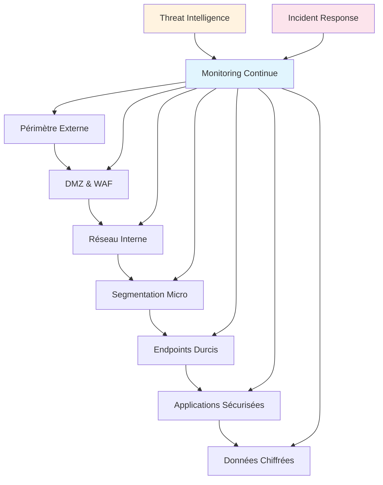
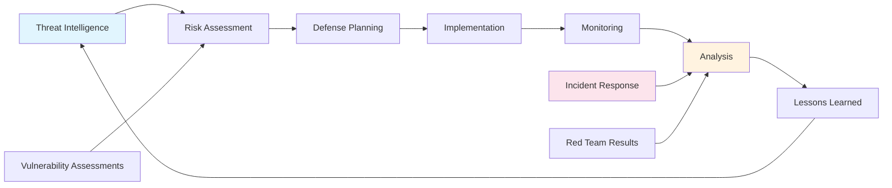

# Penser comme un attaquant : sécurité défensive

<Badge type="warning" text="Sécurité Défensive 2025" />

La sécurité défensive la plus efficace naît d'une compréhension profonde des techniques d'attaque. En adoptant la mentalité d'un attaquant, vous développez une vision stratégique des vulnérabilités et renforcez considérablement vos défenses. Cette approche transforme votre perception de la sécurité d'une simple checklist en une discipline dynamique et proactive.

## Le paradigme de la sécurité offensive-défensive

### Comprendre l'asymétrie défenseur-attaquant

::: info Réalité du paysage sécuritaire
- **L'attaquant** n'a besoin que d'une seule vulnérabilité pour réussir
- **Le défenseur** doit sécuriser l'ensemble de la surface d'attaque
- **Les attaques** évoluent constamment, les défenses doivent s'adapter
- **Le temps** favorise généralement l'attaquant qui peut planifier longuement
:::

Cette asymétrie fondamentale explique pourquoi adopter un mindset offensif est crucial pour une défense efficace. Vous devez anticiper les vecteurs d'attaque avant qu'ils ne soient exploités, identifier les faiblesses avant qu'elles ne deviennent des brèches critiques.

### Les trois piliers de la mentalité offensive

**Vision systémique** : Les attaquants ne voient pas les systèmes comme des entités isolées, mais comme des écosystèmes interconnectés. Chaque composant devient un point d'entrée potentiel vers l'objectif final.

**Persistance créative** : Face aux barrières sécuritaires, les attaquants développent des contournements innovants. Cette créativité destructrice doit inspirer votre créativité défensive.

**Opportunisme stratégique** : Les attaquants exploitent les fenêtres temporelles de vulnérabilité. Comprendre ces moments critiques permet de mieux les protéger.

## Méthodologies d'analyse offensive

### Threat modeling : cartographier l'univers des menaces

La modélisation des menaces constitue la foundation de votre approche défensive. Elle transforme les vulnérabilités abstraites en scénarios concrets et actionnables.

**Méthodologie STRIDE** : Cette approche examine six catégories de menaces - Spoofing, Tampering, Repudiation, Information Disclosure, Denial of Service, Elevation of Privilege. Chaque composant de votre système est analysé sous ces angles pour identifier les vulnérabilités potentielles.

**Analyse par kill chain** : Modélisez les étapes qu'un attaquant suivrait depuis la reconnaissance initiale jusqu'à l'exfiltration des données. Cette vision linéaire révèle les points de défense critiques où interrompre une attaque.

**Perspective PASTA** : Process for Attack Simulation and Threat Analysis. Cette méthode centre l'analyse sur les objectifs business, garantissant que vos efforts sécuritaires protègent ce qui compte vraiment pour l'organisation.

### Reconnaissance et cartographie des actifs

::: warning Surface d'attaque moderne
Les environnements modernes multiplient exponentiellement les points d'entrée :
- **Applications web** avec APIs et microservices
- **Infrastructure cloud** multi-régions et multi-fournisseurs  
- **Appareils IoT** connectés au réseau corporate
- **Endpoints distants** en télétravail permanent
- **Shadow IT** déployé sans validation sécuritaire
:::

Adoptez la perspective d'un attaquant effectuant sa reconnaissance initiale. Utilisez des outils publics pour cartographier votre infrastructure externe, identifiez les informations exposées sur les réseaux sociaux et les dépôts de code, analysez vos certificats SSL et DNS pour révéler l'architecture interne.

Cette exercice révèle souvent un décalage saisissant entre la perception interne de votre sécurité et la réalité vue de l'extérieur. Les attaquants disposent d'informations que vous ne soupçonnez pas être publiques.

### Red team exercises : simulation d'attaques réelles

Les exercices de red team transcendent les audits sécuritaires traditionnels en simulant des adversaires persistants et adaptatifs. Ces simulations testent non seulement vos contrôles techniques, mais aussi vos processus de détection et de réponse.

**Scénarios adversariaux** : Définissez des personas d'attaquants spécifiques - hacktivistes, criminels organisés, menaces persistantes avancées. Chaque profil implique des techniques, motivations et ressources différentes.

**Objectifs business-oriented** : Plutôt que de chercher le maximum de vulnérabilités, focalisez sur l'atteinte d'objectifs business critiques. Cette approche révèle les chemins d'attaque les plus préoccupants pour l'organisation.

**Contraintes temporelles réalistes** : Les vrais attaquants opèrent sous contraintes de temps et de ressources. Simulez ces limitations pour évaluer la résilience de vos défenses face à des adversaires pressés.

## Techniques d'exploitation courantes

### Social engineering : l'art de la manipulation

Le social engineering demeure l'une des techniques les plus efficaces car elle exploite le maillon le plus imprévisible : l'humain. Comprendre ces mécanismes psychologiques renforce vos défenses humaines autant que techniques.

**Ingénierie psychologique** : Les attaquants exploitent des biais cognitifs universels - autorité, réciprocité, urgence, preuve sociale. En reconnaissant ces leviers, vous pouvez sensibiliser vos équipes et concevoir des processus résistants à la manipulation.

**Reconnaissance OSINT** : Les informations publiques (réseaux sociaux, sites corporate, offres d'emploi) fournissent aux attaquants un contexte détaillé pour personnaliser leurs approches. Auditez régulièrement votre empreinte informationnelle publique.

**Techniques de prétexte** : Les attaquants créent des scenarios crédibles justifiant leurs demandes d'information ou d'accès. Développez des protocoles de validation pour les demandes inhabituelles, même apparemment légitimes.

### Exploitation des vulnérabilités techniques

::: tip Cycles de vulnérabilité modernes
1. **Découverte** : Recherche de nouvelles vulnérabilités
2. **Disclosure** : Publication responsable ou sur le dark web
3. **Weaponization** : Développement d'exploits opérationnels
4. **Mass exploitation** : Utilisation à grande échelle
5. **Detection/Response** : Développement de signatures et patches
:::

**Zero-day et n-day** : Distinguez les attaques utilisant des vulnérabilités inconnues (zero-day) de celles exploitant des failles connues mais non patchées (n-day). Les secondes représentent la majorité des incidents réels.

**Chain exploitation** : Les attaquants sophistiqués chaînent des vulnérabilités mineures pour obtenir des impacts majeurs. Analysez vos systèmes sous l'angle de ces combinations potentielles.

**Living off the land** : L'utilisation d'outils légitimes pour des activités malveillantes complique la détection. Surveillez l'usage anormal d'outils standard plutôt que de vous focaliser uniquement sur les malwares exotiques.

### Mouvements latéraux et persistence

Une fois l'accès initial obtenu, les attaquants se déplacent horizontalement dans l'infrastructure pour atteindre leurs objectifs. Cette phase révèle la résilience interne de votre architecture sécuritaire.

**Privilege escalation** : Les attaquants élèvent progressivement leurs privilèges pour contourner les contrôles d'accès. Implémentez une défense en profondeur avec des barrières à chaque niveau de privilege.

**Credential harvesting** : La récupération de credentials valides facilite les mouvements latéraux. Adoptez des architectures zero-trust minimisant l'impact de la compromission de credentials.

**Persistence mechanisms** : Les attaquants établissent des accès permanents résistants aux redémarrages et aux changements d'administration. Auditez régulièrement les mécanismes de persistence potentiels dans vos environnements.

## Architecture défensive inspirée de l'attaque

### Défense en profondeur moderne

### Segmentation inspirée des kill chains

Concevez votre architecture réseau pour interrompre les kill chains d'attaque à chaque étape possible. Chaque segment devient une zone de contrôle où l'activité malveillante peut être détectée et stoppée.

**Micro-segmentation** : Isolez les workloads critiques au niveau applicatif, pas seulement réseau. Cette granularité limite les mouvements latéraux même après une compromission initiale.

**Zero Trust Network Access** : Assumez que votre périmètre est déjà compromis et validez chaque connexion comme si elle venait de l'extérieur. Cette approche reflète la réalité des environnements modernes.

**Isolation dynamique** : Implémentez des capacités d'isolation automatique des ressources suspectes. Les attaquants comptent sur la persistance de l'accès ; privez-les de cette continuité.

### Deception technology : retourner l'attaque

Les technologies de deception créent des leurres attractifs pour les attaquants, générant des alertes précoces et ralentissant leur progression.

**Honeypots stratégiques** : Déployez des systèmes leurres imitant vos actifs critiques. Placez-les dans des emplacements logiques où des attaquants chercheraient naturellement des cibles de valeur.

**Canary tokens** : Distribuez des marqueurs détectables dans vos systèmes - fichiers, credentials, URLs. Leur activation signale une activité malveillante avec une très faible probabilité de faux positifs.

**Breadcrumb trails** : Créez des chemins apparemment intéressants menant vers des environnements monitored. Les attaquants suivant ces pistes révèlent leurs techniques et intentions.

## Detection et réponse proactives

### Behavioral analytics : détecter l'anormal

::: details Indicateurs comportementaux d'attaque

**Patterns de connexion anormaux** :
- Authentifications hors horaires habituels
- Connexions depuis de nouvelles géolocalisations
- Utilisation d'outils administratifs par des utilisateurs standards

**Activité système suspecte** :
- Processus inhabituels avec des privilèges élevés
- Communications réseau vers des destinations inconnues
- Modifications de fichiers système critiques

**Mouvements de données suspects** :
- Transfers volumineux vers l'extérieur
- Accès à des ressources non liées au rôle utilisateur
- Patterns d'accès suggérant une automatisation
:::

### Threat hunting : chasse proactive aux menaces

Le threat hunting inverse la logique défensive traditionnelle : au lieu d'attendre les alertes, vous cherchez activement des signes de compromission basés sur votre compréhension des techniques d'attaque.

**Hypothèse-driven hunting** : Formulez des hypothèses sur la façon dont votre organisation pourrait être attaquée, puis recherchez des preuves de ces activités dans vos logs et systèmes.

**IOC et TTPs** : Dépassez les Indicators of Compromise statiques pour vous concentrer sur les Tactics, Techniques, and Procedures. Les TTPs évoluent plus lentement que les IOCs et offrent une détection plus durable.

**Timeline analysis** : Reconstruisez les séquences d'événements pour identifier des patterns d'attaque subtils étalés sur de longues périodes. Les APTs comptent sur cette patience pour éviter la détection.

### Incident response orientée adversaire

Votre réponse aux incidents doit refléter votre compréhension des motivations et techniques d'attaque. Chaque incident devient une opportunité d'apprentissage pour renforcer vos défenses futures.

**Attribution tactique** : Identifiez les TTPs utilisées pour orienter votre réponse. Différents adversaires nécessitent des approches de containment et d'éradication spécifiques.

**Damage assessment** : Évaluez l'impact en pensant comme l'attaquant - quels étaient leurs objectifs probables et ont-ils pu les atteindre ? Cette perspective guide vos priorités de remediation.

**Lessons learned** : Analysez comment l'attaque a réussi pour identifier les gaps défensifs. Focalisez sur les TTPs qui ont fonctionné plutôt que sur les tools spécifiques utilisés.

## Veille et intelligence des menaces

### Sources et exploitation de la threat intelligence

La threat intelligence transforme les données sur les adversaires en insights actionnables pour votre défense. Adoptez une approche structurée pour collecter, analyser et appliquer cette intelligence.

**Sources diversifiées** : Combinez threat intelligence commerciale, gouvernementale, communautaire et interne. Chaque source apporte une perspective unique sur le paysage des menaces.

**Contextualisation** : Adaptez les informations génériques aux spécificités de votre organisation. Une menace théoriquement sérieuse peut être non-pertinente pour votre environnement particulier.

**Actionabilité** : Privilégiez l'intelligence directement utilisable pour améliorer vos détections, orienter votre threat hunting ou informer vos décisions d'architecture.

### Adversary profiling : connaître ses ennemis

::: warning Profils d'adversaires contemporains

**Script kiddies** :
- Motivations : Reconnaissance, défi personnel
- Techniques : Outils automatisés, attaques opportunistes
- Défenses : Hardening basique, monitoring des vulnérabilités connues

**Cybercriminels** :
- Motivations : Profit financier, rapidité d'exécution
- Techniques : Ransomware, fraude, cryptomining
- Défenses : Protection des données critiques, segmentation

**Hacktivistes** :
- Motivations : Message politique, notoriété
- Techniques : Defacement, DDoS, leaks d'information
- Défenses : Protection de l'image, communication de crise

**APTs/Nation-states** :
- Motivations : Espionnage, sabotage, influence géopolitique
- Techniques : Persistence long-terme, techniques sophistiquées
- Défenses : Monitoring avancé, threat hunting, isolation critique
:::

### Intelligence économique et sectorielle

Comprenez les menaces spécifiques à votre secteur d'activité. Les attaquants ciblent souvent des industries entières avec des techniques spécialisées et des motivations sectorielles.

**Threat landscape sectoriel** : Identifiez les techniques d'attaque favorisées contre votre industrie. Les patterns d'attaque varient significativement entre la santé, la finance, l'énergie ou la technologie.

**Supply chain risks** : Analysez les risques provenant de votre écosystème de partenaires et fournisseurs. Les attaquants exploitent les relations de confiance pour accéder aux cibles principales.

**Regulatory landscape** : Intégrez les exigences réglementaires dans votre stratégie sécuritaire. Les attaquants exploitent les gaps entre conformité et sécurité effective.

## Formation et culture sécuritaire

### Développer l'instinct sécuritaire

La sécurité effective nécessite que chaque membre de l'organisation développe une sensibilité aux menaces. Cette culture ne s'impose pas par des politiques mais se cultive par l'éducation et l'expérience.

**Security champions** : Identifiez et formez des ambassadeurs sécuritaires dans chaque équipe. Ces champions deviennent des multiplicateurs de bonnes pratiques et des points de contact pour les questions sécuritaires.

**Scenario-based training** : Utilisez des scenarios réalistes basés sur des attaques documentées contre votre secteur. Cette approche concrète rend la formation plus mémorable et applicable.

**Red team social** : Organisez des exercices de social engineering contrôlés pour sensibiliser aux techniques de manipulation. L'expérience directe marque plus durablement que les présentations théoriques.

### Metrics et amélioration continue

::: tip Métriques sécuritaires orientées adversaire

**Temps de détection** : Durée moyenne entre l'intrusion et la détection
**Temps de containment** : Délai pour isoler un incident après détection  
**Coverage des TTPs** : Pourcentage des techniques MITRE ATT&CK détectables
**False positive rate** : Proportion d'alertes non malveillantes
**Mean time to remediation** : Temps moyen de résolution complète
:::

Mesurez votre efficacité sécuritaire avec des métriques reflétant la perspective d'un attaquant. Ces indicateurs orientent vos investissements vers les améliorations les plus impactantes.

**Continuous improvement** : Établissez un cycle d'amélioration basé sur l'analyse des incidents, les résultats d'exercices red team et l'évolution du threat landscape.

**Benchmarking sectoriel** : Comparez vos performances aux standards de votre industrie pour identifier les gaps et les bonnes pratiques à adopter.

## Évolution et adaptation

### Anticipation des menaces émergentes

Le paysage sécuritaire évolue constamment avec l'émergence de nouvelles technologies, techniques d'attaque et motivations adversaires. Votre stratégie défensive doit intégrer cette dynamique d'évolution.

**Emerging technologies** : Chaque innovation technologique (IA, IoT, blockchain, quantum computing) introduit de nouveaux vecteurs d'attaque. Anticipez ces vulnérabilités avant qu'elles ne soient exploitées massivement.

**Geopolitical context** : Les tensions géopolitiques influencent les motivations et cibles des cyberattaques. Adaptez votre posture défensive au contexte international évolutif.

**Attack technique evolution** : Les techniques d'attaque s'sophistiquent continuellement. Maintenez une veille active sur l'évolution des TTPs pour adapter vos détections et défenses.

### Adaptive defense architecture

## Conclusion

Adopter la mentalité d'un attaquant transforme radicalement votre approche de la sécurité défensive. Cette perspective révèle les vulnérabilités invisibles depuis l'intérieur et oriente vos efforts vers les défenses les plus critiques.

::: tip Points clés à retenir
- **Asymétrie fondamentale** : Comprenez l'avantage naturel de l'attaquant
- **Vision systémique** : Analysez vos défenses comme un écosystème interconnecté  
- **Proactivité** : Chassez les menaces au lieu de simplement réagir aux alertes
- **Amélioration continue** : Évoluez constamment face aux techniques d'attaque
:::

Cette approche offensive-défensive ne vise pas la paranoïa mais la lucidité. En comprendre comment vous pourriez être attaqué, vous développez des défenses proportionnées et efficaces. L'objectif n'est pas l'invulnérabilité - impossible à atteindre - mais la résilience face aux adversaires réels de votre organisation.

La sécurité devient alors un dialogue permanent entre votre créativité défensive et l'ingéniosité des attaquants. Cette dynamique, bien maîtrisée, constitue votre meilleure protection contre les menaces d'aujourd'hui et de demain.

## Ressources et documentation

### Frameworks et méthodologies

- [MITRE ATT&CK](https://attack.mitre.org) - Framework de techniques d'attaque pour la threat intelligence
- [NIST Cybersecurity Framework](https://www.nist.gov/cyberframework) - Cadre de référence pour la cybersécurité
- [OWASP Top 10](https://owasp.org/www-project-top-ten/) - Vulnérabilités applicatives les plus critiques
- [STRIDE Threat Modeling](https://docs.microsoft.com/en-us/azure/security/develop/threat-modeling-tool-threats) - Méthodologie de modélisation des menaces

### Outils de Red Team et Pentesting

- [Metasploit](https://www.metasploit.com) - Framework de tests de pénétration
- [Burp Suite](https://portswigger.net/burp) - Plateforme de tests de sécurité web
- [Kali Linux](https://www.kali.org) - Distribution Linux pour la sécurité offensive
- [Cobalt Strike](https://www.cobaltstrike.com) - Plateforme de simulation d'adversaires
- [BloodHound](https://github.com/BloodHoundAD/BloodHound) - Analyse des chemins d'attaque Active Directory

### Threat Intelligence et OSINT

- [CIRCL](https://www.circl.lu) - Centre de recherche en cybersécurité du Luxembourg
- [MISP](https://www.misp-project.org) - Plateforme de partage de threat intelligence
- [VirusTotal](https://www.virustotal.com) - Service d'analyse de malwares
- [Shodan](https://www.shodan.io) - Moteur de recherche pour dispositifs connectés
- [AlienVault OTX](https://otx.alienvault.com) - Communauté de threat intelligence

### Formation et certification

- [Offensive Security](https://www.offensive-security.com) - Certifications OSCP, OSEP, OSCE
- [SANS Institute](https://www.sans.org) - Formation en sécurité informatique
- [eLearnSecurity](https://elearnsecurity.com) - Certifications pratiques en pentesting
- [CyberSeek](https://www.cyberseek.org) - Ressources de carrière en cybersécurité

### Livres de référence

- [The Web Application Hacker's Handbook](https://portswigger.net/web-security/web-application-hackers-handbook) - Bible de la sécurité web
- [Red Team Development and Operations](https://redteam.guide) - Guide des opérations red team
- [The Art of Deception](https://www.wiley.com/en-us/The+Art+of+Deception%3A+Controlling+the+Human+Element+of+Security-p-9780471237129) - Social engineering par Kevin Mitnick
- [Threat Modeling: Designing for Security](https://www.wiley.com/en-us/Threat+Modeling%3A+Designing+for+Security-p-9781118809990) - Adam Shostack

### Communautés et veille

- [Reddit r/netsec](https://reddit.com/r/netsec) - Actualités et discussions sécurité
- [DEFCON](https://defcon.org) - Conférence de référence en sécurité
- [Black Hat](https://www.blackhat.com) - Conférences techniques de sécurité
- [BSides](https://www.securitybsides.com) - Événements communautaires de sécurité
- [KrebsOnSecurity](https://krebsonsecurity.com) - Blog de Brian Krebs sur la cybercriminalité

### Plateformes d'entraînement

- [Hack The Box](https://www.hackthebox.eu) - Laboratoires de pentesting en ligne
- [TryHackMe](https://tryhackme.com) - Apprentissage interactif de la cybersécurité
- [VulnHub](https://www.vulnhub.com) - Machines virtuelles vulnérables
- [OverTheWire](https://overthewire.org/wargames/) - Challenges de sécurité par niveaux
- [picoCTF](https://picoctf.org) - Compétition de capture the flag éducative

### Réglementation et conformité

- [RGPD](https://www.cnil.fr/fr/reglement-europeen-protection-donnees) - Réglementation européenne sur la protection des données
- [NIS2](https://www.enisa.europa.eu/topics/cybersecurity-policy/nis-directive-new) - Directive européenne sur la sécurité des réseaux
- [ISO 27001](https://www.iso.org/isoiec-27001-information-security.html) - Standard international de management de la sécurité
- [SOC 2](https://www.aicpa.org/resources/landing/system-and-organization-controls-soc-suite-of-services) - Framework d'audit de sécurité
