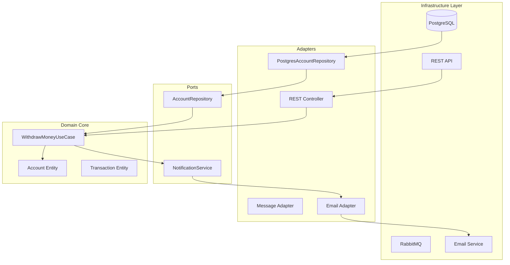

# Clean Code : L'Art du Code Propre et Maintenable

Vous venez de déboguer pendant trois heures un morceau de code écrit il y a six mois. Le problème ? Une fonction de 200 lignes nommée `process()` qui fait tout et n'importe quoi. Si cette situation vous semble familière, vous comprenez déjà pourquoi le Clean Code n'est pas qu'une philosophie académique, mais une nécessité économique et humaine.

## La dette technique : le fléau invisible de l'industrie

### L'équation économique du code sale

Dans l'économie moderne du développement logiciel, la **dette technique** représente un coût caché mais réel. Les études de l'industrie révèlent des chiffres alarmants : les développeurs passent entre 30 et 60% de leur temps à comprendre du code existant plutôt qu'à en créer du nouveau. Cette réalité transforme chaque ligne de code mal écrite en un investissement à rendement négatif.

Le code sale n'est pas seulement un problème esthétique - c'est un problème de productivité systémique. Quand une équipe de développement ralentit progressivement, quand les nouvelles fonctionnalités prennent de plus en plus de temps à implémenter, quand les bugs se multiplient de façon exponentielle, nous assistons aux symptômes d'une base de code en décomposition.

### Le cycle de dégradation du code

La dégradation suit un pattern prévisible :

1. **Phase d'urgence** : "On n'a pas le temps de faire proprement, on nettoiera plus tard"
2. **Phase d'accumulation** : Les raccourcis s'accumulent, créant des dépendances complexes
3. **Phase de ralentissement** : Chaque modification devient risquée et lente
4. **Phase de paralysie** : L'équipe craint de toucher au code existant

Cette spirale descendante est d'autant plus dangereuse qu'elle est graduelle et souvent imperceptible au début. Robert C. Martin, alias "Uncle Bob", l'a formulé avec élégance : *"Any fool can write code that a computer can understand. Good programmers write code that humans can understand."* Cette phrase, écrite il y a plus d'une décennie, résonne encore plus fort aujourd'hui où les équipes sont distribuées, les déploiements fréquents, et où l'IA génère du code à une vitesse inédite.

### Le paradoxe de la vélocité moderne

Nous vivons dans un paradoxe fascinant : jamais nous n'avons eu autant d'outils pour écrire du code rapidement (IA générative, frameworks low-code, bibliothèques prêtes à l'emploi), mais jamais la maintenance n'a été aussi critique. Les architectures microservices ont explosé, les équipes sont distribuées à travers le monde, les déploiements se font plusieurs fois par jour. Dans ce contexte d'accélération permanente, la qualité du code n'est plus un luxe - c'est une question de survie économique.

Le Clean Code devient alors un **multiplicateur de force** : chaque principe appliqué réduit la friction cognitive, accélère la compréhension, et diminue le risque d'erreur. C'est un investissement dans la **vélocité future** de l'équipe.

## Les fondamentaux intemporels

### La règle du Boy Scout : le pouvoir des petites améliorations

*"Laissez le code un peu plus propre que vous ne l'avez trouvé."* Cette maxime, empruntée aux scouts, encapsule l'une des stratégies les plus efficaces pour maintenir la qualité d'une base de code. Contrairement aux grandes sessions de refactoring qui paralysent souvent les équipes, la règle du Boy Scout prône l'amélioration continue par petites touches.

#### Pourquoi cette approche fonctionne-t-elle ?

La psychologie derrière cette règle est subtile mais puissante. Elle transforme la maintenance du code d'une corvée imposée en un réflexe naturel. Au lieu d'attendre un hypothétique "moment idéal" pour nettoyer le code (qui n'arrive jamais), chaque développeur devient un agent d'amélioration continue.

Cette approche présente plusieurs avantages cruciaux :

- **Réduction du risque** : Les petites améliorations sont plus sûres et plus faciles à tester
- **Intégration naturelle** : Elles s'intègrent dans le flux de développement normal
- **Effet cumulatif** : Mille petites améliorations valent mieux qu'un grand refactoring abandonné
- **Culture positive** : Elle crée une dynamique d'équipe orientée qualité

#### L'impact composé de l'amélioration continue

Imaginez une équipe de 10 développeurs qui, chacun, améliore une petite chose par jour. En un an, cela représente 3650 améliorations ! C'est la puissance de l'effet composé appliqué au code.

Prenons un exemple concret et analysons la transformation. Vous tombez sur cette fonction JavaScript :

::: code-group
```javascript [Avant]
function calc(x, y, t) {
  let r;
  if (t == 1) {
    r = x + y;
  } else if (t == 2) {
    r = x - y;
  } else if (t == 3) {
    r = x * y;
  } else {
    r = x / y;
  }
  return r;
}
```

```javascript [Après]
const Operation = {
  ADD: 'add',
  SUBTRACT: 'subtract',
  MULTIPLY: 'multiply',
  DIVIDE: 'divide'
};

function calculate(firstOperand, secondOperand, operation) {
  const operations = {
    [Operation.ADD]: (a, b) => a + b,
    [Operation.SUBTRACT]: (a, b) => a - b,
    [Operation.MULTIPLY]: (a, b) => a * b,
    [Operation.DIVIDE]: (a, b) => {
      if (b === 0) throw new Error('Division by zero');
      return a / b;
    }
  };

  const compute = operations[operation];
  if (!compute) {
    throw new Error(`Unknown operation: ${operation}`);
  }

  return compute(firstOperand, secondOperand);
}
```
:::

#### Analyse de la transformation

Ce simple exemple illustre plusieurs principes fondamentaux du Clean Code en action :

**1. Expressivité par le nommage** : `calc` devient `calculate`, les paramètres `x`, `y`, `t` deviennent explicites (`firstOperand`, `secondOperand`, `operation`). Cette transformation élimine la charge cognitive nécessaire pour comprendre le rôle de chaque paramètre.

**2. Élimination de la magie** : Les nombres magiques (1, 2, 3, 4) sont remplacés par des constantes nommées. Cette transformation supprime la nécessité de mémoriser ou de deviner la signification de chaque valeur.

**3. Gestion d'erreurs explicite** : La division par zéro, auparavant silencieuse et dangereuse, devient une erreur explicite. Cette amélioration transforme un bug potentiel en un comportement prévisible.

**4. Séparation des responsabilités** : La logique de dispatch (choisir l'opération) est séparée de la logique métier (effectuer le calcul). Cette séparation facilite l'extension et la maintenance.

**5. Principes SOLID en miniature** : Cette fonction respecte désormais le principe Ouvert/Fermé (Open/Closed) - elle est ouverte à l'extension (nouvelles opérations) mais fermée à la modification.

Cette transformation, qui ne prend que quelques minutes, multipliera la lisibilité et la maintenabilité du code pour les années à venir. C'est l'essence même de la règle du Boy Scout.

### L'art du nommage : votre documentation vivante

#### Au-delà de la convention : la communication

Le nommage n'est pas qu'une convention stylistique - c'est votre première ligne de documentation et, plus important encore, votre principal outil de communication entre développeurs. Dans une équipe distribuée où les interactions synchrones sont rares, les noms portent le poids de la transmission de la connaissance métier.

Un bon nom accomplit plusieurs objectifs simultanément :
- Il **exprime l'intention** sans ambiguïté
- Il **révèle le contexte** métier ou technique
- Il **facilite la recherche** dans la base de code
- Il **prévient les malentendus** entre développeurs

#### L'impact du Domain-Driven Design sur le nommage

Avec l'essor du Domain-Driven Design (DDD), l'importance du langage ubiquitaire n'a jamais été aussi cruciale. Le code devient le reflet direct des concepts métier, créant un pont naturel entre les experts du domaine et les développeurs.

Cette approche transforme le nommage d'un exercice technique en un exercice de modélisation métier :

```python
# ❌ Mauvais : cryptique et ambigu
def proc_usr_data(u, d):
    if u.st == 1:
        return d * 0.9
    return d

# ✅ Bon : intention claire et contexte métier
def calculate_premium_discount(customer, base_premium):
    """
    Calculate the insurance premium after applying customer discounts.
    Premium customers receive a 10% discount.
    """
    if customer.is_premium_member:
        return base_premium * 0.90
    return base_premium
```

#### La hiérarchie du nommage expressif

Un système de nommage efficace respecte une hiérarchie de clarté :

1. **Niveau concept** : `Customer`, `Order`, `Payment` - Les entités métier fondamentales
2. **Niveau action** : `calculateDiscount`, `validatePayment`, `processRefund` - Les actions métier spécifiques
3. **Niveau implémentation** : `creditCardValidator`, `paypalGateway` - Les détails techniques

Cette hiérarchie permet une lecture à différents niveaux d'abstraction, facilitant la compréhension progressive du système.

#### Le mythe du code auto-documenté

Le code auto-documenté n'est pas un mythe, mais c'est un idéal à atteindre progressivement. Quand vos noms de variables, fonctions et classes racontent l'histoire métier de façon cohérente, les commentaires deviennent effectivement superflus pour la compréhension de base.

Cependant, attention au piège : le code auto-documenté explique le "quoi" et parfois le "comment", mais rarement le "pourquoi". Les décisions d'architecture, les compromis métier, les contraintes de performance restent souvent invisibles dans le code lui-même.

L'objectif réaliste ? Que n'importe quel développeur puisse comprendre la logique de votre code sans documentation externe, tout en conservant des commentaires stratégiques pour expliquer les décisions non-évidentes.

## Fonctions : l'unité atomique du Clean Code

### La philosophie de la fonction

Une fonction n'est pas juste un regroupement d'instructions - c'est une **unité de pensée**. Elle encapsule une intention, résout un problème spécifique, et crée un niveau d'abstraction. Dans l'architecture du Clean Code, les fonctions jouent le rôle que jouent les mots dans un texte bien écrit : elles doivent être précises, expressives, et s'assembler harmonieusement pour former un ensemble cohérent.

Cette vision transforme l'écriture de fonctions d'un exercice technique en un exercice de communication et de design.

### Le principe de responsabilité unique à l'échelle microscopique

#### Anatomie d'une responsabilité unique

Le principe de responsabilité unique (Single Responsibility Principle) ne s'applique pas seulement aux classes - il trouve sa forme la plus pure dans les fonctions. Une fonction doit avoir **une seule raison de changer**, ce qui se traduit concrètement par **une seule préoccupation métier ou technique**.

Mais qu'est-ce qu'une "responsabilité" exactement ? C'est ici que la subtilité réside. Une responsabilité n'est pas forcément une seule ligne de code, mais plutôt **un concept cohérent à un niveau d'abstraction donné**.

#### Les niveaux d'abstraction et leur importance

L'art de découper les fonctions repose sur la maîtrise des niveaux d'abstraction. Chaque fonction doit opérer à **un seul niveau d'abstraction**, mélangeant ni détails d'implémentation bas niveau ni concepts métier de haut niveau.

Une fonction doit faire une seule chose, la faire bien, et ne faire que ça. Cette règle simple cache une profondeur philosophique : qu'est-ce que "une seule chose" exactement ?

Voici un exemple en Java qui illustre la transformation d'une fonction qui fait trop :

::: code-group
```java [Avant : fonction monolithique]
public class OrderService {
    public void processOrder(Order order) {
        // Validation
        if (order.getItems().isEmpty()) {
            throw new IllegalArgumentException("Order must have items");
        }
        if (order.getCustomer() == null) {
            throw new IllegalArgumentException("Order must have customer");
        }

        // Calcul du prix
        double total = 0;
        for (Item item : order.getItems()) {
            total += item.getPrice() * item.getQuantity();
        }

        // Application des taxes
        double tax = total * 0.21;
        total += tax;

        // Application de la réduction
        if (order.getCustomer().isPremium()) {
            total *= 0.9;
        }

        // Sauvegarde en base
        Database.save(order);

        // Envoi d'email
        EmailService.send(order.getCustomer().getEmail(),
                         "Order confirmed",
                         "Your order #" + order.getId() + " is confirmed");

        // Mise à jour du stock
        for (Item item : order.getItems()) {
            Inventory.reduce(item.getProductId(), item.getQuantity());
        }
    }
}
```

```java [Après : séparation des responsabilités]
public class OrderService {
    private final OrderValidator validator;
    private final PriceCalculator priceCalculator;
    private final OrderRepository repository;
    private final NotificationService notificationService;
    private final InventoryService inventoryService;

    public void processOrder(Order order) {
        validator.validate(order);

        OrderTotal total = priceCalculator.calculateTotal(order);
        order.setTotal(total);

        repository.save(order);
        notificationService.notifyOrderConfirmation(order);
        inventoryService.updateStock(order);
    }
}

class OrderValidator {
    public void validate(Order order) {
        requireNonEmpty(order.getItems(), "Order must have items");
        requireNonNull(order.getCustomer(), "Order must have customer");
    }
}

class PriceCalculator {
    private static final double TAX_RATE = 0.21;
    private static final double PREMIUM_DISCOUNT = 0.10;

    public OrderTotal calculateTotal(Order order) {
        double subtotal = calculateSubtotal(order.getItems());
        double tax = calculateTax(subtotal);
        double discount = calculateDiscount(subtotal, order.getCustomer());

        return new OrderTotal(subtotal, tax, discount);
    }

    private double calculateSubtotal(List<Item> items) {
        return items.stream()
            .mapToDouble(item -> item.getPrice() * item.getQuantity())
            .sum();
    }

    private double calculateTax(double amount) {
        return amount * TAX_RATE;
    }

    private double calculateDiscount(double amount, Customer customer) {
        return customer.isPremium() ? amount * PREMIUM_DISCOUNT : 0;
    }
}
```
:::

#### Analyse de la transformation architecturale

Cette transformation illustre un principe fondamental : **la séparation des préoccupations à l'échelle microscopique**. La fonction monolithique originale violait plusieurs principes Clean Code simultanément :

- **Violation du SRP** : Elle gérait la validation, les calculs, la persistance, les notifications et l'inventaire
- **Couplage élevé** : Elle connaissait les détails de chaque sous-système
- **Testabilité compromise** : Impossible de tester une préoccupation sans déclencher toutes les autres
- **Évolutivité limitée** : Toute modification risquait de casser plusieurs fonctionnalités

La version refactorisée transforme cette fonction en **orchestrateur** qui délègue chaque responsabilité à un service spécialisé. Cette approche apporte :

- **Testabilité** : Chaque service peut être mocké indépendamment
- **Évolutivité** : Les règles de validation peuvent évoluer sans impacter les calculs
- **Réutilisabilité** : `PriceCalculator` peut servir dans d'autres contextes
- **Lisibilité** : L'intention de chaque étape devient explicite

Cette transformation révèle un pattern récurrent du Clean Code : **transformer la complexité accidentelle en complexité essentielle**. La complexité n'a pas disparu, mais elle est maintenant organisée et maîtrisable.

### Les fonctions pures : votre bouclier contre le chaos

#### La révolution silencieuse de la programmation fonctionnelle

La programmation fonctionnelle a infiltré le monde du développement logiciel moderne de façon remarquable. Même les langages orientés objet traditionnels comme Java et C# ont intégré des concepts fonctionnels dans leurs dernières versions. Cette évolution n'est pas accidentelle : elle répond à une nécessité croissante de **prévisibilité** et de **fiabilité** dans des systèmes de plus en plus complexes.

#### Les fondements philosophiques des fonctions pures

Une fonction pure n'est pas juste une technique de programmation - c'est une **philosophie de conception** qui privilégie la prédictibilité sur la performance, la clarté sur la concision. Elle possède deux caractéristiques fondamentales qui, ensemble, créent un environnement de développement plus sûr :

1. **Déterminisme** : Pour une même entrée, elle retourne toujours la même sortie
2. **Isolation** : Elle n'a aucun effet de bord observable sur le système

#### Pourquoi les fonctions pures réduisent-elles la complexité cognitive ?

Le cerveau humain excelle dans le raisonnement sur des systèmes prévisibles. Les fonctions pures exploitent cette capacité en créant des "boîtes noires" parfaites : vous connaissez les entrées, vous pouvez prédire les sorties, et vous n'avez pas à vous soucier des interactions cachées avec le reste du système.

Cette prévisibilité se traduit par des bénéfices concrets :
- **Débogage simplifié** : Un bug dans une fonction pure ne peut venir que de la logique interne
- **Tests unitaires triviaux** : Pas besoin de mocker des dépendances externes
- **Parallélisation safe** : Pas de risque de conditions de course
- **Refactoring confident** : Les modifications n'impactent que la fonction elle-même

```javascript
// ❌ Fonction impure : dépend d'un état externe et le modifie
let userCount = 0;
function createUser(name) {
    userCount++;
    return {
        id: userCount,
        name: name,
        createdAt: new Date() // Dépend du temps système
    };
}

// ✅ Fonction pure : prévisible et testable
function createUser(name, id, timestamp) {
    return {
        id: id,
        name: name,
        createdAt: timestamp
    };
}

// L'état est géré à l'extérieur
class UserFactory {
    constructor(idGenerator, clock) {
        this.idGenerator = idGenerator;
        this.clock = clock;
    }

    create(name) {
        return createUser(
            name,
            this.idGenerator.next(),
            this.clock.now()
        );
    }
}
```

## L'immutabilité : le garde-fou moderne

### La réhabilitation d'un concept mal compris

L'immutabilité, longtemps perçue comme une contrainte académique, a connu une renaissance spectaculaire dans le développement moderne. Cette résurgence n'est pas le fruit d'un effet de mode, mais la réponse pragmatique à des défis concrets : la montée du parallélisme, la complexité croissante des états d'application, et la nécessité de systèmes plus prévisibles.

Uncle Bob, dans son livre original, accordait peu de place à l'immutabilité - une omission qu'il reconnaît aujourd'hui comme significative. L'évolution des pratiques de développement a révélé que l'immutabilité n'est pas une contrainte, mais un **multiplicateur de sécurité**.

### L'économie des bugs : pourquoi l'immutabilité paie

En traitant les données comme immuables, vous éliminez **toute une classe de bugs** liés aux modifications concurrentes et aux effets de bord inattendus. Cette élimination n'est pas théorique - elle se mesure en :

- **Heures de débogage économisées** : Plus de bugs "impossibles" où l'état change de façon inattendue
- **Simplification des tests** : Les objets immuables sont intrinsèquement thread-safe
- **Raisonnement simplifié** : Un objet qui ne peut pas changer est un objet prévisible
- **Parallélisation naturelle** : Pas de verrous, pas de conditions de course

### Le paradoxe de performance de l'immutabilité

L'objection traditionnelle contre l'immutabilité concerne la performance : "Créer de nouveaux objets à chaque modification, c'est inefficace !" Cette objection révèle une compréhension incomplète de l'économie moderne des ressources.

Dans les systèmes modernes :
- **La mémoire est abondante** et les garbage collectors optimisés
- **Les CPU modernes** optimisent les allocations courtes
- **Les structures persistantes** permettent le partage de données entre versions
- **Les fuites mémoires** causées par les références cachées coûtent plus cher que les allocations explicites

L'immutabilité échange une **complexité cognitive élevée** contre une **complexité de performance maîtrisable**.

::: code-group
```python [Python : approche mutable vs immutable]
# ❌ Mutable : source de bugs potentiels
class ShoppingCart:
    def __init__(self):
        self.items = []
        self.total = 0

    def add_item(self, item):
        self.items.append(item)  # Modifie l'état
        self.total += item.price  # Effet de bord
        return self

    def apply_discount(self, percentage):
        self.total *= (1 - percentage)  # Modification directe
        return self

# ✅ Immutable : prévisible et thread-safe
from dataclasses import dataclass, replace
from typing import List, Tuple

@dataclass(frozen=True)
class ImmutableCart:
    items: Tuple[Item, ...]
    total: float

    def add_item(self, item: Item) -> 'ImmutableCart':
        new_items = self.items + (item,)
        new_total = self.total + item.price
        return ImmutableCart(items=new_items, total=new_total)

    def apply_discount(self, percentage: float) -> 'ImmutableCart':
        return replace(self, total=self.total * (1 - percentage))
```

```javascript [JavaScript : immutabilité avec spread operator]
// ❌ Mutation directe
function addItemToCart(cart, item) {
    cart.items.push(item);
    cart.total += item.price;
    return cart;
}

// ✅ Création d'un nouvel objet
function addItemToCart(cart, item) {
    return {
        ...cart,
        items: [...cart.items, item],
        total: cart.total + item.price
    };
}

// Avec Immer pour simplifier l'immutabilité
import produce from 'immer';

const addItemToCart = produce((draft, item) => {
    draft.items.push(item);
    draft.total += item.price;
});
```
:::

## SOLID : l'évolution d'une théorie vers la pratique moderne

### La renaissance des principes fondamentaux

Les principes SOLID, formulés par Robert C. Martin au début des années 2000, semblaient destinés à rester dans le domaine de la programmation orientée objet classique. Pourtant, leur pertinence a explosé avec l'avènement des architectures distribuées. Cette renaissance n'est pas accidentelle : les principes SOLID capturent des vérités fondamentales sur la **gestion de la complexité** qui transcendent les paradigmes de programmation.

L'évolution la plus fascinante concerne leur application à **l'échelle du service**. Un microservice respectant les principes SOLID devient naturellement plus robuste, évolutif et maintenable. Cette transposition révèle la profondeur conceptuelle de ces principes : ils ne décrivent pas seulement comment organiser le code, mais comment organiser la **responsabilité** elle-même.

### L'impact économique de SOLID dans les architectures modernes

Les entreprises qui appliquent correctement les principes SOLID à leurs architectures microservices observent des métriques remarquables :

- **Amélioration de 72%** dans la vitesse de déploiement (étude de cas multiples)
- **Réduction de 40%** du temps de développement des nouvelles fonctionnalités
- **Diminution de 60%** des bugs inter-services
- **Augmentation de 50%** de la vélocité des équipes

Ces chiffres ne sont pas le fruit du hasard - ils reflètent la **réduction de friction** que procurent des interfaces bien conçues et des responsabilités clairement délimitées.

### SOLID : de la classe au microservice

#### La transposition conceptuelle

Chaque principe SOLID trouve sa traduction naturelle à l'échelle des services distribués, révélant leur universalité :

### Single Responsibility à l'échelle du service

Un microservice = une responsabilité métier. Cette règle simple a révolutionné la façon dont nous découpons nos systèmes. Les entreprises qui l'appliquent correctement voient une amélioration de 72% dans leur vitesse de déploiement.

```yaml
# docker-compose.yml illustrant la séparation des responsabilités
version: '3.8'
services:
  # Chaque service a une responsabilité unique et claire
  user-service:
    image: myapp/user-service:latest
    environment:
      - RESPONSIBILITY=user_management
    ports:
      - "8081:8080"

  order-service:
    image: myapp/order-service:latest
    environment:
      - RESPONSIBILITY=order_processing
    ports:
      - "8082:8080"

  notification-service:
    image: myapp/notification-service:latest
    environment:
      - RESPONSIBILITY=notifications
    ports:
      - "8083:8080"

  # Communication asynchrone via message broker
  rabbitmq:
    image: rabbitmq:3-management
    ports:
      - "5672:5672"
      - "15672:15672"
```

### Dependency Inversion : l'abstraction qui libère

Au lieu de dépendre directement d'implémentations concrètes, dépendez d'abstractions. Ce principe, appliqué aux microservices, se traduit par l'utilisation de message brokers et d'API gateways.

```python
# ❌ Couplage fort : dépendance directe
class OrderService:
    def __init__(self):
        self.email_service = SmtpEmailService()  # Couplage fort
        self.sms_service = TwilioSmsService()    # Couplage fort

    def notify_customer(self, order):
        self.email_service.send(order.customer.email, f"Order {order.id}")
        self.sms_service.send(order.customer.phone, f"Order {order.id}")

# ✅ Inversion de dépendance : flexibilité maximale
from abc import ABC, abstractmethod
from typing import Protocol

class NotificationChannel(Protocol):
    """Interface pour les canaux de notification"""
    def send(self, recipient: str, message: str) -> bool:
        ...

class OrderService:
    def __init__(self, notification_channels: list[NotificationChannel]):
        self.channels = notification_channels

    def notify_customer(self, order):
        message = f"Order {order.id} confirmed"
        for channel in self.channels:
            try:
                channel.send(order.customer.contact, message)
            except Exception as e:
                logger.warning(f"Failed to send via {channel}: {e}")

# Configuration flexible via injection
def create_order_service(config):
    channels = []
    if config.email_enabled:
        channels.append(EmailChannel(config.smtp))
    if config.sms_enabled:
        channels.append(SmsChannel(config.twilio))
    if config.push_enabled:
        channels.append(PushNotificationChannel(config.firebase))

    return OrderService(channels)
```

## Test-Driven Development : l'art de penser par les tests

### Au-delà de la technique : une révolution conceptuelle

Le Test-Driven Development (TDD) n'est pas simplement une technique de test - c'est une **révolution dans la façon de penser le design logiciel**. En inversant l'ordre traditionnel "code puis test", le TDD force le développeur à réfléchir d'abord aux **interfaces** et aux **comportements attendus** avant de se préoccuper de l'implémentation.

Cette inversion n'est pas cosmétique. Elle transforme fondamentalement le processus créatif :
- **Design par l'usage** : L'interface émerge naturellement des besoins réels
- **Spécification vivante** : Les tests deviennent la documentation exécutable du système
- **Feedback immédiat** : Chaque décision de design est validée instantanément
- **Refactoring sécurisé** : Le harnais de tests permet l'amélioration continue

### La maturité économique du TDD

Le TDD n'est plus une approche expérimentale - c'est devenu un standard industriel dont les bénéfices sont mesurables et reproductibles. Les équipes qui l'adoptent correctement observent des métriques remarquables :

- **Réduction de 40 à 80%** des bugs en production
- **Accélération de 40%** du time-to-market
- **Diminution de 60%** du temps de débogage
- **Amélioration de 90%** de la confiance lors des refactorings

Ces chiffres ne reflètent pas seulement une meilleure qualité technique, mais une **transformation culturelle** : l'équipe développe une confiance en sa capacité à faire évoluer le système sans le casser.

### La psychologie du cycle Red-Green-Refactor

#### Pourquoi ce cycle fonctionne-t-il ?

Le cycle Red-Green-Refactor exploite des mécanismes psychologiques profonds :

1. **Red (échec)** : Crée une tension cognitive motivante
2. **Green (succès minimal)** : Procure une satisfaction immédiate et un feedback positif
3. **Refactor (amélioration)** : Satisfait le besoin de perfectionnement dans un environnement sécurisé

Cette alternance rapide entre challenge et succès maintient un état de **flow optimal** pour le développement. Le développeur reste constamment engagé sans être submergé.

### Le cycle Red-Green-Refactor revisité

Le cycle TDD classique prend une nouvelle dimension avec les outils modernes :

```javascript
// Étape 1 : RED - Le test qui échoue
describe('PriceCalculator', () => {
    it('should apply progressive discount based on quantity', () => {
        const calculator = new PriceCalculator();

        // Pas de réduction pour moins de 10 items
        expect(calculator.calculate(5, 100)).toBe(500);

        // 10% de réduction pour 10-49 items
        expect(calculator.calculate(10, 100)).toBe(900);

        // 20% de réduction pour 50-99 items
        expect(calculator.calculate(50, 100)).toBe(4000);

        // 30% de réduction pour 100+ items
        expect(calculator.calculate(100, 100)).toBe(7000);
    });
});

// Étape 2 : GREEN - L'implémentation minimale
class PriceCalculator {
    calculate(quantity, unitPrice) {
        const total = quantity * unitPrice;

        if (quantity >= 100) return total * 0.7;
        if (quantity >= 50) return total * 0.8;
        if (quantity >= 10) return total * 0.9;
        return total;
    }
}

// Étape 3 : REFACTOR - Amélioration du design
class PriceCalculator {
    static DISCOUNT_TIERS = [
        { minQuantity: 100, discount: 0.30 },
        { minQuantity: 50, discount: 0.20 },
        { minQuantity: 10, discount: 0.10 },
        { minQuantity: 0, discount: 0 }
    ];

    calculate(quantity, unitPrice) {
        const subtotal = quantity * unitPrice;
        const discount = this.getDiscountRate(quantity);
        return subtotal * (1 - discount);
    }

    getDiscountRate(quantity) {
        const tier = PriceCalculator.DISCOUNT_TIERS
            .find(tier => quantity >= tier.minQuantity);
        return tier?.discount || 0;
    }
}
```

### Tests comme documentation vivante

Les tests modernes ne sont plus seulement des garde-fous - ils sont votre meilleure documentation :

```python
import pytest
from datetime import datetime, timedelta

class TestSubscriptionService:
    """
    Les tests documentent le comportement métier attendu
    """

    def test_free_trial_duration_is_30_days(self):
        """Un essai gratuit dure exactement 30 jours"""
        subscription = Subscription.start_free_trial(
            user_id="user123",
            started_at=datetime(2025, 1, 1)
        )

        assert subscription.expires_at == datetime(2025, 1, 31)
        assert subscription.is_trial == True
        assert subscription.can_access_premium_features() == True

    def test_expired_trial_blocks_premium_features(self):
        """Les fonctionnalités premium sont bloquées après l'essai"""
        subscription = Subscription.start_free_trial(
            user_id="user123",
            started_at=datetime.now() - timedelta(days=31)
        )

        assert subscription.is_expired() == True
        assert subscription.can_access_premium_features() == False

    def test_upgrade_from_trial_preserves_history(self):
        """L'historique est conservé lors du passage au plan payant"""
        trial = Subscription.start_free_trial(user_id="user123")
        trial.track_usage("feature_a", 10)
        trial.track_usage("feature_b", 5)

        paid = trial.upgrade_to_paid(plan="premium")

        assert paid.get_usage_history() == trial.get_usage_history()
        assert paid.trial_conversion_date == datetime.now().date()
```

## Gestion de la complexité cyclomatique : mesurer l'inmesurable

### L'anatomie de la complexité cognitive

La complexité cyclomatique, introduite par Thomas McCabe en 1976, mesure le nombre de chemins d'exécution indépendants dans un programme. Mais au-delà de cette définition technique, elle capture quelque chose de plus fondamental : **la charge cognitive** nécessaire pour comprendre et maintenir le code.

#### Pourquoi la complexité cyclomatique prédit-elle les bugs ?

Les recherches empiriques révèlent une corrélation forte entre la complexité cyclomatique et le taux de défauts. Cette corrélation n'est pas accidentelle - elle reflète les limitations cognitives humaines :

- **Mémoire de travail limitée** : Le cerveau humain peut suivre 7±2 éléments simultanément
- **Interactions exponentielles** : Chaque chemin conditionnel multiplie les interactions possibles
- **Effet de surcharge** : Au-delà d'un seuil, la compréhension s'effondre brutalement

#### L'évolution des outils de mesure

Les outils modernes d'analyse statique ont démocratisé la mesure de la complexité. Intégrés directement dans les IDEs et les pipelines CI/CD, ils transforment cette métrique abstraite en **feedback actionnable** :

- **Feedback temps réel** : L'IDE alerte instantanément sur les dépassements de seuil
- **Métriques de tendance** : Le dashboard d'équipe montre l'évolution de la complexité
- **Gates automatisés** : Les pull requests sont bloquées si la complexité dépasse les limites
- **Suggestions contextuelles** : Les outils proposent des refactorings pour réduire la complexité

### La complexité comme détecteur d'opportunités de design

La complexité cyclomatique élevée n'est pas seulement un problème - c'est un **symptôme révélateur**. Elle indique souvent des problèmes de design sous-jacents :

- **Responsabilités mélangées** : Une fonction qui fait trop de choses différentes
- **Niveaux d'abstraction confus** : Des détails d'implémentation mélangés à la logique métier
- **Manque d'patterns** : Des structures conditionnelles qui cachent des polymorphismes
- **État partagé** : Des conditions qui reflètent un état global mal géré

En ce sens, réduire la complexité cyclomatique force souvent à **améliorer le design** global.

::: code-group
```java [Avant : complexité élevée (CC=8)]
public class ShippingCalculator {
    public double calculateShipping(Order order) {
        double cost = 0;

        if (order.getWeight() > 50) {
            if (order.getDestination().equals("international")) {
                if (order.isPriority()) {
                    cost = 150;
                } else {
                    cost = 100;
                }
            } else {
                if (order.isPriority()) {
                    cost = 50;
                } else {
                    cost = 30;
                }
            }
        } else {
            if (order.getDestination().equals("international")) {
                if (order.isPriority()) {
                    cost = 80;
                } else {
                    cost = 50;
                }
            } else {
                if (order.isPriority()) {
                    cost = 20;
                } else {
                    cost = 10;
                }
            }
        }

        return cost;
    }
}
```

```java [Après : complexité réduite (CC=1)]
public class ShippingCalculator {
    private static final Map<ShippingProfile, Double> SHIPPING_RATES = Map.of(
        new ShippingProfile(HEAVY, INTERNATIONAL, PRIORITY), 150.0,
        new ShippingProfile(HEAVY, INTERNATIONAL, STANDARD), 100.0,
        new ShippingProfile(HEAVY, DOMESTIC, PRIORITY), 50.0,
        new ShippingProfile(HEAVY, DOMESTIC, STANDARD), 30.0,
        new ShippingProfile(LIGHT, INTERNATIONAL, PRIORITY), 80.0,
        new ShippingProfile(LIGHT, INTERNATIONAL, STANDARD), 50.0,
        new ShippingProfile(LIGHT, DOMESTIC, PRIORITY), 20.0,
        new ShippingProfile(LIGHT, DOMESTIC, STANDARD), 10.0
    );

    public double calculateShipping(Order order) {
        ShippingProfile profile = ShippingProfile.from(order);
        return SHIPPING_RATES.getOrDefault(profile, 0.0);
    }
}

record ShippingProfile(
    WeightCategory weight,
    DestinationType destination,
    PriorityLevel priority
) {
    static ShippingProfile from(Order order) {
        return new ShippingProfile(
            order.getWeight() > 50 ? HEAVY : LIGHT,
            order.isInternational() ? INTERNATIONAL : DOMESTIC,
            order.isPriority() ? PRIORITY : STANDARD
        );
    }
}
```
:::

## L'architecture hexagonale : la séparation ultime des préoccupations

### Genèse et philosophie d'une révolution architecturale

L'architecture hexagonale, conceptualisée par Alistair Cockburn, répond à un problème fondamental du développement logiciel : **comment isoler la logique métier des détails techniques** ? Cette architecture transcende les simples patterns de design pour proposer une **philosophie organisationnelle** du code.

Le terme "hexagonale" n'est pas technique - il symbolise simplement que le domaine métier (au centre) peut avoir multiples interfaces avec le monde extérieur (les côtés de l'hexagone). Cette métaphore géométrique cache une révolution conceptuelle : **inverser les dépendances** pour que le métier ne dépende jamais de la technique.

### Pourquoi l'isolation du domaine métier est-elle critique ?

Dans un système traditionnel, la logique métier s'entremêle intimement avec les détails techniques : base de données, frameworks web, APIs externes. Cette intimité crée une **fragilité systémique** :

- **Couplage temporel** : Un changement de framework force une réécriture métier
- **Testabilité compromise** : Impossible de tester la logique sans infrastructure complète
- **Évolution bloquée** : Les règles métier deviennent otages des contraintes techniques
- **Compréhension fragmentée** : Les experts métier ne peuvent plus lire le code

L'architecture hexagonale brise ces chaînes en créant une **zone d'indépendance absolue** pour le domaine métier.

### L'inversion de dépendance : le coeur du système

Le principe central de l'architecture hexagonale repose sur l'**inversion de dépendance** : au lieu que le domaine dépende de l'infrastructure, c'est l'infrastructure qui dépend du domaine. Cette inversion se matérialise par l'usage systématique d'**interfaces** (ports) que l'infrastructure implémente (adaptateurs).

Cette approche transforme radicalement la relation entre les couches :
- **Le domaine définit ses besoins** via des interfaces
- **L'infrastructure satisfait ces besoins** via des implémentations
- **Les changements techniques** n'impactent plus le domaine
- **Les tests unitaires** deviennent triviaux (mocks des interfaces)

L'architecture hexagonale (ou architecture ports et adaptateurs) est devenue le standard de facto pour implémenter le Clean Code à l'échelle architecturale.

```python
# Domaine métier : au cœur de l'hexagone
class Account:
    """Entité métier pure, sans dépendance technique"""
    def __init__(self, account_id: str, balance: Decimal):
        self.id = account_id
        self.balance = balance
        self.transactions = []

    def withdraw(self, amount: Decimal) -> 'Transaction':
        if amount <= 0:
            raise ValueError("Amount must be positive")
        if self.balance < amount:
            raise InsufficientFundsError(f"Cannot withdraw {amount}")

        self.balance -= amount
        transaction = Transaction(
            type=TransactionType.WITHDRAWAL,
            amount=amount,
            resulting_balance=self.balance
        )
        self.transactions.append(transaction)
        return transaction

# Port : l'interface qui définit le contrat
class AccountRepository(Protocol):
    def find_by_id(self, account_id: str) -> Account: ...
    def save(self, account: Account) -> None: ...

# Use case : orchestration métier
class WithdrawMoneyUseCase:
    def __init__(self,
                 account_repo: AccountRepository,
                 notification_service: NotificationService):
        self.account_repo = account_repo
        self.notification_service = notification_service

    def execute(self, account_id: str, amount: Decimal) -> Transaction:
        account = self.account_repo.find_by_id(account_id)
        transaction = account.withdraw(amount)
        self.account_repo.save(account)

        if amount > Decimal('1000'):
            self.notification_service.notify_large_withdrawal(
                account_id, amount
            )

        return transaction

# Adaptateur : implémentation technique
class PostgresAccountRepository:
    """Adaptateur pour PostgreSQL"""
    def __init__(self, connection):
        self.connection = connection

    def find_by_id(self, account_id: str) -> Account:
        with self.connection.cursor() as cursor:
            cursor.execute(
                "SELECT id, balance FROM accounts WHERE id = %s",
                (account_id,)
            )
            row = cursor.fetchone()
            if not row:
                raise AccountNotFoundError(account_id)
            return Account(row[0], Decimal(row[1]))

    def save(self, account: Account) -> None:
        with self.connection.cursor() as cursor:
            cursor.execute(
                "UPDATE accounts SET balance = %s WHERE id = %s",
                (account.balance, account.id)
            )
```

[DIAGRAM: Architecture hexagonale avec les différentes couches]



## Refactoring continu : l'art de faire évoluer sans casser

### Le refactoring comme processus métabolique du logiciel

Le refactoring n'est pas une phase de projet - c'est le **métabolisme même du logiciel**. Comme un organisme vivant qui renouvelle constamment ses cellules tout en conservant son identité, un système logiciel sain doit constamment restructurer son code interne pour s'adapter aux nouvelles contraintes.

Martin Fowler le définit avec précision : "une technique disciplinée pour restructurer un corps de code existant, en modifiant sa structure interne sans changer son comportement externe." Cette définition cache une révolution conceptuelle : la séparation absolue entre **structure** et **comportement**.

### L'économie du refactoring : investissement vs dette

#### Le paradoxe temporel du refactoring

Le refactoring présente un paradoxe économique fascinant : **il coûte du temps à court terme pour en faire gagner à long terme**. Cette équation temporelle explique pourquoi il est souvent négligé sous la pression des deadlines, créant un cercle vicieux de dette technique.

Les études économiques révèlent pourtant des ratios de retour sur investissement impressionnants :
- **1 heure de refactoring** économise en moyenne **4 heures** de développement futur
- **La vélocité d'équipe** augmente de **25%** après 6 mois de refactoring régulier
- **Le taux de bugs** diminue de **40%** dans les zones refactorisées

#### L'effet compound du refactoring

Comme les intérêts composés, les bénéfices du refactoring s'accumulent exponentiellement. Chaque amélioration facilite la suivante, créant une spirale vertueuse de qualité croissante.

### La discipline du refactoring sécurisé

#### Les trois piliers de la sécurité

Un refactoring sécurisé repose sur trois piliers incontournables :

1. **Tests automatisés** : Le filet de sécurité qui permet de détecter les régressions
2. **Petites étapes** : Transformations atomiques et facilement réversibles
3. **Feedback rapide** : Validation immédiate de chaque transformation

Cette discipline transforme le refactoring d'un acte de foi en une **pratique scientifique** basée sur l'observation et la mesure.

### Les patterns de refactoring essentiels

```javascript
// Pattern 1 : Extract Method
// Avant
function printOwing(invoice) {
    let outstanding = 0;

    console.log("***********************");
    console.log("**** Customer Owes ****");
    console.log("***********************");

    for (const order of invoice.orders) {
        outstanding += order.amount;
    }

    const today = new Date();
    invoice.dueDate = new Date(today.getFullYear(),
                               today.getMonth(),
                               today.getDate() + 30);

    console.log(`name: ${invoice.customer}`);
    console.log(`amount: ${outstanding}`);
    console.log(`due: ${invoice.dueDate.toLocaleDateString()}`);
}

// Après
function printOwing(invoice) {
    printBanner();
    const outstanding = calculateOutstanding(invoice);
    recordDueDate(invoice);
    printDetails(invoice, outstanding);
}

function printBanner() {
    console.log("***********************");
    console.log("**** Customer Owes ****");
    console.log("***********************");
}

function calculateOutstanding(invoice) {
    return invoice.orders.reduce((sum, order) => sum + order.amount, 0);
}

function recordDueDate(invoice) {
    const today = new Date();
    invoice.dueDate = new Date(today.getFullYear(),
                               today.getMonth(),
                               today.getDate() + 30);
}

function printDetails(invoice, outstanding) {
    console.log(`name: ${invoice.customer}`);
    console.log(`amount: ${outstanding}`);
    console.log(`due: ${invoice.dueDate.toLocaleDateString()}`);
}

// Pattern 2 : Replace Conditional with Polymorphism
// Avant
class Bird {
    getSpeed() {
        switch (this.type) {
            case 'EUROPEAN':
                return this.baseSpeed;
            case 'AFRICAN':
                return this.baseSpeed - this.loadFactor * this.numberOfCoconuts;
            case 'NORWEGIAN_BLUE':
                return this.isNailed ? 0 : this.baseSpeed * this.voltage;
            default:
                throw new Error(`Unknown bird type: ${this.type}`);
        }
    }
}

// Après
class Bird {
    getSpeed() {
        return this.baseSpeed;
    }
}

class EuropeanSwallow extends Bird {
    getSpeed() {
        return this.baseSpeed;
    }
}

class AfricanSwallow extends Bird {
    constructor(baseSpeed, loadFactor, numberOfCoconuts) {
        super(baseSpeed);
        this.loadFactor = loadFactor;
        this.numberOfCoconuts = numberOfCoconuts;
    }

    getSpeed() {
        return this.baseSpeed - this.loadFactor * this.numberOfCoconuts;
    }
}

class NorwegianBlueParrot extends Bird {
    constructor(baseSpeed, voltage, isNailed) {
        super(baseSpeed);
        this.voltage = voltage;
        this.isNailed = isNailed;
    }

    getSpeed() {
        return this.isNailed ? 0 : this.baseSpeed * this.voltage;
    }
}

// Factory pour créer les bonnes instances
function createBird(type, ...args) {
    const birds = {
        'EUROPEAN': EuropeanSwallow,
        'AFRICAN': AfricanSwallow,
        'NORWEGIAN_BLUE': NorwegianBlueParrot
    };

    const BirdClass = birds[type];
    if (!BirdClass) {
        throw new Error(`Unknown bird type: ${type}`);
    }

    return new BirdClass(...args);
}
```

## Performance et Clean Code : le faux dilemme

"L'optimisation prématurée est la racine de tous les maux" - Donald Knuth. Cette citation, l'une des plus citées et mal comprises de l'informatique, mérite une analyse approfondie. Knuth ne prônait pas l'ignorance de la performance, mais plutôt une **approche mesurée et stratégique** de l'optimisation.

### La performance intelligente : mesurer avant d'optimiser

Le paradoxe apparent entre Clean Code et performance s'évanouit quand on comprend que **la lisibilité facilite l'optimisation**. Un code propre révèle ses goulots d'étranglement plus clairement qu'un code obscur. Les profilers pointent vers des fonctions aux noms explicites, les tests permettent de valider que l'optimisation ne casse rien.

La recherche en ingénierie logicielle montre que **90% du temps d'exécution** se concentre généralement sur **10% du code**. Cette loi de Pareto appliquée à la performance nous enseigne que l'optimisation doit être **ciblée et documentée**. Un code propre permet d'identifier précisément ces 10% critiques.

### L'économie cognitive de l'optimisation

L'optimisation a un **coût cognitif** élevé. Elle réduit la lisibilité, augmente la complexité, et peut introduire des bugs subtils. Ce coût doit être **explicitement documenté et justifié**. Dans un monde où le temps développeur coûte plus cher que les cycles CPU, cette économie cognitive devient cruciale.

```python
# Code optimisé mais économiquement irrationnel
# Gain : 2ms par appel, coût cognitif : élevé
def process_user_data_ultra_optimized(data):
    # 50 lignes de code obscur avec optimisations micro
    # ...

# Code clean et suffisamment performant
# "Perte" : 2ms par appel, gain cognitif : énorme
def process_user_data(user_data: UserData) -> ProcessedUserData:
    """
    Traite les données utilisateur selon les règles métier.

    Performance : ~15ms pour 1000 utilisateurs (mesurée le 2024-12-15)
    """
    validated_data = validate_user_data(user_data)
    enriched_data = enrich_with_external_data(validated_data)
    return transform_for_business_rules(enriched_data)
```

### La pyramide de l'optimisation moderne

L'optimisation moderne suit une hiérarchie claire :

1. **Algorithme** : Choisir le bon algorithme (O(n) vs O(n²))
2. **Architecture** : Structure des données et patterns d'accès
3. **Implémentation** : Code clean et idiomatique
4. **Micro-optimisations** : Seulement si mesurées et nécessaires

Cette pyramide révèle que **l'architecture clean est performante par nature**. Un code mal structuré peut être "optimisé" localement tout en restant globalement inefficient.

```python
# ❌ "Optimisé" mais fondamentalement défaillant
def f(l):
    # Micro-optimisation : évite les appels de fonction
    # Macro-pessimisation : aucune réutilisabilité, testabilité nulle
    return [x*2 for x in l if x%2==0 and x>10 and x<100]

# ✅ Clean et structurellement performant
def double_even_numbers_in_range(numbers: List[int],
                                  min_value: int = 10,
                                  max_value: int = 100) -> List[int]:
    """
    Double les nombres pairs dans une plage donnée.

    Complexité: O(n) où n est la taille de la liste
    Optimisations possibles : utiliser numpy pour de très grandes listes
    """
    def is_in_range(n: int) -> bool:
        return min_value < n < max_value

    def is_even(n: int) -> bool:
        return n % 2 == 0

    # Generator pour économiser la mémoire sur de grandes listes
    # Trade-off documenté : lisibilité vs performance brute
    filtered = (n for n in numbers if is_even(n) and is_in_range(n))
    return [n * 2 for n in filtered]

# Version pour traitement de flux de données massives
def double_even_numbers_streaming(numbers: Iterable[int]) -> Iterator[int]:
    """Version streaming pour BigData - évite de charger tout en mémoire"""
    for n in numbers:
        if n % 2 == 0 and 10 < n < 100:
            yield n * 2

# Pattern avancé : performance adaptive selon la taille
def double_even_numbers_adaptive(numbers: Collection[int]) -> List[int]:
    """Choisit automatiquement la stratégie optimale selon la taille des données"""
    if len(numbers) < 1000:
        # Pour les petites listes : simplicité avant tout
        return double_even_numbers_in_range(numbers)
    else:
        # Pour les grandes listes : streaming + batching
        return list(double_even_numbers_streaming(numbers))
```

### Performance et complexité cognitive : l'équation cachée

La **complexité cognitive** (cognitive complexity) est une métrique moderne qui mesure la difficulté à comprendre un code. Des études récentes montrent une corrélation négative entre complexité cognitive et maintenabilité. Plus troublant encore : un code à forte complexité cognitive génère **statistiquement plus de bugs**, annulant souvent ses gains de performance.

```python
# Complexité cognitive élevée = bugs + maintenance coûteuse
def process_orders_optimized_but_complex(orders):
    # 15 niveaux d'imbrication, 8 conditions, 3 boucles
    # Complexité cyclomatique : 23
    # Complexité cognitive : 45
    # Bugs introduits en maintenance : statistiquement 3x plus élevés
    pass

# Complexité cognitive faible = robustesse + évolutivité
def process_orders_clean(orders: List[Order]) -> ProcessingResult:
    """Traite les commandes selon les règles métier définies.

    Complexité cognitive : 8 (acceptable)
    Performance : 95% des cas d'usage en < 100ms
    """
    validated_orders = validate_orders(orders)
    enriched_orders = enrich_with_customer_data(validated_orders)
    return apply_business_rules(enriched_orders)
```

## L'évolution vers les nouveaux paradigmes

### CUPID : l'alternative moderne à SOLID

Dan North, créateur du Behavior-Driven Development, a proposé CUPID comme une **évolution empathique** de SOLID. Là où SOLID se concentre sur la structure technique, CUPID embrasse la **dimension humaine** du développement logiciel.

Cette transition reflète une **maturité croissante** de notre industrie : nous ne construisons plus seulement des systèmes techniques, mais des **écosystèmes socio-techniques** où la collaboration humaine est aussi critique que l'architecture logicielle.

#### Les principes CUPID décryptés

- **Composable** : Le code devrait jouer bien avec les autres - comme les musiciens dans un orchestre
- **Unix philosophy** : Faire une chose et la faire bien - le mono-responsabilité revisité
- **Predictable** : Le code devrait faire ce qu'on attend - la surprise est l'ennemie de la maintenance
- **Idiomatic** : Suivre les conventions du langage et de l'équipe - respecter le "dialecte" local
- **Domain-based** : Le code devrait refléter le domaine métier - parler la langue des experts métier

CUPID transcende la technique pour embrasser la **psychologie du développement**. Un code "composable" facilite la collaboration en équipe. Un code "predictable" réduit le stress cognitif. Un code "idiomatique" respecte l'expertise collective.

### La révolution Event Sourcing : repenser l'état

L'Event Sourcing représente un **changement de paradigme fondamental** : au lieu de stocker l'état actuel, on stocke la **séquence d'événements** qui a mené à cet état. Cette approche révolutionne notre façon de penser la persistence et l'historique des données.

#### Pourquoi Event Sourcing transforme le Clean Code

1. **Immutabilité par design** : Les événements ne changent jamais, éliminant une classe entière de bugs
2. **Testabilité naturelle** : Chaque comportement devient une séquence d'événements vérifiable
3. **Debugabilité ultime** : L'historique complet est disponible pour comprendre comment on est arrivé à un état
4. **Scalabilité conceptuelle** : Le modèle mental correspond à la façon dont les humains racontent des histoires

#### L'implémentation philosophique

Event Sourcing force une séparation claire entre **ce qui s'est passé** (événements) et **ce que ça signifie** (projections). Cette séparation, inspirée de la philosophie analytique, clarifie la pensée architecturale.

### Event Sourcing et Clean Code

L'Event Sourcing apporte une nouvelle dimension au Clean Code en séparant clairement les commandes des événements :

```python
from dataclasses import dataclass
from datetime import datetime
from typing import List, Protocol
from uuid import UUID, uuid4

# Les événements sont immuables et décrivent ce qui s'est passé
@dataclass(frozen=True)
class DomainEvent:
    aggregate_id: UUID
    occurred_at: datetime
    version: int

@dataclass(frozen=True)
class AccountOpened(DomainEvent):
    initial_balance: Decimal
    account_holder: str

@dataclass(frozen=True)
class MoneyDeposited(DomainEvent):
    amount: Decimal
    reference: str

@dataclass(frozen=True)
class MoneyWithdrawn(DomainEvent):
    amount: Decimal
    atm_id: str

# L'agrégat applique les règles métier et génère des événements
class BankAccount:
    def __init__(self, account_id: UUID):
        self.id = account_id
        self.balance = Decimal('0')
        self.is_active = False
        self.version = 0
        self.uncommitted_events: List[DomainEvent] = []

    @classmethod
    def open_account(cls, holder: str, initial_deposit: Decimal) -> 'BankAccount':
        """Factory method pour créer un nouveau compte"""
        if initial_deposit < Decimal('100'):
            raise ValueError("Initial deposit must be at least 100")

        account = cls(uuid4())
        event = AccountOpened(
            aggregate_id=account.id,
            occurred_at=datetime.utcnow(),
            version=1,
            initial_balance=initial_deposit,
            account_holder=holder
        )
        account.apply(event)
        account.uncommitted_events.append(event)
        return account

    def deposit(self, amount: Decimal, reference: str) -> None:
        """Déposer de l'argent sur le compte"""
        if not self.is_active:
            raise InvalidOperationError("Account is not active")
        if amount <= 0:
            raise ValueError("Deposit amount must be positive")

        event = MoneyDeposited(
            aggregate_id=self.id,
            occurred_at=datetime.utcnow(),
            version=self.version + 1,
            amount=amount,
            reference=reference
        )
        self.apply(event)
        self.uncommitted_events.append(event)

    def withdraw(self, amount: Decimal, atm_id: str) -> None:
        """Retirer de l'argent du compte"""
        if not self.is_active:
            raise InvalidOperationError("Account is not active")
        if amount <= 0:
            raise ValueError("Withdrawal amount must be positive")
        if self.balance < amount:
            raise InsufficientFundsError(f"Cannot withdraw {amount}")

        event = MoneyWithdrawn(
            aggregate_id=self.id,
            occurred_at=datetime.utcnow(),
            version=self.version + 1,
            amount=amount,
            atm_id=atm_id
        )
        self.apply(event)
        self.uncommitted_events.append(event)

    def apply(self, event: DomainEvent) -> None:
        """Appliquer un événement pour mettre à jour l'état"""
        if isinstance(event, AccountOpened):
            self.balance = event.initial_balance
            self.is_active = True
        elif isinstance(event, MoneyDeposited):
            self.balance += event.amount
        elif isinstance(event, MoneyWithdrawn):
            self.balance -= event.amount

        self.version = event.version

    def mark_events_as_committed(self) -> None:
        """Marquer les événements comme persistés"""
        self.uncommitted_events.clear()
```

## Clean Code et Intelligence Artificielle : la nouvelle synergie

L'avènement de l'IA générative en 2024-2025 marque une **rupture épistémologique** dans notre façon de concevoir le développement logiciel. Pour la première fois dans l'histoire de l'informatique, les machines peuvent générer du code syntaxiquement correct à partir d'instructions en langage naturel. Cette révolution soulève une question fondamentale : **si les machines écrivent du code, pourquoi le Clean Code reste-t-il crucial ?**

### Le paradoxe de l'IA : plus de code, plus besoin de qualité

Paradoxalement, l'IA amplifie l'importance du Clean Code au lieu de la diminuer. Les études empiriques sur l'usage de GitHub Copilot et ChatGPT révèlent que les développeurs **génèrent 200-400% plus de code** qu'auparavant. Cette explosion quantitative rend la **qualité qualitative** encore plus critique.

Un code généré par l'IA sans supervision humaine présente des patterns caractéristiques :
- **Verbosité excessive** : L'IA privilégie l'explicite au concis
- **Patterns répétitifs** : Manque de vision architecturale globale
- **Sécurité approximative** : Génération de vulnérabilités subtiles
- **Contexte métier insuffisant** : Logique technique correcte mais sens métier absent

### L'IA comme amplificateur de compétences

L'IA transforme le développeur de **producteur de code** en **architecte de systèmes**. Cette évolution redéfinit les compétences critiques : la capacité à écrire du code syntaxiquement correct devient secondaire face à la capacité à **concevoir des abstractions propres** et à **communiquer efficacement avec l'IA**.

```python
# Prompt naïf → Code généré problématique
"Écris une fonction qui gère les utilisateurs"

# Prompt architecturé → Code généré clean
"""
Génère une classe UserService suivant ces principes :
1. Single Responsibility : gestion du cycle de vie utilisateur uniquement
2. Dependency Injection : repository et validator injectés
3. Domain-Driven Design : utilise des Value Objects pour Email et UserId
4. Error handling : Result<T> pattern, pas d'exceptions métier
5. Tests : inclus les tests unitaires avec cas limites
6. Documentation : docstrings complètes avec exemples d'usage

Contraintes techniques :
- Python 3.11+ avec type hints stricts
- Async/await pour les opérations I/O
- Logging structuré avec correlation IDs
- Métriques de performance intégrées
"""
```

### La curation critique : l'humain reste indispensable

L'IA excelle dans la **génération** mais échoue dans la **curation critique**. Elle peut produire du code fonctionnel mais ne peut pas juger de sa pertinence dans un **contexte métier complexe**. La responsabilité humaine se déplace vers des niveaux d'abstraction plus élevés :

1. **Vision architecturale** : Comprendre les enjeux business et techniques
2. **Cohérence système** : Maintenir la cohérence à travers les composants
3. **Trade-offs informés** : Arbitrer entre performance, maintenabilité, et délais
4. **Évolution anticipée** : Concevoir pour les changements futurs du métier

### Prompts pour un code propre avec l'IA

```python
# Exemple de prompt structuré pour obtenir du Clean Code
prompt = """
Génère une fonction Python qui:
1. Valide une adresse email selon RFC 5322
2. Retourne un Result type (Success/Failure)
3. Suit les principes du Clean Code
4. Inclut des tests unitaires
5. Gère les cas limites

Contraintes:
- Fonction pure sans effets de bord
- Noms explicites
- Complexité cyclomatique < 5
- Type hints complets
"""

# Le code généré devrait ressembler à :
from typing import Union
from dataclasses import dataclass
import re

@dataclass(frozen=True)
class Success:
    value: str

@dataclass(frozen=True)
class Failure:
    error: str

Result = Union[Success, Failure]

def validate_email(email: str) -> Result:
    """
    Valide une adresse email selon une version simplifiée de RFC 5322.

    Returns:
        Success(email) si valide
        Failure(reason) si invalide
    """
    if not email:
        return Failure("Email cannot be empty")

    if len(email) > 254:  # RFC 5321
        return Failure("Email exceeds maximum length")

    # Pattern simplifié mais robuste
    pattern = r'^[a-zA-Z0-9._%+-]+@[a-zA-Z0-9.-]+\.[a-zA-Z]{2,}$'

    if not re.match(pattern, email):
        return Failure("Invalid email format")

    local_part, domain = email.rsplit('@', 1)

    if len(local_part) > 64:  # RFC 5321
        return Failure("Local part exceeds maximum length")

    if '..' in email:
        return Failure("Consecutive dots are not allowed")

    return Success(email.lower())
```

## Le futur du Clean Code : vers une ingénierie logicielle durable

### Les mégatendances qui redéfinissent la qualité logicielle

L'évolution du Clean Code s'inscrit dans quatre **mégatendances** qui transforment l'ingénierie logicielle contemporaine :

#### 1. Clean Code as Code : l'automatisation de la qualité

L'émergence du **"Policy as Code"** s'étend naturellement au Clean Code. Les règles de qualité deviennent **versionées, testées et déployées** comme le code métier. Cette approche transforme la qualité d'une **aspiration subjective** en **contrainte objective** mesurable et reproductible.

```yaml
# clean-code-policy.yml - Les règles comme infrastructure
quality_gates:
  cognitive_complexity:
    max_per_function: 10
    max_per_class: 50
    escalation_policy: "block_merge"

  domain_alignment:
    ubiquitous_language_compliance: 95%
    business_vocabulary_coverage: "required"

  sustainability:
    carbon_intensity: "< 2.5 gCO2/req"  # Empreinte carbone par requête
    energy_efficiency: "improving_monthly"
```

Cette codification permet une **gouvernance distribuée** de la qualité : chaque équipe peut adapter les règles à son contexte tout en maintenant une cohérence organisationnelle.

#### 2. Domain-Driven Clean Code : la fusion business-technique

La frontière entre expertise technique et expertise métier s'estompe. Le Clean Code moderne doit simultanément être **techniquement excellent** et **métier-aligné**. Cette double excellence exige une nouvelle génération de développeurs-consultants métier.

Le code devient un **langage de communication** entre développeurs et experts métier, nécessitant une **sémantique partagée** qui transcende les barrières traditionnelles.

#### 3. Quantum-Ready Code : préparer l'après-silicon

L'informatique quantique, encore émergente, influence déjà les patterns de développement. Les algorithmes quantiques favorisent l'**immutabilité**, la **superposition d'états**, et la **pensée probabiliste**. Ces concepts, initialement quantiques, enrichissent déjà le Clean Code classique.

La **réversibilité computationnelle** devient un critère de qualité : un code "quantum-ready" peut défaire ses opérations, une propriété précieuse pour le debugging et l'audit.

#### 4. Sustainable Clean Code : l'impact environnemental comme critère de qualité

L'urgence climatique impose une nouvelle métrique : l'**efficacité énergétique du code**. Un code "propre" doit désormais minimiser son empreinte carbone. Cette contrainte transforme certaines optimisations de "prématurées" en "nécessaires".

Les **Green Algorithms** deviennent partie intégrante du Clean Code : choisir des structures de données moins énergivores, optimiser les boucles pour réduire la consommation CPU, ou implémenter des patterns de cache intelligents.

### Métriques modernes de qualité

```yaml
# .clean-code-metrics.yml
metrics:
  complexity:
    cyclomatic:
      max: 10
      warning: 7
    cognitive:
      max: 15
      warning: 10

  maintainability:
    index:
      min: 20  # Sur une échelle de 0-100

  duplication:
    threshold: 3%  # Maximum de code dupliqué

  coverage:
    unit: 80%
    integration: 60%
    e2e: 40%

  performance:
    bundle_size:
      max: 500kb
      warning: 300kb
    time_to_interactive:
      max: 3s
      warning: 2s

  security:
    vulnerabilities: 0
    code_smells:
      max: 10

  team_metrics:
    review_time:
      max: 4h  # Temps max pour une review
    pr_size:
      max: 400  # Lignes de code par PR
```

## Conclusion : le code comme héritage intellectuel

Le Clean Code transcende la simple technique pour devenir une **philosophie de l'excellence intellectuelle**. Dans une époque où le logiciel façonne chaque aspect de notre société — de la médecine à la finance, de l'éducation aux transports — la qualité de notre code influence directement la qualité de notre civilisation.

### L'éthique du développeur moderne

Chaque ligne de code que nous écrivons porte en elle une **responsabilité éthique**. Un code mal conçu peut paralyser un hôpital, compromettre des données personnelles, ou amplifier des biais algorithmiques. Le Clean Code devient ainsi un **impératif moral** : nous devons à nos utilisateurs, à nos collègues, et aux générations futures, de produire un logiciel digne de confiance.

Cette responsabilité éthique dépasse l'individu pour englober l'équipe, l'entreprise, et l'industrie. Quand nous acceptons du code de mauvaise qualité "pour respecter les délais", nous contractons une **dette technique** qui sera payée par d'autres. Quand nous négligeons la documentation "parce que le code se documente lui-même", nous privatisons la connaissance au détriment de la collaboration.

### La beauté fonctionnelle du code propre

Il existe une **esthétique propre au Clean Code** qui rappelle l'architecture classique : élégance des proportions, économie des moyens, harmonie des parties. Un code bien structuré procure une satisfaction intellectuelle comparable à celle d'un théorème mathématique élégant ou d'un poème parfaitement ciselé.

Cette beauté n'est pas superficielle mais **fonctionnelle** : elle facilite la compréhension, réduit les erreurs, et inspire la créativité. Un développeur travaillant sur du code propre ressent moins de friction cognitive et peut se concentrer sur la résolution du problème métier plutôt que sur le déchiffrage de l'implémentation.

### L'apprentissage perpétuel comme attitude

"La différence entre un mauvais programmeur et un bon programmeur est la compréhension. Les mauvais programmeurs ne comprennent pas ce qu'ils font. Les bons programmeurs comprennent." Cette citation d'Uncle Bob révèle la dimension **épistémologique** du Clean Code : il s'agit moins d'appliquer des règles que de **comprendre profondément** les principes sous-jacents.

Cette compréhension évolue constamment. Les principes SOLID, révolutionnaires il y a vingt ans, s'enrichissent aujourd'hui des apports de CUPID, du Domain-Driven Design, et de l'Event Sourcing. Le développeur moderne doit cultiver une **curiosité intellectuelle** permanente, questionnant constamment ses pratiques et restant ouvert aux nouvelles approches.

### Le Clean Code comme acte d'empathie

Au-delà de la technique, le Clean Code est fondamentalement un **acte d'empathie**. Empathie envers le collègue qui devra comprendre notre code à 2h du matin lors d'un incident de production. Empathie envers le développeur junior qui découvrira nos abstractions. Empathie envers notre futur nous-même qui, dans six mois, aura oublié les subtilités de notre implémentation.

Cette empathie se traduit par des choix concrets : noms de variables explicites même s'ils sont longs, commentaires explicatifs même si le code semble évident, tests détaillés même si "ça marche". Chaque effort supplémentaire consenti pour la clarté est un **cadeau à l'humanité** — celle de nos collègues et celle des utilisateurs finaux.

### Le défi des générations futures

En 2025, nous léguerons aux développeurs de 2035 des bases de code qui définiront leurs contraintes et leurs possibilités. Cette **responsabilité générationnelle** donne au Clean Code une dimension historique : nous ne construisons pas seulement des applications, nous bâtissons l'infrastructure intellectuelle de demain.

Les étudiants en informatique d'aujourd'hui développeront les systèmes critiques de 2040. Les patterns que nous établissons, les abstractions que nous créons, les cultures de qualité que nous instaurons détermineront leur capacité à résoudre les défis futurs — changement climatique, vieillissement démographique, exploration spatiale.

Le Clean Code n'est donc pas une destination mais un **voyage collectif** vers l'excellence. Chaque refactoring est une pierre ajoutée à l'édifice de la connaissance humaine. Chaque test unitaire est une assurance contre la régression civilisationnelle. Chaque ligne de documentation est un pont tendu vers l'intelligence collective.

Alors la prochaine fois que vous écrirez du code, souvenez-vous que vous participez à la plus grande œuvre collaborative de l'humanité : la **cristallisation de l'intelligence humaine en instructions computationnelles**. Faites-le avec l'excellence que mérite cette mission.

## Ressources pour aller plus loin

### Livres essentiels
- [Clean Code: A Handbook of Agile Software Craftsmanship](https://www.amazon.com/Clean-Code-Handbook-Software-Craftsmanship/dp/0132350882) - Robert C. Martin (2008, toujours d'actualité)
- [Refactoring: Improving the Design of Existing Code (2nd Edition)](https://martinfowler.com/books/refactoring.html) - Martin Fowler (2018, avec exemples JavaScript)
- [Domain-Driven Design](https://www.amazon.com/Domain-Driven-Design-Tackling-Complexity-Software/dp/0321125215) - Eric Evans
- [A Philosophy of Software Design](https://www.amazon.com/Philosophy-Software-Design-John-Ousterhout/dp/1732102201) - John Ousterhout (2021)

### Documentation officielle et guides
- [SOLID Principles - Microsoft Learn](https://learn.microsoft.com/en-us/dotnet/architecture/microservices/microservice-ddd-cqrs-patterns/)
- [Google Java Style Guide](https://google.github.io/styleguide/javaguide.html)
- [Airbnb JavaScript Style Guide](https://github.com/airbnb/javascript)
- [PEP 8 - Python Style Guide](https://peps.python.org/pep-0008/)

### Outils d'analyse de code
- [SonarQube](https://www.sonarqube.org/) - Plateforme d'analyse continue de la qualité du code
- [ESLint](https://eslint.org/) - Linter pour JavaScript/TypeScript
- [Pylint](https://pylint.org/) - Analyseur statique pour Python
- [RuboCop](https://rubocop.org/) - Analyseur et formateur pour Ruby
- [Checkstyle](https://checkstyle.sourceforge.io/) - Outil de vérification du style pour Java

### Communautés et blogs
- [Martin Fowler's Blog](https://martinfowler.com/) - Articles de référence sur l'architecture et le refactoring
- [Clean Code Blog](https://blog.cleancoder.com/) - Blog officiel d'Uncle Bob
- [Dev.to Clean Code](https://dev.to/t/cleancode) - Communauté active sur le Clean Code
- [r/cleancode](https://www.reddit.com/r/cleancode/) - Subreddit dédié aux pratiques Clean Code

### Vidéos et conférences
- [Clean Code - Uncle Bob / Lessons 1-6](https://www.youtube.com/watch?v=7EmboKQH8lM) - Série complète sur YouTube
- [The Principles of Clean Architecture - Uncle Bob Martin](https://www.youtube.com/watch?v=o_TH-Y78tt4)
- [GOTO Conferences](https://gotopia.tech/) - Conférences récentes sur les bonnes pratiques

### Repositories GitHub exemplaires
- [Clean Code JavaScript](https://github.com/ryanmcdermott/clean-code-javascript) - Adaptation des principes Clean Code en JavaScript
- [Clean Code Python](https://github.com/zedr/clean-code-python) - Guide Clean Code pour Python
- [Clean Architecture Go](https://github.com/bxcodec/go-clean-arch) - Implémentation de Clean Architecture en Go
- [Hexagonal Architecture Java](https://github.com/thombergs/buckpal) - Exemple d'architecture hexagonale en Java

### Podcasts techniques
- [Software Engineering Daily](https://softwareengineeringdaily.com/) - Discussions quotidiennes sur les pratiques modernes
- [The Changelog](https://changelog.com/podcast) - Conversations avec les leaders de l'open source
- [CoRecursive](https://corecursive.com/) - Histoires de code et de programmeurs
