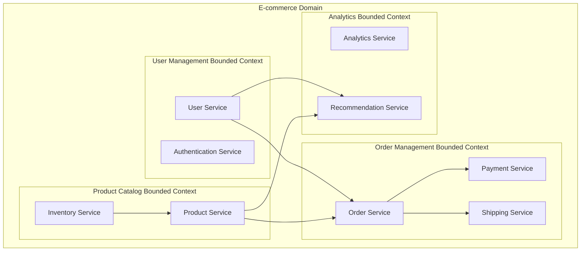

# Architecture microservices : bonnes pratiques

<Badge type="tip" text="Microservices 2025 & Cloud Native" />

L'architecture microservices s'est imposée comme standard pour les applications modernes nécessitant scalabilité, résilience et agilité de développement. Ce guide présente les bonnes pratiques éprouvées pour concevoir, implémenter et maintenir efficacement des systèmes distribués robustes.

## Fondamentaux de l'architecture microservices

### Définition et principes de base

::: info Caractéristiques essentielles
Une architecture microservices décompose une application en **services indépendants**, chacun :
- **Autonome** dans son déploiement et scaling
- **Responsable** d'un domaine métier spécifique
- **Communiquant** via des APIs bien définies
- **Technologiquement indépendant** dans ses choix d'implémentation
:::

### Avantages et défis modernes

| Avantages | Défis |
|-----------|--------|
| Scalabilité granulaire | Complexité opérationnelle |
| Résilience par isolation | Gestion de la cohérence |
| Autonomie des équipes | Communication réseau |
| Diversité technologique | Monitoring distribué |
| Déploiements indépendants | Sécurité inter-services |

## Conception et découpage des services

### Domain Driven Design (DDD) appliqué



### Stratégies de découpage efficaces

::: tip Patterns de découpage recommandés
1. **Par domaine métier** - Chaque service possède son domaine
2. **Par capacité** - Services centrés sur les capabilities
3. **Par flux de données** - Optimisation des échanges
4. **Par équipe** - Alignement organisationnel (Conway's Law)
:::

```typescript
// Exemple de définition de service avec ses responsabilités
interface UserService {
  // Domaine: Gestion des utilisateurs
  responsibilities: {
    userLifecycle: 'create, update, delete users';
    profileManagement: 'user profiles and preferences';
    userQueries: 'search and retrieve user data';
  };
  
  // APIs exposées
  apis: {
    rest: '/api/v1/users';
    events: 'user.created, user.updated, user.deleted';
  };
  
  // Données possédées
  dataOwnership: {
    tables: ['users', 'user_profiles', 'user_preferences'];
    exclusive: true;
  };
}
```

### Anti-patterns à éviter

::: danger Anti-patterns courants
- **Services trop granulaires** - Nano-services créant de la complexité
- **Couplage de données** - Services partageant des bases de données
- **Communication synchrone excessive** - Cascades d'appels bloquants
- **Responsabilités floues** - Overlap entre services
- **Transactions distribuées** - 2PC à éviter absolument
:::

## Patterns de communication

### Communication synchrone optimisée

```typescript
// Client HTTP avec retry et circuit breaker
import axios, { AxiosInstance } from 'axios';
import axiosRetry from 'axios-retry';

class ServiceClient {
  private client: AxiosInstance;
  private circuitBreaker: CircuitBreaker;
  
  constructor(baseURL: string, serviceName: string) {
    this.client = axios.create({
      baseURL,
      timeout: 5000,
      headers: {
        'Content-Type': 'application/json',
        'X-Service-Name': serviceName,
      },
    });
    
    // Configuration retry avec backoff exponentiel
    axiosRetry(this.client, {
      retries: 3,
      retryDelay: axiosRetry.exponentialDelay,
      retryCondition: (error) => {
        return axiosRetry.isNetworkOrIdempotentRequestError(error) ||
               error.response?.status === 503;
      },
    });
    
    // Circuit breaker pattern
    this.circuitBreaker = new CircuitBreaker({
      timeout: 10000,
      errorThresholdPercentage: 50,
      resetTimeout: 30000,
    });
    
    this.setupInterceptors();
  }
  
  private setupInterceptors() {
    // Request interceptor pour tracing distribué
    this.client.interceptors.request.use((config) => {
      const traceId = generateTraceId();
      config.headers['X-Trace-ID'] = traceId;
      config.headers['X-Correlation-ID'] = getCurrentCorrelationId();
      
      return config;
    });
    
    // Response interceptor pour logging et métriques
    this.client.interceptors.response.use(
      (response) => {
        this.recordMetrics(response.config.url!, response.status, response.config.method!);
        return response;
      },
      (error) => {
        this.recordMetrics(
          error.config?.url || 'unknown',
          error.response?.status || 0,
          error.config?.method || 'unknown'
        );
        throw error;
      }
    );
  }
  
  async get<T>(endpoint: string, config?: any): Promise<T> {
    return this.circuitBreaker.execute(async () => {
      const response = await this.client.get(endpoint, config);
      return response.data;
    });
  }
  
  async post<T>(endpoint: string, data: any, config?: any): Promise<T> {
    return this.circuitBreaker.execute(async () => {
      const response = await this.client.post(endpoint, data, config);
      return response.data;
    });
  }
}

// Usage avec gestion d'erreur robuste
class OrderService {
  private userClient: ServiceClient;
  private productClient: ServiceClient;
  
  constructor() {
    this.userClient = new ServiceClient(
      process.env.USER_SERVICE_URL!,
      'order-service'
    );
    this.productClient = new ServiceClient(
      process.env.PRODUCT_SERVICE_URL!,
      'order-service'
    );
  }
  
  async createOrder(orderData: CreateOrderRequest): Promise<Order> {
    try {
      // Validation avec appels parallèles
      const [user, products] = await Promise.all([
        this.userClient.get<User>(`/users/${orderData.userId}`),
        this.validateProducts(orderData.items),
      ]);
      
      // Logique métier locale
      const order = this.buildOrder(user, products, orderData);
      
      // Sauvegarde avec compensation en cas d'échec
      return await this.saveOrderWithCompensation(order);
      
    } catch (error) {
      if (error instanceof CircuitBreakerOpenError) {
        // Fallback ou mode dégradé
        return this.createOrderInDegradedMode(orderData);
      }
      throw error;
    }
  }
  
  private async createOrderInDegradedMode(orderData: CreateOrderRequest): Promise<Order> {
    // Mode dégradé : créer la commande sans validation complète
    // Marquer pour validation asynchrone ultérieure
    const order = new Order({
      ...orderData,
      status: 'PENDING_VALIDATION',
      validationRequired: true,
    });
    
    await this.orderRepository.save(order);
    
    // Déclencher validation asynchrone
    await this.eventBus.publish('order.created.validation_required', {
      orderId: order.id,
      userId: orderData.userId,
      items: orderData.items,
    });
    
    return order;
  }
}
```

### Communication asynchrone avec Event Sourcing

```typescript
// Event Store pour Event Sourcing
interface DomainEvent {
  id: string;
  aggregateId: string;
  aggregateType: string;
  eventType: string;
  eventVersion: number;
  timestamp: Date;
  data: any;
  metadata?: any;
}

class EventStore {
  constructor(private db: Database) {}
  
  async appendEvents(
    aggregateId: string,
    expectedVersion: number,
    events: DomainEvent[]
  ): Promise<void> {
    const transaction = await this.db.transaction();
    
    try {
      // Vérification de concurrence optimiste
      const currentVersion = await this.getCurrentVersion(aggregateId, transaction);
      
      if (currentVersion !== expectedVersion) {
        throw new ConcurrencyError(
          `Expected version ${expectedVersion}, but current version is ${currentVersion}`
        );
      }
      
      // Insertion des événements
      for (const event of events) {
        await transaction.execute(`
          INSERT INTO events (
            id, aggregate_id, aggregate_type, event_type, 
            event_version, timestamp, data, metadata
          ) VALUES (?, ?, ?, ?, ?, ?, ?, ?)
        `, [
          event.id,
          event.aggregateId,
          event.aggregateType,
          event.eventType,
          event.eventVersion,
          event.timestamp,
          JSON.stringify(event.data),
          JSON.stringify(event.metadata || {}),
        ]);
      }
      
      await transaction.commit();
      
      // Publication des événements après commit
      await this.publishEvents(events);
      
    } catch (error) {
      await transaction.rollback();
      throw error;
    }
  }
  
  async getEvents(
    aggregateId: string,
    fromVersion?: number
  ): Promise<DomainEvent[]> {
    const query = `
      SELECT * FROM events 
      WHERE aggregate_id = ? 
      ${fromVersion ? 'AND event_version >= ?' : ''}
      ORDER BY event_version ASC
    `;
    
    const params = fromVersion ? [aggregateId, fromVersion] : [aggregateId];
    const rows = await this.db.query(query, params);
    
    return rows.map(row => ({
      id: row.id,
      aggregateId: row.aggregate_id,
      aggregateType: row.aggregate_type,
      eventType: row.event_type,
      eventVersion: row.event_version,
      timestamp: new Date(row.timestamp),
      data: JSON.parse(row.data),
      metadata: JSON.parse(row.metadata || '{}'),
    }));
  }
  
  private async publishEvents(events: DomainEvent[]): Promise<void> {
    for (const event of events) {
      await this.eventBus.publish(event.eventType, {
        ...event.data,
        metadata: {
          ...event.metadata,
          eventId: event.id,
          aggregateId: event.aggregateId,
          aggregateType: event.aggregateType,
          eventVersion: event.eventVersion,
          timestamp: event.timestamp,
        },
      });
    }
  }
}

// Aggregate Root avec Event Sourcing
abstract class AggregateRoot {
  private _id: string;
  private _version: number = 0;
  private _uncommittedEvents: DomainEvent[] = [];
  
  constructor(id: string) {
    this._id = id;
  }
  
  get id(): string { return this._id; }
  get version(): number { return this._version; }
  
  protected addEvent(eventType: string, data: any, metadata?: any): void {
    const event: DomainEvent = {
      id: generateEventId(),
      aggregateId: this._id,
      aggregateType: this.constructor.name,
      eventType,
      eventVersion: this._version + this._uncommittedEvents.length + 1,
      timestamp: new Date(),
      data,
      metadata,
    };
    
    this._uncommittedEvents.push(event);
    this.applyEvent(event);
  }
  
  getUncommittedEvents(): DomainEvent[] {
    return [...this._uncommittedEvents];
  }
  
  markEventsAsCommitted(): void {
    this._version += this._uncommittedEvents.length;
    this._uncommittedEvents = [];
  }
  
  static fromHistory<T extends AggregateRoot>(
    this: new (id: string) => T,
    events: DomainEvent[]
  ): T {
    if (events.length === 0) {
      throw new Error('Cannot create aggregate from empty event history');
    }
    
    const aggregate = new this(events[0].aggregateId);
    
    for (const event of events) {
      aggregate.applyEvent(event);
      aggregate._version = event.eventVersion;
    }
    
    return aggregate;
  }
  
  protected abstract applyEvent(event: DomainEvent): void;
}

// Exemple d'agrégat Order
class Order extends AggregateRoot {
  private _customerId: string;
  private _items: OrderItem[] = [];
  private _status: OrderStatus = OrderStatus.DRAFT;
  private _totalAmount: number = 0;
  private _createdAt?: Date;
  
  constructor(id: string, customerId?: string) {
    super(id);
    if (customerId) {
      this._customerId = customerId;
    }
  }
  
  static create(customerId: string, items: OrderItem[]): Order {
    const orderId = generateOrderId();
    const order = new Order(orderId, customerId);
    
    order.addEvent('OrderCreated', {
      orderId,
      customerId,
      items,
      totalAmount: items.reduce((sum, item) => sum + item.price * item.quantity, 0),
    });
    
    return order;
  }
  
  addItem(productId: string, quantity: number, price: number): void {
    if (this._status !== OrderStatus.DRAFT) {
      throw new Error('Cannot add items to non-draft order');
    }
    
    this.addEvent('ItemAdded', {
      productId,
      quantity,
      price,
      totalPrice: quantity * price,
    });
  }
  
  confirm(): void {
    if (this._status !== OrderStatus.DRAFT) {
      throw new Error('Cannot confirm non-draft order');
    }
    
    if (this._items.length === 0) {
      throw new Error('Cannot confirm empty order');
    }
    
    this.addEvent('OrderConfirmed', {
      confirmedAt: new Date(),
      finalAmount: this._totalAmount,
    });
  }
  
  protected applyEvent(event: DomainEvent): void {
    switch (event.eventType) {
      case 'OrderCreated':
        this._customerId = event.data.customerId;
        this._items = event.data.items;
        this._totalAmount = event.data.totalAmount;
        this._createdAt = event.timestamp;
        this._status = OrderStatus.DRAFT;
        break;
        
      case 'ItemAdded':
        this._items.push({
          productId: event.data.productId,
          quantity: event.data.quantity,
          price: event.data.price,
        });
        this._totalAmount += event.data.totalPrice;
        break;
        
      case 'OrderConfirmed':
        this._status = OrderStatus.CONFIRMED;
        break;
        
      default:
        // Ignorer les événements inconnus pour compatibilité ascendante
        break;
    }
  }
}
```

## Gestion des données distribuées

### Pattern Saga pour transactions distribuées

```typescript
// Saga Orchestrator pour gestion de transactions distribuées
interface SagaStep {
  name: string;
  action: () => Promise<any>;
  compensation: () => Promise<void>;
}

class SagaOrchestrator {
  private steps: SagaStep[] = [];
  private executedSteps: string[] = [];
  
  addStep(step: SagaStep): void {
    this.steps.push(step);
  }
  
  async execute(): Promise<any> {
    let result: any;
    
    try {
      for (const step of this.steps) {
        console.log(`Executing step: ${step.name}`);
        result = await step.action();
        this.executedSteps.push(step.name);
        console.log(`Step ${step.name} completed successfully`);
      }
      
      return result;
    } catch (error) {
      console.error('Saga execution failed, starting compensation');
      await this.compensate();
      throw error;
    }
  }
  
  private async compensate(): Promise<void> {
    // Compenser dans l'ordre inverse
    const stepsToCompensate = [...this.executedSteps].reverse();
    
    for (const stepName of stepsToCompensate) {
      const step = this.steps.find(s => s.name === stepName);
      if (step) {
        try {
          console.log(`Compensating step: ${step.name}`);
          await step.compensation();
          console.log(`Step ${step.name} compensated successfully`);
        } catch (compensationError) {
          console.error(`Compensation failed for step ${step.name}:`, compensationError);
          // Log pour intervention manuelle
        }
      }
    }
  }
}

// Exemple d'utilisation pour processus de commande
class OrderProcessSaga {
  constructor(
    private userService: UserService,
    private inventoryService: InventoryService,
    private paymentService: PaymentService,
    private orderService: OrderService
  ) {}
  
  async processOrder(orderRequest: OrderRequest): Promise<Order> {
    const saga = new SagaOrchestrator();
    let reservationId: string;
    let paymentId: string;
    let order: Order;
    
    // Step 1: Réserver l'inventaire
    saga.addStep({
      name: 'reserve_inventory',
      action: async () => {
        reservationId = await this.inventoryService.reserveItems(orderRequest.items);
        return reservationId;
      },
      compensation: async () => {
        if (reservationId) {
          await this.inventoryService.releaseReservation(reservationId);
        }
      },
    });
    
    // Step 2: Traiter le paiement
    saga.addStep({
      name: 'process_payment',
      action: async () => {
        paymentId = await this.paymentService.processPayment({
          amount: orderRequest.totalAmount,
          currency: orderRequest.currency,
          customerId: orderRequest.customerId,
          paymentMethod: orderRequest.paymentMethod,
        });
        return paymentId;
      },
      compensation: async () => {
        if (paymentId) {
          await this.paymentService.refundPayment(paymentId);
        }
      },
    });
    
    // Step 3: Créer la commande
    saga.addStep({
      name: 'create_order',
      action: async () => {
        order = await this.orderService.createOrder({
          ...orderRequest,
          reservationId,
          paymentId,
          status: 'CONFIRMED',
        });
        return order;
      },
      compensation: async () => {
        if (order) {
          await this.orderService.cancelOrder(order.id);
        }
      },
    });
    
    // Step 4: Confirmer la réservation
    saga.addStep({
      name: 'confirm_reservation',
      action: async () => {
        await this.inventoryService.confirmReservation(reservationId);
        return true;
      },
      compensation: async () => {
        // La réservation est déjà confirmée, il faudrait re-créditer le stock
        await this.inventoryService.restockItems(orderRequest.items);
      },
    });
    
    return await saga.execute();
  }
}
```

### CQRS avec projections

```typescript
// Command et Query séparés
interface Command {
  id: string;
  type: string;
  aggregateId: string;
  data: any;
  metadata?: any;
}

interface Query {
  id: string;
  type: string;
  parameters: any;
}

// Command Handler
class CreateOrderCommandHandler {
  constructor(
    private orderRepository: OrderRepository,
    private eventStore: EventStore
  ) {}
  
  async handle(command: CreateOrderCommand): Promise<void> {
    // Validation métier
    await this.validateCommand(command);
    
    // Création de l'agrégat
    const order = Order.create(
      command.customerId,
      command.items
    );
    
    // Sauvegarde des événements
    await this.eventStore.appendEvents(
      order.id,
      0, // Version initiale
      order.getUncommittedEvents()
    );
    
    order.markEventsAsCommitted();
  }
  
  private async validateCommand(command: CreateOrderCommand): Promise<void> {
    if (!command.customerId) {
      throw new ValidationError('Customer ID is required');
    }
    
    if (!command.items || command.items.length === 0) {
      throw new ValidationError('Order must contain at least one item');
    }
    
    // Validation métier supplémentaire
  }
}

// Query Handler avec projections optimisées
class OrderQueryHandler {
  constructor(private readDb: ReadDatabase) {}
  
  async getOrdersByCustomer(customerId: string): Promise<OrderSummary[]> {
    // Requête optimisée sur vue matérialisée
    return await this.readDb.query(`
      SELECT 
        o.id,
        o.customer_id,
        o.total_amount,
        o.status,
        o.created_at,
        oi.item_count,
        p.payment_status
      FROM order_summary_view o
      LEFT JOIN order_items_summary oi ON o.id = oi.order_id
      LEFT JOIN payment_summary p ON o.id = p.order_id
      WHERE o.customer_id = ?
      ORDER BY o.created_at DESC
    `, [customerId]);
  }
  
  async getOrderDetails(orderId: string): Promise<OrderDetails> {
    const [order, items, payments] = await Promise.all([
      this.getOrderBasicInfo(orderId),
      this.getOrderItems(orderId),
      this.getOrderPayments(orderId),
    ]);
    
    return {
      ...order,
      items,
      payments,
    };
  }
}

// Projection Builder pour vues matérialisées
class OrderProjectionBuilder {
  constructor(private readDb: ReadDatabase) {}
  
  async handleEvent(event: DomainEvent): Promise<void> {
    switch (event.eventType) {
      case 'OrderCreated':
        await this.createOrderProjection(event);
        break;
      case 'ItemAdded':
        await this.updateOrderItems(event);
        break;
      case 'OrderConfirmed':
        await this.updateOrderStatus(event);
        break;
      default:
        // Ignorer les événements non pertinents
        break;
    }
  }
  
  private async createOrderProjection(event: DomainEvent): Promise<void> {
    await this.readDb.execute(`
      INSERT INTO order_summary_view (
        id, customer_id, total_amount, status, created_at, version
      ) VALUES (?, ?, ?, ?, ?, ?)
    `, [
      event.aggregateId,
      event.data.customerId,
      event.data.totalAmount,
      'DRAFT',
      event.timestamp,
      event.eventVersion,
    ]);
  }
  
  private async updateOrderStatus(event: DomainEvent): Promise<void> {
    await this.readDb.execute(`
      UPDATE order_summary_view 
      SET status = ?, version = ?
      WHERE id = ? AND version < ?
    `, [
      'CONFIRMED',
      event.eventVersion,
      event.aggregateId,
      event.eventVersion,
    ]);
  }
}
```

## Sécurité inter-services

### OAuth 2.0 et JWT pour authentification

```typescript
// Service d'authentification centralisé
class AuthenticationService {
  private jwtSecret: string;
  private jwtIssuer: string;
  
  constructor() {
    this.jwtSecret = process.env.JWT_SECRET!;
    this.jwtIssuer = process.env.JWT_ISSUER || 'auth-service';
  }
  
  async authenticateUser(credentials: LoginCredentials): Promise<AuthResult> {
    // Validation des credentials
    const user = await this.validateCredentials(credentials);
    
    if (!user) {
      throw new AuthenticationError('Invalid credentials');
    }
    
    // Génération des tokens
    const accessToken = await this.generateAccessToken(user);
    const refreshToken = await this.generateRefreshToken(user);
    
    // Sauvegarde du refresh token (avec rotation)
    await this.storeRefreshToken(user.id, refreshToken);
    
    return {
      accessToken,
      refreshToken,
      expiresIn: 3600, // 1 heure
      tokenType: 'Bearer',
      user: this.sanitizeUserForResponse(user),
    };
  }
  
  private async generateAccessToken(user: User): Promise<string> {
    const payload: JWTPayload = {
      sub: user.id,
      iss: this.jwtIssuer,
      aud: 'microservices',
      iat: Math.floor(Date.now() / 1000),
      exp: Math.floor(Date.now() / 1000) + 3600, // 1 heure
      scope: user.permissions.join(' '),
      role: user.role,
      email: user.email,
    };
    
    return jwt.sign(payload, this.jwtSecret, { algorithm: 'HS256' });
  }
  
  async validateToken(token: string): Promise<JWTPayload> {
    try {
      const payload = jwt.verify(token, this.jwtSecret) as JWTPayload;
      
      // Vérifications supplémentaires
      if (payload.iss !== this.jwtIssuer) {
        throw new Error('Invalid issuer');
      }
      
      // Vérifier si le token n'est pas révoqué
      const isRevoked = await this.isTokenRevoked(payload.sub, payload.iat);
      if (isRevoked) {
        throw new Error('Token has been revoked');
      }
      
      return payload;
    } catch (error) {
      throw new AuthenticationError('Invalid token');
    }
  }
}

// Middleware d'authentification pour services
class AuthMiddleware {
  constructor(private authService: AuthenticationService) {}
  
  authenticate() {
    return async (req: Request, res: Response, next: NextFunction) => {
      try {
        const token = this.extractToken(req);
        
        if (!token) {
          return res.status(401).json({ error: 'No token provided' });
        }
        
        const payload = await this.authService.validateToken(token);
        
        // Ajouter les informations d'authentification à la requête
        req.user = {
          id: payload.sub,
          email: payload.email,
          role: payload.role,
          permissions: payload.scope.split(' '),
        };
        
        next();
      } catch (error) {
        return res.status(401).json({ error: 'Invalid token' });
      }
    };
  }
  
  requirePermission(permission: string) {
    return (req: Request, res: Response, next: NextFunction) => {
      if (!req.user || !req.user.permissions.includes(permission)) {
        return res.status(403).json({ error: 'Insufficient permissions' });
      }
      next();
    };
  }
  
  private extractToken(req: Request): string | null {
    const authHeader = req.headers.authorization;
    
    if (!authHeader || !authHeader.startsWith('Bearer ')) {
      return null;
    }
    
    return authHeader.substring(7);
  }
}
```

### mTLS pour communication inter-services

```typescript
// Configuration TLS mutuelle
class MTLSConfig {
  static createSecureServer(port: number, serviceName: string) {
    const options = {
      // Certificat du service
      cert: fs.readFileSync(`/certs/${serviceName}/cert.pem`),
      key: fs.readFileSync(`/certs/${serviceName}/key.pem`),
      
      // CA pour valider les clients
      ca: fs.readFileSync('/certs/ca/ca-cert.pem'),
      
      // Forcer l'authentification mutuelle
      requestCert: true,
      rejectUnauthorized: true,
      
      // Vérification personnalisée
      checkServerIdentity: this.verifyServerIdentity,
    };
    
    const server = https.createServer(options);
    
    // Middleware de validation du certificat client
    server.on('secureConnection', (tlsSocket) => {
      const cert = tlsSocket.getPeerCertificate();
      
      if (!this.validateClientCertificate(cert)) {
        tlsSocket.destroy();
        return;
      }
      
      // Log de l'authentification réussie
      console.log(`Secure connection established with: ${cert.subject.CN}`);
    });
    
    return server;
  }
  
  static createSecureClient(targetService: string): https.Agent {
    return new https.Agent({
      cert: fs.readFileSync('/certs/client/cert.pem'),
      key: fs.readFileSync('/certs/client/key.pem'),
      ca: fs.readFileSync('/certs/ca/ca-cert.pem'),
      checkServerIdentity: (hostname, cert) => {
        return this.verifyServerIdentity(hostname, cert);
      },
    });
  }
  
  private static validateClientCertificate(cert: any): boolean {
    // Vérifier la validité temporelle
    const now = new Date();
    const notBefore = new Date(cert.valid_from);
    const notAfter = new Date(cert.valid_to);
    
    if (now < notBefore || now > notAfter) {
      console.error('Client certificate is expired or not yet valid');
      return false;
    }
    
    // Vérifier que le CN correspond à un service autorisé
    const allowedServices = process.env.ALLOWED_SERVICES?.split(',') || [];
    const clientService = cert.subject.CN;
    
    if (!allowedServices.includes(clientService)) {
      console.error(`Unauthorized client service: ${clientService}`);
      return false;
    }
    
    return true;
  }
  
  private static verifyServerIdentity(hostname: string, cert: any): Error | undefined {
    // Logique de vérification personnalisée pour les services internes
    const expectedCN = hostname;
    const actualCN = cert.subject.CN;
    
    if (expectedCN !== actualCN) {
      return new Error(`Server certificate CN mismatch: expected ${expectedCN}, got ${actualCN}`);
    }
    
    return undefined;
  }
}
```

## Observabilité et monitoring

### Distributed Tracing avec OpenTelemetry

```typescript
// Configuration OpenTelemetry
import { NodeSDK } from '@opentelemetry/sdk-node';
import { getNodeAutoInstrumentations } from '@opentelemetry/auto-instrumentations-node';
import { JaegerExporter } from '@opentelemetry/exporter-jaeger';
import { Resource } from '@opentelemetry/resources';
import { SemanticResourceAttributes } from '@opentelemetry/semantic-conventions';

const serviceName = process.env.SERVICE_NAME || 'unknown-service';
const serviceVersion = process.env.SERVICE_VERSION || '1.0.0';

const sdk = new NodeSDK({
  resource: new Resource({
    [SemanticResourceAttributes.SERVICE_NAME]: serviceName,
    [SemanticResourceAttributes.SERVICE_VERSION]: serviceVersion,
    [SemanticResourceAttributes.DEPLOYMENT_ENVIRONMENT]: process.env.NODE_ENV || 'development',
  }),
  traceExporter: new JaegerExporter({
    endpoint: process.env.JAEGER_ENDPOINT || 'http://localhost:14268/api/traces',
  }),
  instrumentations: [
    getNodeAutoInstrumentations({
      '@opentelemetry/instrumentation-fs': {
        enabled: false, // Éviter les traces sur les opérations fichier
      },
    }),
  ],
});

sdk.start();

// Service avec tracing custom
import { trace, context, SpanStatusCode } from '@opentelemetry/api';

class OrderService {
  private tracer = trace.getTracer('order-service', '1.0.0');
  
  async processOrder(orderData: CreateOrderRequest): Promise<Order> {
    // Créer un span parent pour l'opération complète
    return await this.tracer.startActiveSpan('process_order', async (span) => {
      try {
        // Ajouter des attributs au span
        span.setAttributes({
          'order.customer_id': orderData.customerId,
          'order.item_count': orderData.items.length,
          'order.total_amount': orderData.totalAmount,
        });
        
        // Validation (avec span enfant)
        await this.tracer.startActiveSpan('validate_order', async (validationSpan) => {
          await this.validateOrder(orderData);
          validationSpan.end();
        });
        
        // Appels externes avec propagation de contexte
        const [user, inventory] = await Promise.all([
          this.getUserWithTracing(orderData.customerId),
          this.checkInventoryWithTracing(orderData.items),
        ]);
        
        // Création de la commande
        const order = await this.createOrderEntity(orderData, user, inventory);
        
        // Ajouter le résultat au span
        span.setAttributes({
          'order.id': order.id,
          'order.status': order.status,
        });
        
        span.setStatus({ code: SpanStatusCode.OK });
        return order;
        
      } catch (error) {
        // Enregistrer l'erreur dans le span
        span.recordException(error as Error);
        span.setStatus({
          code: SpanStatusCode.ERROR,
          message: (error as Error).message,
        });
        throw error;
      } finally {
        span.end();
      }
    });
  }
  
  private async getUserWithTracing(userId: string): Promise<User> {
    return await this.tracer.startActiveSpan('get_user', async (span) => {
      span.setAttributes({
        'user.id': userId,
        'service.name': 'user-service',
      });
      
      try {
        const user = await this.userService.getUser(userId);
        span.setStatus({ code: SpanStatusCode.OK });
        return user;
      } catch (error) {
        span.recordException(error as Error);
        span.setStatus({
          code: SpanStatusCode.ERROR,
          message: (error as Error).message,
        });
        throw error;
      } finally {
        span.end();
      }
    });
  }
}

// Middleware pour propagation automatique du contexte
class TracingMiddleware {
  static express() {
    return (req: Request, res: Response, next: NextFunction) => {
      // Le contexte est automatiquement propagé par l'instrumentation
      // Mais on peut ajouter des attributs personnalisés
      const span = trace.getActiveSpan();
      
      if (span) {
        span.setAttributes({
          'http.method': req.method,
          'http.url': req.url,
          'http.user_agent': req.get('User-Agent') || '',
          'user.id': req.user?.id || 'anonymous',
        });
      }
      
      next();
    };
  }
}
```

### Métriques avec Prometheus

```typescript
// Configuration des métriques Prometheus
import client from 'prom-client';

// Registre pour toutes les métriques
const register = new client.Registry();

// Métriques par défaut (CPU, mémoire, etc.)
client.collectDefaultMetrics({ register });

// Métriques métier personnalisées
const httpRequestDuration = new client.Histogram({
  name: 'http_request_duration_seconds',
  help: 'Duration of HTTP requests in seconds',
  labelNames: ['method', 'route', 'status_code', 'service'],
  buckets: [0.1, 0.3, 0.5, 0.7, 1, 3, 5, 7, 10],
});

const httpRequestTotal = new client.Counter({
  name: 'http_requests_total',
  help: 'Total number of HTTP requests',
  labelNames: ['method', 'route', 'status_code', 'service'],
});

const activeOrdersGauge = new client.Gauge({
  name: 'active_orders_total',
  help: 'Number of currently active orders',
  labelNames: ['status'],
});

const orderProcessingDuration = new client.Histogram({
  name: 'order_processing_duration_seconds',
  help: 'Time taken to process orders',
  labelNames: ['status', 'payment_method'],
  buckets: [0.5, 1, 2, 5, 10, 30, 60],
});

const businessMetrics = new client.Counter({
  name: 'business_events_total',
  help: 'Business events counter',
  labelNames: ['event_type', 'service', 'status'],
});

// Enregistrer les métriques
register.registerMetric(httpRequestDuration);
register.registerMetric(httpRequestTotal);
register.registerMetric(activeOrdersGauge);
register.registerMetric(orderProcessingDuration);
register.registerMetric(businessMetrics);

// Middleware pour métriques HTTP automatiques
class MetricsMiddleware {
  static express(serviceName: string) {
    return (req: Request, res: Response, next: NextFunction) => {
      const startTime = Date.now();
      
      // Intercepter la fin de la réponse
      res.on('finish', () => {
        const duration = (Date.now() - startTime) / 1000;
        const route = req.route?.path || req.path;
        
        // Enregistrer les métriques
        httpRequestDuration
          .labels(req.method, route, res.statusCode.toString(), serviceName)
          .observe(duration);
          
        httpRequestTotal
          .labels(req.method, route, res.statusCode.toString(), serviceName)
          .inc();
      });
      
      next();
    };
  }
}

// Service avec métriques métier
class OrderMetricsService {
  recordOrderCreated(order: Order): void {
    businessMetrics
      .labels('order_created', 'order-service', 'success')
      .inc();
      
    activeOrdersGauge
      .labels(order.status)
      .inc();
  }
  
  recordOrderProcessingTime(duration: number, status: string, paymentMethod: string): void {
    orderProcessingDuration
      .labels(status, paymentMethod)
      .observe(duration);
  }
  
  recordOrderStatusChange(fromStatus: string, toStatus: string): void {
    activeOrdersGauge.labels(fromStatus).dec();
    activeOrdersGauge.labels(toStatus).inc();
    
    businessMetrics
      .labels('order_status_changed', 'order-service', 'success')
      .inc();
  }
}

// Endpoint pour exposition des métriques
app.get('/metrics', async (req, res) => {
  try {
    res.set('Content-Type', register.contentType);
    res.end(await register.metrics());
  } catch (error) {
    res.status(500).end();
  }
});
```

### Logging structuré

```typescript
// Configuration de logging structuré
import winston from 'winston';
import { trace, context } from '@opentelemetry/api';

const serviceName = process.env.SERVICE_NAME || 'unknown-service';
const environment = process.env.NODE_ENV || 'development';

// Format de log structuré avec correlation IDs
const logFormat = winston.format.combine(
  winston.format.timestamp(),
  winston.format.errors({ stack: true }),
  winston.format.json(),
  winston.format.printf((info) => {
    // Ajouter les informations de tracing
    const span = trace.getActiveSpan();
    const spanContext = span?.spanContext();
    
    const logEntry = {
      timestamp: info.timestamp,
      level: info.level,
      message: info.message,
      service: serviceName,
      environment,
      traceId: spanContext?.traceId,
      spanId: spanContext?.spanId,
      ...info,
    };
    
    return JSON.stringify(logEntry);
  })
);

const logger = winston.createLogger({
  level: process.env.LOG_LEVEL || 'info',
  format: logFormat,
  defaultMeta: {
    service: serviceName,
    environment,
  },
  transports: [
    new winston.transports.Console(),
    new winston.transports.File({ 
      filename: 'logs/error.log', 
      level: 'error' 
    }),
    new winston.transports.File({ 
      filename: 'logs/combined.log' 
    }),
  ],
});

// Logger avec contexte enrichi
class ContextualLogger {
  private context: Record<string, any> = {};
  
  constructor(private baseLogger: winston.Logger) {}
  
  withContext(context: Record<string, any>): ContextualLogger {
    const newLogger = new ContextualLogger(this.baseLogger);
    newLogger.context = { ...this.context, ...context };
    return newLogger;
  }
  
  info(message: string, meta?: any): void {
    this.baseLogger.info(message, { ...this.context, ...meta });
  }
  
  error(message: string, error?: Error, meta?: any): void {
    this.baseLogger.error(message, {
      ...this.context,
      ...meta,
      error: error ? {
        name: error.name,
        message: error.message,
        stack: error.stack,
      } : undefined,
    });
  }
  
  warn(message: string, meta?: any): void {
    this.baseLogger.warn(message, { ...this.context, ...meta });
  }
  
  debug(message: string, meta?: any): void {
    this.baseLogger.debug(message, { ...this.context, ...meta });
  }
}

// Factory pour créer des loggers contextuels
export class LoggerFactory {
  static createLogger(module: string): ContextualLogger {
    return new ContextualLogger(logger).withContext({ module });
  }
  
  static createRequestLogger(req: Request): ContextualLogger {
    return new ContextualLogger(logger).withContext({
      requestId: req.headers['x-request-id'] || generateRequestId(),
      userId: req.user?.id,
      userAgent: req.get('User-Agent'),
      ip: req.ip,
      method: req.method,
      url: req.url,
    });
  }
}

// Utilisation dans les services
class OrderService {
  private logger = LoggerFactory.createLogger('OrderService');
  
  async processOrder(orderData: CreateOrderRequest): Promise<Order> {
    const orderLogger = this.logger.withContext({
      orderId: generateOrderId(),
      customerId: orderData.customerId,
      operation: 'processOrder',
    });
    
    orderLogger.info('Starting order processing', {
      itemCount: orderData.items.length,
      totalAmount: orderData.totalAmount,
    });
    
    try {
      const order = await this.createOrder(orderData);
      
      orderLogger.info('Order processed successfully', {
        orderId: order.id,
        status: order.status,
        processingTime: Date.now() - startTime,
      });
      
      return order;
    } catch (error) {
      orderLogger.error('Order processing failed', error as Error, {
        errorCode: (error as any).code,
        retryable: this.isRetryableError(error as Error),
      });
      throw error;
    }
  }
}
```

## Déploiement et infrastructure

### Configuration avec Kubernetes

```yaml
# deployment.yaml
apiVersion: apps/v1
kind: Deployment
metadata:
  name: order-service
  labels:
    app: order-service
    version: v1
spec:
  replicas: 3
  selector:
    matchLabels:
      app: order-service
      version: v1
  template:
    metadata:
      labels:
        app: order-service
        version: v1
      annotations:
        prometheus.io/scrape: "true"
        prometheus.io/port: "3000"
        prometheus.io/path: "/metrics"
    spec:
      serviceAccountName: order-service
      containers:
      - name: order-service
        image: myregistry/order-service:v1.2.0
        ports:
        - containerPort: 3000
          name: http
        - containerPort: 9090
          name: grpc
        env:
        - name: NODE_ENV
          value: "production"
        - name: SERVICE_NAME
          value: "order-service"
        - name: DATABASE_URL
          valueFrom:
            secretKeyRef:
              name: order-service-secrets
              key: database-url
        - name: JWT_SECRET
          valueFrom:
            secretKeyRef:
              name: order-service-secrets
              key: jwt-secret
        livenessProbe:
          httpGet:
            path: /health
            port: 3000
          initialDelaySeconds: 30
          periodSeconds: 10
          timeoutSeconds: 5
          failureThreshold: 3
        readinessProbe:
          httpGet:
            path: /ready
            port: 3000
          initialDelaySeconds: 5
          periodSeconds: 5
          timeoutSeconds: 3
          failureThreshold: 3
        resources:
          requests:
            memory: "256Mi"
            cpu: "100m"
          limits:
            memory: "512Mi"
            cpu: "500m"
        volumeMounts:
        - name: tls-certs
          mountPath: /certs
          readOnly: true
      volumes:
      - name: tls-certs
        secret:
          secretName: order-service-tls
---
apiVersion: v1
kind: Service
metadata:
  name: order-service
  labels:
    app: order-service
spec:
  selector:
    app: order-service
  ports:
  - name: http
    port: 80
    targetPort: 3000
    protocol: TCP
  - name: grpc
    port: 9090
    targetPort: 9090
    protocol: TCP
  type: ClusterIP
---
apiVersion: networking.istio.io/v1beta1
kind: VirtualService
metadata:
  name: order-service
spec:
  http:
  - match:
    - uri:
        prefix: /api/v1/orders
    route:
    - destination:
        host: order-service
        port:
          number: 80
    timeout: 30s
    retries:
      attempts: 3
      perTryTimeout: 10s
      retryOn: 5xx,reset,connect-failure,refused-stream
---
apiVersion: networking.istio.io/v1beta1
kind: DestinationRule
metadata:
  name: order-service
spec:
  host: order-service
  trafficPolicy:
    circuitBreaker:
      consecutiveErrors: 5
      interval: 30s
      baseEjectionTime: 30s
      maxEjectionPercent: 50
    loadBalancer:
      simple: LEAST_CONN
  subsets:
  - name: v1
    labels:
      version: v1
```

### Patterns de déploiement

::: tip Stratégies de déploiement recommandées
1. **Blue-Green Deployment** - Bascule complète entre versions
2. **Canary Deployment** - Déploiement progressif avec validation
3. **Rolling Update** - Mise à jour continue sans interruption
4. **Feature Flags** - Activation conditionnelle de fonctionnalités
:::

```yaml
# Canary deployment avec Argo Rollouts
apiVersion: argoproj.io/v1alpha1
kind: Rollout
metadata:
  name: order-service
spec:
  replicas: 5
  strategy:
    canary:
      steps:
      - setWeight: 20
      - pause: {duration: 10m}
      - setWeight: 40
      - pause: {duration: 10m}
      - setWeight: 60
      - pause: {duration: 10m}
      - setWeight: 80
      - pause: {duration: 10m}
      canaryService: order-service-canary
      stableService: order-service-stable
      trafficRouting:
        istio:
          virtualService:
            name: order-service
      analysis:
        templates:
        - templateName: error-rate
        args:
        - name: service-name
          value: order-service
        - name: error-threshold
          value: "5"
  selector:
    matchLabels:
      app: order-service
  template:
    metadata:
      labels:
        app: order-service
    spec:
      containers:
      - name: order-service
        image: myregistry/order-service:v1.3.0
```

## Tests dans un environnement distribué

### Contract Testing avec Pact

```typescript
// Consumer Test (Order Service testant User Service)
import { PactV3, MatchersV3 } from '@pact-foundation/pact';

const { like, eachLike } = MatchersV3;

describe('User Service Contract', () => {
  const provider = new PactV3({
    consumer: 'order-service',
    provider: 'user-service',
    dir: './pacts',
  });
  
  it('should get user details', async () => {
    await provider
      .given('user exists with id 123')
      .uponReceiving('a request for user details')
      .withRequest({
        method: 'GET',
        path: '/api/v1/users/123',
        headers: {
          'Authorization': like('Bearer eyJ0eXAiOiJKV1QiLCJhbGciOiJI...'),
          'Content-Type': 'application/json',
        },
      })
      .willRespondWith({
        status: 200,
        headers: {
          'Content-Type': 'application/json',
        },
        body: {
          id: like('123'),
          email: like('user@example.com'),
          name: like('John Doe'),
          role: like('customer'),
          createdAt: like('2023-01-01T00:00:00Z'),
        },
      });
    
    await provider.executeTest(async (mockService) => {
      const userService = new UserServiceClient(mockService.url);
      const user = await userService.getUser('123');
      
      expect(user.id).toBe('123');
      expect(user.email).toBe('user@example.com');
    });
  });
});

// Provider Test (User Service vérifiant le contrat)
import { Verifier } from '@pact-foundation/pact';

describe('User Service Provider', () => {
  it('should satisfy the contract', async () => {
    const opts = {
      provider: 'user-service',
      providerBaseUrl: 'http://localhost:3000',
      pactUrls: ['./pacts/order-service-user-service.json'],
      stateHandlers: {
        'user exists with id 123': async () => {
          // Setup test data
          await setupTestUser({
            id: '123',
            email: 'user@example.com',
            name: 'John Doe',
            role: 'customer',
          });
        },
      },
      requestFilter: (req, res, next) => {
        // Mock authentication for tests
        req.headers.authorization = 'Bearer valid-token';
        next();
      },
    };
    
    const verifier = new Verifier(opts);
    await verifier.verifyProvider();
  });
});
```

### Tests d'intégration avec TestContainers

```typescript
// Tests d'intégration avec vraies dépendances
import { GenericContainer, StartedTestContainer } from 'testcontainers';
import { Client } from 'pg';

describe('Order Service Integration Tests', () => {
  let postgresContainer: StartedTestContainer;
  let redisContainer: StartedTestContainer;
  let orderService: OrderService;
  
  beforeAll(async () => {
    // Démarrer PostgreSQL
    postgresContainer = await new GenericContainer('postgres:15')
      .withEnvironment({
        POSTGRES_DB: 'testdb',
        POSTGRES_USER: 'testuser',
        POSTGRES_PASSWORD: 'testpass',
      })
      .withExposedPorts(5432)
      .start();
    
    // Démarrer Redis
    redisContainer = await new GenericContainer('redis:7-alpine')
      .withExposedPorts(6379)
      .start();
    
    // Configuration du service avec containers de test
    const config = {
      database: {
        host: postgresContainer.getHost(),
        port: postgresContainer.getMappedPort(5432),
        database: 'testdb',
        username: 'testuser',
        password: 'testpass',
      },
      redis: {
        host: redisContainer.getHost(),
        port: redisContainer.getMappedPort(6379),
      },
    };
    
    orderService = new OrderService(config);
    await orderService.initialize();
    
    // Setup schema et données de test
    await setupTestSchema();
    await seedTestData();
  }, 60000);
  
  afterAll(async () => {
    await orderService?.close();
    await postgresContainer?.stop();
    await redisContainer?.stop();
  });
  
  it('should create order with full workflow', async () => {
    // Test complet avec toutes les dépendances
    const orderRequest = {
      customerId: 'customer-123',
      items: [
        { productId: 'product-1', quantity: 2, price: 10.00 },
        { productId: 'product-2', quantity: 1, price: 15.00 },
      ],
      totalAmount: 35.00,
    };
    
    const order = await orderService.createOrder(orderRequest);
    
    expect(order.id).toBeDefined();
    expect(order.status).toBe('CREATED');
    expect(order.totalAmount).toBe(35.00);
    
    // Vérifier la persistance
    const savedOrder = await orderService.getOrder(order.id);
    expect(savedOrder).toEqual(order);
    
    // Vérifier les événements
    const events = await orderService.getOrderEvents(order.id);
    expect(events).toHaveLength(1);
    expect(events[0].type).toBe('OrderCreated');
  });
});
```

## Bonnes pratiques de production

### Health Checks et Observabilité

```typescript
// Health checks complets
class HealthCheckService {
  private checks: Map<string, HealthCheck> = new Map();
  
  registerCheck(name: string, check: HealthCheck): void {
    this.checks.set(name, check);
  }
  
  async getHealth(): Promise<HealthStatus> {
    const results = new Map<string, CheckResult>();
    const startTime = Date.now();
    
    // Exécuter tous les checks en parallèle
    const checkPromises = Array.from(this.checks.entries()).map(
      async ([name, check]) => {
        try {
          const result = await Promise.race([
            check.execute(),
            this.timeout(5000, `Health check ${name} timed out`),
          ]);
          
          results.set(name, {
            status: 'healthy',
            details: result,
            duration: Date.now() - startTime,
          });
        } catch (error) {
          results.set(name, {
            status: 'unhealthy',
            error: (error as Error).message,
            duration: Date.now() - startTime,
          });
        }
      }
    );
    
    await Promise.all(checkPromises);
    
    const overallStatus = Array.from(results.values()).every(
      r => r.status === 'healthy'
    ) ? 'healthy' : 'unhealthy';
    
    return {
      status: overallStatus,
      timestamp: new Date().toISOString(),
      duration: Date.now() - startTime,
      checks: Object.fromEntries(results),
    };
  }
  
  private timeout(ms: number, message: string): Promise<never> {
    return new Promise((_, reject) => 
      setTimeout(() => reject(new Error(message)), ms)
    );
  }
}

// Health checks spécifiques
class DatabaseHealthCheck implements HealthCheck {
  constructor(private db: Database) {}
  
  async execute(): Promise<any> {
    const start = Date.now();
    await this.db.query('SELECT 1');
    
    return {
      connection: 'ok',
      responseTime: Date.now() - start,
    };
  }
}

class ExternalServiceHealthCheck implements HealthCheck {
  constructor(
    private serviceName: string,
    private serviceUrl: string
  ) {}
  
  async execute(): Promise<any> {
    const start = Date.now();
    const response = await fetch(`${this.serviceUrl}/health`, {
      method: 'GET',
      timeout: 3000,
    });
    
    if (!response.ok) {
      throw new Error(`${this.serviceName} returned ${response.status}`);
    }
    
    return {
      service: this.serviceName,
      status: 'reachable',
      responseTime: Date.now() - start,
    };
  }
}

// Configuration des health checks
const healthService = new HealthCheckService();

healthService.registerCheck('database', new DatabaseHealthCheck(database));
healthService.registerCheck('redis', new RedisHealthCheck(redisClient));
healthService.registerCheck('user-service', new ExternalServiceHealthCheck(
  'user-service',
  process.env.USER_SERVICE_URL!
));

// Endpoints
app.get('/health', async (req, res) => {
  try {
    const health = await healthService.getHealth();
    const statusCode = health.status === 'healthy' ? 200 : 503;
    
    res.status(statusCode).json(health);
  } catch (error) {
    res.status(503).json({
      status: 'unhealthy',
      error: (error as Error).message,
      timestamp: new Date().toISOString(),
    });
  }
});

app.get('/ready', async (req, res) => {
  // Vérifications de disponibilité plus légères
  try {
    await database.query('SELECT 1');
    res.status(200).json({ status: 'ready' });
  } catch (error) {
    res.status(503).json({ status: 'not ready' });
  }
});
```

### Patterns de résilience

::: tip Patterns essentiels de résilience
1. **Circuit Breaker** - Protection contre les services défaillants
2. **Retry avec Backoff** - Nouvelle tentative intelligente
3. **Timeout** - Éviter les blocages
4. **Bulkhead** - Isolation des ressources
5. **Graceful Degradation** - Mode dégradé fonctionnel
:::

```typescript
// Implementation complète de patterns de résilience
class ResilientServiceClient {
  private circuitBreaker: CircuitBreaker;
  private rateLimiter: RateLimiter;
  
  constructor(
    private baseUrl: string,
    private options: ResilientClientOptions
  ) {
    this.circuitBreaker = new CircuitBreaker({
      failureThreshold: options.failureThreshold || 5,
      timeout: options.timeout || 10000,
      resetTimeout: options.resetTimeout || 60000,
    });
    
    this.rateLimiter = new RateLimiter({
      maxRequests: options.maxRequests || 100,
      timeWindow: options.timeWindow || 60000,
    });
  }
  
  async execute<T>(request: () => Promise<T>): Promise<T> {
    // 1. Rate limiting
    await this.rateLimiter.acquire();
    
    // 2. Circuit breaker
    return await this.circuitBreaker.execute(async () => {
      // 3. Retry avec backoff exponentiel
      return await this.retryWithBackoff(request);
    });
  }
  
  private async retryWithBackoff<T>(
    request: () => Promise<T>,
    maxRetries: number = 3
  ): Promise<T> {
    let lastError: Error;
    
    for (let attempt = 0; attempt <= maxRetries; attempt++) {
      try {
        return await request();
      } catch (error) {
        lastError = error as Error;
        
        // Ne pas retry sur certaines erreurs
        if (this.isNonRetryableError(error as Error)) {
          throw error;
        }
        
        if (attempt === maxRetries) {
          break;
        }
        
        // Backoff exponentiel avec jitter
        const delay = Math.min(
          1000 * Math.pow(2, attempt) + Math.random() * 1000,
          30000
        );
        
        await this.sleep(delay);
      }
    }
    
    throw lastError!;
  }
  
  private isNonRetryableError(error: Error): boolean {
    // Erreurs 4xx (sauf 429) ne doivent pas être retryées
    if ('status' in error) {
      const status = (error as any).status;
      return status >= 400 && status < 500 && status !== 429;
    }
    return false;
  }
}
```

## Conclusion

### Récapitulatif des bonnes pratiques

::: info Checklist Architecture Microservices
**Conception**
- [ ] Découpage par domaine métier (DDD)
- [ ] Services autonomes et faiblement couplés
- [ ] APIs bien définies et versionnées
- [ ] Responsabilités claires par service

**Communication**
- [ ] Préférer l'asynchrone quand possible
- [ ] Patterns de résilience implémentés
- [ ] Gestion d'erreur robuste
- [ ] Timeout et retry configurés

**Données**
- [ ] Base de données par service
- [ ] Pas de transactions distribuées
- [ ] Event Sourcing pour audit
- [ ] CQRS pour optimisation

**Sécurité**
- [ ] Authentification centralisée
- [ ] mTLS pour communications internes
- [ ] Secrets management sécurisé
- [ ] Principe du moindre privilège

**Observabilité**
- [ ] Distributed tracing configuré
- [ ] Métriques métier et techniques
- [ ] Logging structuré centralisé
- [ ] Health checks complets

**Déploiement**
- [ ] Containerisation avec Docker
- [ ] Orchestration Kubernetes
- [ ] CI/CD automatisé
- [ ] Stratégies de déploiement progressif
:::

### Évolutions futures

L'architecture microservices continue d'évoluer vers :
- **Serverless** - Functions as a Service
- **Service Mesh** - Envoy/Istio pour infrastructure
- **Event-driven** - Architecture réactive
- **AI/ML integration** - Services intelligents

### Conseil final

Adoptez les microservices de façon progressive. Commencez par identifier les bounded contexts naturels de votre domaine métier, puis évoluez par étapes en maintenant la simplicité opérationnelle. La complexité distribuée doit être justifiée par des bénéfices métier tangibles.

N'oubliez pas : **"Distribute when you must, not because you can"** - La simplicité reste votre meilleur allié pour construire des systèmes maintenables et évolutifs.