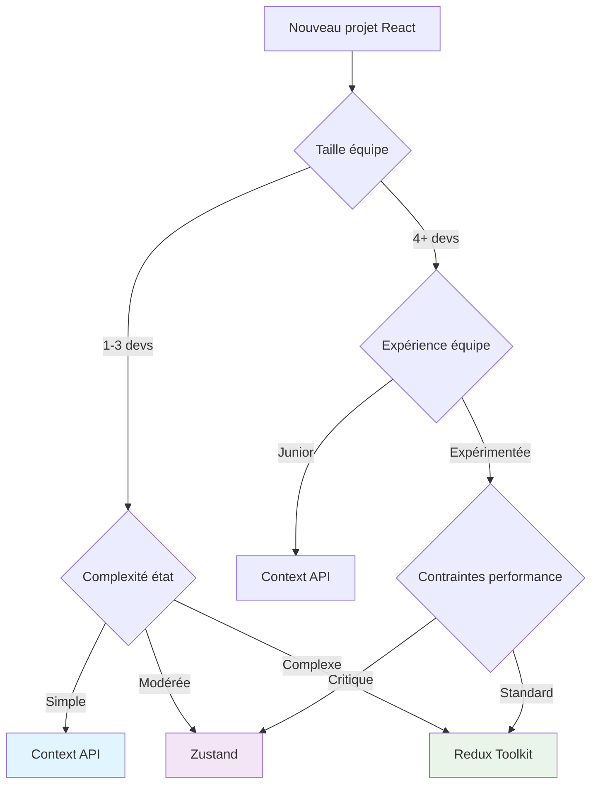

# Gestion d'état moderne : Context vs Redux vs Zustand

<Badge type="tip" text="React 18+ & State Management 2025" />

La gestion d'état représente l'un des défis centraux du développement d'applications React modernes. En 2025, trois approches dominent le paysage : React Context API, Redux Toolkit et Zustand. Ce guide compare ces solutions pour vous aider à faire le choix optimal selon votre contexte projet.

## Évolution de la gestion d'état React

### Historique et tendances actuelles

::: info État des lieux 2025
- **Context API** : Solution native React pour état local/modéré
- **Redux Toolkit** : Standard industriel pour applications complexes
- **Zustand** : Alternative moderne et minimaliste
- **Adoption** : 85% des projets React utilisent au moins une de ces solutions
:::

### Critères de sélection modernes

| Critère | Importance | Impact |
|---------|------------|--------|
| Complexité de l'état | Élevée | Architecture globale |
| Taille de l'équipe | Moyenne | Maintenabilité |
| Performance | Élevée | Expérience utilisateur |
| Courbe d'apprentissage | Moyenne | Productivité équipe |
| Écosystème | Moyenne | Extensions disponibles |

## React Context API

### Présentation et cas d'usage

React Context API est la solution native pour partager l'état entre composants sans prop drilling. Optimale pour les états modérément complexes et les équipes privilégiant les solutions natives.

::: tip Cas d'usage idéaux
- Applications de petite à moyenne taille
- État principalement de configuration (thème, authentification)
- Équipes préférant les API natives React
- Projets nécessitant un bundle minimal
:::

### Implémentation moderne avec useReducer

```typescript
// types/auth.ts
export interface User {
  id: string;
  name: string;
  email: string;
  role: 'admin' | 'user';
}

export interface AuthState {
  user: User | null;
  isLoading: boolean;
  error: string | null;
}

export type AuthAction =
  | { type: 'AUTH_START' }
  | { type: 'AUTH_SUCCESS'; payload: User }
  | { type: 'AUTH_ERROR'; payload: string }
  | { type: 'AUTH_LOGOUT' };
```

```typescript
// hooks/useAuthReducer.ts
import { useReducer } from 'react';
import { AuthState, AuthAction } from '../types/auth';

const initialState: AuthState = {
  user: null,
  isLoading: false,
  error: null,
};

function authReducer(state: AuthState, action: AuthAction): AuthState {
  switch (action.type) {
    case 'AUTH_START':
      return {
        ...state,
        isLoading: true,
        error: null,
      };
    
    case 'AUTH_SUCCESS':
      return {
        ...state,
        isLoading: false,
        user: action.payload,
        error: null,
      };
    
    case 'AUTH_ERROR':
      return {
        ...state,
        isLoading: false,
        error: action.payload,
      };
    
    case 'AUTH_LOGOUT':
      return {
        ...state,
        user: null,
        isLoading: false,
        error: null,
      };
    
    default:
      return state;
  }
}

export function useAuthReducer() {
  return useReducer(authReducer, initialState);
}
```

### Context Provider optimisé

```typescript
// contexts/AuthContext.tsx
import React, { createContext, useContext, ReactNode, useMemo } from 'react';
import { AuthState, AuthAction } from '../types/auth';
import { useAuthReducer } from '../hooks/useAuthReducer';

interface AuthContextType {
  state: AuthState;
  dispatch: React.Dispatch<AuthAction>;
  // Actions simplifiées
  login: (email: string, password: string) => Promise<void>;
  logout: () => void;
  isAuthenticated: boolean;
}

const AuthContext = createContext<AuthContextType | undefined>(undefined);

interface AuthProviderProps {
  children: ReactNode;
}

export function AuthProvider({ children }: AuthProviderProps) {
  const [state, dispatch] = useAuthReducer();

  // Actions métier
  const login = async (email: string, password: string) => {
    dispatch({ type: 'AUTH_START' });
    
    try {
      const response = await fetch('/api/auth/login', {
        method: 'POST',
        headers: { 'Content-Type': 'application/json' },
        body: JSON.stringify({ email, password }),
      });
      
      if (!response.ok) {
        throw new Error('Authentication failed');
      }
      
      const user = await response.json();
      dispatch({ type: 'AUTH_SUCCESS', payload: user });
    } catch (error) {
      dispatch({ 
        type: 'AUTH_ERROR', 
        payload: error instanceof Error ? error.message : 'Unknown error' 
      });
    }
  };

  const logout = () => {
    localStorage.removeItem('auth-token');
    dispatch({ type: 'AUTH_LOGOUT' });
  };

  // Valeurs mémorisées pour éviter les re-rendus
  const contextValue = useMemo(() => ({
    state,
    dispatch,
    login,
    logout,
    isAuthenticated: !!state.user,
  }), [state]);

  return (
    <AuthContext.Provider value={contextValue}>
      {children}
    </AuthContext.Provider>
  );
}

// Hook personnalisé avec vérification
export function useAuth() {
  const context = useContext(AuthContext);
  
  if (context === undefined) {
    throw new Error('useAuth must be used within an AuthProvider');
  }
  
  return context;
}
```

### Optimisation des performances

```typescript
// contexts/OptimizedContext.tsx
import React, { createContext, useContext, ReactNode, useMemo } from 'react';

// Séparer les contextes pour éviter les re-rendus inutiles
const StateContext = createContext<AuthState | undefined>(undefined);
const ActionsContext = createContext<AuthActions | undefined>(undefined);

interface AuthActions {
  login: (email: string, password: string) => Promise<void>;
  logout: () => void;
}

export function OptimizedAuthProvider({ children }: { children: ReactNode }) {
  const [state, dispatch] = useAuthReducer();

  // Actions mémorisées (ne changent jamais)
  const actions = useMemo(() => ({
    login: async (email: string, password: string) => {
      // Implémentation login
    },
    logout: () => {
      // Implémentation logout
    },
  }), []);

  return (
    <ActionsContext.Provider value={actions}>
      <StateContext.Provider value={state}>
        {children}
      </StateContext.Provider>
    </ActionsContext.Provider>
  );
}

// Hooks séparés pour un contrôle fin
export function useAuthState() {
  const context = useContext(StateContext);
  if (!context) throw new Error('useAuthState must be used within OptimizedAuthProvider');
  return context;
}

export function useAuthActions() {
  const context = useContext(ActionsContext);
  if (!context) throw new Error('useAuthActions must be used within OptimizedAuthProvider');
  return context;
}
```

### Avantages et limitations

::: tip Avantages de Context API
- **Native à React** - Aucune dépendance externe
- **Simple à comprendre** - API familière
- **Bundle léger** - Impact minimal sur la taille
- **TypeScript friendly** - Excellent support natif
:::

::: warning Limitations importantes
- **Performance** - Re-rendus fréquents sans optimisation
- **DevTools** - Debugging limité comparé à Redux
- **Complexité** - Code verbose pour états complexes
- **Testabilité** - Tests d'intégration plus difficiles
:::

## Redux Toolkit

### Présentation et architecture moderne

Redux Toolkit (RTK) est la façon moderne et recommandée d'utiliser Redux. Il simplifie considérablement l'écriture de code Redux tout en conservant sa puissance et ses avantages.

::: info Nouveautés RTK 2025
- **RTK Query 2.0** - Gestion d'API optimisée
- **Listener Middleware** - Effets de bord simplifiés
- **Auto-batching** - Performance améliorée
- **TypeScript 5.0** - Inférence de types perfectionnée
:::

### Configuration store moderne

```typescript
// store/index.ts
import { configureStore, combineReducers } from '@reduxjs/toolkit';
import { setupListeners } from '@reduxjs/toolkit/query';
import { 
  persistStore, 
  persistReducer,
  FLUSH,
  REHYDRATE,
  PAUSE,
  PERSIST,
  PURGE,
  REGISTER,
} from 'redux-persist';
import storage from 'redux-persist/lib/storage';

import authSlice from './slices/authSlice';
import uiSlice from './slices/uiSlice';
import { apiSlice } from './api/apiSlice';

// Configuration de persistance
const persistConfig = {
  key: 'root',
  storage,
  whitelist: ['auth'], // Persister seulement l'auth
};

const rootReducer = combineReducers({
  auth: authSlice,
  ui: uiSlice,
  api: apiSlice.reducer,
});

const persistedReducer = persistReducer(persistConfig, rootReducer);

export const store = configureStore({
  reducer: persistedReducer,
  middleware: (getDefaultMiddleware) =>
    getDefaultMiddleware({
      serializableCheck: {
        ignoredActions: [FLUSH, REHYDRATE, PAUSE, PERSIST, PURGE, REGISTER],
      },
    }).concat(apiSlice.middleware),
  devTools: process.env.NODE_ENV !== 'production',
});

// Configuration RTK Query listeners
setupListeners(store.dispatch);

export const persistor = persistStore(store);

// Types pour TypeScript
export type RootState = ReturnType<typeof store.getState>;
export type AppDispatch = typeof store.dispatch;
```

### Slice moderne avec createSlice

```typescript
// store/slices/authSlice.ts
import { createSlice, createAsyncThunk, PayloadAction } from '@reduxjs/toolkit';
import { User } from '../../types/auth';

interface AuthState {
  user: User | null;
  isLoading: boolean;
  error: string | null;
  lastLogin: string | null;
}

const initialState: AuthState = {
  user: null,
  isLoading: false,
  error: null,
  lastLogin: null,
};

// Thunks asynchrones
export const loginAsync = createAsyncThunk(
  'auth/login',
  async (
    credentials: { email: string; password: string },
    { rejectWithValue }
  ) => {
    try {
      const response = await fetch('/api/auth/login', {
        method: 'POST',
        headers: { 'Content-Type': 'application/json' },
        body: JSON.stringify(credentials),
      });

      if (!response.ok) {
        const error = await response.text();
        return rejectWithValue(error);
      }

      const data = await response.json();
      
      // Sauvegarder le token
      localStorage.setItem('auth-token', data.token);
      
      return data.user;
    } catch (error) {
      return rejectWithValue('Network error');
    }
  }
);

export const logoutAsync = createAsyncThunk(
  'auth/logout',
  async (_, { dispatch }) => {
    localStorage.removeItem('auth-token');
    // Autres actions de cleanup
    dispatch(clearUserData());
  }
);

// Slice principal
const authSlice = createSlice({
  name: 'auth',
  initialState,
  reducers: {
    clearError: (state) => {
      state.error = null;
    },
    clearUserData: (state) => {
      state.user = null;
      state.lastLogin = null;
    },
    updateUserProfile: (state, action: PayloadAction<Partial<User>>) => {
      if (state.user) {
        state.user = { ...state.user, ...action.payload };
      }
    },
  },
  extraReducers: (builder) => {
    builder
      // Login cases
      .addCase(loginAsync.pending, (state) => {
        state.isLoading = true;
        state.error = null;
      })
      .addCase(loginAsync.fulfilled, (state, action) => {
        state.isLoading = false;
        state.user = action.payload;
        state.lastLogin = new Date().toISOString();
        state.error = null;
      })
      .addCase(loginAsync.rejected, (state, action) => {
        state.isLoading = false;
        state.error = action.payload as string;
      })
      // Logout cases
      .addCase(logoutAsync.fulfilled, (state) => {
        return { ...initialState }; // Reset complet
      });
  },
});

export const { clearError, clearUserData, updateUserProfile } = authSlice.actions;

// Selectors avec reselect pour optimisation
export const selectAuth = (state: { auth: AuthState }) => state.auth;
export const selectUser = (state: { auth: AuthState }) => state.auth.user;
export const selectIsAuthenticated = (state: { auth: AuthState }) => !!state.auth.user;
export const selectAuthError = (state: { auth: AuthState }) => state.auth.error;

export default authSlice.reducer;
```

### RTK Query pour gestion d'API

```typescript
// store/api/apiSlice.ts
import { createApi, fetchBaseQuery } from '@reduxjs/toolkit/query/react';
import type { RootState } from '../index';

// Types pour l'API
interface ApiUser extends User {
  createdAt: string;
  updatedAt: string;
}

interface LoginRequest {
  email: string;
  password: string;
}

interface LoginResponse {
  user: ApiUser;
  token: string;
  refreshToken: string;
}

// Base query avec authentification
const baseQueryWithAuth = fetchBaseQuery({
  baseUrl: '/api',
  prepareHeaders: (headers, { getState }) => {
    const token = (getState() as RootState).auth.user?.token;
    if (token) {
      headers.set('authorization', `Bearer ${token}`);
    }
    return headers;
  },
});

// API Slice principal
export const apiSlice = createApi({
  reducerPath: 'api',
  baseQuery: baseQueryWithAuth,
  tagTypes: ['User', 'Post', 'Comment'],
  endpoints: (builder) => ({
    // Authentication
    login: builder.mutation<LoginResponse, LoginRequest>({
      query: (credentials) => ({
        url: '/auth/login',
        method: 'POST',
        body: credentials,
      }),
      invalidatesTags: ['User'],
    }),
    
    // User management
    getProfile: builder.query<ApiUser, void>({
      query: () => '/auth/profile',
      providesTags: ['User'],
    }),
    
    updateProfile: builder.mutation<ApiUser, Partial<ApiUser>>({
      query: (updates) => ({
        url: '/auth/profile',
        method: 'PATCH',
        body: updates,
      }),
      invalidatesTags: ['User'],
      // Optimistic update
      async onQueryStarted(patch, { dispatch, queryFulfilled }) {
        const patchResult = dispatch(
          apiSlice.util.updateQueryData('getProfile', undefined, (draft) => {
            Object.assign(draft, patch);
          })
        );
        
        try {
          await queryFulfilled;
        } catch {
          patchResult.undo();
        }
      },
    }),
    
    // Posts avec pagination
    getPosts: builder.query<{posts: Post[], hasMore: boolean}, {page: number, limit: number}>({
      query: ({ page, limit }) => `/posts?page=${page}&limit=${limit}`,
      providesTags: (result) =>
        result
          ? [
              ...result.posts.map(({ id }) => ({ type: 'Post' as const, id })),
              { type: 'Post', id: 'LIST' },
            ]
          : [{ type: 'Post', id: 'LIST' }],
      // Merge des résultats pour pagination infinie
      serializeQueryArgs: ({ endpointName }) => {
        return endpointName;
      },
      merge: (currentCache, newItems, { arg }) => {
        if (arg.page === 1) {
          return newItems;
        }
        return {
          ...newItems,
          posts: [...currentCache.posts, ...newItems.posts],
        };
      },
      forceRefetch({ currentArg, previousArg }) {
        return currentArg?.page !== previousArg?.page;
      },
    }),
  }),
});

// Export des hooks générés automatiquement
export const {
  useLoginMutation,
  useGetProfileQuery,
  useUpdateProfileMutation,
  useGetPostsQuery,
} = apiSlice;
```

### Hooks TypeScript personnalisés

```typescript
// hooks/redux.ts
import { useDispatch, useSelector, TypedUseSelectorHook } from 'react-redux';
import type { RootState, AppDispatch } from '../store';

// Hooks typés pour l'application
export const useAppDispatch = () => useDispatch<AppDispatch>();
export const useAppSelector: TypedUseSelectorHook<RootState> = useSelector;

// Hook de connexion simplifiée
export function useAuth() {
  const dispatch = useAppDispatch();
  const auth = useAppSelector(selectAuth);
  
  const login = (credentials: { email: string; password: string }) => {
    return dispatch(loginAsync(credentials));
  };
  
  const logout = () => {
    return dispatch(logoutAsync());
  };
  
  return {
    ...auth,
    login,
    logout,
    isAuthenticated: !!auth.user,
  };
}
```

### Avantages et considérations

::: tip Avantages de Redux Toolkit
- **Architecture prévisible** - State management structuré
- **DevTools exceptionnels** - Time travel debugging
- **Écosystème riche** - Middleware et extensions
- **Performance** - Optimisations intégrées avec Immer
- **RTK Query** - Gestion d'API puissante
:::

::: warning Considérations importantes
- **Courbe d'apprentissage** - Concepts Redux à maîtriser
- **Boilerplate** - Plus de code initial malgré RTK
- **Complexité** - Peut être excessive pour petites apps
- **Bundle size** - Plus lourd que alternatives minimalistes
:::

## Zustand

### Présentation et philosophie

Zustand est une solution de gestion d'état minimaliste qui combine simplicité d'utilisation et puissance. Elle élimine la complexité de Redux tout en conservant une architecture prévisible.

::: tip Avantages de Zustand
- **API minimale** - Très peu de concepts à apprendre
- **TypeScript native** - Excellent support sans configuration
- **Performance** - Pas de providers, évite context hell
- **Flexibilité** - Peut être utilisé en dehors de React
- **Bundle minimal** - Moins de 3KB gzippé
:::

### Store basique avec TypeScript

```typescript
// stores/authStore.ts
import { create } from 'zustand';
import { devtools, persist, subscribeWithSelector } from 'zustand/middleware';
import { immer } from 'zustand/middleware/immer';

interface User {
  id: string;
  name: string;
  email: string;
  role: 'admin' | 'user';
}

interface AuthState {
  // État
  user: User | null;
  isLoading: boolean;
  error: string | null;
  
  // Actions
  login: (email: string, password: string) => Promise<void>;
  logout: () => void;
  clearError: () => void;
  updateProfile: (updates: Partial<User>) => void;
  
  // Getters computés
  isAuthenticated: () => boolean;
  isAdmin: () => boolean;
}

export const useAuthStore = create<AuthState>()(
  devtools(
    persist(
      subscribeWithSelector(
        immer((set, get) => ({
          // État initial
          user: null,
          isLoading: false,
          error: null,
          
          // Actions
          login: async (email: string, password: string) => {
            set((state) => {
              state.isLoading = true;
              state.error = null;
            });
            
            try {
              const response = await fetch('/api/auth/login', {
                method: 'POST',
                headers: { 'Content-Type': 'application/json' },
                body: JSON.stringify({ email, password }),
              });
              
              if (!response.ok) {
                throw new Error('Authentication failed');
              }
              
              const userData = await response.json();
              
              set((state) => {
                state.user = userData;
                state.isLoading = false;
                state.error = null;
              });
              
              // Sauvegarder le token
              localStorage.setItem('auth-token', userData.token);
              
            } catch (error) {
              set((state) => {
                state.isLoading = false;
                state.error = error instanceof Error ? error.message : 'Unknown error';
              });
            }
          },
          
          logout: () => {
            localStorage.removeItem('auth-token');
            set((state) => {
              state.user = null;
              state.error = null;
            });
          },
          
          clearError: () => {
            set((state) => {
              state.error = null;
            });
          },
          
          updateProfile: (updates: Partial<User>) => {
            set((state) => {
              if (state.user) {
                Object.assign(state.user, updates);
              }
            });
          },
          
          // Getters computés
          isAuthenticated: () => !!get().user,
          isAdmin: () => get().user?.role === 'admin',
        }))
      ),
      {
        name: 'auth-storage',
        partialize: (state) => ({ user: state.user }), // Persister seulement l'utilisateur
      }
    ),
    {
      name: 'auth-store',
    }
  )
);
```

### Store modulaire et composé

```typescript
// stores/index.ts
import { create } from 'zustand';
import { devtools } from 'zustand/middleware';
import { createAuthSlice, AuthSlice } from './authSlice';
import { createUISlice, UISlice } from './uiSlice';
import { createPostsSlice, PostsSlice } from './postsSlice';

// Store principal composé
export type AppState = AuthSlice & UISlice & PostsSlice;

export const useAppStore = create<AppState>()(
  devtools(
    (...args) => ({
      ...createAuthSlice(...args),
      ...createUISlice(...args),
      ...createPostsSlice(...args),
    }),
    {
      name: 'app-store',
    }
  )
);

// Slices modulaires
// stores/authSlice.ts
import { StateCreator } from 'zustand';
import { AppState } from './index';

export interface AuthSlice {
  user: User | null;
  isLoading: boolean;
  login: (email: string, password: string) => Promise<void>;
  logout: () => void;
}

export const createAuthSlice: StateCreator<
  AppState,
  [],
  [],
  AuthSlice
> = (set, get) => ({
  user: null,
  isLoading: false,
  
  login: async (email, password) => {
    set({ isLoading: true });
    try {
      // Logique de connexion
      const user = await loginAPI(email, password);
      set({ user, isLoading: false });
      
      // Interaction avec d'autres slices
      get().showNotification('Connexion réussie', 'success');
    } catch (error) {
      set({ isLoading: false });
      get().showNotification('Erreur de connexion', 'error');
    }
  },
  
  logout: () => {
    set({ user: null });
    get().clearNotifications();
  },
});
```

### Hooks d'abstraction et selectors

```typescript
// hooks/useAuth.ts
import { useShallow } from 'zustand/react/shallow';
import { useAuthStore } from '../stores/authStore';

// Hook avec selector optimisé
export function useAuth() {
  return useAuthStore(
    useShallow((state) => ({
      user: state.user,
      isLoading: state.isLoading,
      error: state.error,
      login: state.login,
      logout: state.logout,
      clearError: state.clearError,
      isAuthenticated: state.isAuthenticated(),
      isAdmin: state.isAdmin(),
    }))
  );
}

// Hook pour état spécifique (évite re-renders)
export function useUser() {
  return useAuthStore((state) => state.user);
}

export function useAuthActions() {
  return useAuthStore(
    useShallow((state) => ({
      login: state.login,
      logout: state.logout,
      clearError: state.clearError,
    }))
  );
}

// Hook avec selector conditionnel
export function useAuthError() {
  return useAuthStore(
    (state) => state.error,
    (a, b) => a === b // Comparaison custom pour éviter re-renders
  );
}
```

### Middleware personnalisé

```typescript
// middleware/logger.ts
import { StateCreator, StoreMutatorIdentifier } from 'zustand';

type Logger = <
  T,
  Mps extends [StoreMutatorIdentifier, unknown][] = [],
  Mcs extends [StoreMutatorIdentifier, unknown][] = []
>(
  f: StateCreator<T, Mps, Mcs>,
  name?: string
) => StateCreator<T, Mps, Mcs>;

type LoggerImpl = <T>(
  f: StateCreator<T, [], []>,
  name?: string
) => StateCreator<T, [], []>;

const loggerImpl: LoggerImpl = (f, name) => (set, get, store) => {
  const loggedSet: typeof set = (...args) => {
    console.log(`[${name || 'Store'}] Setting:`, args);
    return set(...args);
  };
  
  return f(loggedSet, get, store);
};

export const logger = loggerImpl as Logger;

// Middleware de synchronisation
type Sync = <T>(
  f: StateCreator<T, [], []>,
  syncKey: string
) => StateCreator<T, [], []>;

export const sync: Sync = (f, syncKey) => (set, get, store) => {
  // Synchroniser avec localStorage ou autre store
  const syncedSet: typeof set = (...args) => {
    const result = set(...args);
    localStorage.setItem(syncKey, JSON.stringify(get()));
    return result;
  };
  
  return f(syncedSet, get, store);
};
```

### Testing avec Zustand

```typescript
// __tests__/authStore.test.ts
import { act, renderHook } from '@testing-library/react';
import { useAuthStore } from '../stores/authStore';

// Mock fetch pour les tests
global.fetch = jest.fn();

describe('AuthStore', () => {
  beforeEach(() => {
    // Reset store avant chaque test
    useAuthStore.setState({
      user: null,
      isLoading: false,
      error: null,
    });
    
    (fetch as jest.Mock).mockClear();
  });
  
  it('should login successfully', async () => {
    const mockUser = { id: '1', name: 'John', email: 'john@test.com', role: 'user' as const };
    
    (fetch as jest.Mock).mockResolvedValueOnce({
      ok: true,
      json: async () => mockUser,
    });
    
    const { result } = renderHook(() => useAuthStore());
    
    await act(async () => {
      await result.current.login('john@test.com', 'password');
    });
    
    expect(result.current.user).toEqual(mockUser);
    expect(result.current.isAuthenticated()).toBe(true);
    expect(result.current.isLoading).toBe(false);
  });
  
  it('should handle login error', async () => {
    (fetch as jest.Mock).mockRejectedValueOnce(new Error('Login failed'));
    
    const { result } = renderHook(() => useAuthStore());
    
    await act(async () => {
      await result.current.login('invalid@test.com', 'wrong');
    });
    
    expect(result.current.user).toBeNull();
    expect(result.current.error).toBe('Login failed');
    expect(result.current.isLoading).toBe(false);
  });
  
  it('should logout correctly', () => {
    const { result } = renderHook(() => useAuthStore());
    
    // Setup initial state
    act(() => {
      useAuthStore.setState({
        user: { id: '1', name: 'John', email: 'john@test.com', role: 'user' },
      });
    });
    
    act(() => {
      result.current.logout();
    });
    
    expect(result.current.user).toBeNull();
    expect(result.current.isAuthenticated()).toBe(false);
  });
});
```

### Avantages et limitations

::: tip Avantages de Zustand
- **Simplicité** - API intuitive et minimale
- **Performance** - Pas de Context Provider
- **TypeScript** - Support excellent sans configuration
- **Flexibilité** - Utilisable en dehors de React
- **Taille** - Bundle très léger
:::

::: warning Limitations à considérer
- **Écosystème** - Moins d'outils que Redux
- **DevTools** - Moins avancés que Redux DevTools
- **Conventions** - Moins de patterns établis
- **Communauté** - Plus petite que Redux
:::

## Comparaison détaillée

### Tableau de comparaison technique

| Aspect | Context API | Redux Toolkit | Zustand |
|--------|-------------|---------------|---------|
| **Bundle Size** | 0KB (natif) | ~47KB | ~2.9KB |
| **Courbe d'apprentissage** | Faible | Moyenne-élevée | Très faible |
| **Performance** | Moyenne* | Élevée | Élevée |
| **DevTools** | Limitées | Excellentes | Bonnes |
| **TypeScript** | Bon | Excellent | Excellent |
| **Tests** | Difficile | Facile | Facile |
| **Écosystème** | React only | Très riche | Émergent |

*avec optimisations

### Critères de choix par projet

::: details Choisir Context API quand
**Projets adaptés :**
- Applications de petite taille (< 50 composants)
- État principalement de configuration
- Équipe junior ou temps limité
- Contraintes de bundle size strictes

**Patterns recommandés :**
- Plusieurs contextes spécialisés
- Utilisation de `useReducer` pour logique complexe
- Mémorisation avec `useMemo` et `useCallback`
- Providers séparés pour éviter re-rendus
:::

::: details Choisir Redux Toolkit quand
**Projets adaptés :**
- Applications complexes avec état global important
- Équipes expérimentées
- Besoins de debugging avancés
- Intégration avec écosystème Redux existant

**Patterns recommandés :**
- RTK Query pour gestion d'API
- Slices modulaires bien découpés
- Selectors avec reselect
- Middleware pour effets de bord
:::

::: details Choisir Zustand quand
**Projets adaptés :**
- Besoin de simplicité avec puissance
- Applications de taille moyenne
- Performance critique
- Équipes valorisant la DX moderne

**Patterns recommandés :**
- Stores modulaires composés
- Hooks d'abstraction pour composants
- Middleware personnalisé si nécessaire
- Selectors optimisés avec `useShallow`
:::

## Migration entre solutions

### De Context vers Zustand

```typescript
// Avant (Context)
const AuthContext = createContext<AuthContextType | undefined>(undefined);

export function AuthProvider({ children }: { children: ReactNode }) {
  const [state, dispatch] = useReducer(authReducer, initialState);
  // ...
}

// Après (Zustand)
export const useAuthStore = create<AuthState>()((set, get) => ({
  user: null,
  isLoading: false,
  login: async (email, password) => {
    // Logique directement dans le store
  },
  // ...
}));

// Remplacement du Provider
function App() {
  // Plus besoin de Provider !
  return <AppRoutes />;
}
```

### De Redux vers Zustand

```typescript
// Migration progressive - garder les deux temporairement
import { useSelector } from 'react-redux';
import { useAuthStore } from './stores/authStore';

function useAuth() {
  // Utiliser Redux ou Zustand selon la disponibilité
  const reduxAuth = useSelector(selectAuth);
  const zustandAuth = useAuthStore((state) => ({
    user: state.user,
    login: state.login,
  }));
  
  // Migration progressive
  return reduxAuth.user ? reduxAuth : zustandAuth;
}
```

## Recommandations pratiques

### Stratégie de sélection 2025



### Bonnes pratiques transversales

::: tip Principes universels
1. **Colocation** - Garder l'état près de son usage
2. **Normalisation** - Structure de données plate
3. **Immutabilité** - Éviter les mutations directes
4. **Séparation** - État UI distinct de l'état métier
5. **Testabilité** - État facilement mockable
:::

### Performance et optimisation

```typescript
// Techniques d'optimisation communes

// 1. Sélection précise (éviter over-selection)
const userName = useStore((state) => state.user?.name); // ✅ Bon
const user = useStore((state) => state.user); // ❌ Re-render sur tout changement

// 2. Mémorisation des selectors complexes
const expensiveComputation = useStore(
  useCallback((state) => {
    return state.items
      .filter(item => item.active)
      .sort((a, b) => a.priority - b.priority);
  }, [])
);

// 3. Batching des mises à jour
const updateMultiple = () => {
  // Context/Redux - utilisent déjà le batching React 18
  // Zustand - grouper les mises à jour
  useStore.setState((state) => ({
    ...state,
    loading: false,
    data: newData,
    error: null,
  }));
};
```

## Conclusion

### Récapitulatif des recommandations

::: info Synthèse 2025
**Context API** reste pertinent pour les applications simples et l'état de configuration. Sa nature native à React en fait un choix sûr pour débuter.

**Redux Toolkit** s'impose pour les applications complexes nécessitant une architecture robuste et des outils de debugging avancés. RTK Query renforce sa position pour la gestion d'API.

**Zustand** émerge comme le compromis idéal, offrant simplicité d'usage et performance excellente. Son adoption croissante en fait un choix moderne recommandé.
:::

### Tendances futures

Le paysage de la gestion d'état React continue d'évoluer vers :
- **Simplicité accrue** - APIs plus intuitives
- **Performance native** - Optimisations automatiques
- **TypeScript first** - Support natif excellent
- **Server state** - Séparation claire client/serveur

### Conseil final

Choisissez selon votre contexte spécifique, mais privilégiez la simplicité quand possible. Zustand représente souvent le meilleur équilibre pour les projets modernes, tandis que Redux Toolkit reste incontournable pour les applications d'entreprise complexes.

L'important n'est pas la technologie choisie, mais la cohérence de son application et la capacité de l'équipe à la maintenir efficacement.